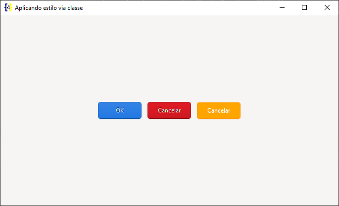
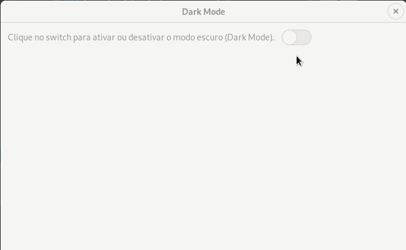
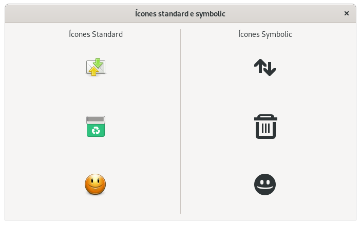

> Em desenvolvimento e revisão

> **OBS**: Este repositório tem um arquivo `Pipfile`, o mesmo **não** funciona no Windows, isso porque a instalação do GTK e Python **DEVEM** ser feitas pelo **msys2**.

---

# GUI (graphical user interface) com Python e GTK

Tutoriais e pequenos exemplos de código.

## GTK

O GTK é um **toolkit multiplataforma** para a criação de interfaces gráficas.

Este toolkit utiliza [licença GNU LGPL](https://pt.wikipedia.org/wiki/GNU_Lesser_General_Public_License), o que permite a sua utilização para construção de softwares que seja livres ou proprietários.

Foi desenvolvido inicialmente para o [GIMP](https://www.gimp.org/) (GNU Image Manipulation Program), por isso foi batizado de **GIMP Toolkit** ou simplesmente **GTK**.

Originalmente criado por, Peter Mattis, Spencer Kimball e Josh MacDonald.

O GTK+ é comumente utilizado na elaboração de aplicativos para o ambiente de desktop [GNOME](https://www.gnome.org/), contudo por ser multiplataforma pode ser executado sem problemas em diversos sistemas operacionais e ambientes gráficos.

O toolkit é escrito em `C`, seu design é orientado a objeto com base no sistema de objetos da biblioteca `GLib`.

Existe o suporte (bindings) a diversas linguagens de programação, contudo as linguagem que são suportadas **oficialmente** (até o momento que escrevo) são:

-   C++.
-   JavaScript.
-   Python.
-   Vala.

## O que estou publicando?

A ideia é apenas **estudar** e documentar a construção de interfaces gráficas com GTK e Python.

Exemplos de código podem ser vistos na pasta `src` deste repositório.

> Em caso de problemas entre em contato para que o material possa ser melhorado.

# Tutoriais

- [Como instalar o msys2 no Windows (Obrigatório)](./docs/install-msys2-windows.md).
- [Como instalar o PyGObject for Windows (não recomendado)](./docs/install-pygi-windows.md).
- [Configurando o ambiente de desenvolvimento](./docs/set-dev-env.md).

## IDEs e RADs

- [Como Instalar o Gnome Builder](./docs/install-gnome-builder.md).
- [Como Instalar o Gnome Glade](./docs/install-gnome-glade.md).

## Purism Librem 5

- [Como Instalar a biblioteca libhandy](./docs/install-purism-libhandy.md).
- [Executando o PureOS (Phosh) via VM](./docs/phosh.md).

## GTK

- [Criando uma janela com Python e GTK](./docs/creating-main-window.md).

## Criar executáveis

- [Criando executáveis com Cx_Freeze no Windows](./docs/cxfreeze-windows.md).
- [Criando executáveis com Cx_Freeze no Linux](./docs/cxfreeze-linux.md).

## Extra

- [Como instalar Python no Linux e Windows](./docs/install-python.md).

---

# Código

## GTK

### Janela principal

- [Lendo arquivos interface do Gnome Glade](./src/main-window/glade).
- [Lendo arquivos de interface do Gnome Builder](./src/main-window/builder).
- [Criando a janela com Python](./src/main-window).

### Signals e slots

- [Sinais e slots com arquivo de interface do Gnome Glade](./src/signals-and-slots/glade).
- [Sinais e slots com arquivo de interface do Gnome Builder](./src/signals-and-slots/builder).
- [Sinais e slots com arquivo com Python](./src/signals-and-slots).

### Style

> **OBS**: Ao utilizar `background-color` deve-se utilizar `background-image: none;`.

> **OBS**: Ao utilizar somente `background` não é necessário utilizar `background-image: none;`.

> **OBS**: Alguns widgets utilizam uma imagem de fundo em alguns casos pode ser interessante remover essa imagem com `background-image: none;`.

- [Carregando uma arquivo css](./docs/style-load-css-file.md)
    
    
- [Adicionar classe a um widget](./docs/style-add-class.md)
    
    
- [Adicionar nome a um widget](./docs/style-add-name.md)
    

- [Ativando e desativando o dark mode (modo escuro)](./docs/style-dark-mode.md).
    

- [Utilizando ícones standard e symbolic](./src/gnome-icons).
    

### Layouts

- [actionbar](./src/layouts/actionbar).
- [box_horizontal](./src/layouts/box_horizontal).
- [box_vertical](./src/layouts/box_vertical).
- [buttonbox](./src/layouts/buttonbox).
- [fixed](./src/layouts/fixed).
- [flowbox](./src/layouts/flowbox).
- [grid](./src/layouts/grid).
- [gtk_layout](./src/layouts/gtk_layout).
- [headerbar_layout](./src/layouts/headerbar).
- [listbox_layout](./src/layouts/listbox).
- [notebook_layout](./src/layouts/notebook).
- [overlay_layout](./src/layouts/overlay).
- [paned_layout_horizontal](./src/layouts/paned_horizontal).
- [paned-layout-vertical](./src/layouts/paned_vertical).
- [revealer_layout](./src/layouts/revealer).
- [stack_layout_stacksidebar](./src/layouts/stack_stacksidebar).
- [stack_layout_stackswitcher](./src/layouts/stack_switcher).

##### Widgets

ToDo

---

## Purism Librem 5

### Widgets

- [action_row](./src/librem5-libhandy/action_row.py).
- [arrows](./src/librem5-libhandy/arrows.py).
- [column](./src/librem5-libhandy/column.py).
- [combo_row (não sei implementar ou ainda não funciona na versão que utilizei)]().
- [dialer](./src/librem5-libhandy/dialer.py).
- [dialer sem utilizar classe](./src/librem5-libhandy/dialer_without_class.py).
- [dialer_button](./src/librem5-libhandy/dialer_button.py).
- [dialer_cycle_button](./src/librem5-libhandy/dialer_cycle_button.py).
- [dialog](./src/librem5-libhandy/dialog.py).
- [dialog utilizando classe (os botões ficam direntes?)](./src/librem5-libhandy/dialog_with_class.py).
- [enums](#).
- [expander_row](#).
- [header_bar](#).
- [header_group](#).
- [leaflet](#).
- [mod](#).
- [preferences_group](#).
- [preferences_page](#).
- [preferences_row](#).
- [preferences_window](#).
- [search_bar](#).
- [squeezer](#).
- [title_bar](#).
- [value_object](#).
- [versions](#).
- [view_switcher_bar](#).
- [view_switcher](#).