 and GTK")

 

 

&emsp;

&emsp;

# Creating graphical interfaces with Python (PyGObject) and GTK

## 📝 Description

Repository created to centralize tips, tutorials and code examples on building graphical interfaces with the Python programming language (PyGObject) and the GTK graphics tookit.

---

## 🛠 Technologies used

To date, the following technologies have been used to build the project:

&emsp;

&emsp;

&emsp;

&emsp;

---

## 🤓 Author

Repository made with 💙 by [Renato Cruz](https://github.com/natorsc) 🤜🤛 Get in touch!

Follow content on programming and technology at

One of the playlists I usually listen to when I'm studying or coding 😁:

---

## 💝 Donations

Thank you for your donation, it is through it that I am able to maintain this content 😊.

### Buy me a coffee

### Ko-Fi

### Pix

**Chave**: `b1839493-2afe-484d-9272-82a3e402b36f`

---

## 💡 Extra

### GTK

- [Documentation GTK 3](https://docs.gtk.org/gtk3/).
- [Documentation GTK 4](https://docs.gtk.org/gtk4/).

### Libadwaita

- [Documentation 1.x](https://gnome.pages.gitlab.gnome.org/libadwaita/doc/1-latest/).

### GNOME

- [Official website](https://www.gnome.org/).
- [Blog](https://blogs.gnome.org/).
- [GNOME Human Interface Guidelines (HIG)](https://wiki.gnome.org/Design/HIG).

### Development

- [GNOME Builder](https://apps.gnome.org/pt-BR/app/org.gnome.Builder/).
- [Workbench](https://apps.gnome.org/pt-BR/app/re.sonny.Workbench/).
- [Cambalache](https://flathub.org/pt-BR/apps/ar.xjuan.Cambalache).
- [Icon Library](https://flathub.org/apps/details/org.gnome.design.IconLibrary).
- [Typography](https://flathub.org/apps/details/org.gnome.design.Typography).
- [App Icon Preview](https://flathub.org/apps/details/org.gnome.design.AppIconPreview).
- [Symbolic Preview](https://flathub.org/apps/details/org.gnome.design.SymbolicPreview).
- [Color Palette](https://flathub.org/apps/details/org.gnome.design.Palette).
- [Gnome icon library online](https://teams.pages.gitlab.gnome.org/Design/icon-development-kit-www/).

### Softwares

- [GNOME Apps](https://apps.gnome.org/pt-BR/).
- [GNOME circle](https://circle.gnome.org/).
- [Awesome GTK](https://github.com/valpackett/awesome-gtk).

### Flatpak

- [Official website](https://www.flatpak.org/).
- [Flathub](https://flathub.org/).

### Visual Studio Code

- [Gnome Magic (bedsteler20)](https://marketplace.visualstudio.com/items?itemName=bedsteler20.gnome-magic).
- [GTK Blueprint (Bodil Stokke)](https://marketplace.visualstudio.com/items?itemName=bodil.blueprint-gtk).
- [Flatpak (Bilal Elmoussaoui)](https://marketplace.visualstudio.com/items?itemName=bilelmoussaoui.flatpak-vscode).

---

## Widgets

### GTK

#### Gtk.ActionBar

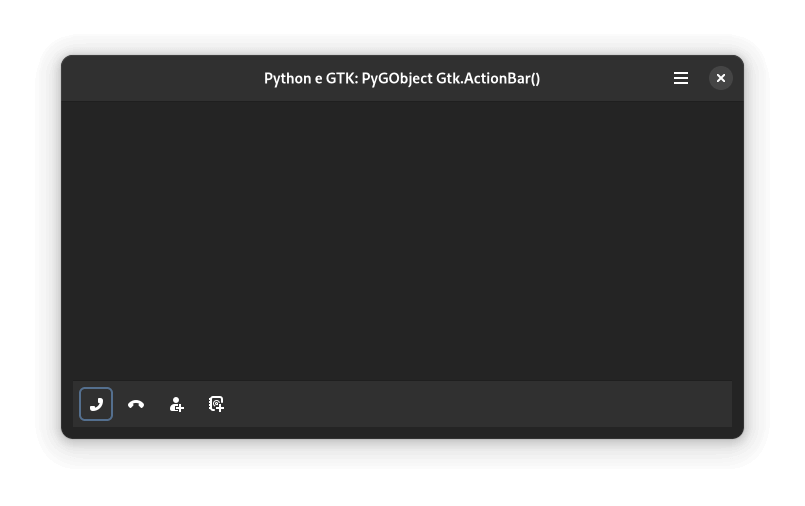

- [Informações do widget](./docs/widgets-info/GtkActionBar.md).
- [Python](./src/gtk-widgets/actionbar/MainWindow.py).
- [GTK Blueprint](./src/gtk-widgets/actionbar/ui/MainWindow.blp).
- [Python load ui](./src/gtk-widgets/actionbar/ui/MainWindow.py).
- [UI](./src/gtk-widgets/actionbar/ui/MainWindow.ui).

---

#### Gtk.Application

- [Python](./src/gtk-widgets/application/MainWindow.py).
- [GTK Blueprint](./src/gtk-widgets/application/ui/MainWindow.blp).
- [Python load ui](./src/gtk-widgets/application/ui/MainWindow.py).
- [UI](./src/gtk-widgets/application/ui/MainWindow.ui).

---

#### Gtk.ApplicationWindow

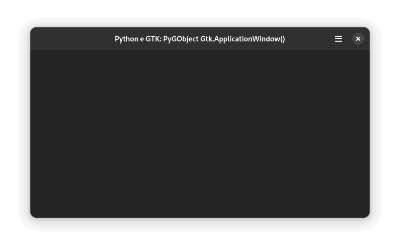

- [Informações do widget](./docs/widgets-info/GtkApplicationWindow.md).
- [Python](./src/gtk-widgets/application-window/MainWindow.py).
- [GTK Blueprint](./src/gtk-widgets/application-window/ui/MainWindow.blp).
- [Python load ui](./src/gtk-widgets/application-window/ui/MainWindow.py).
- [UI](./src/gtk-widgets/application-window/ui/MainWindow.ui).

---

#### Gtk.Box (horizontal)

")

- [Informações do widget](./docs/widgets-info/GtkBox.md).
- [Python](./src/gtk-widgets/box-horizontal/MainWindow.py).
- [GTK Blueprint](./src/gtk-widgets/box-horizontal/ui/MainWindow.blp).
- [Python load ui](./src/gtk-widgets/box-horizontal/ui/MainWindow.py).
- [UI](./src/gtk-widgets/box-horizontal/ui/MainWindow.ui).

---

#### Gtk.Box (vertical)

")

- [Informações do widget](./docs/widgets-info/GtkBox.md).
- [Python](./src/gtk-widgets/box-vertical/MainWindow.py).
- [GTK Blueprint](./src/gtk-widgets/box-vertical/ui/MainWindow.blp).
- [Python load ui](./src/gtk-widgets/box-vertical/ui/MainWindow.py).
- [UI](./src/gtk-widgets/box-vertical/ui/MainWindow.ui).

---

#### Gtk.Button

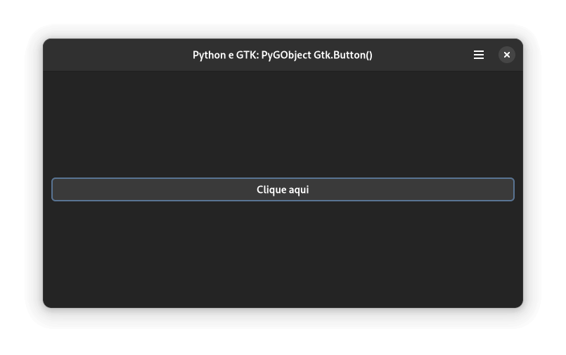

- [Informações do widget](./docs/widgets-info/GtkButton.md).
- [Python](./src/gtk-widgets/button/MainWindow.py).
- [GTK Blueprint](./src/gtk-widgets/button/ui/MainWindow.blp).
- [Python load ui](./src/gtk-widgets/button/ui/MainWindow.py).
- [UI](./src/gtk-widgets/button/ui/MainWindow.ui).

---

#### Gtk.Calendar

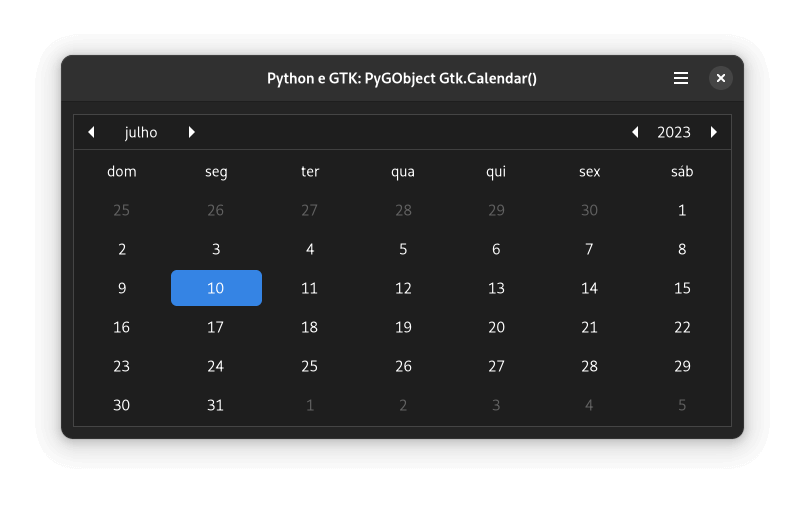

- [Informações do widget](./docs/widgets-info/GtkCalendar.md).
- [Python](./src/gtk-widgets/calendar/MainWindow.py).
- [GTK Blueprint](./src/gtk-widgets/calendar/ui/MainWindow.blp).
- [Python load ui](./src/gtk-widgets/calendar/ui/MainWindow.py).
- [UI](./src/gtk-widgets/calendar/ui/MainWindow.ui).

---

#### Gtk.CheckButton

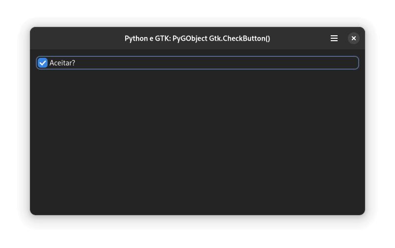

- [Informações do widget](./docs/widgets-info/GtkCheckButton.md).
- [Python](./src/gtk-widgets/check-button/MainWindow.py).
- [GTK Blueprint](./src/gtk-widgets/check-button/ui/MainWindow.blp).
- [Python load ui](./src/gtk-widgets/check-button/ui/MainWindow.py).
- [UI](./src/gtk-widgets/check-button/ui/MainWindow.ui).

---

#### Gtk.CheckButton (radio)

")

- [Informações do widget](./docs/widgets-info/GtkCheckButton.md).
- [Python](./src/gtk-widgets/check-button-radio/MainWindow.py).
- [GTK Blueprint](./src/gtk-widgets/check-button-radio/ui/MainWindow.blp).
- [Python load ui](./src/gtk-widgets/check-button-radio/ui/MainWindow.py).
- [UI](./src/gtk-widgets/check-button-radio/ui/MainWindow.ui).

---

#### Gtk.ColorDialogButton

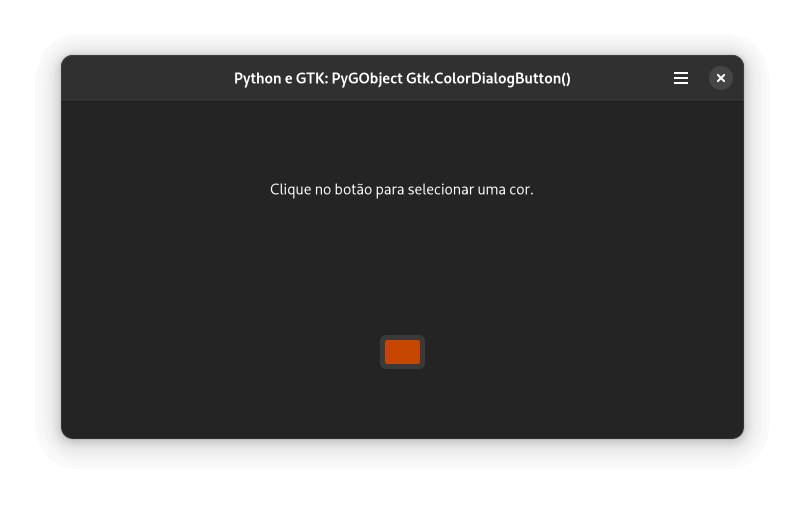

- [Informações do widget](./docs/widgets-info/GtkColorDialogButton.md).
- [Python](./src/gtk-widgets/color-dialog-button/MainWindow.py).
- [GTK Blueprint](./src/gtk-widgets/color-dialog-button/ui/MainWindow.blp).
- [Python load ui](./src/gtk-widgets/color-dialog-button/ui/MainWindow.py).
- [UI](./src/gtk-widgets/color-dialog-button/ui/MainWindow.ui).

---

#### Drag and drop

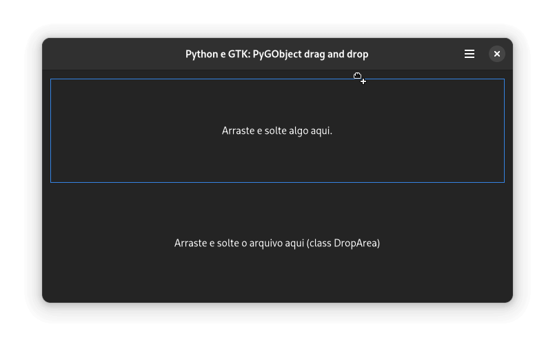

- [Python](./src/gtk-widgets/drag-and-drop/MainWindow.py).

---

#### Gtk.DropDown

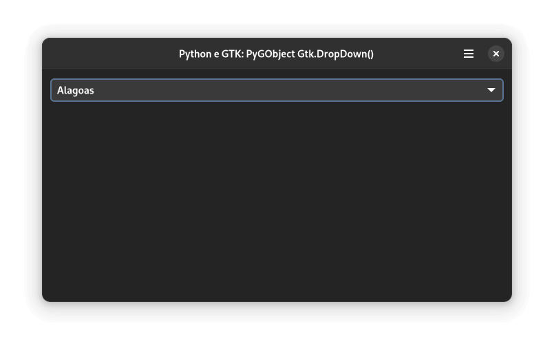

- [Informações do widget](./docs/widgets-info/GtkDropDown.md).
- [Python](./src/gtk-widgets/drop-down/MainWindow.py).
- [GTK Blueprint](./src/gtk-widgets/drop-down/ui/MainWindow.blp).
- [Python load ui](./src/gtk-widgets/drop-down/ui/MainWindow.py).
- [UI](./src/gtk-widgets/drop-down/ui/MainWindow.ui).

---

#### Gtk.Entry

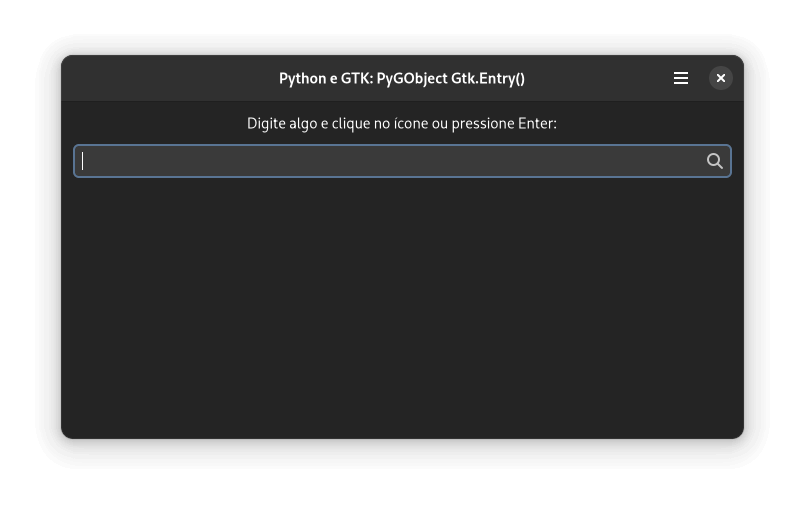

- [Informações do widget](./docs/widgets-info/GtkEntry.md).
- [Python](./src/gtk-widgets/entry/MainWindow.py).
- [GTK Blueprint](./src/gtk-widgets/entry/ui/MainWindow.blp).
- [Python load ui](./src/gtk-widgets/entry/ui/MainWindow.py).
- [UI](./src/gtk-widgets/entry/ui/MainWindow.ui).

---

#### Gtk.FileDialog (folder)

")

- [Python](./src/gtk-widgets/file-dialog-folder/MainWindow.py).
- [GTK Blueprint](./src/gtk-widgets/file-dialog-folder/ui/MainWindow.blp).
- [Python load ui](./src/gtk-widgets/file-dialog-folder/ui/MainWindow.py).
- [UI](./src/gtk-widgets/file-dialog-folder/ui/MainWindow.ui).

---

#### Gtk.FileDialog (open)

")

- [Python](/src/gtk-widgets/file-dialog-open/MainWindow.py).
- [GTK Blueprint](/src/gtk-widgets/file-dialog-open/ui/MainWindow.blp).
- [Python load ui](/src/gtk-widgets/file-dialog-open/ui/MainWindow.ui).
- [UI](/src/gtk-widgets/file-dialog-open/ui/MainWindow.ui).

---

#### Gtk.FileDialog (save)

")

- [Python](./src/gtk-widgets/file-dialog-save/MainWindow.py).
- [GTK Blueprint](./src/gtk-widgets/file-dialog-save/ui/MainWindow.blp).
- [Python load ui](./src/gtk-widgets/file-dialog-save/ui/MainWindow.py).
- [UI](./src/gtk-widgets/file-dialog-save/ui/MainWindow.ui).

---

#### Gtk.Fixed

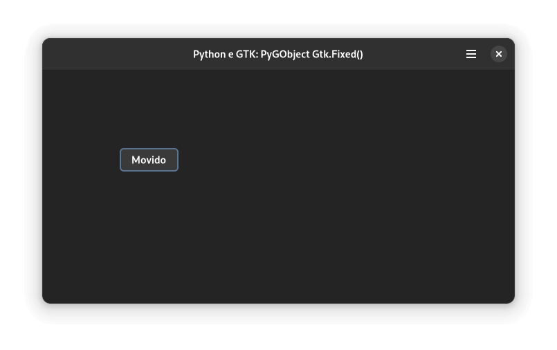

- [Informações do widget](./docs/widgets-info/GtkFixed.md).
- [Python](./src/gtk-widgets/fixed/MainWindow.py).
- [GTK Blueprint](./src/gtk-widgets/fixed/ui/MainWindow.blp).
- [Python load ui](./src/gtk-widgets/fixed/ui/MainWindow.py).
- [UI](./src/gtk-widgets/fixed/ui/MainWindow.ui).

---

#### Gtk.FlowBox

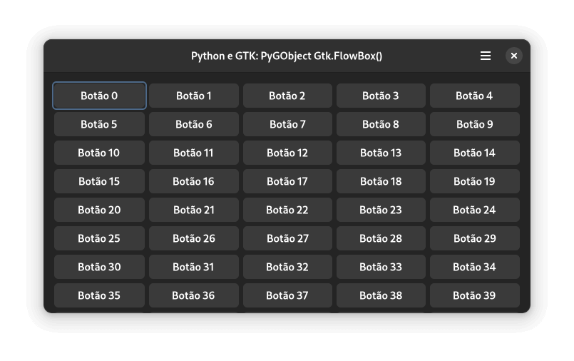

- [Informações do widget](./docs/widgets-info/GtkFlowBox.md).
- [Python](./src/gtk-widgets/flow-box/MainWindow.py).
- [GTK Blueprint](./src/gtk-widgets/flow-box/ui/MainWindow.blp).
- [Python load ui](./src/gtk-widgets/flow-box/ui/MainWindow.py).
- [UI](./src/gtk-widgets/flow-box/ui/MainWindow.ui).

---

#### Gtk.Grid

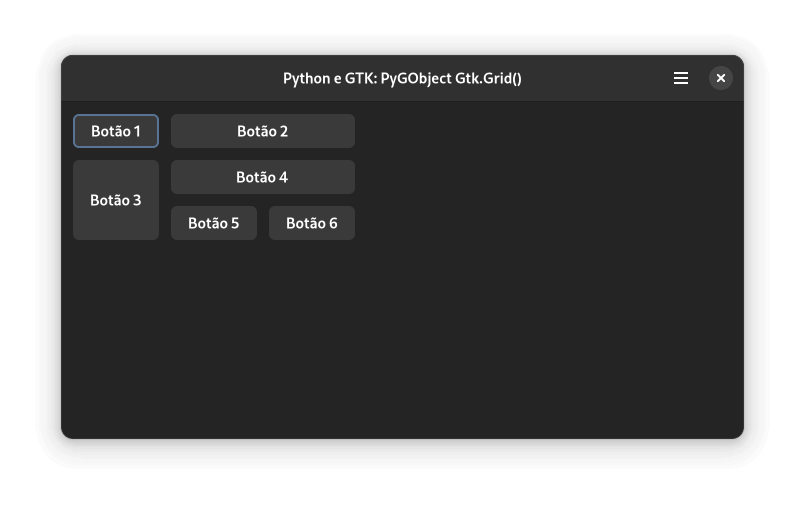

- [Informações do widget](./docs/widgets-info/GtkGrid.md).
- [Python](./src/gtk-widgets/grid/MainWindow.py).
- [GTK Blueprint](./src/gtk-widgets/grid/ui/MainWindow.blp).
- [Python load ui](./src/gtk-widgets/grid/ui/MainWindow.py).
- [UI](./src/gtk-widgets/grid/ui/MainWindow.ui).

---

#### Gtk.HeaderBar

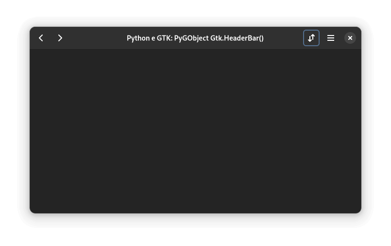

- [Informações do widget](./docs/widgets-info/GtkHeaderBar.md).
- [Python](./src/gtk-widgets/header-bar/MainWindow.py).
- [GTK Blueprint](./src/gtk-widgets/header-bar/ui/MainWindow.blp).
- [Python load ui](./src/gtk-widgets/header-bar/ui/MainWindow.py).
- [UI](./src/gtk-widgets/header-bar/ui/MainWindow.ui).

---

#### Gtk.Image

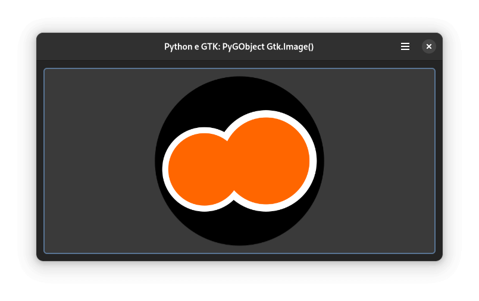

- [Informações do widget](./docs/widgets-info/GtkImage.md).
- [Python](./src/gtk-widgets/image/MainWindow.py).
- [GTK Blueprint](./src/gtk-widgets/image/ui/MainWindow.blp).
- [Python load ui](./src/gtk-widgets/image/ui/MainWindow.py).
- [UI](./src/gtk-widgets/image/ui/MainWindow.ui).

---

#### Gtk.ListBox

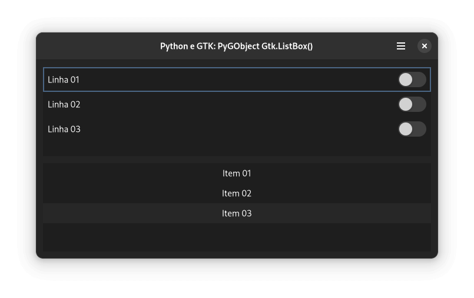

- [Informações do widget](./docs/widgets-info/GtkListBox.md).
- [Python](./src/gtk-widgets/list-box/MainWindow.py).
- [GTK Blueprint](./src/gtk-widgets/list-box/ui/MainWindow.blp).
- [Python load ui](./src/gtk-widgets/list-box/ui/MainWindow.py).
- [UI](./src/gtk-widgets/list-box/ui/MainWindow.ui).

---

#### Gtk.ListView

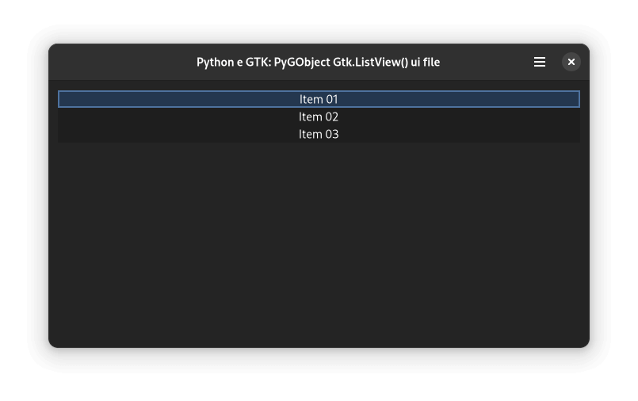

> 🚨 Criar código Python.

- [Informações do widget](./docs/widgets-info/GtkListView.md).
- [Python](#gtklistview).
- [GTK Blueprint](./src/gtk-widgets/list-view/ui/MainWindow.blp).
- [Python load ui](./src/gtk-widgets/list-view/ui/MainWindow.py).
- [UI](./src/gtk-widgets/list-view/ui/MainWindow.ui).

---

#### Gtk.MenuButton

- [Informações do widget](./docs/widgets-info/GtkMenuButton.md).
- [Python](./src/gtk-widgets/menu-button/MainWindow.py).
- [GTK Blueprint](./src/gtk-widgets/menu-button/ui/MainWindow.blp).
- [Python load ui](./src/gtk-widgets/menu-button/ui/MainWindow.py).
- [UI](./src/gtk-widgets/menu-button/ui/MainWindow.ui).

---

#### Gtk.Overlay

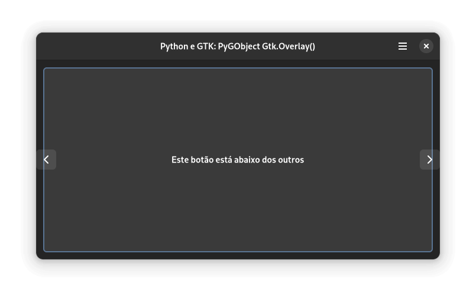

- [Informações do widget](./docs/widgets-info/GtkOverlay.md).
- [Python](./src/gtk-widgets/overlay/MainWindow.py).
- [GTK Blueprint](./src/gtk-widgets/overlay/ui/MainWindow.blp).
- [Python load ui](./src/gtk-widgets/overlay/ui/MainWindow.py).
- [UI](./src/gtk-widgets/overlay/ui/MainWindow.ui).

---

Pango tags
==========

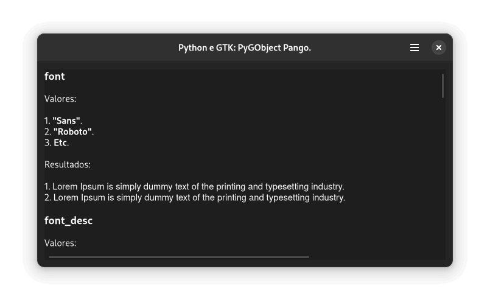

- [Python](./src/gtk-widgets/pango-tags/MainWindow.py).
- [GTK Blueprint](./src/gtk-widgets/pango-tags/ui/MainWindow.blp).
- [Python load ui](./src/gtk-widgets/pango-tags/ui/MainWindow.py).
- [UI](./src/gtk-widgets/pango-tags/ui/MainWindow.ui).

---

#### Gtk.Picture

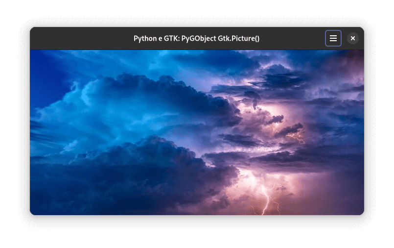

- [Informações do widget](./docs/widgets-info/GtkPicture.md).
- [Python](./src/gtk-widgets/picture/MainWindow.py).
- [GTK Blueprint](./src/gtk-widgets/picture/ui/MainWindow.blp).
- [Python load ui](./src/gtk-widgets/picture/ui/MainWindow.py).
- [UI](./src/gtk-widgets/picture/ui/MainWindow.ui).

---

#### Gtk.PrintOperation

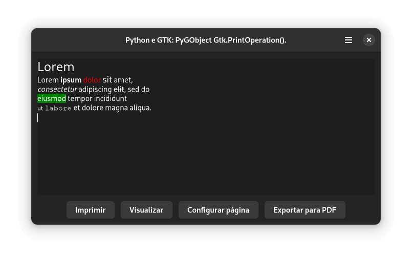

- [Python](./src/gtk-widgets/print-operation/MainWindow.py).
- [GTK Blueprint](./src/gtk-widgets/print-operation/ui/MainWindow.blp).
- [Python load ui](./src/gtk-widgets/print-operation/ui/MainWindow.py).
- [UI](./src/gtk-widgets/print-operation/ui/MainWindow.ui).

---

#### Gtk.SearchBar

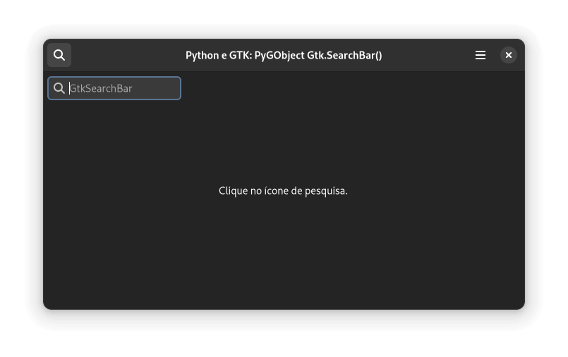

- [Informações do widget](./docs/widgets-info/GtkSearchBar.md).
- [Python](./src/gtk-widgets/search-bar/MainWindow.py).
- [GTK Blueprint](./src/gtk-widgets/search-bar/ui/MainWindow.blp).
- [Python load ui](./src/gtk-widgets/search-bar/ui/MainWindow.py).
- [UI](./src/gtk-widgets/search-bar/ui/MainWindow.ui).

---

#### Gtk.ShortcutsWindow

> 🚨 Criar código Python.

- [Informações do widget](./docs/widgets-info/GtkShortcutsWindow.md).
- [GTK Blueprint](./src/gtk-widgets/shortcuts-window/ui/ShortcutsWindow.blp).
- [UI](./src/gtk-widgets/shortcuts-window/ui/ShortcutsWindow.ui).

---

#### Signals and slots

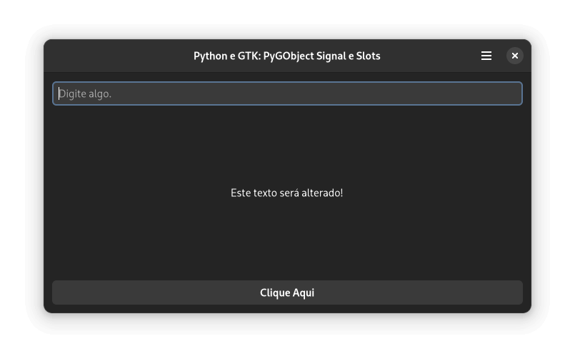

- [Python](./src/gtk-widgets/signals-and-slots/MainWindow.py).
- [GTK Blueprint](./src/gtk-widgets/signals-and-slots/ui/MainWindow.blp).
- [Python load ui](./src/gtk-widgets/signals-and-slots/ui/MainWindow.py).
- [UI](./src/gtk-widgets/signals-and-slots/ui/MainWindow.ui).

---

#### Gtk.StackSidebar

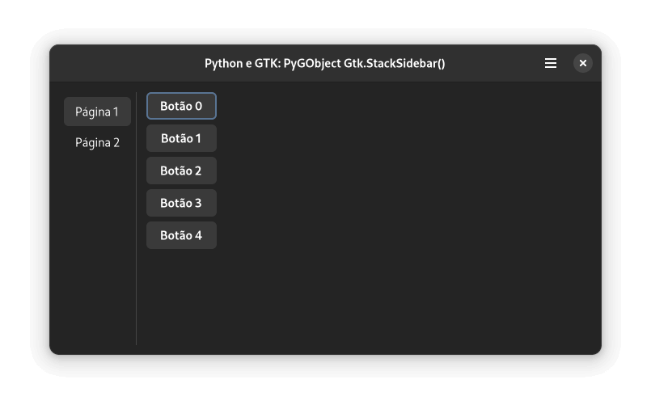

- [Informações do widget](./docs/widgets-info/GtkStackSidebar.md).
- [Python](./src/gtk-widgets/stack-sidebar/MainWindow.py).
- [GTK Blueprint](./src/gtk-widgets/stack-sidebar/ui/MainWindow.blp).
- [Python load ui](./src/gtk-widgets/stack-sidebar/ui/MainWindow.py).
- [UI](./src/gtk-widgets/stack-sidebar/ui/MainWindow.ui).

---

#### Gtk.StackSwitcher

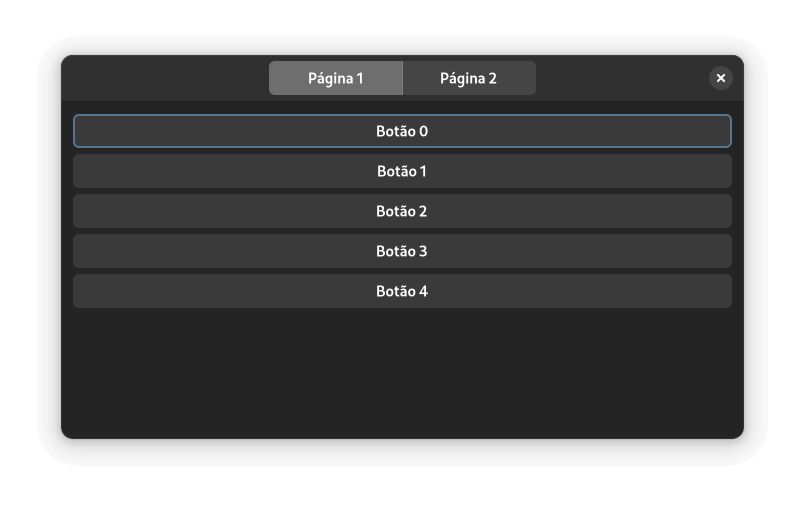

- [Informações do widget](./docs/widgets-info/GtkStackSwitcher.md).
- [Python](./src/gtk-widgets/stack-switcher/MainWindow.py).
- [GTK Blueprint](./src/gtk-widgets/stack-switcher/ui/MainWindow.blp).
- [Python load ui](./src/gtk-widgets/stack-switcher/ui/MainWindow.py).
- [UI](./src/gtk-widgets/stack-switcher/ui/MainWindow.ui).

---

#### Gtk.Switch

- [Informações do widget](./docs/widgets-info/GtkSwitch.md).
- [Python](./src/gtk-widgets/switch/MainWindow.py).
- [GTK Blueprint](./src/gtk-widgets/switch/ui/MainWindow.blp).
- [Python load ui](./src/gtk-widgets/switch/ui/MainWindow.py).
- [UI](./src/gtk-widgets/switch/ui/MainWindow.ui).

---

#### Translation (gettext)

")

> 🚨 Revisar.

- [Python](./src/gtk-widgets/translator-gettext/MainWindow.py).

---

#### Gtk.Video

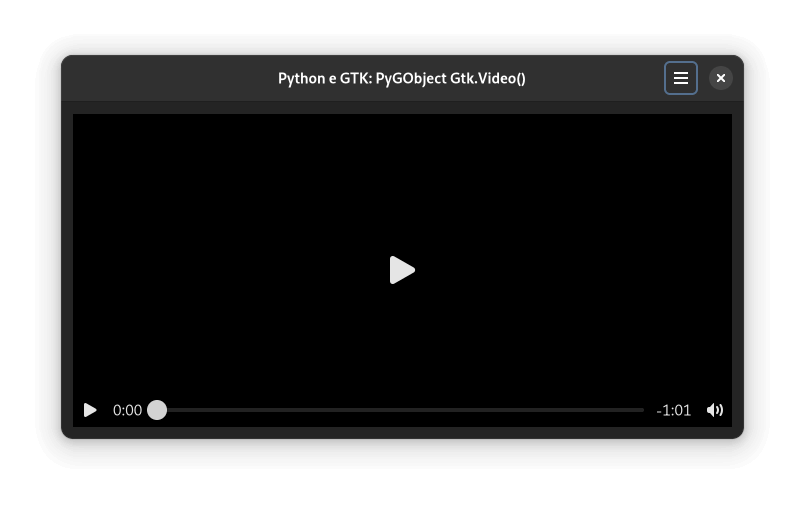

- [Informações do widget](./docs/widgets-info/GtkVideo.md).
- [Python](./src/gtk-widgets/video/MainWindow.py).
- [GTK Blueprint](./src/gtk-widgets/video/ui/MainWindow.blp).
- [Python load ui](./src/gtk-widgets/video/ui/MainWindow.py).
- [UI](./src/gtk-widgets/video/ui/MainWindow.ui).

---

#### Gtk.Window

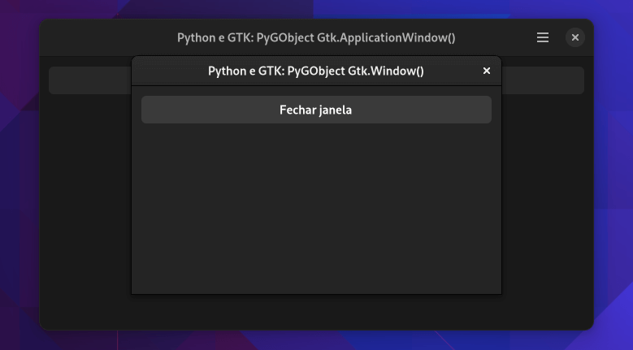

- [Informações do widget](./docs/widgets-info/GtkWindow.md).
- [Python](./src/gtk-widgets/window/MainWindow.py).
- [GTK Blueprint](./src/gtk-widgets/window/ui/MainWindow.blp).
- [Python load ui](./src/gtk-widgets/window/ui/MainWindow.py).
- [UI](./src/gtk-widgets/window/ui/MainWindow.ui).

---

 

### Libadwaita

#### Adw.AboutWindow

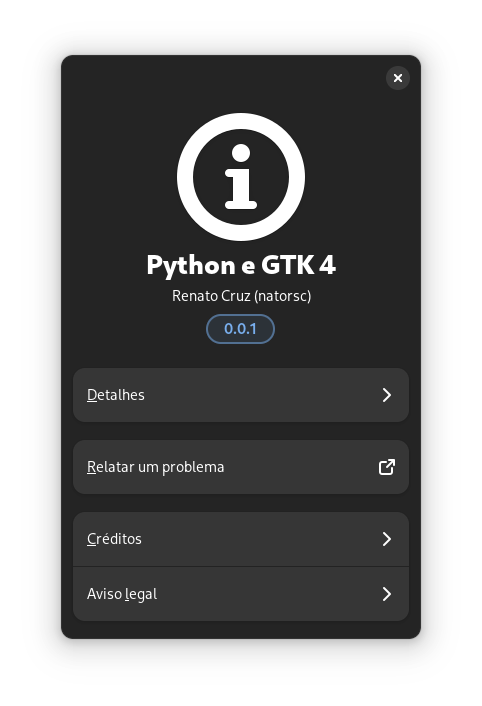

- [Informações do widget](./docs/widgets-info/AdwAboutWindow.md).
- [Python](./src/libadwaita-widgets/about-window/MainWindow.py).
- [GTK Blueprint](./src/libadwaita-widgets/about-window/ui/MainWindow.blp).
- [Python load ui](./src/libadwaita-widgets/about-window/ui/MainWindow.py).
- [UI](./src/libadwaita-widgets/about-window/ui/MainWindow.ui).

---

#### Adw.ActionRow

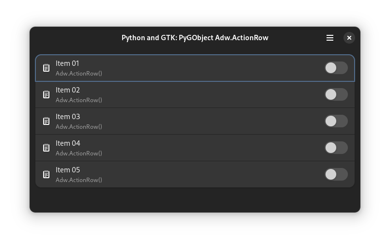

- [Informações do widget](./docs/widgets-info/AdwActionRow.md).
- [Python](./src/libadwaita-widgets/action-row/MainWindow.py).
- [GTK Blueprint](./src/libadwaita-widgets/action-row/ui/MainWindow.blp).
- [Python load ui](./src/libadwaita-widgets/action-row/ui/MainWindow.py).
- [UI](./src/libadwaita-widgets/action-row/ui/MainWindow.ui).

---

#### Adw.Application

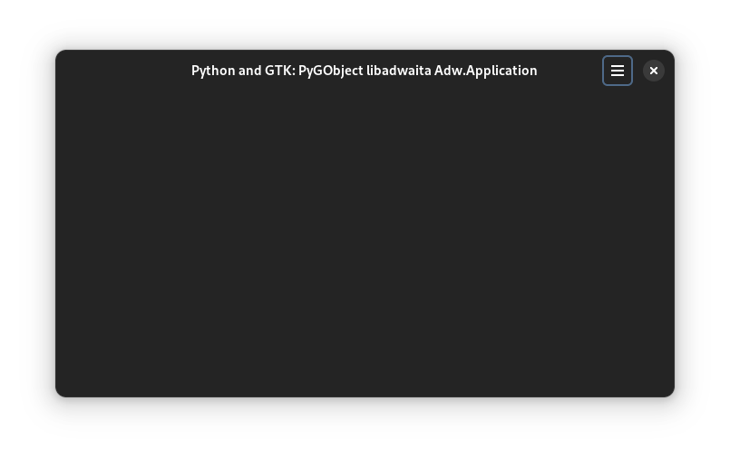

- [Python](./src/libadwaita-widgets/application/MainWindow.py).
- [GTK Blueprint](./src/libadwaita-widgets/application/ui/MainWindow.blp).
- [Python load ui](./src/libadwaita-widgets/application/ui/MainWindow.py).
- [UI](./src/libadwaita-widgets/application/ui/MainWindow.ui).

---

#### Adw.Avatar

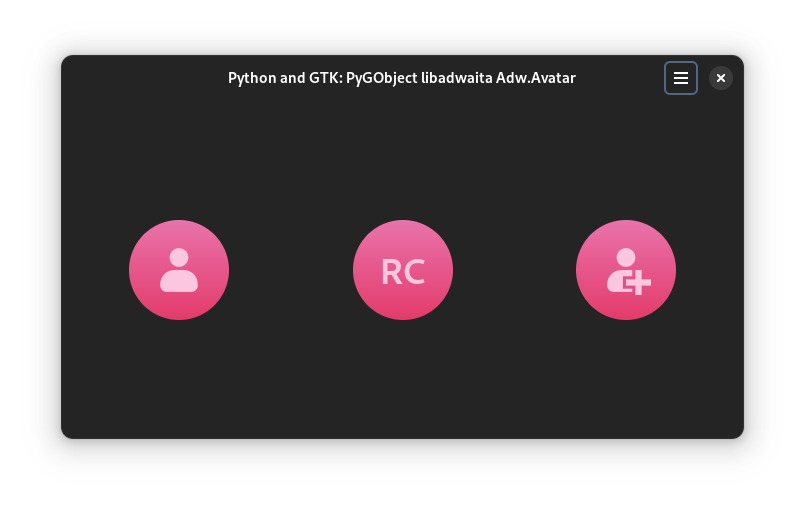

- [Informações do widget](./docs/widgets-info/AdwAvatar.md).
- [Python](./src/libadwaita-widgets/avatar/MainWindow.py).
- [GTK Blueprint](./src/libadwaita-widgets/avatar/ui/MainWindow.blp).
- [Python load ui](./src/libadwaita-widgets/avatar/ui/MainWindow.py).
- [UI](./src/libadwaita-widgets/avatar/ui/MainWindow.ui).

---

#### Adw.Banner

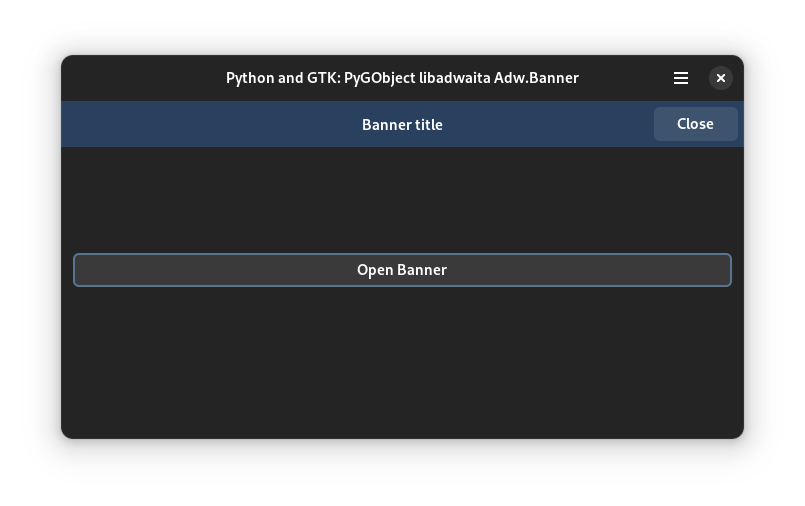

- [Informações do widget](./docs/widgets-info/AdwBanner.md).
- [Python](./src/libadwaita-widgets/banner/MainWindow.py).
- [GTK Blueprint](./src/libadwaita-widgets/banner/ui/MainWindow.blp).
- [Python load ui](./src/libadwaita-widgets/banner/ui/MainWindow.py).
- [UI](./src/libadwaita-widgets/banner/ui/MainWindow.ui).

---

#### Adw.ButtonContent

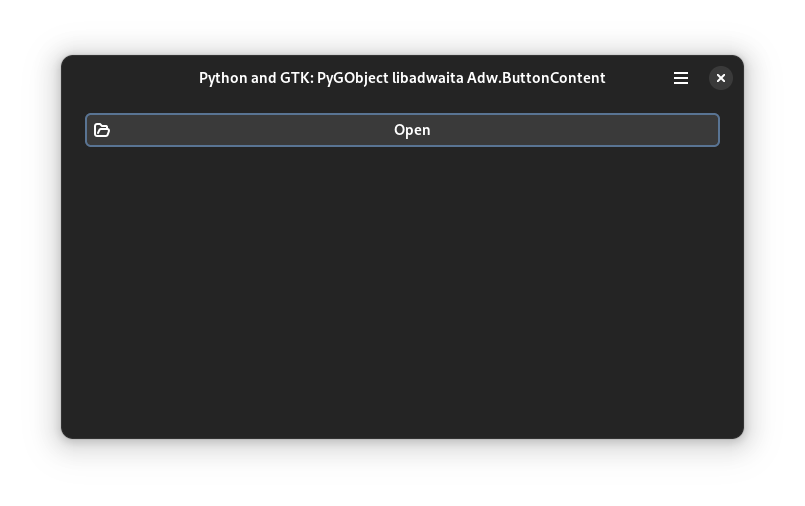

- [Informações do widget](./docs/widgets-info/AdwButtonContent.md).
- [Python](./src/libadwaita-widgets/button-content/MainWindow.py).
- [GTK Blueprint](./src/libadwaita-widgets/button-content/ui/MainWindow.blp).
- [Python load ui](./src/libadwaita-widgets/button-content/ui/MainWindow.py).
- [UI](./src/libadwaita-widgets/button-content/ui/MainWindow.ui).

---

#### Adw.Carousel

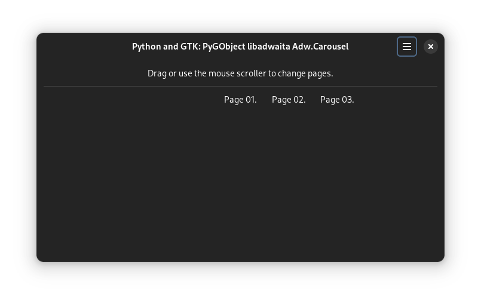

- [Informações do widget](./docs/widgets-info/AdwCarousel.md).
- [Python](./src/libadwaita-widgets/carousel/MainWindow.py).
- [GTK Blueprint](./src/libadwaita-widgets/carousel/ui/MainWindow.blp).
- [Python load ui](./src/libadwaita-widgets/carousel/ui/MainWindow.py).
- [UI](./src/libadwaita-widgets/carousel/ui/MainWindow.ui).

---

#### Adw.CarouselIndicatorDots

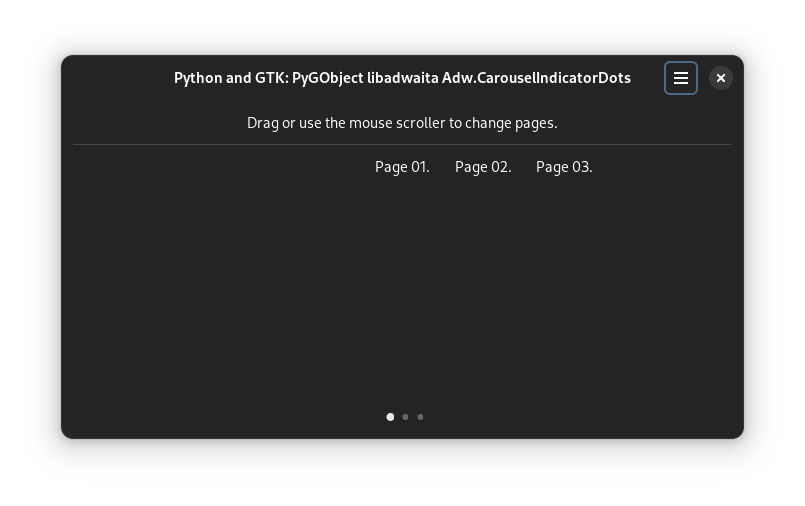

- [Informações do widget](./docs/widgets-info/AdwCarouselIndicatorDots.md).
- [Python](./src/libadwaita-widgets/carousel-indicator-dots/MainWindow.py).
- [GTK Blueprint](./src/libadwaita-widgets/carousel-indicator-dots/ui/MainWindow.blp).
- [Python load ui](./src/libadwaita-widgets/carousel-indicator-dots/ui/MainWindow.py).
- [UI](./src/libadwaita-widgets/carousel-indicator-dots/ui/MainWindow.ui).

---

#### Adw.CarouselIndicatorLines

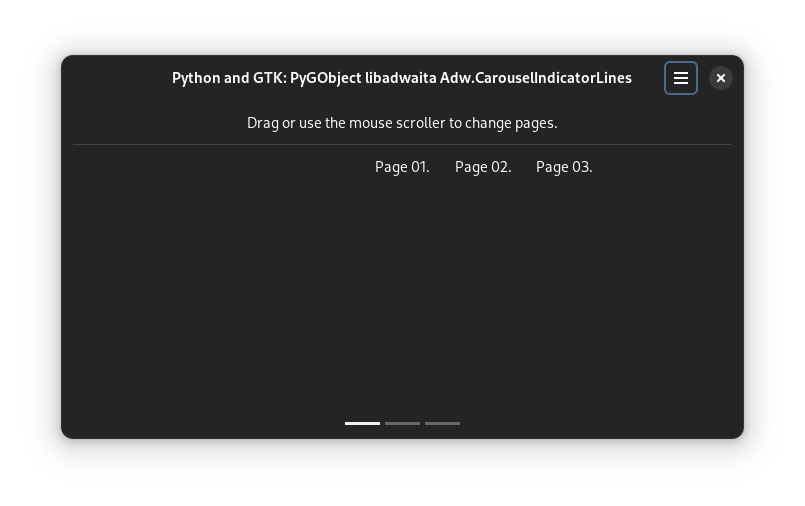

- [Informações do widget](./docs/widgets-info/AdwCarouselIndicatorLines.md).
- [Python](./src/libadwaita-widgets/carousel-indicator-lines/MainWindow.py).
- [GTK Blueprint](./src/libadwaita-widgets/carousel-indicator-lines/ui/MainWindow.blp).
- [Python load ui](./src/libadwaita-widgets/carousel-indicator-lines/ui/MainWindow.py).
- [UI](./src/libadwaita-widgets/carousel-indicator-lines/ui/MainWindow.ui).

---

#### Adw.Clamp

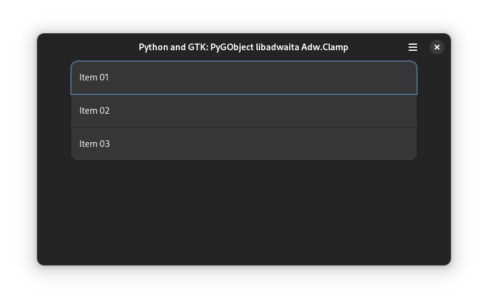

- [Informações do widget](./docs/widgets-info/AdwClamp.md).
- [Python](./src/libadwaita-widgets/clamp/MainWindow.py).
- [GTK Blueprint](./src/libadwaita-widgets/clamp/ui/MainWindow.blp).
- [Python load ui](./src/libadwaita-widgets/clamp/ui/MainWindow.py).
- [UI](./src/libadwaita-widgets/clamp/ui/MainWindow.ui).

---

#### Adw.ComboRow

- [Informações do widget](./docs/widgets-info/AdwComboRow.md).
- [Python](./src/libadwaita-widgets/combo-row/MainWindow.py).
- [GTK Blueprint](./src/libadwaita-widgets/combo-row/ui/MainWindow.blp).
- [Python load ui](./src/libadwaita-widgets/combo-row/ui/MainWindow.py).
- [UI](./src/libadwaita-widgets/combo-row/ui/MainWindow.ui).

---

#### Adw.EntryRow

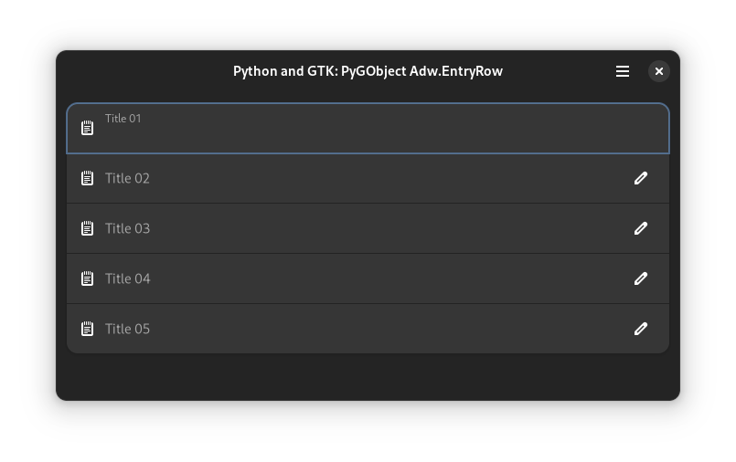

- [Informações do widget](./docs/widgets-info/AdwEntryRow.md).
- [Python](./src/libadwaita-widgets/entry-row/MainWindow.py).
- [GTK Blueprint](./src/libadwaita-widgets/entry-row/ui/MainWindow.blp).
- [Python load ui](./src/libadwaita-widgets/entry-row/ui/MainWindow.py).
- [UI](./src/libadwaita-widgets/entry-row/ui/MainWindow.ui).

---

#### Adw.ExpanderRow

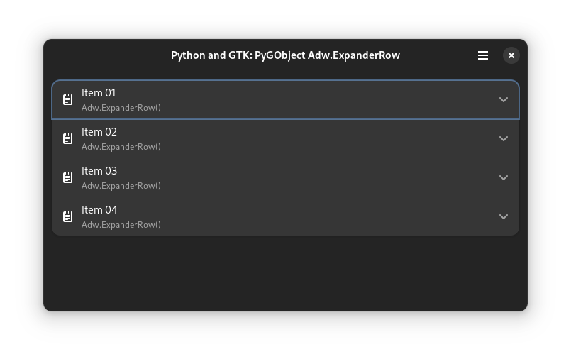

- [Informações do widget](./docs/widgets-info/AdwExpanderRow.md).
- [Python](./src/libadwaita-widgets/expander-row/MainWindow.py).
- [GTK Blueprint](./src/libadwaita-widgets/expander-row/ui/MainWindow.blp).
- [Python load ui](./src/libadwaita-widgets/expander-row/ui/MainWindow.py).
- [UI](./src/libadwaita-widgets/expander-row/ui/MainWindow.ui).

---

#### Adw.MessageDialog

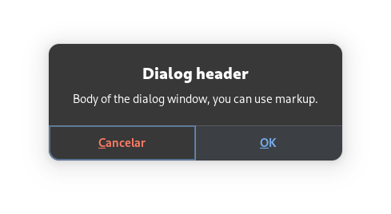

- [Informações do widget](./docs/widgets-info/AdwMessageDialog.md).
- [Python](./src/libadwaita-widgets/message-dialog/MainWindow.py).
- [GTK Blueprint](./src/libadwaita-widgets/message-dialog/ui/AdwMessageDialog.blp).
- [Python load ui](./src/libadwaita-widgets/message-dialog/ui/MainWindow.py).
- [UI](./src/libadwaita-widgets/message-dialog/ui/AdwMessageDialog.ui).

---

#### Adw.NavigationSplitView

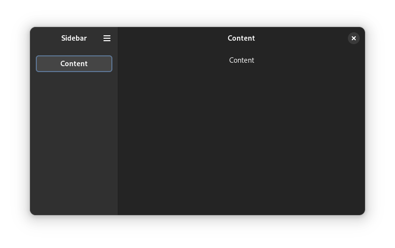

- [Informações do widget](./docs/widgets-info/AdwNavigationSplitView.md).
- [Python](./src/libadwaita-widgets/navigation-split-view/MainWindow.py).
- [GTK Blueprint](./src/libadwaita-widgets/navigation-split-view/ui/MainWindow.blp).
- [Python load ui](./src/libadwaita-widgets/navigation-split-view/ui/MainWindow.py).
- [UI](./src/libadwaita-widgets/navigation-split-view/ui/MainWindow.ui).

---

#### Adw.PasswordEntryRow

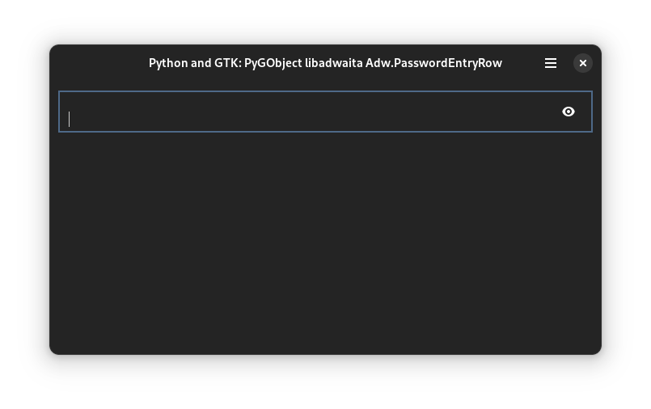

- [Informações do widget](./docs/widgets-info/AdwPasswordEntryRow.md).
- [Python](./src/libadwaita-widgets/password-entry-row/MainWindow.py).
- [GTK Blueprint](./src/libadwaita-widgets/password-entry-row/ui/MainWindow.blp).
- [Python load ui](./src/libadwaita-widgets/password-entry-row/ui/MainWindow.py).
- [UI](./src/libadwaita-widgets/password-entry-row/ui/MainWindow.ui).

---

#### Adw.PreferencesPage

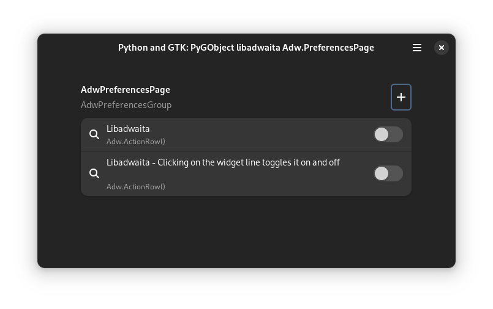

- [Python](./src/libadwaita-widgets/preferences-page/MainWindow.py).
- [GTK Blueprint](./src/libadwaita-widgets/preferences-page/ui/MainWindow.blp).
- [Python load ui](./src/libadwaita-widgets/preferences-page/ui/MainWindow.py).
- [UI](./src/libadwaita-widgets/preferences-page/ui/MainWindow.ui).

---

#### Adw.PreferencesWindow

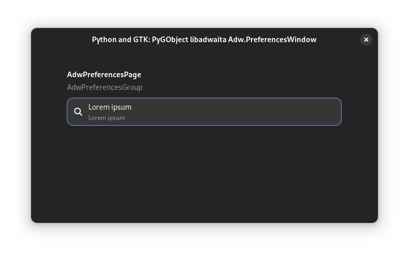

- [Python](./src/libadwaita-widgets/preferences-window/MainWindow.py).
- [GTK Blueprint](./src/libadwaita-widgets/preferences-window/ui/AdwPreferencesWindow.blp).
- [Python load ui](./src/libadwaita-widgets/preferences-window/ui/AdwPreferencesWindow.py).
- [UI](./src/libadwaita-widgets/preferences-window/ui/AdwPreferencesWindow.ui).

---

#### Adw.SplitButton

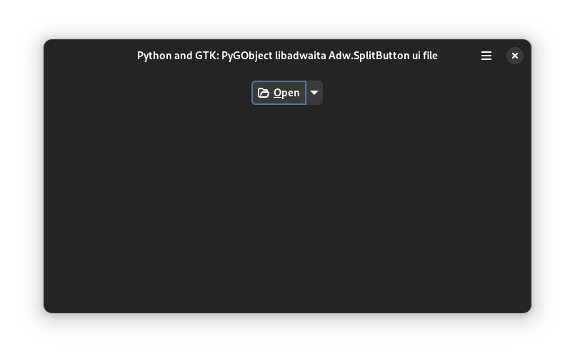

- [Informações do widget](./docs/widgets-info/AdwSplitButton.md).
- [Python](./src/libadwaita-widgets/split-button/MainWindow.py).
- [GTK Blueprint](./src/libadwaita-widgets/split-button/ui/MainWindow.blp).
- [Python load ui](./src/libadwaita-widgets/split-button/ui/MainWindow.py).
- [UI](./src/libadwaita-widgets/split-button/ui/MainWindow.ui).

---

#### Adw.StatusPage

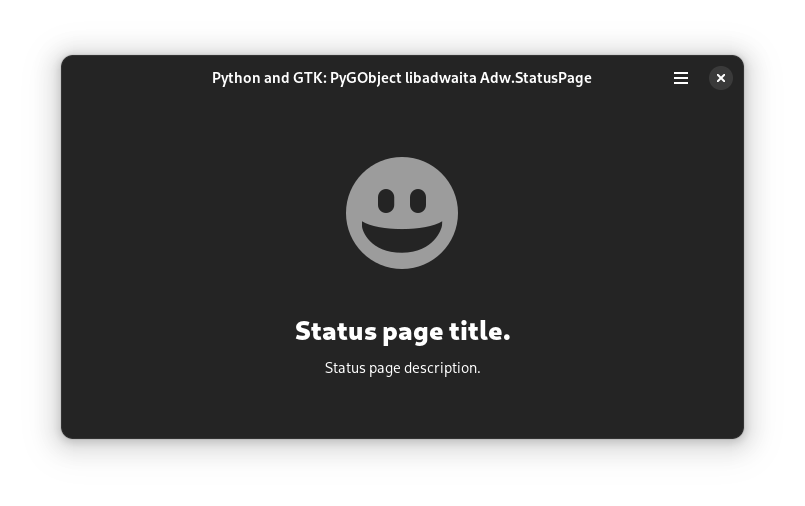

- [Informações do widget](./docs/widgets-info/AdwStatusPage.md).
- [Python](./src/libadwaita-widgets/status-page/MainWindow.py).
- [GTK Blueprint](./src/libadwaita-widgets/status-page/ui/MainWindow.blp).
- [Python load ui](./src/libadwaita-widgets/status-page/ui/MainWindow.py).
- [UI](./src/libadwaita-widgets/status-page/ui/MainWindow.ui).

--

#### Adw.Toast

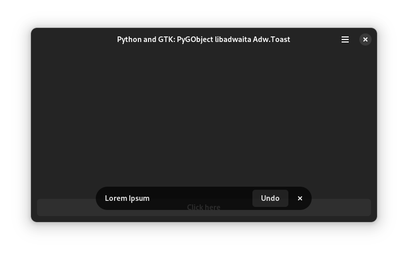

- [Python](./src/libadwaita-widgets/toast/MainWindow.py).
- [GTK Blueprint](./src/libadwaita-widgets/toast/ui/MainWindow.blp).
- [Python load ui](./src/libadwaita-widgets/toast/ui/MainWindow.py).
- [UI](./src/libadwaita-widgets/toast/ui/MainWindow.ui).

---

#### Adw.ToolbarView

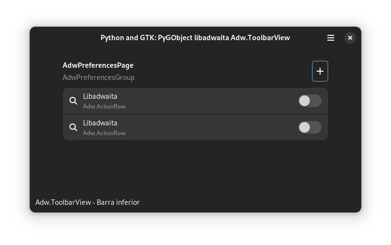

- [Informações do widget](./docs/widgets-info/AdwToolbarView.md).
- [Python](./src/libadwaita-widgets/toolbar-view/MainWindow.py).

---

#### Adw.ViewStack

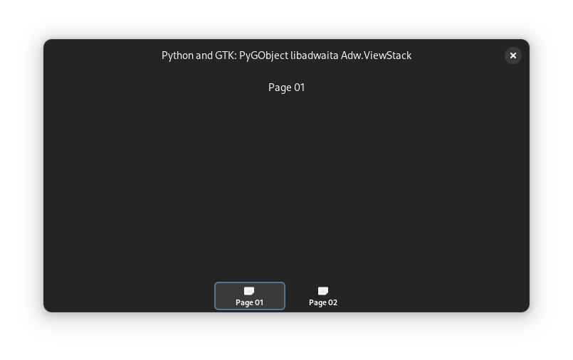

- [Informações do widget](./docs/widgets-info/AdwViewStack.md).
- [GTK Blueprint](./src/libadwaita-widgets/view-stack/ui/MainWindow.blp).
- [Python load ui](./src/libadwaita-widgets/view-stack/ui/MainWindow.py).
- [UI](./src/libadwaita-widgets/view-stack/ui/MainWindow.ui).

---

### Libadwaita style classes

#### Background

- [Python](./src/libadwaita-style-classes/background/MainWindow.py).
- [GTK Blueprint](./src/libadwaita-style-classes/background/ui/MainWindow.blp).
- [Python load ui](./src/libadwaita-style-classes/background/ui/MainWindow.py).
- [UI](./src/libadwaita-style-classes/background/ui/MainWindow.ui).

---

#### Body

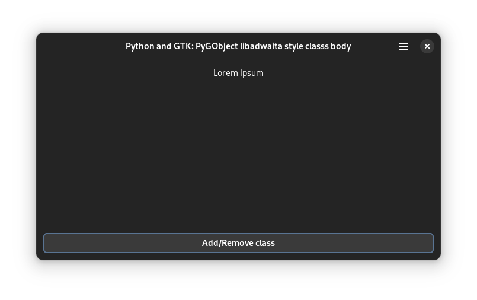

- [Python](./src/libadwaita-style-classes/body/MainWindow.py).
- [GTK Blueprint](./src/libadwaita-style-classes/body/ui/MainWindow.blp).
- [Python load ui](./src/libadwaita-style-classes/body/ui/MainWindow.py).
- [UI](./src/libadwaita-style-classes/body/ui/MainWindow.ui).

---

#### Boxed list

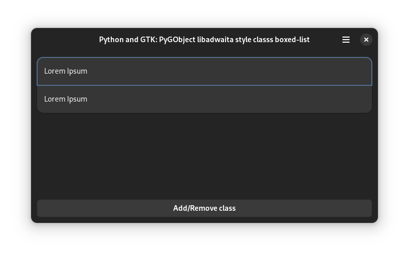

- [Python](./src/libadwaita-style-classes/boxed-list/MainWindow.py).
- [GTK Blueprint](./src/libadwaita-style-classes/boxed-list/ui/MainWindow.blp).
- [Python load ui](./src/libadwaita-style-classes/boxed-list/ui/MainWindow.py).
- [UI](./src/libadwaita-style-classes/boxed-list/ui/MainWindow.ui).

---

#### Boxed list separate

> ToDo.

- [Python](./src/libadwaita-style-classes).
- [GTK Blueprint](./src/libadwaita-style-classes).
- [Python load ui](./src/libadwaita-style-classes).
- [UI](./src/libadwaita-style-classes).

---

#### Caption

- [Python](./src/libadwaita-style-classes/caption/MainWindow.py).
- [GTK Blueprint](./src/libadwaita-style-classes/caption/ui/MainWindow.blp).
- [Python load ui](./src/libadwaita-style-classes/caption/ui/MainWindow.py).
- [UI](./src/libadwaita-style-classes/caption/ui/MainWindow.ui).

---

#### Caption heading

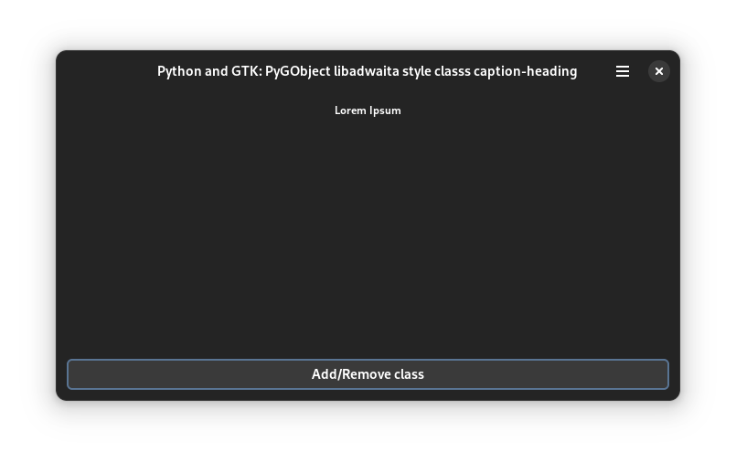

- [Python](./src/libadwaita-style-classes/caption-heading/MainWindow.py).
- [GTK Blueprint](./src/libadwaita-style-classes/caption-heading/ui/MainWindow.blp).
- [Python load ui](./src/libadwaita-style-classes/caption-heading/ui/MainWindow.py).
- [UI](./src/libadwaita-style-classes/caption-heading/ui/MainWindow.ui).

---

#### Card

- [Python](./src/libadwaita-style-classes/card/MainWindow.py).
- [GTK Blueprint](./src/libadwaita-style-classes/card/ui/MainWindow.blp).
- [Python load ui](./src/libadwaita-style-classes/card/ui/MainWindow.py).
- [UI](./src/libadwaita-style-classes/card/ui/MainWindow.ui).

---

#### Circular

- [Python](./src/libadwaita-style-classes/circular/MainWindow.py).
- [GTK Blueprint](./src/libadwaita-style-classes/circular/ui/MainWindow.blp).
- [Python load ui](./src/libadwaita-style-classes/circular/ui/MainWindow.py).
- [UI](./src/libadwaita-style-classes/circular/ui/MainWindow.ui).

---

#### Colors

- [Python](./src/libadwaita-style-classes/colors/MainWindow.py).
- [GTK Blueprint](./src/libadwaita-style-classes/colors/ui/MainWindow.blp).
- [Python load ui](./src/libadwaita-style-classes/colors/ui/MainWindow.py).
- [UI](./src/libadwaita-style-classes/colors/ui/MainWindow.ui).

---

#### Compact

- [Python](./src/libadwaita-style-classes/compact/MainWindow.py).
- [GTK Blueprint](./src/libadwaita-style-classes/compact/ui/MainWindow.blp).
- [Python load ui](./src/libadwaita-style-classes/compact/ui/MainWindow.py).
- [UI](./src/libadwaita-style-classes/compact/ui/MainWindow.ui).

---

#### Destructive action

- [Python](./src/libadwaita-style-classes/destructive-action/MainWindow.py).
- [GTK Blueprint](./src/libadwaita-style-classes/destructive-action/ui/MainWindow.blp).
- [Python load ui](./src/libadwaita-style-classes/destructive-action/ui/MainWindow.py).
- [UI](./src/libadwaita-style-classes/destructive-action/ui/MainWindow.ui).

---

#### Devel

- [Python](./src/libadwaita-style-classes/devel/MainWindow.py).
- [GTK Blueprint](./src/libadwaita-style-classes/devel/ui/MainWindow.blp).
- [Python load ui](./src/libadwaita-style-classes/devel/ui/MainWindow.py).
- [UI](./src/libadwaita-style-classes/devel/ui/MainWindow.ui).

---

#### Dim label

- [Python](./src/libadwaita-style-classes/dim-label/MainWindow.py).
- [GTK Blueprint](./src/libadwaita-style-classes/dim-label/ui/MainWindow.blp).
- [Python load ui](./src/libadwaita-style-classes/dim-label/ui/MainWindow.py).
- [UI](./src/libadwaita-style-classes/dim-label/ui/MainWindow.ui).

---

#### Flat

- [Python](./src/libadwaita-style-classes/flat/MainWindow.py).
- [GTK Blueprint](./src/libadwaita-style-classes/flat/ui/MainWindow.blp).
- [Python load ui](./src/libadwaita-style-classes/flat/ui/MainWindow.py).
- [UI](./src/libadwaita-style-classes/flat/ui/MainWindow.ui).

---

#### Frame

- [Python](./src/libadwaita-style-classes).
- [GTK Blueprint](./src/libadwaita-style-classes).
- [Python load ui](./src/libadwaita-style-classes).
- [UI](./src/libadwaita-style-classes).

---

#### Heading

- [Python](./src/libadwaita-style-classes/frame/MainWindow.py).
- [GTK Blueprint](./src/libadwaita-style-classes/frame/ui/MainWindow.blp).
- [Python load ui](./src/libadwaita-style-classes/frame/ui/MainWindow.py).
- [UI](./src/libadwaita-style-classes/frame/ui/MainWindow.ui).

---

#### Icon dropshadow

- [Python](./src/libadwaita-style-classes/icon-dropshadow/MainWindow.py).
- [GTK Blueprint](./src/libadwaita-style-classes/icon-dropshadow/ui/MainWindow.blp).
- [Python load ui](./src/libadwaita-style-classes/icon-dropshadow/ui/MainWindow.py).
- [UI](./src/libadwaita-style-classes/icon-dropshadow/ui/MainWindow.ui).

---

#### Inline

- [Python](./src/libadwaita-style-classes/inline/MainWindow.py).
- [GTK Blueprint](./src/libadwaita-style-classes/inline/ui/MainWindow.blp).
- [Python load ui](./src/libadwaita-style-classes/inline/ui/MainWindow.py).
- [UI](./src/libadwaita-style-classes/inline/ui/MainWindow.ui).

---

#### Linked

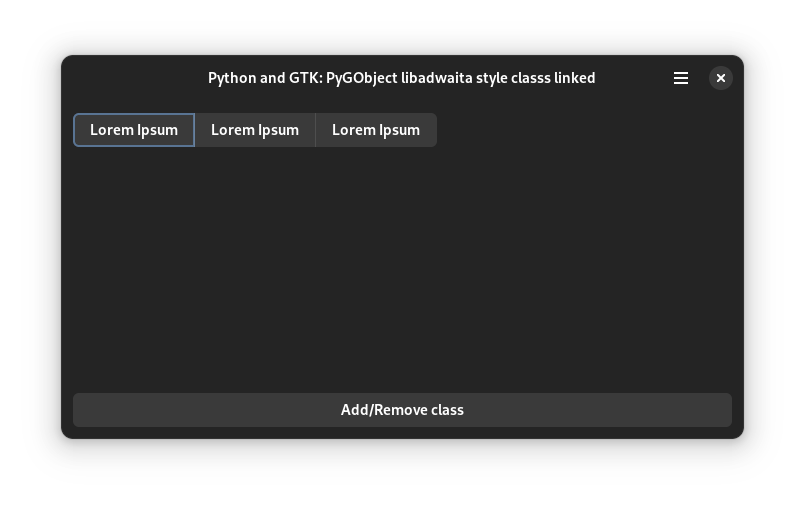

- [Python](./src/libadwaita-style-classes/linked/MainWindow.py).
- [GTK Blueprint](./src/libadwaita-style-classes/linked/ui/MainWindow.blp).
- [Python load ui](./src/libadwaita-style-classes/linked/ui/MainWindow.py).
- [UI](./src/libadwaita-style-classes/linked/ui/MainWindow.ui).

---

#### Lowres icon

- [Python](./src/libadwaita-style-classes/lowres-icon/MainWindow.py).
- [GTK Blueprint](./src/libadwaita-style-classes/lowres-icon/ui/MainWindow.blp).
- [Python load ui](./src/libadwaita-style-classes/lowres-icon/ui/MainWindow.py).
- [UI](./src/libadwaita-style-classes/lowres-icon/ui/MainWindow.ui).

---

#### Menu

- [Python](./src/libadwaita-style-classes/menu/MainWindow.py).
- [GTK Blueprint](./src/libadwaita-style-classes/menu/ui/MainWindow.blp).
- [Python load ui](./src/libadwaita-style-classes/menu/ui/MainWindow.py).
- [UI](./src/libadwaita-style-classes/menu/ui/MainWindow.ui).

---

#### Monospace

- [Python](./src/libadwaita-style-classes/monospace/MainWindow.py).
- [GTK Blueprint](./src/libadwaita-style-classes/monospace/ui/MainWindow.blp).
- [Python load ui](./src/libadwaita-style-classes/monospace/ui/MainWindow.py).
- [UI](./src/libadwaita-style-classes/monospace/ui/MainWindow.ui).

---

#### Navigation sidebar

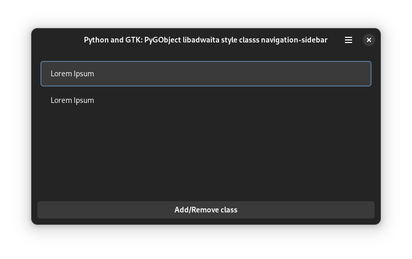

- [Python](./src/libadwaita-style-classes/navigation-sidebar/MainWindow.py).
- [GTK Blueprint](./src/libadwaita-style-classes/navigation-sidebar/ui/MainWindow.blp).
- [Python load ui](./src/libadwaita-style-classes/navigation-sidebar/ui/MainWindow.py).
- [UI](./src/libadwaita-style-classes/navigation-sidebar/ui/MainWindow.ui).

---

#### Numeric

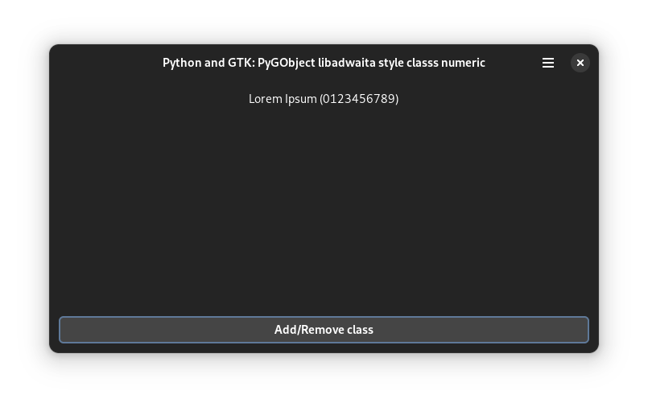

- [Python](./src/libadwaita-style-classes/numeric/MainWindow.py).
- [GTK Blueprint](./src/libadwaita-style-classes/numeric/ui/MainWindow.blp).
- [Python load ui](./src/libadwaita-style-classes/numeric/ui/MainWindow.py).
- [UI](./src/libadwaita-style-classes/numeric/ui/MainWindow.ui).

---

#### Opaque

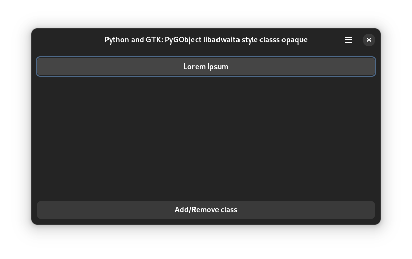

- [Python](./src/libadwaita-style-classes/opaque/MainWindow.py).
- [GTK Blueprint](./src/libadwaita-style-classes/opaque/ui/MainWindow.blp).
- [Python load ui](./src/libadwaita-style-classes/opaque/ui/MainWindow.py).
- [UI](./src/libadwaita-style-classes/opaque/ui/MainWindow.ui).

---

#### Osd

- [Python](./src/libadwaita-style-classes/osd/MainWindow.py).
- [GTK Blueprint](./src/libadwaita-style-classes/osd/ui/MainWindow.blp).
- [Python load ui](./src/libadwaita-style-classes/osd/ui/MainWindow.py).
- [UI](./src/libadwaita-style-classes/osd/ui/MainWindow.ui).

---

#### Pill

- [Python](./src/libadwaita-style-classes/pill/MainWindow.py).
- [GTK Blueprint](./src/libadwaita-style-classes/pill/ui/MainWindow.blp).
- [Python load ui](./src/libadwaita-style-classes/pill/ui/MainWindow.py).
- [UI](./src/libadwaita-style-classes/pill/ui/MainWindow.ui).

---

#### Property

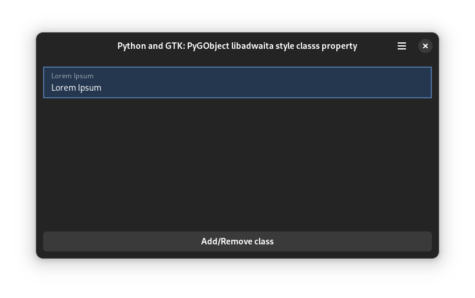

- [Python](./src/libadwaita-style-classes/property/MainWindow.py).
- [GTK Blueprint](./src/libadwaita-style-classes/property/ui/MainWindow.blp).
- [Python load ui](./src/libadwaita-style-classes/property/ui/MainWindow.py).
- [UI](./src/libadwaita-style-classes/property/ui/MainWindow.ui).

---

#### Selection mode

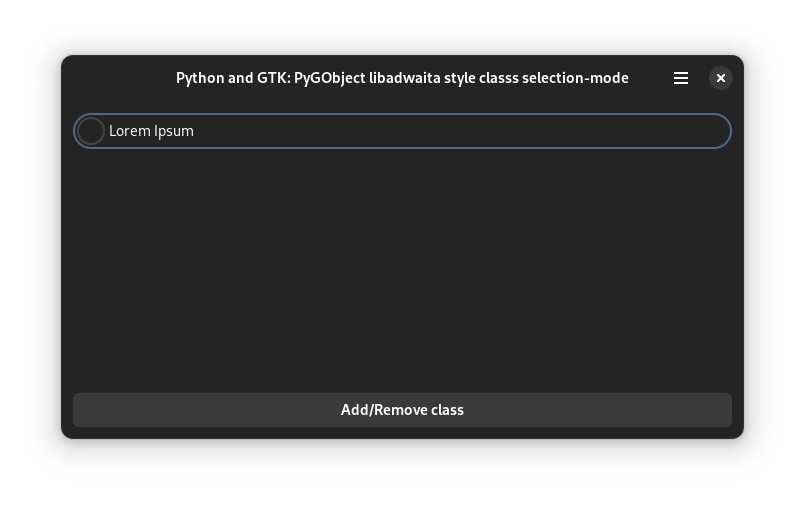

- [Python](./src/libadwaita-style-classes/selection-mode/MainWindow.py).
- [GTK Blueprint](./src/libadwaita-style-classes/selection-mode/ui/MainWindow.blp).
- [Python load ui](./src/libadwaita-style-classes/selection-mode/ui/MainWindow.py).
- [UI](./src/libadwaita-style-classes/selection-mode/ui/MainWindow.ui).

---

#### Spacer

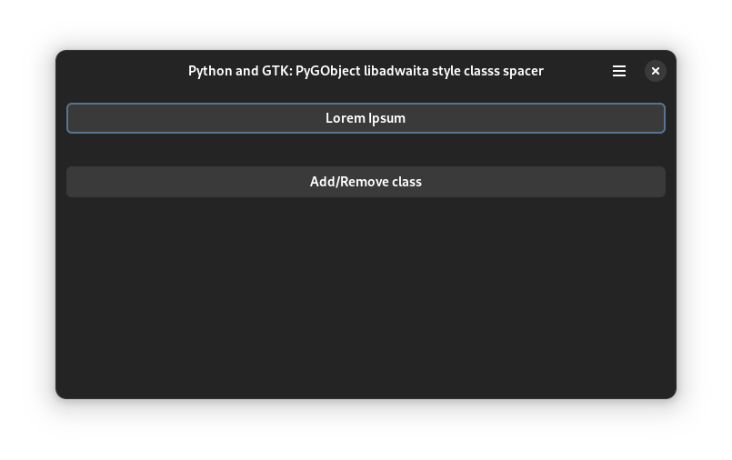

- [Python](./src/libadwaita-style-classes/spacer/MainWindow.py).
- [GTK Blueprint](./src/libadwaita-style-classes/spacer/ui/MainWindow.blp).
- [Python load ui](./src/libadwaita-style-classes/spacer/ui/MainWindow.ui).
- [UI](./src/libadwaita-style-classes/spacer/ui/MainWindow.ui).

---

#### Suggested action

- [Python](./src/libadwaita-style-classes/suggested-action/MainWindow.py).
- [GTK Blueprint](./src/libadwaita-style-classes/suggested-action/ui/MainWindow.blp).
- [Python load ui](./src/libadwaita-style-classes/suggested-action/ui/MainWindow.py).
- [UI](./src/libadwaita-style-classes/suggested-action/ui/MainWindow.ui).

---

#### Title

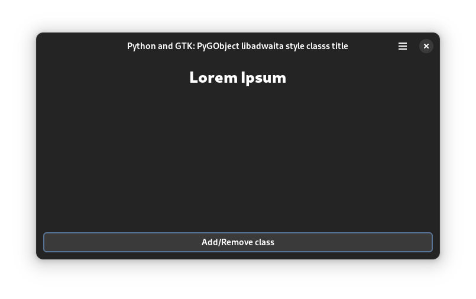

- [Python](./src/libadwaita-style-classes/title/MainWindow.py).
- [GTK Blueprint](./src/libadwaita-style-classes/title/ui/MainWindow.blp).
- [Python load ui](./src/libadwaita-style-classes/title/ui/MainWindow.py).
- [UI](./src/libadwaita-style-classes/title/ui/MainWindow.ui).

---

#### Toolbar

- [Python](./src/libadwaita-style-classes/toolbar/MainWindow.py).
- [GTK Blueprint](./src/libadwaita-style-classes/toolbar/ui/MainWindow.blp).
- [Python load ui](./src/libadwaita-style-classes/toolbar/ui/MainWindow.py).
- [UI](./src/libadwaita-style-classes/toolbar/ui/MainWindow.ui).

---

#### View

- [Python](./src/libadwaita-style-classes/view/MainWindow.py).
- [GTK Blueprint](./src/libadwaita-style-classes/view/ui/MainWindow.blp).
- [Python load ui](./src/libadwaita-style-classes/view/ui/MainWindow.py).
- [UI](./src/libadwaita-style-classes/view/ui/MainWindow.ui).

---
