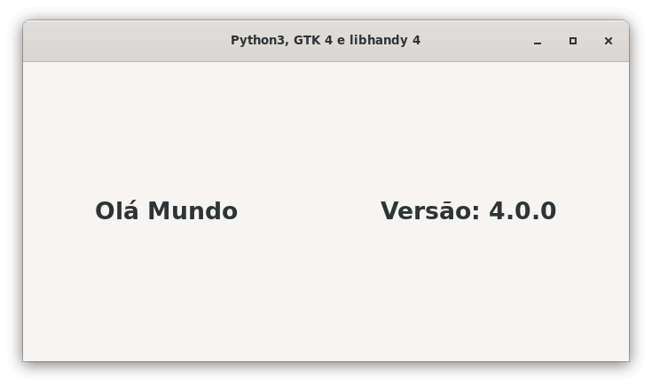

 

# Criando interfaces gráficas com Python (PyGObject) e GTK

Repostório com diversos exemplos de código e alguns tutoriais sobre a construção de interfaces gráficas com a linguagem
de progração Python e o toolkit gráfico GTK.

## O que estou publicando?

A ideia é apenas **estudar** e documentar a construção de interfaces gráficas com a linguagem de programação Python e o
toolkit para construção de interfaces gráficas GTK.

> **OBS**: Em caso de problemas entre em contato para que o material possa ser melhorado.

---

## GTK

O GTK é um **toolkit multiplataforma** para a criação de interfaces gráficas.

Este toolkit utiliza [licença GNU LGPL](https://pt.wikipedia.org/wiki/GNU_Lesser_General_Public_License), o que permite
a sua utilização para construção de softwares que seja livres ou proprietários.

Foi desenvolvido inicialmente para o [GIMP](https://www.gimp.org/) (GNU Image Manipulation Program), por isso foi
batizado de **GIMP Toolkit** ou simplesmente **GTK**.

Originalmente criado por, Peter Mattis, Spencer Kimball e Josh MacDonald.

O GTK+ é comumente utilizado na elaboração de aplicativos para o ambiente de desktop [GNOME](https://www.gnome.org/),
contudo por ser multiplataforma pode ser executado sem problemas em diversos sistemas operacionais e ambientes gráficos.

O toolkit é escrito em `C` , seu design é orientado a objeto com base no sistema de objetos da biblioteca `GLib` .

Existe o suporte (bindings) a diversas linguagens de programação, contudo as linguagem que são suportadas **
oficialmente** (até o momento que escrevo) são:

- C++.
- C\#.
- C.
- JavaScript.
- Python.
- Rust.
- Vala.

---

## bibliotecas:

- **GLib**: Biblioteca com utilitários de uso geral, não é específica para interfaces gráficas. GLib fornece muitos
  tipos de dados úteis, macros, conversões de tipo, utilitários de string, utilitários de arquivo, uma abstração de loop
  principal e assim por diante.
- **GObject**: Biblioteca que fornece um sistema de tipos.
- **GIO**: Uma API VFS (Virtual file system) moderna e fácil de usar, incluindo abstrações para arquivos, drives,
  volumes, fluxo de IO, bem como programação de rede e comunicação DBus.
- **cairo**: Cairo é uma biblioteca de gráficos 2D com suporte para vários dispositivos de saída.
- **Pango**: Pango é uma biblioteca para manipulação de texto internacionalizada. Ele gira em torno do objeto
  PangoLayout, representando um parágrafo de texto. Pango fornece o motor para `GtkTextView`, `GtkLabel`, `GtkEntry` e
  outros widgets que exibem texto.
- **ATK**: ATK é o Kit de ferramentas de acessibilidade. Ele fornece um conjunto de interfaces genéricas que permitem
  que tecnologias de acessibilidade interajam com uma interface gráfica de usuário. Por exemplo, um leitor de tela usa
  ATK para descobrir o texto em uma interface e lê-lo para usuários cegos. Os widgets GTK possuem suporte integrado para
  acessibilidade usando a estrutura ATK.
- **GdkPixbuf**: Esta é uma pequena biblioteca que permite criar objetos GdkPixbuf ("buffer de pixel") a partir de dados
  de imagem ou arquivos de imagem. Use um `GdkPixbuf` em combinação com `GtkImage` para exibir imagens.
- **graphene**: Esta é uma pequena biblioteca que fornece operações e tipos de dados vetoriais e matriciais. O graphene
  fornece implementações otimizadas usando vários conjuntos de instruções SIMD, como SSE.
- **GDK**: GDK é a camada de abstração que permite ao GTK oferecer suporte a vários sistemas de janelas. O GDK fornece
  recursos de sistema de janelas no Wayland, X11, Windows e OS X.
- **GSK**: GSK é uma biblioteca para criar um gráfico de cena a partir de nós de renderização e renderizá-lo usando
  diferentes APIs de renderização. GSK fornece renderizadores para OpenGL, Vulkan e Cairo.

---

## Tutoriais

- [Criando o ambiente de desenvolvimento](https://codigoninja.dev/gtk/gtk3-pygobject-criando-ambiente-desenvolvimento/).

### Windows

- [Criando um executável com o Cx_Freeze e listdlls](https://codigoninja.dev/gtk/gtk3-pygobject-criando-executavel-cx-freeze-windows/).
- [Como instalar o PyGObject for Windows (não recomendado)](https://codigoninja.dev/gtk/gtk3-instalar-pygobject-for-windows/).

### Linux

- [Criando um executável com o Cx_Freeze](https://codigoninja.dev/gtk/gtk3-pygobject-criando-executavel-cx-freeze-linux/).

### Style

- [Exemplo de alguns seletores css no Gtk](https://codigoninja.dev/gtk3-pygobject-principais-seletores-css/).
- [Ativar e desativar o modo escuro (dark mode)](https://codigoninja.dev/gtk/gtk3-pygobject-utilizar-modo-escuro-dark-mode/).

### Ferramentas

- [Ativando o Gkt Inspector](https://codigoninja.dev/gtk/ativar-ferramenta-gtk-Inspector/).
- [Como instalar o Gnome Builder](https://codigoninja.dev/gtk/instalar-gnome-builder-linux/).
- [Criando um projeto com o Gnome Builder](https://codigoninja.dev/gtk/criar-projeto-gnome-builder/).
- [Como instalar o Gnome Gnome Glade](https://codigoninja.dev/gtk/instalar-gnome-glade/).
- [Como instalar o Gtk icon browser](https://codigoninja.dev/gtk/instalar-gtk3-icon-browser/).

### Libhandy

- [Como instalar a biblioteca libhandy no Linux e Windows](https://codigoninja.dev/gtk/gtk3-pygobject-instalar-biblioteca-libhandy/).

---

## GTK 3

### Gio

- [Gio.Menu](./docs/gtk3-widgets.md#gio-menu).
- [Gio.SimpleAction](./docs/gtk3-widgets.md#gio-simple-action).

### Widgets

- [Gtk.ActionBar](./docs/gtk3-widgets.md#gtk-actionbar).
- [Gtk.ApplicationWindow](./docs/gtk3-widgets.md#gtk-applicationwindow).
- [Gtk.Box horizontal](./docs/gtk3-widgets.md#gtk-box-horizontal).
- [Gtk.Box vertical](./docs/gtk3-widgets.md#gtk-box-vertical).
- [Gtk.Button](./docs/gtk3-widgets.md#gtk-button).
- [Gtk.ButtonBox](./docs/gtk3-widgets.md#gtk-buttonbox).
- [Gtk.Calendar](./docs/gtk3-widgets.md#gtk-calendar).
- [Gtk.CheckButton](./docs/gtk3-widgets.md#gtk-checkbutton).
- [Gtk.Dialog](./docs/gtk3-widgets.md#gtk-dialog).
- [Gtk.DragAndDrop](./docs/gtk3-widgets.md#gtk-drag-and-drop).
- [Gtk.Entry](./docs/gtk3-widgets.md#gtk-entry).
- [Gtk.EntryCompletion](./docs/gtk3-widgets.md#gtk-entrycompletion).
- [Gtk.EventBox](./docs/gtk3-widgets.md#gtk-eventbox).
- [Gtk.FileChooserDialog folder](./docs/gtk3-widgets.md#gtk-filechooserdialog-folder).
- [Gtk.FileChooserDialog open](./docs/gtk3-widgets.md#gtk-filechooserdialog-open).
- [Gtk.FileChooserDialog save](./docs/gtk3-widgets.md#gtk-filechooserdialog-save).
- [Gtk.Fixed](./docs/gtk3-widgets.md#gtk-filechooserdialog-save).
- [Gtk.FlowBox](./docs/gtk3-widgets.md#gtk-flowbox).
- [Gtk.Grid](./docs/gtk3-widgets.md#gtk-grid).
- [Gtk.HeaderBar](./docs/gtk3-widgets.md#gtk-headerbar).
- [Gtk.Image](./docs/gtk3-widgets.md#gtk-image).
- [Gtk.InfoBar](./docs/gtk3-widgets.md#gtk-infobar).
- [Gtk.Layout](./docs/gtk3-widgets.md#gtk-layout).
- [Gtk.LinkButton](./docs/gtk3-widgets.md#gtk-linkbutton).
- [Gtk.ListBox](./docs/gtk3-widgets.md#gtk-listbox).
- [Gtk.Menu](./docs/gtk3-widgets.md#gtk-menu).
- [Gtk.MenuBar](./docs/gtk3-widgets.md#gtk-menubar).
- [Gtk.MenuButton](./docs/gtk3-widgets.md#gtk-menubutton).
- [Gtk.MessageDialog](./docs/gtk3-widgets.md#gtk-messagedialog).
- [Gtk.Notebook](./docs/gtk3-widgets.md#gtk-notebook).
- [Gtk.Notify](./docs/gtk3-widgets.md#gtk-notify).
- [Gtk.Overlay](./docs/gtk3-widgets.md#gtk-overlay).
- [Gtk.Paned horizontal](./docs/gtk3-widgets.md#gtk-paned-horizontal).
- [Gtk.Paned vertical](./docs/gtk3-widgets.md#gtk-paned-vertical).
- [Gtk.Popover](./docs/gtk3-widgets.md#gtk-popover).
- [Gtk.PrintOperation](./docs/gtk3-widgets.md#gtk-printoperation).
- [Gtk.RadioButton](./docs/gtk3-widgets.md#gtk-radiobutton).
- [Gtk.Revealer](./docs/gtk3-widgets.md#gtk-revealer).
- [Gtk.SearchBar](./docs/gtk3-widgets.md#gtk-searchbar).
- [Gtk.SearchEntry](./docs/gtk3-widgets.md#gtk-searchentry).
- [Gtk.Separator](./docs/gtk3-widgets.md#gtk-separator).
- [Gtk.Spinner](./docs/gtk3-widgets.md#gtk-spinner).
- [Gtk.StackSidebar](./docs/gtk3-widgets.md#gtk-stacksidebar).
- [Gtk.StackSwitcher](./docs/gtk3-widgets.md#gtk-stackswitcher).
- [Gtk.Statusbar](./docs/gtk3-widgets.md#gtk-statusbar).
- [Gtk Style add class](./docs/gtk3-widgets.md#gtk-style-add-class).
- [Gtk Style css provider](./docs/gtk3-widgets.md#gtk-style-css-provider).
- [Gtk Style dark mode](./docs/gtk3-widgets.md#gtk-style-dark-mode).
- [Gtk Style set name](./docs/gtk3-widgets.md#gtk-style-set-name).
- [Gtk.switch](./docs/gtk3-widgets.md#gtk-switch).
- [Gtk.ToggleButton](./docs/gtk3-widgets.md#gtk-togglebutton).
- [Gtk.Toolbar](./docs/gtk3-widgets.md#gtk-toolbar).
- [Gtk.TreeView editable](./docs/gtk3-widgets.md#gtk-treeview-editable).
- [Gtk.TreeView filter](./docs/gtk3-widgets.md#gtk-treeview-filter).
- [Gtk.TreeView sort](./docs/gtk3-widgets.md#gtk-treeview-sort).
- [Gtk.TreeView TreeStore](./docs/gtk3-widgets.md#gtk-treeview-treestore).
- [Gtk.Window](./docs/gtk3-widgets.md#gtk-window).

---

## GTK 4

> Em construção.

> Exemplos estarão disponíveis assim que o Gnome 40 estiver disponível nas principais distribuições Linux.

O GTK 4 foi lançado em 16 de dezembro 2020.

No GTK 4 é desencorajado o uso do Gnome Glade, isso porque o Gnome Builder fornece uma forma padronizada e moderna de se
criar e gerenciar projetos.

Os widgets que foram criados ou passaram por grandes aprimoramentos são:

- Data transfers.
- Event controllers.
- Layout managers.
- Render nodes.
- Media playback.
- Scalable lists.
- Shaders.
- Accessibility.

## Testando o GTK 4

O GTK 4 juntamente com a libhandy 4 podem ser testados utilizando-se o template base que está disponível no repositório:

[https://gitlab.gnome.org/tallero/helloworld](https://gitlab.gnome.org/tallero/helloworld).

Para utilizar o mesmo basta abrir o Gnome Builder e clonar o repositório.

*GTK 4 e libhandy 4*

### Widgets

> Em construção.

---

## Libhandy

### Widgets

- [Handy.ActionRow](./docs/handy-widgets.md#handy-actionrow).
- [Handy.ApplicationWindow](./docs/handy-widgets.md#handy-applicationwindow).
- [Handy.Avatar](./docs/handy-widgets.md#handy-avatar).
- [Handy.Carousel](./docs/handy-widgets.md#handy-avatar).
- [Handy.CarouselIndicatorDots](./docs/handy-widgets.md#handy-carousel-indicator-dots).
- [Handy.CarouselIndicatorLines](./docs/handy-widgets.md#handy-carousel-indicator-lines).
- [Handy.Clamp](./docs/handy-widgets.md#handy-clamp).
- [Handy.ComboRow](./docs/handy-widgets.md#handy-comborow).
- [Handy.Deck](./docs/handy-widgets.md#handy-deck).
- [Handy.ExpanderRow](./docs/handy-widgets.md#handy-expanderrow).
- [Handy.HeaderBar](./docs/handy-widgets.md#handy-headerbar).
- [Handy.HeaderGroup](./docs/handy-widgets.md#handy-headergroup).
- [Handy.Leaflet](./docs/handy-widgets.md#handy-leaflet).
- [Handy.SearchBar](./docs/handy-widgets.md#handy-searchbar).
- [Handy.Squeezer](./docs/handy-widgets.md#handy-squeezer).
- [Handy.ViewSwitcher](./docs/handy-widgets.md#handy-view-switcher).
- [Handy.ViewSwitcherBar](./docs/handy-widgets.md#handy-view-switcher-bar).
- [Handy.ViewSwitcherTitle](./docs/handy-widgets.md#handy-view-switcher-title).
- [Handy.Window](./docs/handy-widgets.md#handy-window).
- [Handy.WindowHandle](./docs/handy-widgets.md#handy-window-handle).

---

## Mockups

Reimaginando a interface de alguns aplicativos famosos com GTK.

> Em construção.

---

## Exemplos

### Navegador web (WebKit2.WebView)

* [WebKit2.WebView com Python](https://github.com/natorsc/gui-python-gtk/tree/master/src/gtk/examples/web-browser).

---
