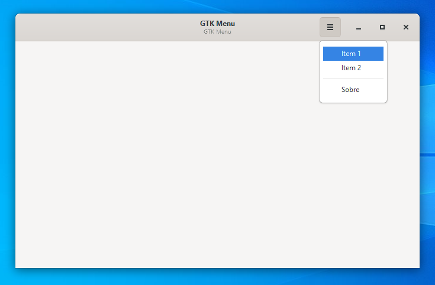
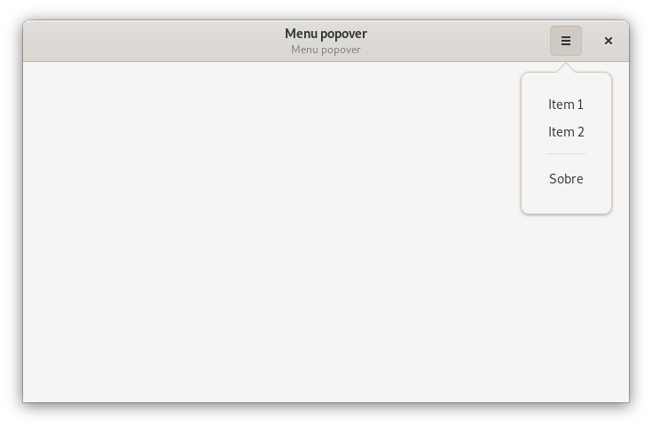
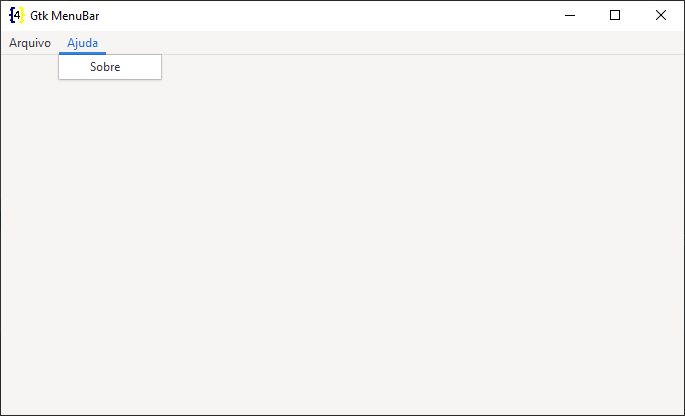
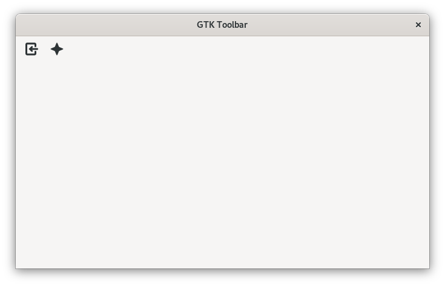
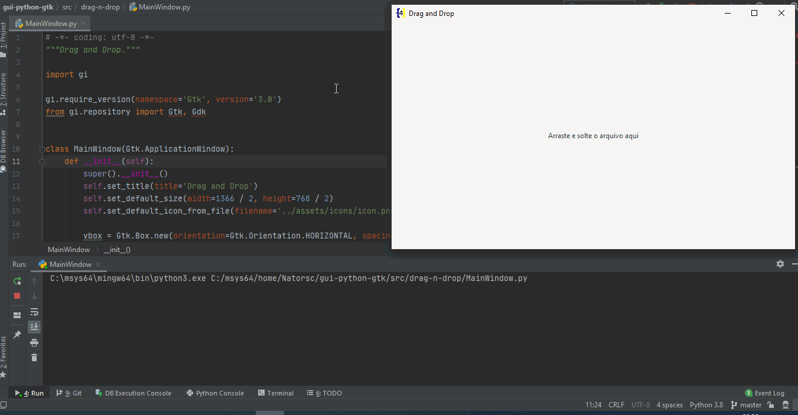
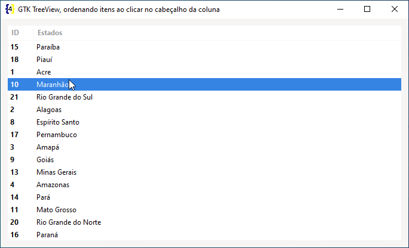
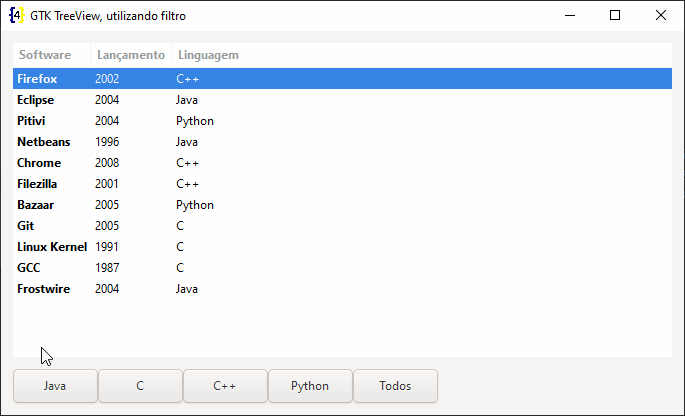

> Em desenvolvimento e revisão

> **OBS**: Este repositório tem um arquivo `Pipfile`, o mesmo **não** funciona no Windows, isso porque a instalação do GTK e Python **DEVEM** ser feitas pelo **msys2**.

---

# GUI (graphical user interface) com Python e GTK

Tutoriais e pequenos exemplos de código.

## GTK

O GTK é um **toolkit multiplataforma** para a criação de interfaces gráficas.

Este toolkit utiliza [licença GNU LGPL](https://pt.wikipedia.org/wiki/GNU_Lesser_General_Public_License), o que permite a sua utilização para construção de softwares que seja livres ou proprietários.

Foi desenvolvido inicialmente para o [GIMP](https://www.gimp.org/) (GNU Image Manipulation Program), por isso foi batizado de **GIMP Toolkit** ou simplesmente **GTK**.

Originalmente criado por, Peter Mattis, Spencer Kimball e Josh MacDonald.

O GTK+ é comumente utilizado na elaboração de aplicativos para o ambiente de desktop [GNOME](https://www.gnome.org/), contudo por ser multiplataforma pode ser executado sem problemas em diversos sistemas operacionais e ambientes gráficos.

O toolkit é escrito em `C`, seu design é orientado a objeto com base no sistema de objetos da biblioteca `GLib`.

Existe o suporte (bindings) a diversas linguagens de programação, contudo as linguagem que são suportadas **oficialmente** (até o momento que escrevo) são:

-   C++.
-   JavaScript.
-   Python.
-   Vala.

## O que estou publicando?

A ideia é apenas **estudar** e documentar a construção de interfaces gráficas com GTK e Python.

Exemplos de código podem ser vistos na pasta `src` deste repositório.

> Em caso de problemas entre em contato para que o material possa ser melhorado.

---

# Tutoriais

Os tutoriais foram movidos para o [blog](https://codigoninja.dev/) para permitir uma melhor formatação do conteúdo.

**Windows**: 

- [Como instalar o msys2 no Windows (Obrigatório)](https://codigoninja.dev/posts/instalar-msys2-windows/).
- [Python e GTK: Como Instalar o PyGObject for Windows (não recomendado)](https://codigoninja.dev/posts/python-gtk-instalar-pygobject-windows/).

**IDEs e RADs**:

- [Como instalar o Gnome Builder](https://codigoninja.dev/posts/instalar-gnome-builder/).
- [Como instalar o Gnome Glade](https://codigoninja.dev/posts/instalar-gnome-glade/).

**GTK**

- [Python e GTK: Configurando o ambiente de desenvolvimento](https://codigoninja.dev/posts/python-gtk-configurando-ambiente-desenvolvimento/).
- [Como ativar e utilizar o GTK Inspector (GtkInspector)](https://codigoninja.dev/posts/ativar-utilizar-gtk-inspector-gtkinspector/).
- [Python e GTK: Como utilizar o modo escuro (dark mode)](https://codigoninja.dev/posts/python-gtk-utilizar-modo-escuro-dark-mode/).
- [Como instalar o GTK icon browser](https://codigoninja.dev/posts/instalar-gtk-icon-browser/).

**Personalizando o estilo do aplicativo**:

- [Python com GTK: Como adicionar a propriedade name em um widget](https://codigoninja.dev/posts/python-gtk-adicionar-propriedade-name-widget/).
- [Python e GTK: Com adicionar uma classe em um widget](https://codigoninja.dev/posts/python-gtk-adicionar-classe-widget/).
- [Python e GTK: Principais seletores CSS e exemplo de utilização](https://codigoninja.dev/posts/python-gtk-principais-seletores-css-exemplo-utilizacao/).

**MainWindow (Janela principal)**:

- [Python e GTK: Criando uma janela](https://codigoninja.dev/posts/python-tk-criando-janela/).

**Executáveis**:

- [Python e GTK: Criando um executável com Cx_Freeze no Windows](https://codigoninja.dev/posts/python-gtk-criando-executavel-cx_freeze-windows/).
- [Python e GTK: Criando um executável com Cx_Freeze no Linux](https://codigoninja.dev/posts/python-gtk-criando-executavel-cx_freeze-linux/).

**Purism Librem 5**:

- [Como instalar a biblioteca libhandy](https://codigoninja.dev/posts/instalar-biblioteca-libhandy/).
- [Executando o PureOS (Phosh) via VM](https://codigoninja.dev/posts/executando-pureos-phosh-via-vm/).

**Extra**:

- [Como instalar a linguagem de programação Python no Linux e Windows ](https://codigoninja.dev/posts/instalar-linguagem-programacao-python-linux-windows/).

---

# Código

## GTK

### Janela principal

- [Lendo arquivos interface do Gnome Glade](./src/gtk/main-window/glade).
- [Lendo arquivos de interface do Gnome Builder](./src/gtk/main-window/builder).
- [Criando a janela com Python](./src/gtk/main-window).

### Signals e slots

- [Sinais e slots com arquivo de interface do Gnome Glade](./src/gtk/signals-and-slots/glade).
- [Sinais e slots com arquivo de interface do Gnome Builder](./src/gtk/signals-and-slots/builder).
- [Sinais e slots com arquivo com Python](./src/gtk/signals-and-slots).

### Janelas de diálogo

- [Janela de diálogo personalizada com Gnome Builder](./src/gtk/dialog/custom/builder).
- [Janela de diálogo personalizada com Gnome Glade](./src/gtk/dialog/custom/glade).
- [Janela de diálogo personalizada utilizando classe (class)](./src/gtk/dialog/custom_dialog_window.py).
- [Janela de diálogo personalizada](./src/gtk/dialog/custom_dialog_window_without_class.py).

- [Janela de diálogo do tipo mensagem utilizando classe (class)](./src/gtk/dialog/custom_dialog_window.py).
- [Janela de diálogo do tipo mensagem](./src/gtk/dialog/custom_dialog_window.py).

### Menus

- [GTK Menu](./src/gtk/menus/menu).

    
    
- [GTK Popover](./src/gtk/menus/popover).

    
    
- [GTK MenuBar](./src/gtk/menus/menubar).

    

- [GTK ToolBar](./src/gtk/menus/toolbar).

    

### Style

> **OBS**: Ao utilizar `background-color` deve-se utilizar `background-image: none;`.

> **OBS**: Ao utilizar somente `background` não é necessário utilizar `background-image: none;`.

> **OBS**: Alguns widgets utilizam uma imagem de fundo em alguns casos pode ser interessante remover essa imagem com `background-image: none;`.

- [Carregando uma arquivo css](./docs/style-load-css-file.md)
    
    
    
- [Adicionar classe a um widget](./docs/style-add-class.md)
    
    
    
- [Adicionar nome a um widget](./docs/style-add-name.md)
    
    

- [Ativando e desativando o dark mode (modo escuro)](./docs/style-dark-mode.md).
    
    

- [Utilizando ícones standard e symbolic](./src/gtk/gnome-icons).
    
    

### Layouts

- [actionbar](./src/gtk/layouts/actionbar).
- [box_horizontal](./src/gtk/layouts/box_horizontal).
- [box_vertical](./src/gtk/layouts/box_vertical).
- [buttonbox](./src/gtk/layouts/buttonbox).
- [fixed](./src/gtk/layouts/fixed).
- [flowbox](./src/gtk/layouts/flowbox).
- [grid](./src/gtk/layouts/grid).
- [gtk_layout](./src/gtk/layouts/gtk_layout).
- [headerbar_layout](./src/gtk/layouts/headerbar).
- [listbox_layout](./src/gtk/layouts/listbox).
- [notebook_layout](./src/gtk/layouts/notebook).
- [overlay_layout](./src/gtk/layouts/overlay).
- [paned_layout_horizontal](./src/gtk/layouts/paned_horizontal).
- [paned-layout-vertical](./src/gtk/layouts/paned_vertical).
- [revealer_layout](./src/gtk/layouts/revealer).
- [stack_layout_stacksidebar](./src/gtk/layouts/stack_stacksidebar).
- [stack_layout_stackswitcher](./src/gtk/layouts/stack_switcher).

### Widgets

- [Radio button](./src/gtk/widgets/radio-button)
- [TargetEntry (drag and drop)](./src/gtk/drag-n-drop)
    
    
    
- [GTK Entry](./src/gtk/widgets/entry):
    - [Auto completar ao digitar](./src/gtk/widgets/entry/autocomplete).
        
        
        
    - [Pesquisar ao digitar](./src/gtk/widgets/entry/search).
    
        
        
- GTK TreeView:
    - [Ordenando itens ao clicar no cabeçalho da coluna](./src/gtk/widgets/treeview/sort).
        
        
        
    - [Realizado a edição do valor na celular](./src/gtk/widgets/treeview/editable).
        
        
    
    - [Utilizando filtro](./src/gtk/widgets/treeview/filter).
    
        

---

## Purism Librem 5

### Widgets

- [action_row](./src/gtk/librem5-libhandy/action_row.py).
- [arrows](./src/gtk/librem5-libhandy/arrows.py).
- [column](./src/gtk/librem5-libhandy/column.py).
- [combo_row (não sei implementar ou ainda não funciona na versão que utilizei)]().
- [dialer](./src/gtk/librem5-libhandy/dialer.py).
- [dialer sem utilizar classe](./src/gtk/librem5-libhandy/dialer_without_class.py).
- [dialer_button](./src/gtk/librem5-libhandy/dialer_button.py).
- [dialer_cycle_button](./src/gtk/librem5-libhandy/dialer_cycle_button.py).
- [dialog](./src/gtk/librem5-libhandy/dialog.py).
- [dialog utilizando classe (os botões ficam direntes?)](./src/gtk/librem5-libhandy/dialog_with_class.py).
- enums.
- expander_row.
- header_bar.
- header_group.
- leaflet.
- mod.
- preferences_group.
- preferences_page.
- preferences_row.
- preferences_window.
- search_bar.
- squeezer.
- title_bar.
- value_object.
- versions.
- view_switcher_bar.
- view_switcher.

      