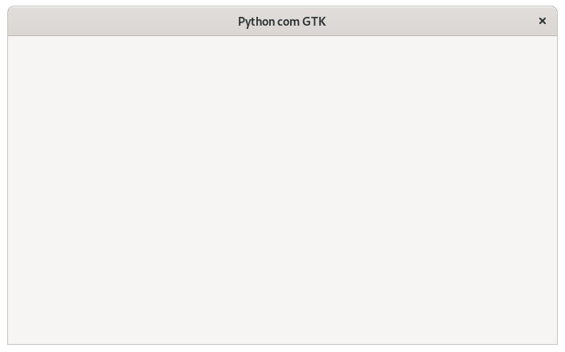
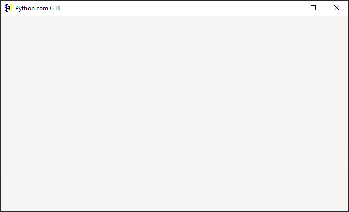

# Criando uma janela com Python e GTK

> Neste texto devo elencar algumas vantagens e desvantagens, as mesmas expressam a **minha** opinião e as **minhas** dificuldades. Sinta-se a vontade para questionar e discutir. Não trate este texto como uma verdade absoluta :relaxed:.

:rotating_light: Importante :rotating_light:

Caso você esteja começando por este texto recomendo que acesse primeiro essa postagem:

[Configurando o ambiente de desenvolvimento](./set-dev-env.md).

:rotating_light:

O GTK fornece diversas formas e paradigmas para a construção de uma janela.

O mais comum é utilizar como **janela principal** um widget do tipo `Gtk.ApplicationWindow`, isso porque a mesma **herda** de `Gtk.Window`, `Gio.ActionMap` e `Gio.ActionGroup`, e caso haja a necessidade de janelas adicionais podem ser utilizadas janelas do tipo `Gtk.Window`, entretanto isso não é uma regra.

Serão exibidas **4 formas** de se construir uma janela utilizando-se `Gtk.ApplicationWindow`.

:heavy_exclamation_mark: **Importante notar** que apesar de serem exibidas 4 formas de se criar **exatamente a mesma janela**, temos que ter em mente que todas as formas apresentadas estão corretas e **não existe uma forma melhor ou pior**, tudo irá depender do projeto que se está desenvolvendo ou mesmo da equipe que se tem disponível.

Vou iniciar falando das 2 formas onde **não temos** a separação da **lógica de negocio** do **design da interface**.

Isso sígnica que o design da interface é feito utilizando-se a **própria** linguagem de programação.

Vantagens

- Facilidade na verificação de erros.
- Não é necessário o aprendizado da linguagem de marcação da interface.

Desvantagens

- A pessoa que está **desenvolvendo a interface deve** ter domínio da linguagem de programação que está sendo utilizada na lógica de negocio.
- Dependendo do tamanho do projeto o código pode ficar confuso, principalmente quando são necessárias alterações de design.

Na **primeira forma** não utilizamos classes (orientação a objeto), isso torna o código bem simples e normalmente não gera confusão entre programadores iniciantes:

```python
# -*- coding: utf-8 -*-
"""Criando uma janela."""

# Importando a biblioteca gnome introspection.
import gi

# Definindo que o aplicativo deve ser executado no GTK 3.
# Isso porque um computador pode ter mais de uma versão do GTK.
gi.require_version(namespace='Gtk', version='3.0')

# Importando os widgets do GTK.
from gi.repository import Gtk

# Criando a janela principal.
win = Gtk.ApplicationWindow()

# Configurando a janela principal.
win.set_title(title='Python com GTK')
win.set_default_size(width=1366 / 2, height=768 / 2)
win.set_position(position=Gtk.WindowPosition.CENTER)
win.set_default_icon_from_file(filename='icone.png')

# Conectando a janela principal ao **evento** de fechar o aplicativo.
# Este evento é disparado quando o botão fechar da janela é pressionado.
win.connect('destroy', Gtk.main_quit)

# Exibindo a janela.
win.show_all()

# Iniciando o loop.
Gtk.main()
```

> **OBS**: Dei preferencia por comentar no código ao invés de escrever no texto.

> Lembre-se de comentar a linha do ícone ou de adicionar o caminho relativo ou absoluto até o mesmo.

Particularmente não gosto muito deste modelo, na **minha** opinião ele torna a manutenção do código mais complexa a medida que a aplicação cresce e em alguns momentos se faz necessária a utilização de variáveis **globais** e outros recursos que dificultam a localização de erros e a manutenção do código.

Já na **segunda forma** é utilizada uma **classe** para representar a janela.

Este é um modelo que me agrada, uma vez que permite a utilização de herança e **pra mim** faz mais sentido imaginar **cada janela** da aplicação **como um objeto** (uma classe):

```python
# -*- coding: utf-8 -*-
"""Utilizando uma classe para criar e configurar a janela principal."""

# Importando a biblioteca gnome introspection.
import gi

# Definindo que o aplicativo deve ser executado no GTK 3.
# Isso porque um computador pode ter mais de uma versão do GTK.
gi.require_version(namespace='Gtk', version='3.0')

# Importando os widgets do GTK.
from gi.repository import Gtk


class MainWindow(Gtk.ApplicationWindow):
    """Classe herda de ``Gtk.ApplicationWindow``."""

    def __init__(self):
        """Construtor."""
        super().__init__()

        # Configurando a janela principal.
        self.set_title(title='Python com GTK')
        self.set_default_size(width=1366 / 2, height=768 / 2)
        self.set_position(position=Gtk.WindowPosition.CENTER)
        self.set_default_icon_from_file(filename='icone.png')


if __name__ == '__main__':
    # Criando a janela principal.
    win = MainWindow()

    # Conectando a janela principal ao evento de fechar o aplicativo.
    # Este evento é disparado quando o botão fechar da janela é pressionado.
    win.connect('destroy', Gtk.main_quit)

    # Exibindo a janela.
    win.show_all()

    # Iniciando o loop.
    Gtk.main()
```

Eu particularmente **recomendo** que se utilize o modelo com classes, no curto prazo ele deve exigir alguma curva de aprendizado, entretanto no logo prazo ele deve tornar a manutenção do código mais simples e modular.

Certo essas foram 2 formas de criar a janela utilizando-se a própria linguagem de programação.

Agora vamos ver 2 formas de ler arquivos de interface externos gerados pelo [Gnome Glade](./install-gnome-glade.md) e pelo o [Gnome Builder](./install-gnome-builder.md).

> **OBS**: Os arquivos de interface também podem ser escritos sem a utilização de nenhum programa externo, desde que se possua um bom conhecimento da linguagem de marcação e dos widgets que compõem a mesma.

A utilização de arquivos de interface é considerada uma **boa pratica**, uma vez que o **programador/designer** não precisa conhecer a linguagem de programação que está sendo utilizada na lógica de negocio para criar a interface.

Vamos começar com o arquivo de interface (`xml`) do Gnome Glade:

```xml
<?xml version="1.0" encoding="UTF-8"?>
<!-- Generated with glade 3.22.1 -->
<!-- MainWindow.glade -->
<interface>
    <requires lib="gtk+" version="3.20"/>
    <object class="GtkApplicationWindow" id="MainWindow">
        <property name="can_focus">False</property>
        <property name="title" translatable="yes">Python com GTK</property>
        <property name="default_width">683</property>
        <property name="default_height">384</property>
        <property name="icon">../../assets/icons/icon.png</property>
        <child>
            <placeholder/>
        </child>
    </object>
</interface>
```

Para realizar a leitura do arquivo de interface gerado pelo Gnome Glade pode ser utilizado o seguinte código Python:

```python
# -*- coding: utf-8 -*-
"""Lendo arquivo de interface gerado pelo Gnome Glade."""

import gi

gi.require_version(namespace='Gtk', version='3.0')
from gi.repository import Gtk

if __name__ == '__main__':
    # Criando uma instancia do Builder.
    builder = Gtk.Builder.new()

    # Acessando/lendo arquivo de interface.
    builder.add_from_file(filename='MainWindow.glade')

    # Listando todos os widgets disponíveis no arquivo de interface.
    # print(builder.get_objects())

    # Acessando a janela que foi criada no arquivo de interface.
    win = builder.get_object(name='MainWindow')

    # Conectando o evento de fechar ao botão fechar da janela.
    win.connect('destroy', Gtk.main_quit)

    # Exibindo a janela.
    win.show_all()

    # Loop da interface.
    Gtk.main()
```

No **Gnome Builder** vamos ter um código de interface semelhante, a principal diferença é que a janela principal não será um `<object>` mais sim um `<template>`, além é claro das diferenças de atributos:

- **Gnome Glade**: `<object class="GtkApplicationWindow" id="MainWindow">`.
- **Gnome Builder**: `<template class="MainWindow" parent="GtkApplicationWindow">`.

Código de interface do Gnome Builder:

```xml
<?xml version="1.0" encoding="UTF-8"?>
<!-- MainWindow.ui -->
<interface>
    <requires lib="gtk+" version="3.20"/>
    <template class="MainWindow" parent="GtkApplicationWindow">
        <property name="can_focus">False</property>
        <property name="title" translatable="yes">Python com GTK</property>
        <property name="default_width">683</property>
        <property name="default_height">384</property>
        <property name="icon">../../assets/icons/icon.png</property>
        <child>
            <placeholder/>
        </child>
    </template>
</interface>
```

Para leitura do arquivo de interface gerado pelo Gnome Builder:

```python
# -*- coding: utf-8 -*-
"""Lendo arquivo de interface gerado pelo Builder.

Arquivo está com a extensão glade porque o PyCharm não
abre a extensão `*.ui`.
"""

import gi

gi.require_version(namespace='Gtk', version='3.0')
from gi.repository import Gtk


# @Gtk.Template(string, filename, resource_path)
@Gtk.Template(filename='MainWindow.glade')
class MainWindow(Gtk.ApplicationWindow):
    # Variável **DEVE** ter o mesmo nome do parâmetro
    # ``class`` do arquivo de inteface.
    __gtype_name__ = 'MainWindow'


if __name__ == '__main__':
    win = MainWindow()
    win.connect('destroy', Gtk.main_quit)
    win.show_all()
    Gtk.main()
```

Independente do modelo escolhido o resultado será a seguinte janela:



Código sendo executado no Windows:

