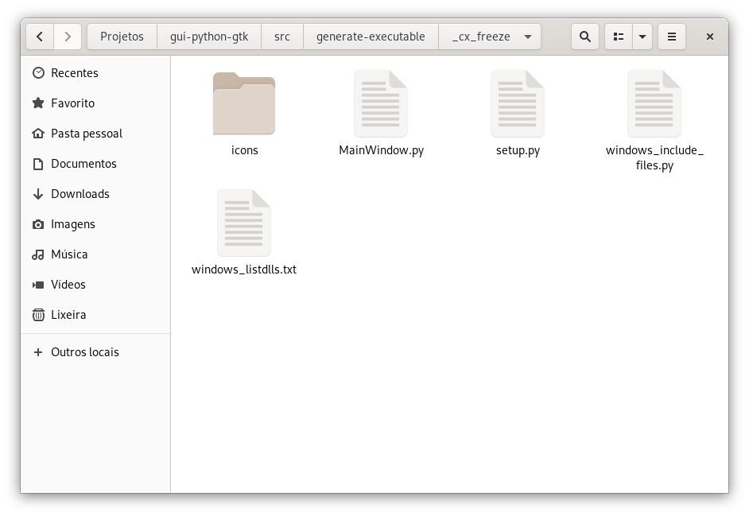
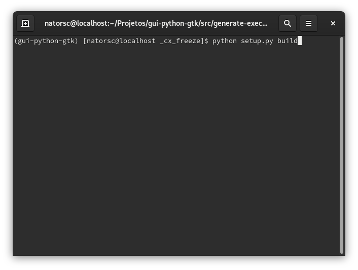
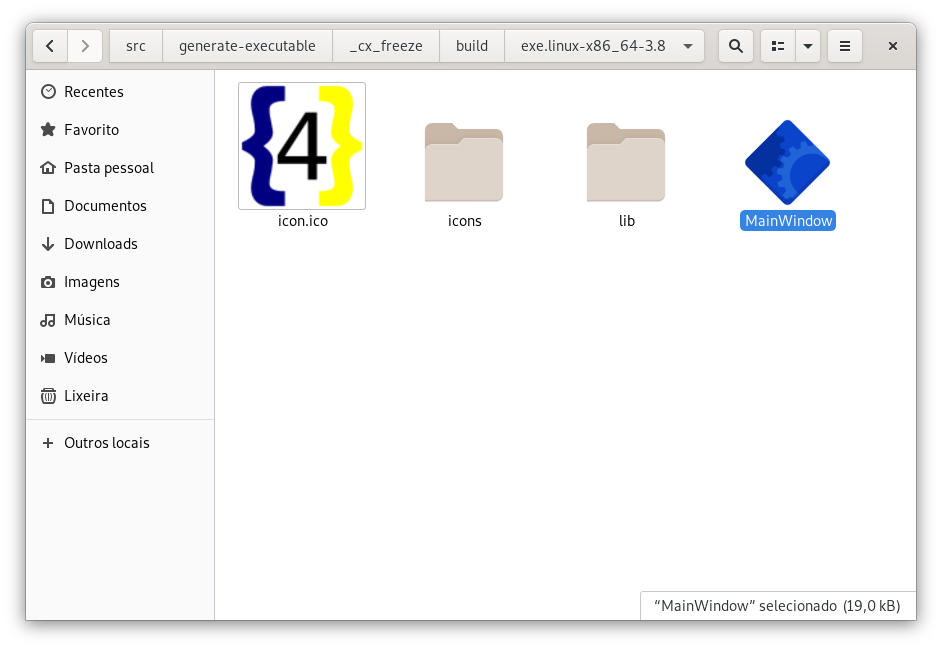
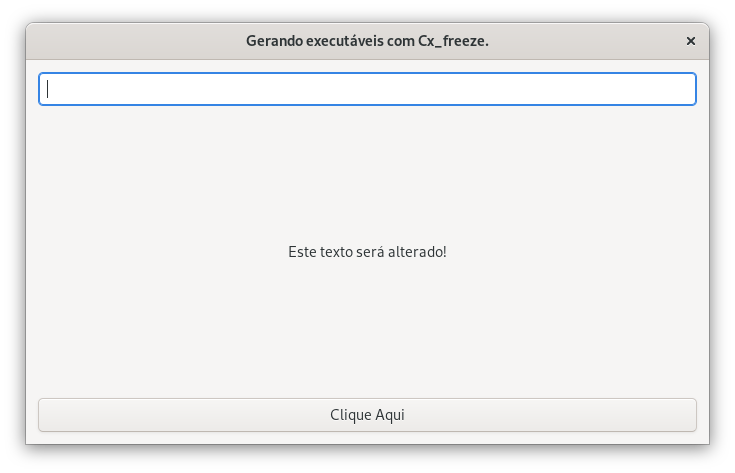
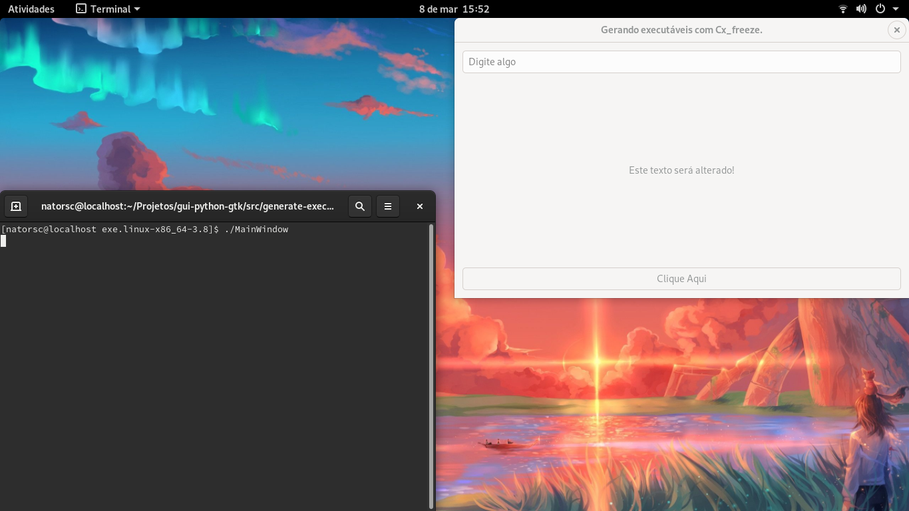
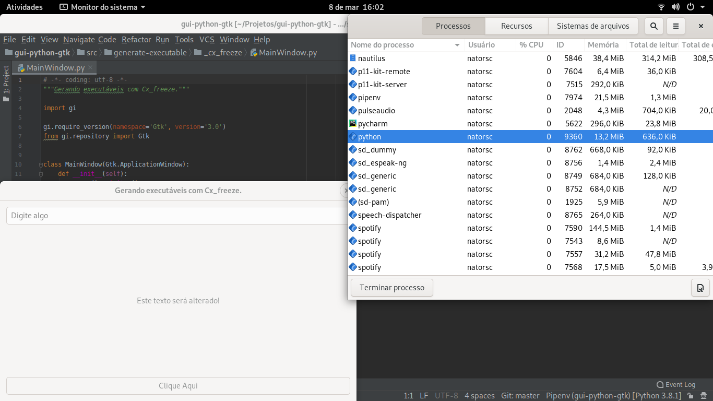
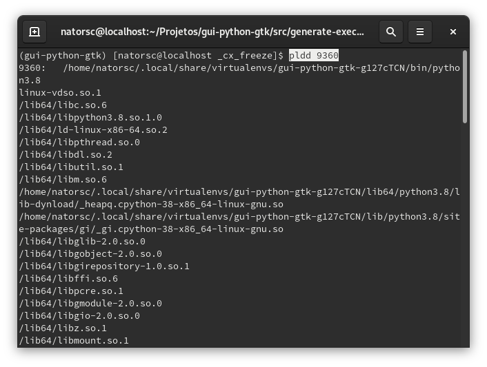

# Criando executáveis com Cx_Freeze no Linux

Gerar executáveis no Linux não costuma ser uma tarefa demasiadamente complexa.

Diferente do que vimos no Microsoft Windows:

- [Criando executáveis com Cx_Freeze no Windows](./cxfreeze-windows.md).

O Cx_Freeze no Linux **QUASE SEMPRE** consegue copiar todas as dependências necessárias.

Para este exemplo vamos utilizar a seguinte estrutura de arquivos e diretórios:

```txt
.
├── icons
│   ├── icon.ico
│   └── icon.png
├── MainWindow.py
├── setup.py
├── windows_include_files.py
└── windows_listdlls.txt
```



Ela é idêntica ao que vimos na postagem para Microsoft Windows e é por isso que temos os arquivos `windows_include_files.py` e `windows_listdlls.txt` , porém isso não irá atrapalhar.

Para ambos os sistema operacionais é utilizado o seguinte código dentro do arquivo `MainWindow.py`:

```python
# -*- coding: utf-8 -*-
"""Gerando executáveis com Cx_freeze."""

import gi

gi.require_version(namespace='Gtk', version='3.0')
from gi.repository import Gtk


class MainWindow(Gtk.ApplicationWindow):
    def __init__(self):
        super().__init__()
        self.set_title(title='Gerando executáveis com Cx_freeze.')
        self.set_default_size(width=1366 / 2, height=768 / 2)
        self.set_position(position=Gtk.WindowPosition.CENTER)
        self.set_default_icon_from_file(filename='./icons/icon.png')

        vbox = Gtk.Box.new(orientation=Gtk.Orientation.VERTICAL, spacing=12)
        vbox.set_border_width(border_width=12)
        self.add(widget=vbox)

        self.entry = Gtk.Entry.new()
        self.entry.set_placeholder_text(text='Digite algo')
        vbox.pack_start(child=self.entry, expand=False, fill=True, padding=0)

        self.label = Gtk.Label.new(str='Este texto será alterado!')
        vbox.pack_start(child=self.label, expand=True, fill=True, padding=0)

        button = Gtk.Button.new_with_label(label='Clique Aqui')
        button.connect('clicked', self._on_button_clicked)
        vbox.pack_end(child=button, expand=False, fill=True, padding=0)

    def _on_button_clicked(self, button):
        """Método é chamado quando o botão da interface é pressionado.

        Caso haja algum texto/caractere no campo de entrada de texto o
        texto será exibido no label da interface, caso não haja
        texto é exibida outra mensagem.

        :param button: Instância do objeto ``Gtk.Button()``. Basicamente
        informaçõe do botão que foi pressionado.
        """
        if self.entry.get_text():
            self.label.set_label(str=self.entry.get_text())
        else:
            self.label.set_label(str='Digite algo no campo acima!')


if __name__ == '__main__':
    win = MainWindow()
    win.connect('destroy', Gtk.main_quit)
    win.show_all()
    Gtk.main()
```

Caso você não tenha o Python e o GTK configurados, leia:

- [Configurando o ambiente de desenvolvimento](./set-dev-env.md).
- Os arquivos necessários também estão disponíveis no meu repositório no [Github](https://github.com/natorsc/gui-python-gtk/tree/master/src/generate-executable/_cx_freeze).

A instalação do Cx_freeze é feita a partir do comando:

```bash
pip install cx_Freeze
```

> Recomendo que você utilize um ambiente virtual!.

Após instalar o Cx_Freeze vamos criar o arquivo `setup.py` , neste arquivo vamos inserir o seguinte código:

```python
# -*- coding: utf-8 -*-
"""Gerando executáveis com Cx_Freeze!"""

import sys
from platform import system

from cx_Freeze import Executable, setup

base = None

build_exe_options = {
    'excludes': ['tkinter', 'wx', 'email', 'pydoc_data', 'curses'],
    'include_files': ['icons'],
    'packages': ['gi'],
}

if system() == 'Windows':
    from windows_include_files import include_files

    if sys.platform == 'win32':
        base = 'Win32GUI'
        build_exe_options['include_files'] = include_files

    if sys.platform == 'win64':
        base = 'Win64GUI'
        build_exe_options['include_files'] = include_files

setup(
    name='MyApp',
    author='Renato Cruz (natorsc@gmail.com)',
    version='0.0.1',
    description='Criando executáveis com Cx_Freeze!',
    options={'build_exe': build_exe_options},
    executables=[
        Executable(
            'MainWindow.py',
            base=base,
            icon='icons/icon.ico',
        ),
    ],
)
```

Após criar o arquivo podemos gerar o executável com o comando:

```bash
python setup.py build
```



> **OBS**: Utilizei o comando `python` porque estou utilizando um ambiente virtual! Adéque conforme o seu ambiente de desenvolvimento.

Ao final do processo será criada uma pasta chamada `build` , dentro desta pasta haverá uma **subpasta** com o nome da arquitetura e dentro dela temos o arquivo executável `MainWindow`:

```txt
.
├── build
│   └── exe.linux-x86_64-3.8
│       ├── icon.ico
│       ├── icons
│       ├── lib
│       └── MainWindow
├── icons
│   ├── icon.ico
│   └── icon.png
├── MainWindow.py
├── setup.py
├── windows_include_files.py
└── windows_listdlls.txt
```



Para executar basta dar **2 cliques** sobre o arquivo `MainWindow` :

Como resultado temos:



Caso o executável não abra tente executar o mesmo via terminal:

```bash
./MainWindow
```



Isso fará com que um **log de erro** seja exibido no terminal. Assim é possível ir analisando e corrigindo os possíveis problemas.

## Extra

Como vimos no texto do Microsoft Windows podemos utilizar o `ListDLLs` para identificar as DLLs que estão envolvidas em um determinado processo.

No Linux caso o aplicativo apresente algum problema por falta de alguma biblioteca podemos utilizar o comando `pldd` para verificar as bibliotecas que estão envolvidas em um determinado processo.

Para isso basta executar o código de exemplo e abrir o gerenciador de processos da sua distribuição (ou via terminal mesmo 😉) e localizar o **PID** do processo:



Ao localizar o processo execute no terminal:

```bash
pldd PID
```

> **OBS**: Substitua **PID** pelo numero do seu processo.



Com isso é exibido no terminal as bibliotecas e o caminho até elas, com isso basta adequar o arquivo `setup.py`, fazendo com que o mesmo copie alguma biblioteca que possa ter faltado.

> **OBS**: Vale observar que a ferramenta de linha de comando `pldd` não é a única que realiza essa operação, utilize a ferramenta de linha de comando que a sua distribuição Linux possua ou aquela que lhe traz um melhor resultado.