# Criando executáveis com Cx_Freeze no Windows

Apesar de procurar na documentação e pela internet, não encontrei exemplos, textos ou tutoriais que exemplifiquem este procedimento de gerar executáveis com Python e GTK no Windows.

Devido a isso resolvi montar um tutorial o mais completo possível :muscle:.

Os arquivos necessários para este tutorial podem ser encontrados no meu [Github](https://github.com/natorsc/gui-python-gtk/tree/master/src/generate-executable/_cx_freeze).

Vamos começar criando um chamado `MainWindow.py`, nele vamos ter o seguinte código:

```python
# -*- coding: utf-8 -*-
"""Gerando executáveis com Cx_freeze."""

import gi

gi.require_version(namespace='Gtk', version='3.0')
from gi.repository import Gtk


class MainWindow(Gtk.ApplicationWindow):
    def __init__(self):
        super().__init__()
        self.set_title(title='Gerando executáveis com Cx_freeze.')
        self.set_default_size(width=1366 / 2, height=768 / 2)
        self.set_position(position=Gtk.WindowPosition.CENTER)
        self.set_default_icon_from_file(filename='./icons/icon.png')

        vbox = Gtk.Box.new(orientation=Gtk.Orientation.VERTICAL, spacing=12)
        vbox.set_border_width(border_width=12)
        self.add(widget=vbox)

        self.entry = Gtk.Entry.new()
        self.entry.set_placeholder_text(text='Digite algo')
        vbox.pack_start(child=self.entry, expand=False, fill=True, padding=0)

        self.label = Gtk.Label.new(str='Este texto será alterado!')
        vbox.pack_start(child=self.label, expand=True, fill=True, padding=0)

        button = Gtk.Button.new_with_label(label='Clique Aqui')
        button.connect('clicked', self._on_button_clicked)
        vbox.pack_end(child=button, expand=False, fill=True, padding=0)

    def _on_button_clicked(self, button):
        """Método é chamado quando o botão da interface é pressionado.

        Caso haja algum texto/caractere no campo de entrada de texto o
        texto será exibido no label da interface, caso não haja
        texto é exibida outra mensagem.

        :param button: Instância do objeto ``Gtk.Button()``. Basicamente
        informaçõe do botão que foi pressionado.
        """
        if self.entry.get_text():
            self.label.set_label(str=self.entry.get_text())
        else:
            self.label.set_label(str='Digite algo no campo acima!')


if __name__ == '__main__':
    win = MainWindow()
    win.connect('destroy', Gtk.main_quit)
    win.show_all()
    Gtk.main()
```

O código acima cria uma janela e nela temos alguns widgets, esse script se tornará um executável através do Cx_freeze.

A maior parte dos problemas ao se gerar um executável para Windows está no fato do Cx_Freeze não conseguir copiar todas as **dlls** necessárias.

Uma solução para isso é utilizar a ferramenta de linha de comando **ListDLLs**.

Essa ferramenta é da própria Microsoft que pode ser baixada no endereço:

[https://docs.microsoft.com/en-us/sysinternals/downloads/listdlls](https://docs.microsoft.com/en-us/sysinternals/downloads/listdlls)

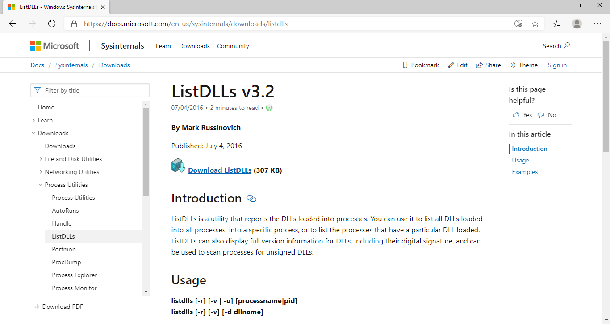

A ferramenta de linha de comando permite que um processo seja passado e ela irá retornar as dlls que são utilizadas neste processo 😍.

Ao realizar o download teremos um arquivo compactado:

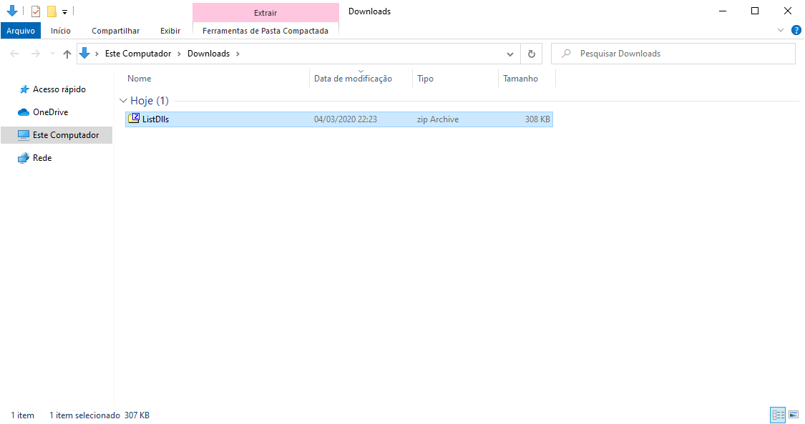

Basta extrair o mesmo e teremos acesso a **2 arquivos executáveis**:

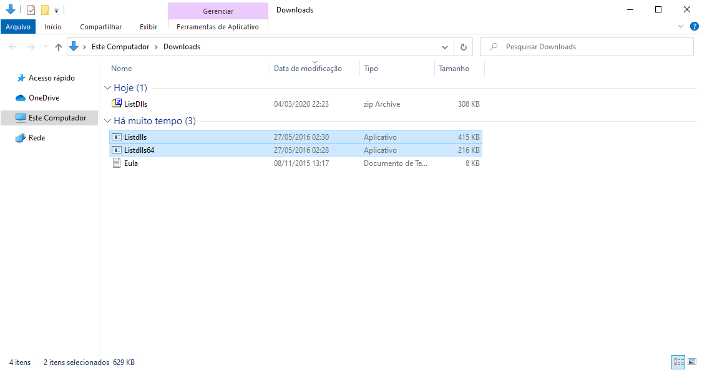

Um arquivo executável para sistemas **32 bits** e outro para sistemas **64 bits**.

Agora que temos a ferramenta necessária, precisamos criar o processo que desejamos analisar.

Para isso devemos executar o nosso código de exemplo (`MainWindow.py`):

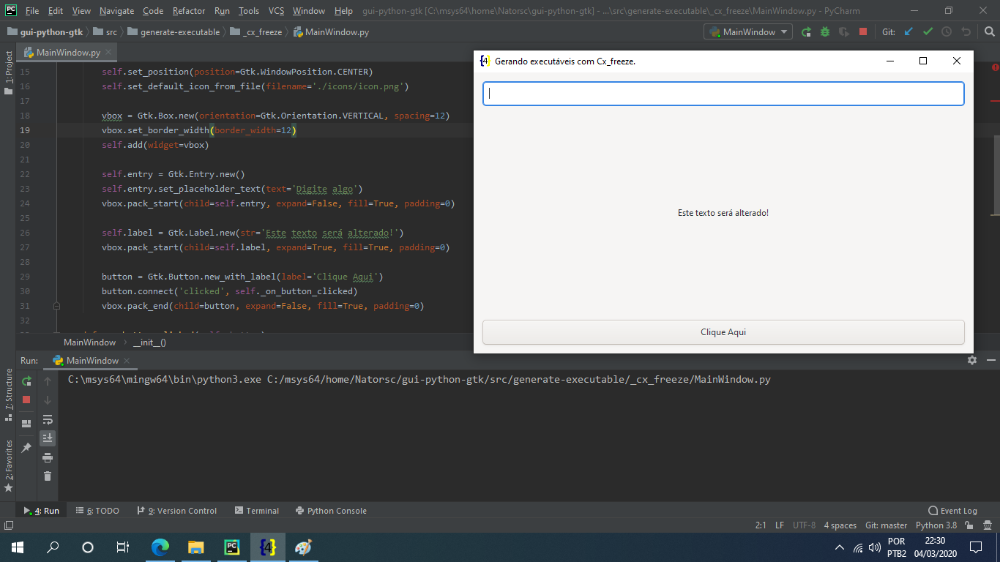

No terminal do PyCharm é possível ver que ele utilizou `python3.exe` para executar o código e este será o processo que deverá ser analisado com o ListDLLs.

Caso tenha duvidas de qual processo foi gerado, basta acessar o **Gerenciador de Tarefas** do Windows e clicar na aba **Detalhes**:

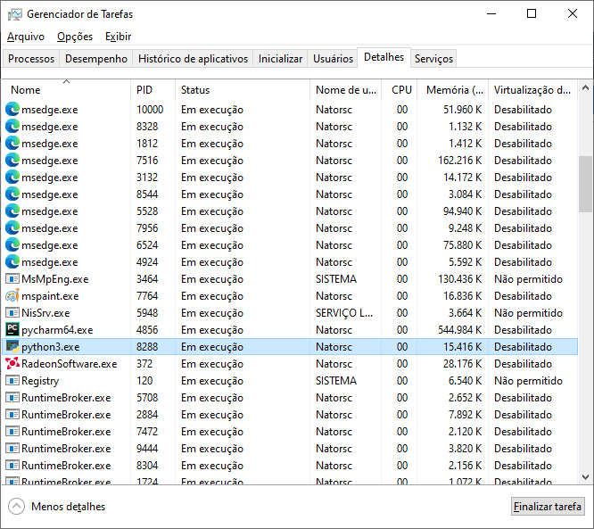

> Finalize e inicie a execução do código caso esteja em duvida.

No caso da imagem acima o processo se chama `python3.exe` e o PID (id do processo) é o `8288`.

Agora basta abrir um terminal (**CMD** ou **PowerShell**) na pasta onde estão o executáveis do ListDLLs:

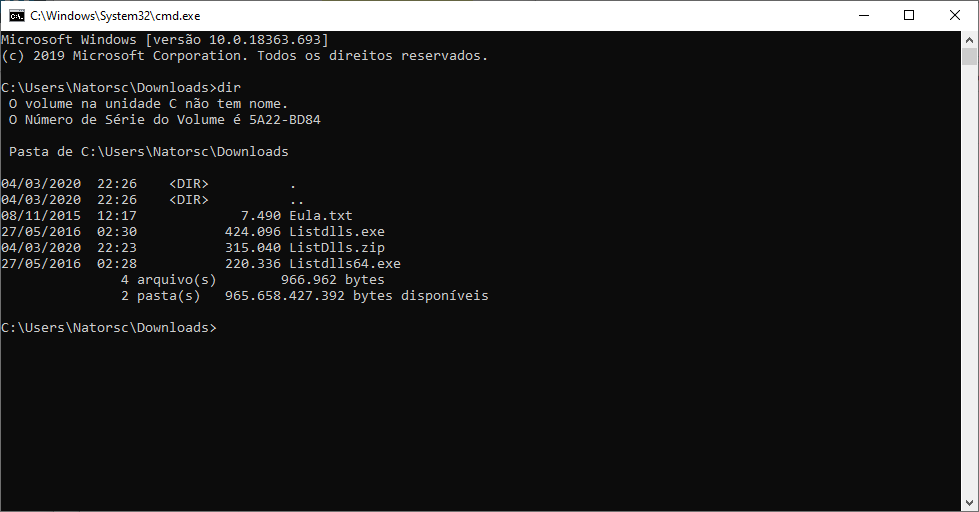

Para listar as DLLs:

```bat
.\Listdlls64.exe python3.exe
```

Se o seu sistema operacional for **32 bits** muito provavelmente o comando seja:

```bat
.\Listdlls.exe python3.exe
```

> **OBS**: Vale salientar que pode ser utilizado o **PID** do processo também.

:heavy_exclamation_mark: Na primeira vez que o ListDLLs for executado será exibida a licença de uso:

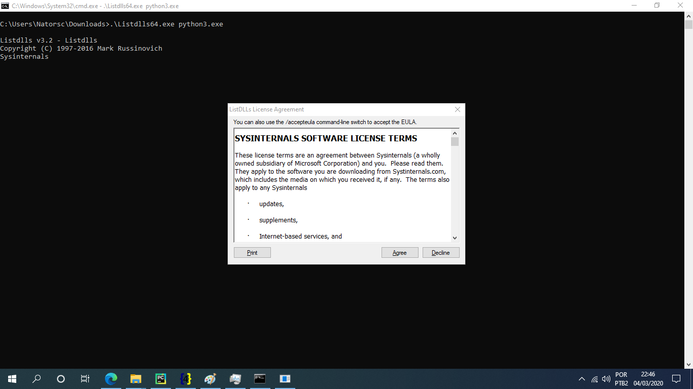

Como resultado do comando temos no terminal uma lista de DLLs (e outros arquivos) que estão sendo utilizados na execução do aplicativo:

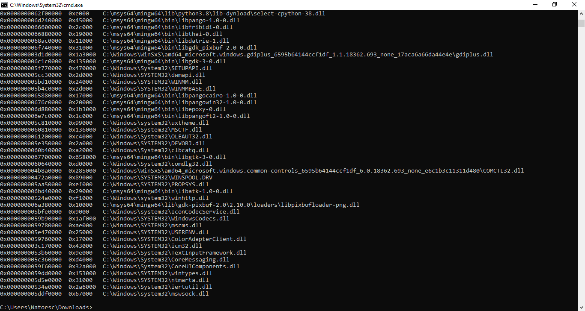

Copie a saída do terminal para um arquivo de texto.

Agora devemos:

- Remover as 2 primeiras colunas.
- Montar uma lista de tuplas.
- etc, :persevere:.

Para facilitar eu criei um arquivo chamado `windows_include_files.py` e coloquei os valores já formatados dentro :satisfied::

```python
include_files = [
    # Pasta de icones, para outros arquivos ou pastas basta adicionar os mesmos.
    'icons',
    # Bibliotecas adicionadas manualmente.
    ('C:/msys64/mingw64/lib/girepository-1.0', 'lib/girepository-1.0'),
    ('C:/msys64/mingw64/lib/gdk-pixbuf-2.0', 'lib/gdk-pixbuf-2.0'),
    ('C:/msys64/mingw64/lib/gtk-3.0', 'lib/gtk-3.0'),
    ('C:/msys64/mingw64/share/glib-2.0', 'share/glib-2.0'),
    # Dlls do Windows (Listdlls).
    ('C:/msys64/mingw64/bin/libpython3.8.dll', 'libpython3.8.dll'),
    ('C:/msys64/mingw64/bin/libwinpthread-1.dll', 'libwinpthread-1.dll'),
    ('C:/msys64/mingw64/lib/python3.8/lib-dynload/_heapq-cpython-38.dll', '_heapq-cpython-38.dll'),
    ('C:/msys64/mingw64/lib/python3.8/site-packages/gi/_gi-cpython-38.dll', '_gi-cpython-38.dll'),
    ('C:/msys64/mingw64/bin/libffi-6.dll', 'libffi-6.dll'),
    ('C:/msys64/mingw64/bin/libgirepository-1.0-1.dll', 'libgirepository-1.0-1.dll'),
    ('C:/msys64/mingw64/bin/libglib-2.0-0.dll', 'libglib-2.0-0.dll'),
    ('C:/msys64/mingw64/bin/libgobject-2.0-0.dll', 'libgobject-2.0-0.dll'),
    ('C:/msys64/mingw64/bin/libgio-2.0-0.dll', 'libgio-2.0-0.dll'),
    ('C:/msys64/mingw64/bin/libgmodule-2.0-0.dll', 'libgmodule-2.0-0.dll'),
    ('C:/msys64/mingw64/bin/libintl-8.dll', 'libintl-8.dll'),
    ('C:/msys64/mingw64/bin/libpcre-1.dll', 'libpcre-1.dll'),
    ('C:/msys64/mingw64/bin/zlib1.dll', 'zlib1.dll'),
    ('C:/msys64/mingw64/bin/libiconv-2.dll', 'libiconv-2.dll'),
    ('C:/msys64/mingw64/lib/python3.8/site-packages/gi/_gi_cairo-cpython-38.dll', '_gi_cairo-cpython-38.dll'),
    ('C:/msys64/mingw64/bin/libcairo-gobject-2.dll', 'libcairo-gobject-2.dll'),
    ('C:/msys64/mingw64/bin/libcairo-2.dll', 'libcairo-2.dll'),
    ('C:/msys64/mingw64/bin/libfontconfig-1.dll', 'libfontconfig-1.dll'),
    ('C:/msys64/mingw64/bin/libfreetype-6.dll', 'libfreetype-6.dll'),
    ('C:/msys64/mingw64/bin/libpixman-1-0.dll', 'libpixman-1-0.dll'),
    ('C:/msys64/mingw64/bin/libpng16-16.dll', 'libpng16-16.dll'),
    ('C:/msys64/mingw64/bin/libexpat-1.dll', 'libexpat-1.dll'),
    ('C:/msys64/mingw64/bin/libbz2-1.dll', 'libbz2-1.dll'),
    ('C:/msys64/mingw64/bin/libharfbuzz-0.dll', 'libharfbuzz-0.dll'),
    ('C:/msys64/mingw64/bin/libgraphite2.dll', 'libgraphite2.dll'),
    ('C:/msys64/mingw64/bin/libstdc++-6.dll', 'libstdc++-6.dll'),
    ('C:/msys64/mingw64/bin/libgcc_s_seh-1.dll', 'libgcc_s_seh-1.dll'),
    ('C:/msys64/mingw64/lib/python3.8/site-packages/cairo/_cairo-cpython-38.dll', '_cairo-cpython-38.dll'),
    ('C:/msys64/mingw64/lib/python3.8/lib-dynload/_socket-cpython-38.dll', '_socket-cpython-38.dll'),
    ('C:/msys64/mingw64/lib/python3.8/lib-dynload/math-cpython-38.dll', 'math-cpython-38.dll'),
    ('C:/msys64/mingw64/lib/python3.8/lib-dynload/select-cpython-38.dll', 'select-cpython-38.dll'),
    ('C:/msys64/mingw64/bin/libpango-1.0-0.dll', 'libpango-1.0-0.dll'),
    ('C:/msys64/mingw64/bin/libfribidi-0.dll', 'libfribidi-0.dll'),
    ('C:/msys64/mingw64/bin/libthai-0.dll', 'libthai-0.dll'),
    ('C:/msys64/mingw64/bin/libdatrie-1.dll', 'libdatrie-1.dll'),
    ('C:/msys64/mingw64/bin/libgdk_pixbuf-2.0-0.dll', 'libgdk_pixbuf-2.0-0.dll'),
    ('C:/msys64/mingw64/bin/libgdk-3-0.dll', 'libgdk-3-0.dll'),
    ('C:/msys64/mingw64/bin/libepoxy-0.dll', 'libepoxy-0.dll'),
    ('C:/msys64/mingw64/bin/libpangocairo-1.0-0.dll', 'libpangocairo-1.0-0.dll'),
    ('C:/msys64/mingw64/bin/libpangowin32-1.0-0.dll', 'libpangowin32-1.0-0.dll'),
    ('C:/msys64/mingw64/bin/libpangoft2-1.0-0.dll', 'libpangoft2-1.0-0.dll'),
    ('C:/msys64/mingw64/bin/libgtk-3-0.dll', 'libgtk-3-0.dll'),
    ('C:/msys64/mingw64/bin/libatk-1.0-0.dll', 'libatk-1.0-0.dll'),
    ('C:/msys64/mingw64/lib/gdk-pixbuf-2.0/2.10.0/loaders/libpixbufloader-png.dll', 'libpixbufloader-png.dll'),
]
```

> **OBS**: O arquivo acima é apenas para referencia. Adeque conforme a suas necessidades.

Mais a frente vamos importar a variável `include_files` desse arquivo em um arquivo chamado `setup.py` que ainda vamos criar.

Já temos as DLLs, então podemos instalar o Cx_Freeze, para localizar este pacote você pode executar no terminal do msys2:

```bash
pacman -Ss Cx_Freeze
```

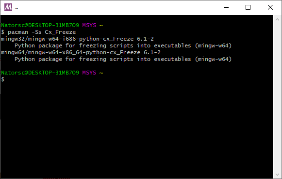

> **OBS**: Também é possível localizar pacotes através do site: [https://packages.msys2.org/search](https://packages.msys2.org/search)

Para realizar a instalação do pacote **64 bits**:

```bash
pacman -S mingw-w64-x86_64-python-cx_Freeze
```

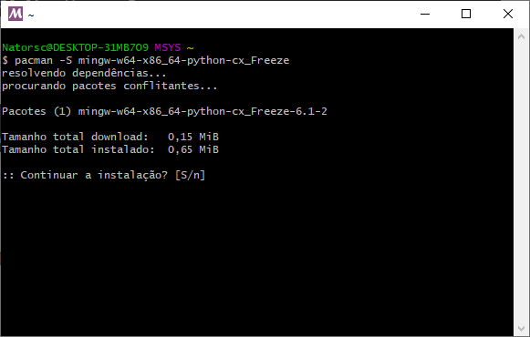

Pacote **32 bits**:

```bash
pacman -S mingw-w64-i686-python-cx_Freeze
```

Com o Cx_Freeze instalado vamos criar um arquivo chamado `setup.py`, é nele que vamos passar algumas informações do aplicativo, as bibliotecas e DLLs que desejamos incluir ou excluir.

Eu **tentei** criar um arquivo que atenda a sistema Linux e Windows :sunglasses:, contudo lembre-se de adequar o mesmo as **suas** necessidades:

```bash
# -*- coding: utf-8 -*-
"""Gerando executáveis com Cx_Freeze!"""

import sys
from platform import system

from cx_Freeze import Executable, setup

base = None

build_exe_options = {
    'excludes': ['tkinter', 'wx', 'email', 'pydoc_data', 'curses'],
    'include_files': ['icons'],
    'packages': ['gi'],
}

if system() == 'Windows':
    from windows_include_files import include_files

    if sys.platform == 'win32':
        base = 'Win32GUI'
        build_exe_options['include_files'] = include_files

    if sys.platform == 'win64':
        base = 'Win64GUI'
        build_exe_options['include_files'] = include_files

setup(
    name='MyApp',
    author='Renato Cruz (natorsc@gmail.com)',
    version='0.0.1',
    description='Criando executáveis com Cx_Freeze!',
    options={'build_exe': build_exe_options},
    executables=[
        Executable(
            'MainWindow.py',
            base=base,
            icon='icons/icon.ico',
        ),
    ],
)
```

Para gerar o executável abra o terminal **MSYS2 MinGW**:

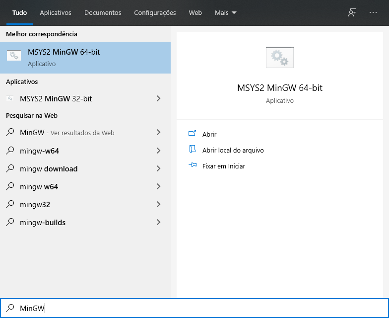

Navegue até a pasta onde está o arquivo `setup.py` e execute:

```bash
python3 setup.py build
```

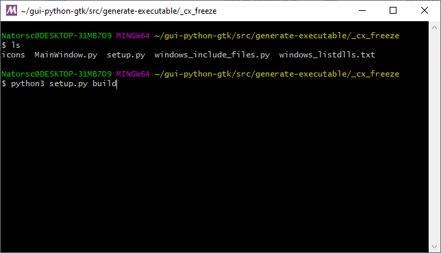

> Aguarde até o final do processo de construção do aplicativo.

Quando o processo terminar acesse a pasta **build** que foi criada dentro do diretório do projeto:

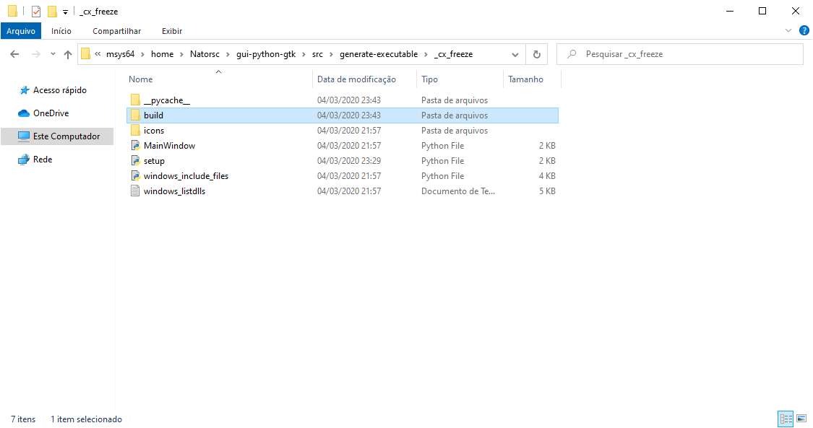

Dentro desta pasta deve haver uma **subpasta** e dentro desta subpasta estará o executável do aplicativo (`MainWindow.exe`):

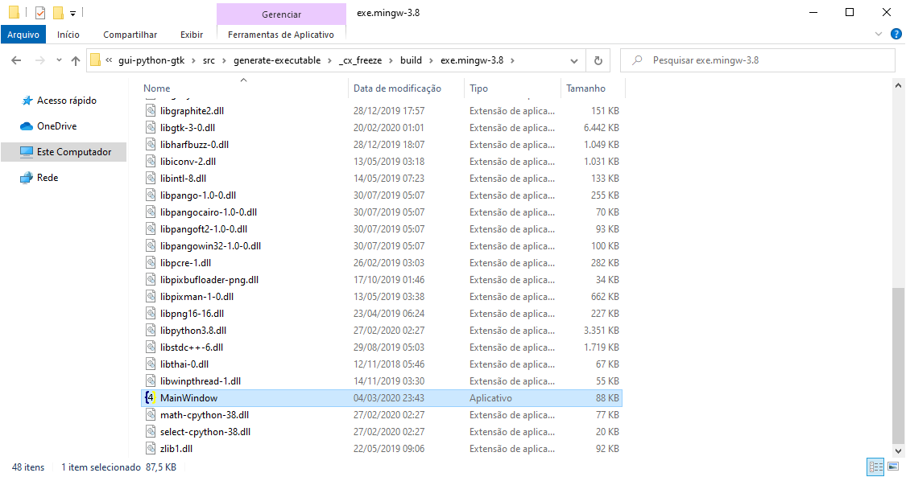

Para executar basta dar **2 cliques** sobre o executável e o resultado é:

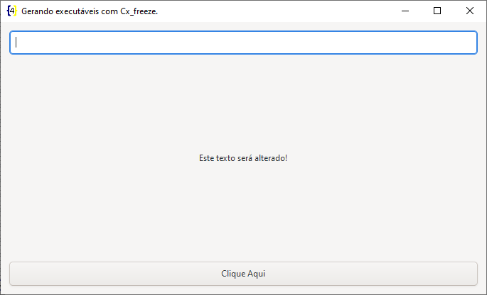

Caso o aplicativo **não abra** quando for dado 2 cliques é interessante que você execute o mesmo via terminal (**CMD** ou **PowerShell**):

```bat
.\MainWindow.exe
```

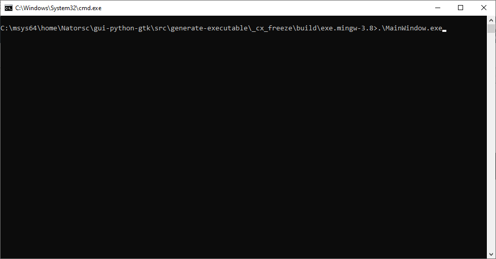

Isso faz com que o aplicativo exiba um **log** de erro no próprio terminal e a partir dessa informação é possível realizar as correções necessárias.

## Distribuindo

Ao verificar que o executável está funcionando podemos simplesmente compactar os arquivos e distribuir o aplicativo como portable (portátil).

Outra opção é criar um pacote `msi` através do comando:

```bash
python setup.py bdist_msi
```

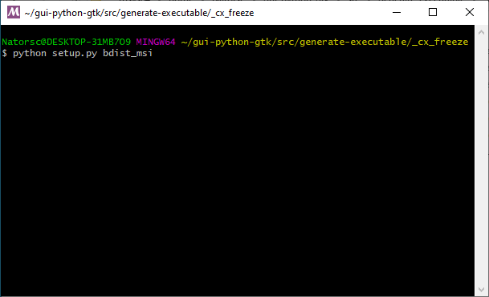

Ao executar o comando acima será criada uma pasta `dist`:

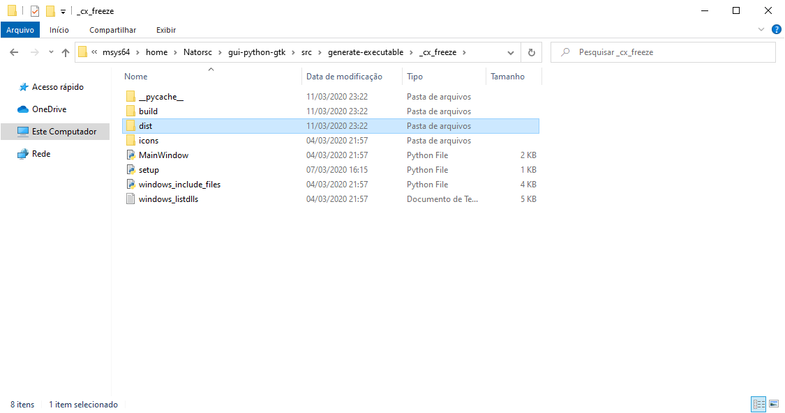

Dentro da pasta `dist` estará o instalador do tipo MSI:

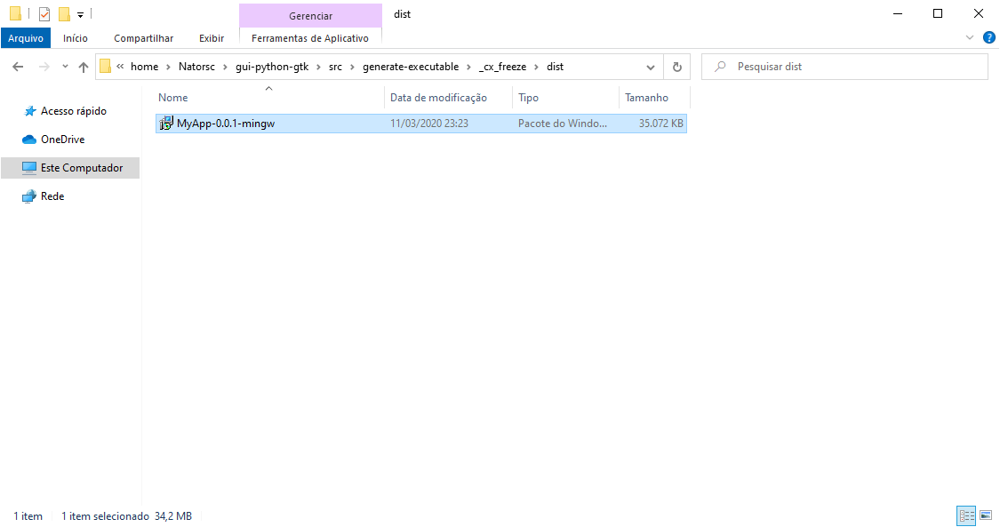

Esse arquivo pode ser distribuído de forma simples e para iniciar o instalador em outro equipamento basta dar **2 cliques**:

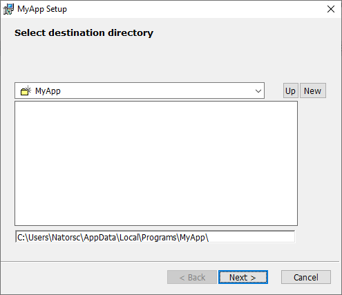

Com isso conseguimos abordar a construção de executáveis no Microsoft Windows via Cx_Freeze :tada:.

No caso de duvidas ou dificuldades estou a disposição e muito obrigado a todos que tem interagido e me ensinado muito :grin:.

Para outros exemplos utilizando o Gnome Glade e Gnome Builder acesse o meu [Github](https://github.com/natorsc/gui-python-gtk).