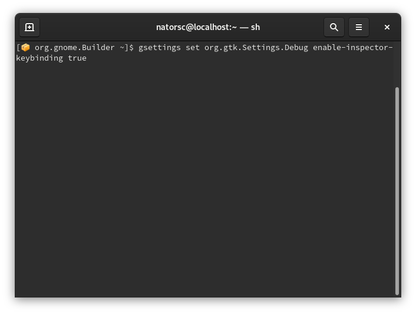

# GtkInspector

O GtkInspector é uma ferramenta de depuração interativa (interactive debugging).

Por padrão a depuração vem desativada, para ativar a mesma:

```bash
gsettings set org.gtk.Settings.Debug enable-inspector-keybinding true
```

Para utilizar a depuração deve-se abrir um aplicativo (GTK) e precionar as telas de atalho `Control-Shift-D` ou `Control-Shift-I`.


Caso o aplicativo seja um Flatpak deve-se ativar a depuração dentro do contêiner do aplicativo, para isso:

```bash
flatpak run --command='sh' Nome.Do.Aplicativo
```


Em seguida:

```bash
gsettings set org.gtk.Settings.Debug enable-inspector-keybinding true
```



Após executar os comandos acima os atalhos `Control-Shift-D` ou `Control-Shift-I` devem funcionar sem problemas em aplicativos empacotados em Flatpak.
