# Widgets

Alguns widgets do GTK 3 feitos com Python, Gnome Builder e Gnome Glade.

## Gtk ActionBar

- [Gnome Builder](https://github.com/natorsc/gui-python-gtk/tree/master/src/gtk3/actionbar/builder).
- [Gnome Glade](https://github.com/natorsc/gui-python-gtk/tree/master/src/gtk3/actionbar/glade).
- [Python](https://github.com/natorsc/gui-python-gtk/tree/master/src/gtk3/actionbar).

---

## Gtk ApplicationWindow

- [Gnome Builder](https://github.com/natorsc/gui-python-gtk/tree/master/src/gtk3/applicationwindow/builder).
- [Gnome Glade](https://github.com/natorsc/gui-python-gtk/tree/master/src/gtk3/applicationwindow/glade).
- [Python](https://github.com/natorsc/gui-python-gtk/tree/master/src/gtk3/applicationwindow).

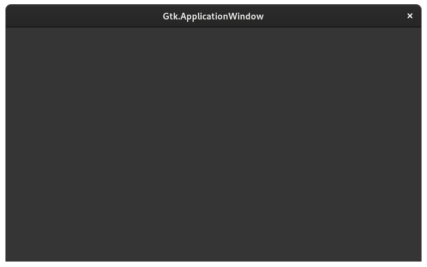

---

## Gtk Box horizontal

- [Gnome Builder](https://github.com/natorsc/gui-python-gtk/tree/master/src/gtk3/box-horizontal/builder).
- [Gnome Glade](https://github.com/natorsc/gui-python-gtk/tree/master/src/gtk3/box-horizontal/glade).
- [Python](https://github.com/natorsc/gui-python-gtk/tree/master/src/gtk3/box-horizontal).

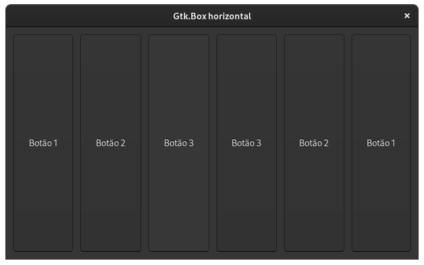

---

## Gtk Box vertical

- [Gnome Builder](https://github.com/natorsc/gui-python-gtk/tree/master/src/gtk3/box-vertical/builder).
- [Gnome Glade](https://github.com/natorsc/gui-python-gtk/tree/master/src/gtk3/box-vertical/glade).
- [Python](https://github.com/natorsc/gui-python-gtk/tree/master/src/gtk3/box-vertical).

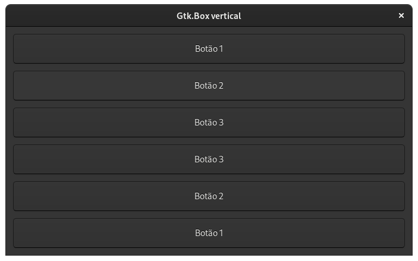

---

## Gtk Button

- [Gnome Builder](https://github.com/natorsc/gui-python-gtk/tree/master/src/gtk3/button/builder).
- [Gnome Glade](https://github.com/natorsc/gui-python-gtk/tree/master/src/gtk3/button/glade).
- [Python](https://github.com/natorsc/gui-python-gtk/tree/master/src/gtk3/button).

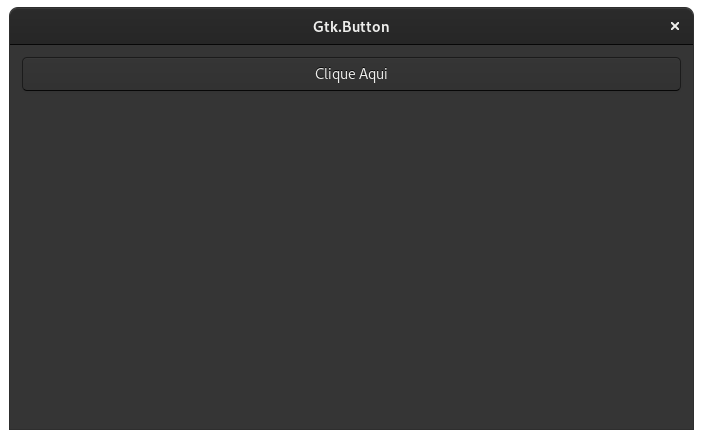

---

## Gtk ButtonBox

- [Gnome Builder](https://github.com/natorsc/gui-python-gtk/tree/master/src/gtk3/buttonbox/builder).
- [Gnome Glade](https://github.com/natorsc/gui-python-gtk/tree/master/src/gtk3/buttonbox/glade).
- [Python](https://github.com/natorsc/gui-python-gtk/tree/master/src/gtk3/buttonbox).

---

## Gtk Calendar

- [Gnome Builder](https://github.com/natorsc/gui-python-gtk/tree/master/src/gtk3/calendar/builder).
- [Gnome Glade](https://github.com/natorsc/gui-python-gtk/tree/master/src/gtk3/calendar/glade).
- [Python](https://github.com/natorsc/gui-python-gtk/tree/master/src/gtk3/calendar).

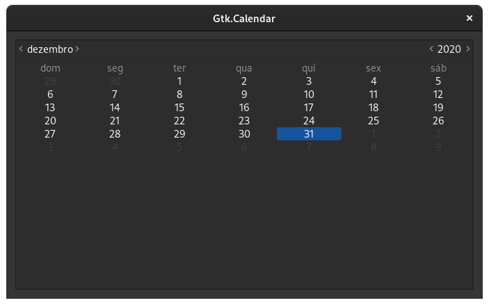

---

## Gtk CheckButton

- [Gnome Builder](https://github.com/natorsc/gui-python-gtk/tree/master/src/gtk3/calendar/builder).
- [Gnome Glade](https://github.com/natorsc/gui-python-gtk/tree/master/src/gtk3/calendar/glade).
- [Python](https://github.com/natorsc/gui-python-gtk/tree/master/src/gtk3/calendar).

---

## Gtk Dialog

- [Gnome Builder](https://github.com/natorsc/gui-python-gtk/tree/master/src/gtk3/dialog/builder).
- [Gnome Glade](https://github.com/natorsc/gui-python-gtk/tree/master/src/gtk3/dialog/glade).
- [Python](https://github.com/natorsc/gui-python-gtk/tree/master/src/gtk3/dialog).

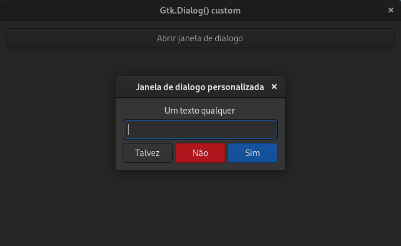

---

## Gtk Drag And Drop

- [Gnome Builder](https://github.com/natorsc/gui-python-gtk/tree/master/src/gtk3/drag-and-drop/builder).
- [Gnome Glade](https://github.com/natorsc/gui-python-gtk/tree/master/src/gtk3/drag-and-drop/glade).
- [Python](https://github.com/natorsc/gui-python-gtk/tree/master/src/gtk3/drag-and-drop).

---

## Gtk Entry

- [Gnome Builder](https://github.com/natorsc/gui-python-gtk/tree/master/src/gtk3/entry/builder).
- [Gnome Glade](https://github.com/natorsc/gui-python-gtk/tree/master/src/gtk3/entry/glade).
- [Python](https://github.com/natorsc/gui-python-gtk/tree/master/src/gtk3/entry).

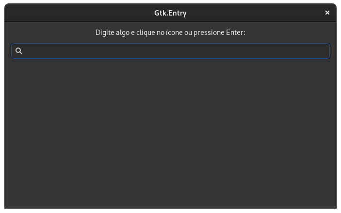

---

## Gtk EntryCompletion

- [Gnome Builder](https://github.com/natorsc/gui-python-gtk/tree/master/src/gtk3/entry-completion/builder).
- [Gnome Glade](https://github.com/natorsc/gui-python-gtk/tree/master/src/gtk3/entry-completion/glade).
- [Python](https://github.com/natorsc/gui-python-gtk/tree/master/src/gtk3/entry-completion).

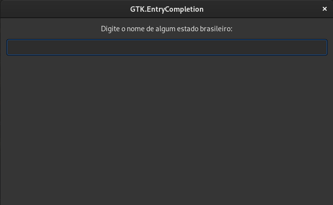

---

## Gtk EventBox

- [Gnome Builder](https://github.com/natorsc/gui-python-gtk/tree/master/src/gtk3/eventbox/builder).
- [Gnome Glade](https://github.com/natorsc/gui-python-gtk/tree/master/src/gtk3/eventbox/glade).
- [Python](https://github.com/natorsc/gui-python-gtk/tree/master/src/gtk3/eventbox).

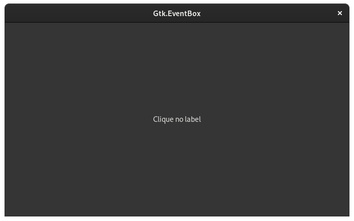

---

## Gtk FileChooserDialog folder

Não recomendo a criação desse tipo de dialogo com o Gnome Builder ou mesmo com o Gnome Glade, uma vez que os dialogos criados neles não seguem as regras de estilo do GTK.

- [Python](https://github.com/natorsc/gui-python-gtk/tree/master/src/gtk3/file-chooser-dialog-folder).

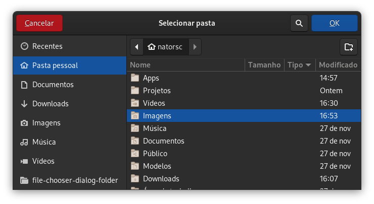

---

## Gtk FileChooserDialog open

Não recomendo a criação desse tipo de dialogo com o Gnome Builder ou mesmo com o Gnome Glade, uma vez que os dialogos criados neles não seguem as regras de estilo do GTK.

- [Python](https://github.com/natorsc/gui-python-gtk/tree/master/src/gtk3/file-chooser-dialog-open).

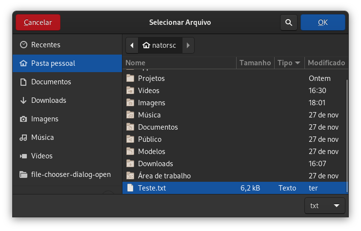

---

## Gtk FileChooserDialog save

Não recomendo a criação desse tipo de dialogo com o Gnome Builder ou mesmo com o Gnome Glade, uma vez que os dialogos criados neles não seguem as regras de estilo do GTK.

- [Python](https://github.com/natorsc/gui-python-gtk/tree/master/src/gtk3/file-chooser-dialog-save).

---

## Gtk Fixed

- [Gnome Builder](https://github.com/natorsc/gui-python-gtk/tree/master/src/gtk3/fixed/builder).
- [Gnome Glade](https://github.com/natorsc/gui-python-gtk/tree/master/src/gtk3/fixed/glade).
- [Python](https://github.com/natorsc/gui-python-gtk/tree/master/src/gtk3/fixed).

---

## Gtk FlowBox

- [Gnome Builder](https://github.com/natorsc/gui-python-gtk/tree/master/src/gtk3/flowbox/builder).
- [Gnome Glade](https://github.com/natorsc/gui-python-gtk/tree/master/src/gtk3/flowbox/glade).
- [Python](https://github.com/natorsc/gui-python-gtk/tree/master/src/gtk3/flowbox).

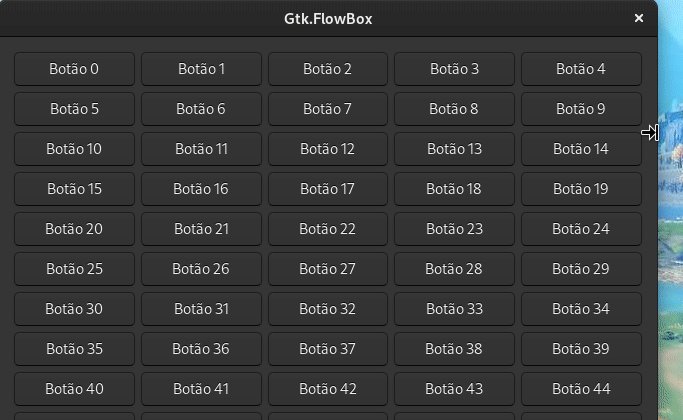

---

## Gtk Grid

- [Gnome Builder](https://github.com/natorsc/gui-python-gtk/tree/master/src/gtk3/grid/builder).
- [Gnome Glade](https://github.com/natorsc/gui-python-gtk/tree/master/src/gtk3/grid/glade).
- [Python](https://github.com/natorsc/gui-python-gtk/tree/master/src/gtk3/grid).

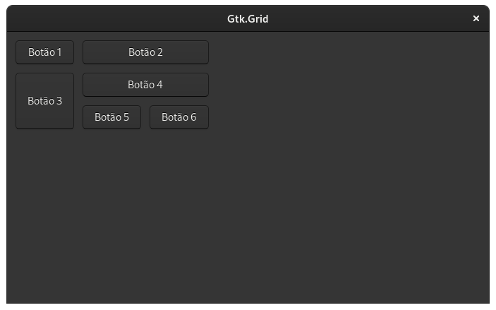

---

## Gtk HeaderBar

- [Gnome Builder](https://github.com/natorsc/gui-python-gtk/tree/master/src/gtk3/headerbar/builder).
- [Gnome Glade](https://github.com/natorsc/gui-python-gtk/tree/master/src/gtk3/headerbar/glade).
- [Python](https://github.com/natorsc/gui-python-gtk/tree/master/src/gtk3/headerbar).

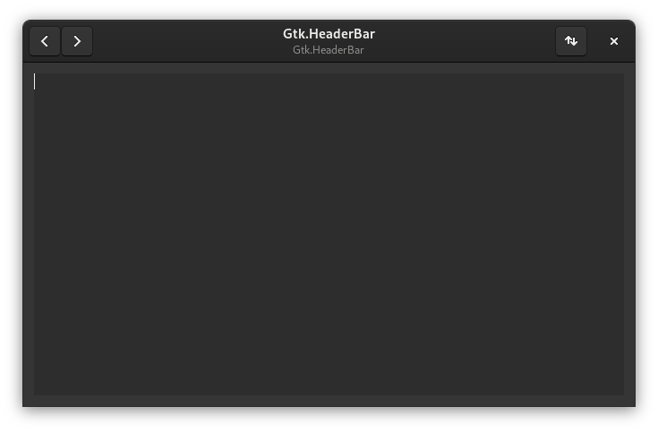

---

## Gtk Image

- [Gnome Builder](https://github.com/natorsc/gui-python-gtk/tree/master/src/gtk3/image/builder).
- [Gnome Glade](https://github.com/natorsc/gui-python-gtk/tree/master/src/gtk3/image/glade).
- [Python](https://github.com/natorsc/gui-python-gtk/tree/master/src/gtk3/image).

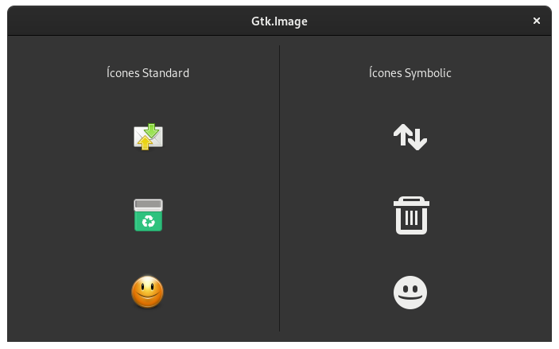

---

## Gtk InfoBar

- [Gnome Builder](https://github.com/natorsc/gui-python-gtk/tree/master/src/gtk3/infobar/builder).
- [Gnome Glade](https://github.com/natorsc/gui-python-gtk/tree/master/src/gtk3/infobar/glade).
- [Python](https://github.com/natorsc/gui-python-gtk/tree/master/src/gtk3/infobar).

---

## Gtk Layout

- [Gnome Builder](https://github.com/natorsc/gui-python-gtk/tree/master/src/gtk3/layout/builder).
- [Gnome Glade](https://github.com/natorsc/gui-python-gtk/tree/master/src/gtk3/layout/glade).
- [Python](https://github.com/natorsc/gui-python-gtk/tree/master/src/gtk3/layout).

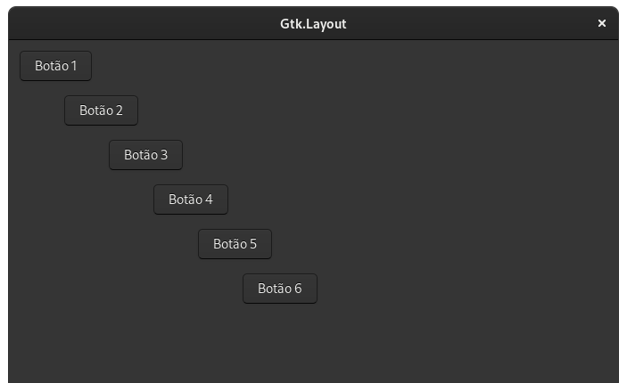

---

## Gtk LinkButton

- [Gnome Builder](https://github.com/natorsc/gui-python-gtk/tree/master/src/gtk3/linkbutton/builder).
- [Gnome Glade](https://github.com/natorsc/gui-python-gtk/tree/master/src/gtk3/linkbutton/glade).
- [Python](https://github.com/natorsc/gui-python-gtk/tree/master/src/gtk3/linkbutton).

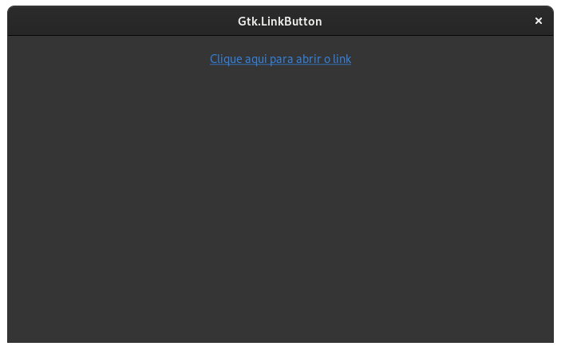

---

## Gtk ListBox

- [Gnome Builder](https://github.com/natorsc/gui-python-gtk/tree/master/src/gtk3/listbox/builder).
- [Gnome Glade](https://github.com/natorsc/gui-python-gtk/tree/master/src/gtk3/listbox/glade).
- [Python](https://github.com/natorsc/gui-python-gtk/tree/master/src/gtk3/listbox).

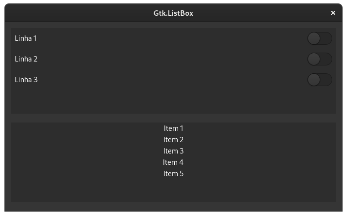

---

## Gtk Menu

- [Gnome Builder](https://github.com/natorsc/gui-python-gtk/tree/master/src/gtk3/menu/builder).
- [Gnome Glade](https://github.com/natorsc/gui-python-gtk/tree/master/src/gtk3/menu/glade).
- [Python](https://github.com/natorsc/gui-python-gtk/tree/master/src/gtk3/menu).

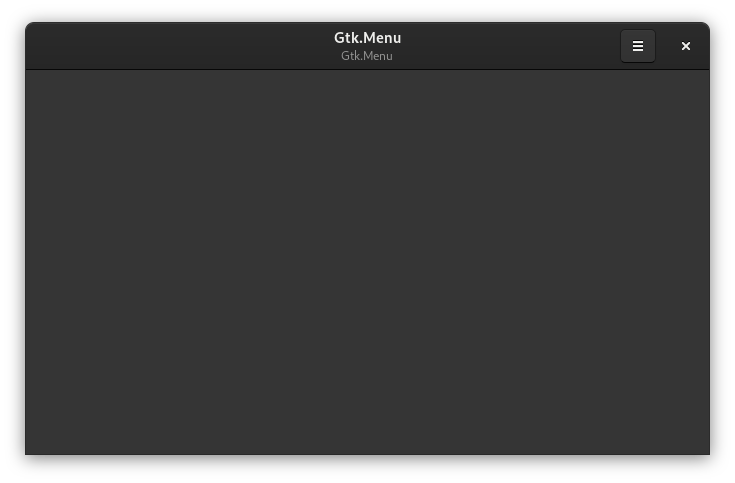

---

## Gtk MenuBar

- [Gnome Builder](https://github.com/natorsc/gui-python-gtk/tree/master/src/gtk3/menubar/builder).
- [Gnome Glade](https://github.com/natorsc/gui-python-gtk/tree/master/src/gtk3/menubar/glade).
- [Python](https://github.com/natorsc/gui-python-gtk/tree/master/src/gtk3/menubar).

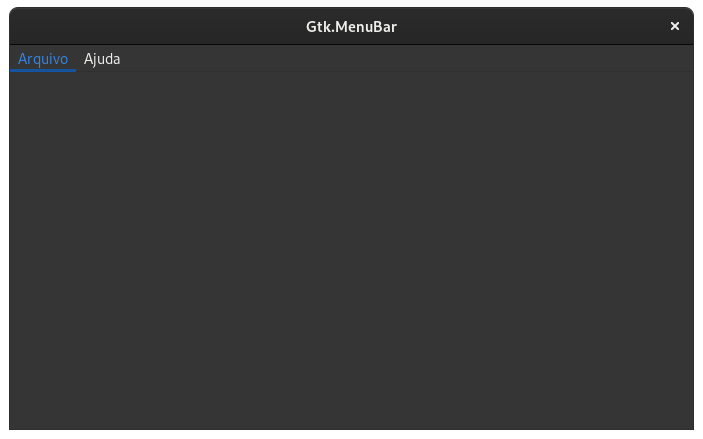

---

## Gtk MenuButton

- [Gnome Builder](https://github.com/natorsc/gui-python-gtk/tree/master/src/gtk3/menubutton/builder).
- [Gnome Glade](https://github.com/natorsc/gui-python-gtk/tree/master/src/gtk3/menubutton/glade).
- [Python](https://github.com/natorsc/gui-python-gtk/tree/master/src/gtk3/menubutton).

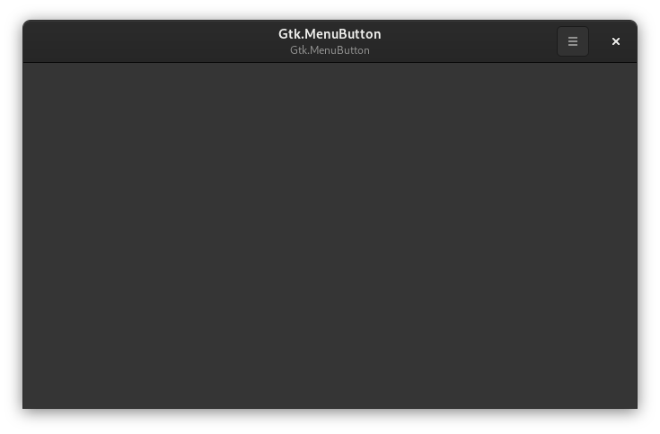

---

## Gtk MessageDialog

Não recomendo a criação desse tipo de dialogo com o Gnome Builder ou mesmo com o Gnome Glade, uma vez que os dialogos criados neles não seguem as regras de estilo do GTK.

- [Python](https://github.com/natorsc/gui-python-gtk/tree/master/src/gtk3/message-dialog).

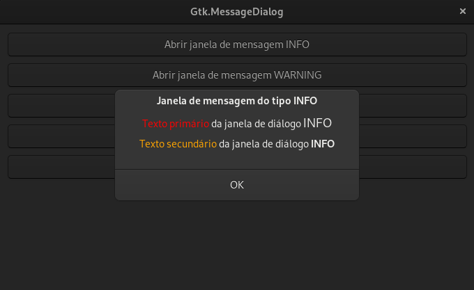

---

## Gtk Notebook

- [Gnome Builder](https://github.com/natorsc/gui-python-gtk/tree/master/src/gtk3/notebook/builder).
- [Gnome Glade](https://github.com/natorsc/gui-python-gtk/tree/master/src/gtk3/notebook/glade).
- [Python](https://github.com/natorsc/gui-python-gtk/tree/master/src/gtk3/notebook).

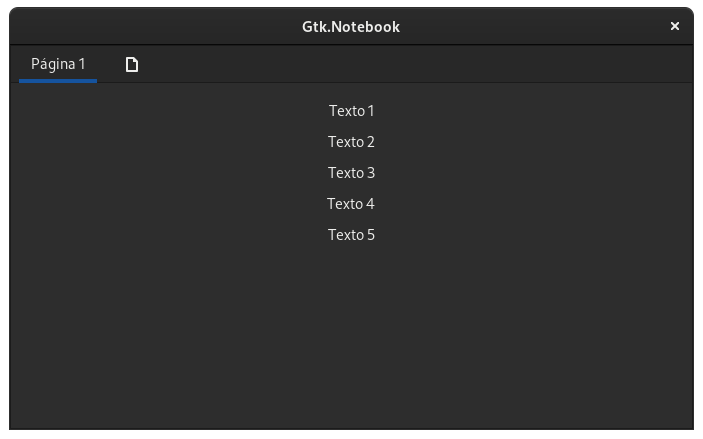

---

## Gtk Notify

- [Python](https://github.com/natorsc/gui-python-gtk/tree/master/src/gtk3/notify).

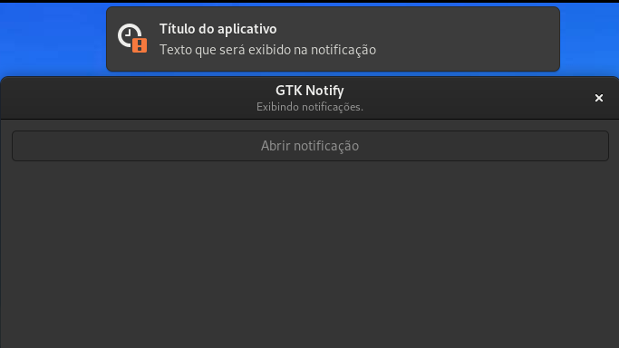

---

## Gtk Overlay

- [Gnome Builder](https://github.com/natorsc/gui-python-gtk/tree/master/src/gtk3/overlay/builder).
- [Gnome Glade](https://github.com/natorsc/gui-python-gtk/tree/master/src/gtk3/overlay/glade).
- [Python](https://github.com/natorsc/gui-python-gtk/tree/master/src/gtk3/overlay).

---

## Gtk Paned horizontal

- [Gnome Builder](https://github.com/natorsc/gui-python-gtk/tree/master/src/gtk3/paned-horizontal/builder).
- [Gnome Glade](https://github.com/natorsc/gui-python-gtk/tree/master/src/gtk3/paned-horizontal/glade).
- [Python](https://github.com/natorsc/gui-python-gtk/tree/master/src/gtk3/paned-horizontal).

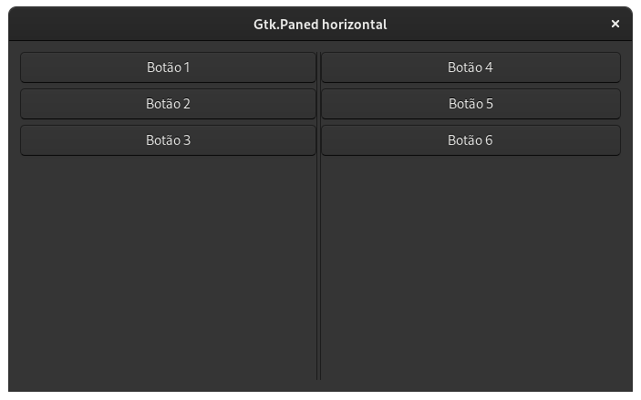

---

## Gtk Paned vertical

- [Gnome Builder](https://github.com/natorsc/gui-python-gtk/tree/master/src/gtk3/paned-vertical/builder).
- [Gnome Glade](https://github.com/natorsc/gui-python-gtk/tree/master/src/gtk3/paned-vertical/glade).
- [Python](https://github.com/natorsc/gui-python-gtk/tree/master/src/gtk3/paned-vertical).

---

## Gtk Popover

- [Gnome Builder](https://github.com/natorsc/gui-python-gtk/tree/master/src/gtk3/popover/builder).
- [Gnome Glade](https://github.com/natorsc/gui-python-gtk/tree/master/src/gtk3/popover/glade).
- [Python](https://github.com/natorsc/gui-python-gtk/tree/master/src/gtk3/popover).

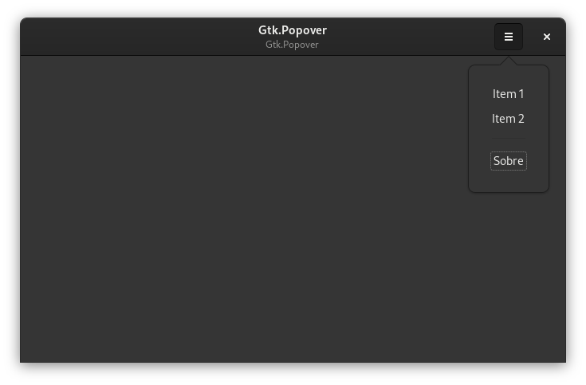

---

## Gtk PrintOperation

- [Gnome Builder](https://github.com/natorsc/gui-python-gtk/tree/master/src/gtk3/print-operation/builder).
- [Gnome Glade](https://github.com/natorsc/gui-python-gtk/tree/master/src/gtk3/print-operation/glade).
- [Python](https://github.com/natorsc/gui-python-gtk/tree/master/src/gtk3/print-operation).

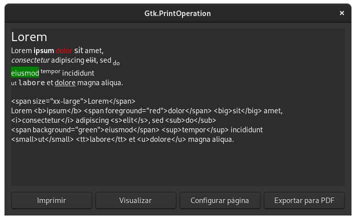

---

---

## Gio Menu

- [Python](https://github.com/natorsc/gui-python-gtk/tree/master/src/gtk3/gio-menu).

---