# Widgets

Alguns widgets do GTK 3 feitos com Python, Gnome Builder e Gnome Glade.

## Gio Menu

- [Python](https://github.com/natorsc/gui-python-gtk/tree/master/src/gtk3/gio-menu).

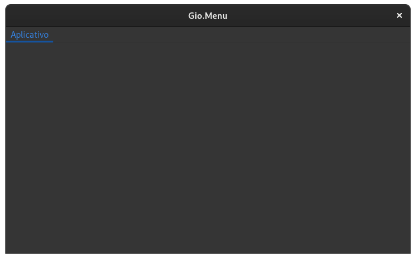

---

## Gio Simple Action

- [Python](https://github.com/natorsc/gui-python-gtk/tree/master/src/gtk3/gio-simple-action).

---

## Gtk ActionBar

- [Gnome Builder](https://github.com/natorsc/gui-python-gtk/tree/master/src/gtk3/actionbar/builder).
- [Gnome Glade](https://github.com/natorsc/gui-python-gtk/tree/master/src/gtk3/actionbar/glade).
- [Python](https://github.com/natorsc/gui-python-gtk/tree/master/src/gtk3/actionbar).

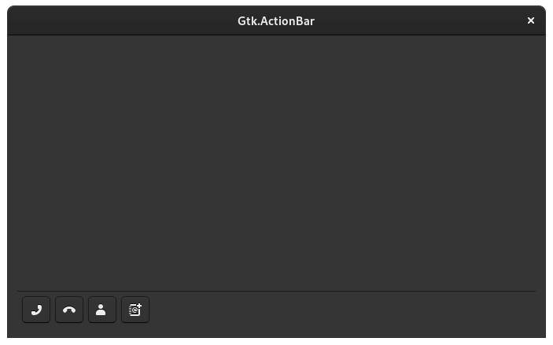

---

## Gtk ApplicationWindow

- [Gnome Builder](https://github.com/natorsc/gui-python-gtk/tree/master/src/gtk3/applicationwindow/builder).
- [Gnome Glade](https://github.com/natorsc/gui-python-gtk/tree/master/src/gtk3/applicationwindow/glade).
- [Python](https://github.com/natorsc/gui-python-gtk/tree/master/src/gtk3/applicationwindow).

---

## Gtk Box horizontal

- [Gnome Builder](https://github.com/natorsc/gui-python-gtk/tree/master/src/gtk3/box-horizontal/builder).
- [Gnome Glade](https://github.com/natorsc/gui-python-gtk/tree/master/src/gtk3/box-horizontal/glade).
- [Python](https://github.com/natorsc/gui-python-gtk/tree/master/src/gtk3/box-horizontal).

---

## Gtk Box vertical

- [Gnome Builder](https://github.com/natorsc/gui-python-gtk/tree/master/src/gtk3/box-vertical/builder).
- [Gnome Glade](https://github.com/natorsc/gui-python-gtk/tree/master/src/gtk3/box-vertical/glade).
- [Python](https://github.com/natorsc/gui-python-gtk/tree/master/src/gtk3/box-vertical).

---

## Gtk Button

- [Gnome Builder](https://github.com/natorsc/gui-python-gtk/tree/master/src/gtk3/button/builder).
- [Gnome Glade](https://github.com/natorsc/gui-python-gtk/tree/master/src/gtk3/button/glade).
- [Python](https://github.com/natorsc/gui-python-gtk/tree/master/src/gtk3/button).

---

## Gtk ButtonBox

- [Gnome Builder](https://github.com/natorsc/gui-python-gtk/tree/master/src/gtk3/buttonbox/builder).
- [Gnome Glade](https://github.com/natorsc/gui-python-gtk/tree/master/src/gtk3/buttonbox/glade).
- [Python](https://github.com/natorsc/gui-python-gtk/tree/master/src/gtk3/buttonbox).

---

## Gtk Calendar

- [Gnome Builder](https://github.com/natorsc/gui-python-gtk/tree/master/src/gtk3/calendar/builder).
- [Gnome Glade](https://github.com/natorsc/gui-python-gtk/tree/master/src/gtk3/calendar/glade).
- [Python](https://github.com/natorsc/gui-python-gtk/tree/master/src/gtk3/calendar).

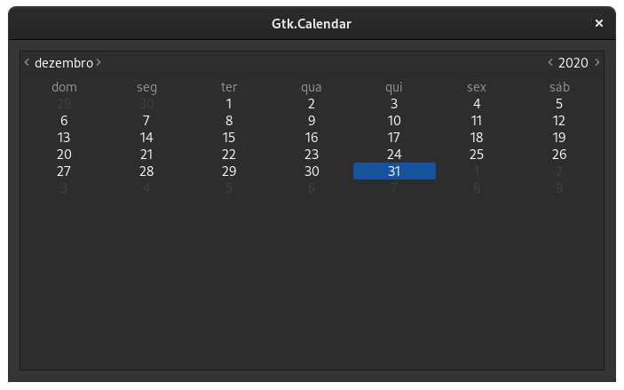

---

## Gtk CheckButton

- [Gnome Builder](https://github.com/natorsc/gui-python-gtk/tree/master/src/gtk3/calendar/builder).
- [Gnome Glade](https://github.com/natorsc/gui-python-gtk/tree/master/src/gtk3/calendar/glade).
- [Python](https://github.com/natorsc/gui-python-gtk/tree/master/src/gtk3/calendar).

---

## Gtk Dialog

- [Gnome Builder](https://github.com/natorsc/gui-python-gtk/tree/master/src/gtk3/dialog/builder).
- [Gnome Glade](https://github.com/natorsc/gui-python-gtk/tree/master/src/gtk3/dialog/glade).
- [Python](https://github.com/natorsc/gui-python-gtk/tree/master/src/gtk3/dialog).

---

## Gtk Drag And Drop

- [Gnome Builder](https://github.com/natorsc/gui-python-gtk/tree/master/src/gtk3/drag-and-drop/builder).
- [Gnome Glade](https://github.com/natorsc/gui-python-gtk/tree/master/src/gtk3/drag-and-drop/glade).
- [Python](https://github.com/natorsc/gui-python-gtk/tree/master/src/gtk3/drag-and-drop).

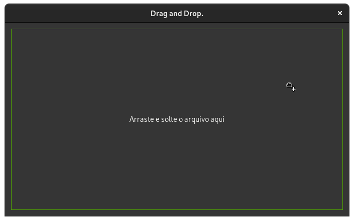

---

## Gtk Entry

- [Gnome Builder](https://github.com/natorsc/gui-python-gtk/tree/master/src/gtk3/entry/builder).
- [Gnome Glade](https://github.com/natorsc/gui-python-gtk/tree/master/src/gtk3/entry/glade).
- [Python](https://github.com/natorsc/gui-python-gtk/tree/master/src/gtk3/entry).

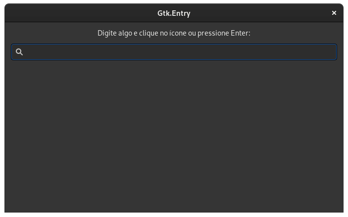

---

## Gtk EntryCompletion

- [Gnome Builder](https://github.com/natorsc/gui-python-gtk/tree/master/src/gtk3/entry-completion/builder).
- [Gnome Glade](https://github.com/natorsc/gui-python-gtk/tree/master/src/gtk3/entry-completion/glade).
- [Python](https://github.com/natorsc/gui-python-gtk/tree/master/src/gtk3/entry-completion).

---

## Gtk EventBox

- [Gnome Builder](https://github.com/natorsc/gui-python-gtk/tree/master/src/gtk3/eventbox/builder).
- [Gnome Glade](https://github.com/natorsc/gui-python-gtk/tree/master/src/gtk3/eventbox/glade).
- [Python](https://github.com/natorsc/gui-python-gtk/tree/master/src/gtk3/eventbox).

---

## Gtk FileChooserDialog folder

Não recomendo a criação desse tipo de dialogo com o Gnome Builder ou mesmo com o Gnome Glade, uma vez que os dialogos
criados neles não seguem as regras de estilo do GTK.

- [Python](https://github.com/natorsc/gui-python-gtk/tree/master/src/gtk3/file-chooser-dialog-folder).

---

## Gtk FileChooserDialog open

Não recomendo a criação desse tipo de dialogo com o Gnome Builder ou mesmo com o Gnome Glade, uma vez que os dialogos
criados neles não seguem as regras de estilo do GTK.

- [Python](https://github.com/natorsc/gui-python-gtk/tree/master/src/gtk3/file-chooser-dialog-open).

---

## Gtk FileChooserDialog save

Não recomendo a criação desse tipo de dialogo com o Gnome Builder ou mesmo com o Gnome Glade, uma vez que os dialogos
criados neles não seguem as regras de estilo do GTK.

- [Python](https://github.com/natorsc/gui-python-gtk/tree/master/src/gtk3/file-chooser-dialog-save).

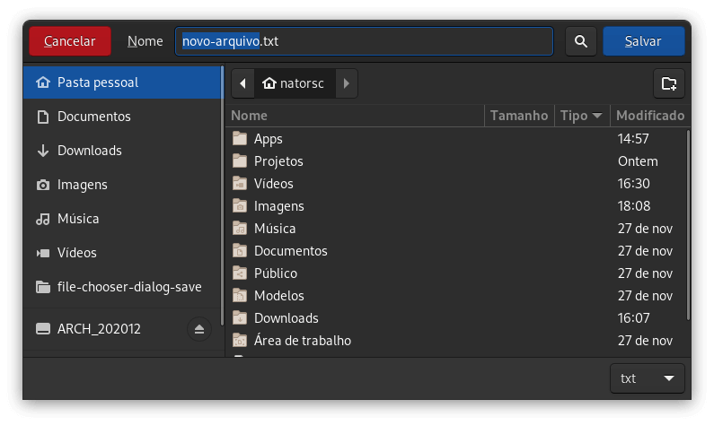

---

## Gtk Fixed

- [Gnome Builder](https://github.com/natorsc/gui-python-gtk/tree/master/src/gtk3/fixed/builder).
- [Gnome Glade](https://github.com/natorsc/gui-python-gtk/tree/master/src/gtk3/fixed/glade).
- [Python](https://github.com/natorsc/gui-python-gtk/tree/master/src/gtk3/fixed).

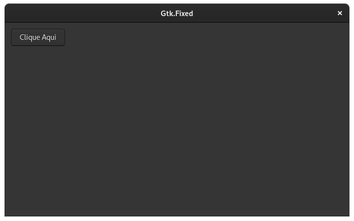

---

## Gtk FlowBox

- [Gnome Builder](https://github.com/natorsc/gui-python-gtk/tree/master/src/gtk3/flowbox/builder).
- [Gnome Glade](https://github.com/natorsc/gui-python-gtk/tree/master/src/gtk3/flowbox/glade).
- [Python](https://github.com/natorsc/gui-python-gtk/tree/master/src/gtk3/flowbox).

---

## Gtk Grid

- [Gnome Builder](https://github.com/natorsc/gui-python-gtk/tree/master/src/gtk3/grid/builder).
- [Gnome Glade](https://github.com/natorsc/gui-python-gtk/tree/master/src/gtk3/grid/glade).
- [Python](https://github.com/natorsc/gui-python-gtk/tree/master/src/gtk3/grid).

---

## Gtk HeaderBar

- [Gnome Builder](https://github.com/natorsc/gui-python-gtk/tree/master/src/gtk3/headerbar/builder).
- [Gnome Glade](https://github.com/natorsc/gui-python-gtk/tree/master/src/gtk3/headerbar/glade).
- [Python](https://github.com/natorsc/gui-python-gtk/tree/master/src/gtk3/headerbar).

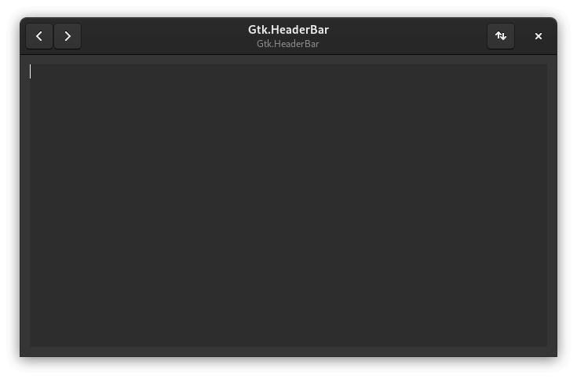

---

## Gtk Image

- [Gnome Builder](https://github.com/natorsc/gui-python-gtk/tree/master/src/gtk3/image/builder).
- [Gnome Glade](https://github.com/natorsc/gui-python-gtk/tree/master/src/gtk3/image/glade).
- [Python](https://github.com/natorsc/gui-python-gtk/tree/master/src/gtk3/image).

---

## Gtk InfoBar

- [Gnome Builder](https://github.com/natorsc/gui-python-gtk/tree/master/src/gtk3/infobar/builder).
- [Gnome Glade](https://github.com/natorsc/gui-python-gtk/tree/master/src/gtk3/infobar/glade).
- [Python](https://github.com/natorsc/gui-python-gtk/tree/master/src/gtk3/infobar).

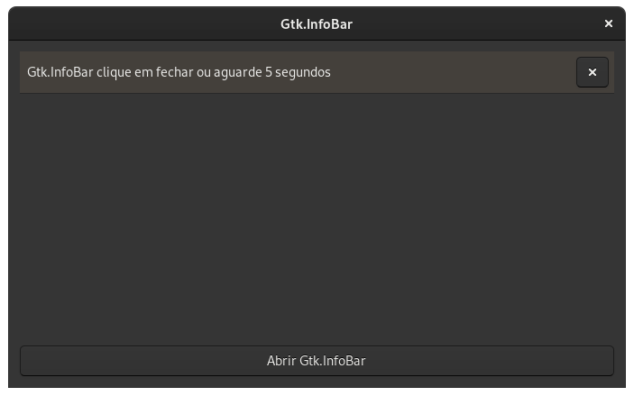

---

## Gtk Layout

- [Gnome Builder](https://github.com/natorsc/gui-python-gtk/tree/master/src/gtk3/layout/builder).
- [Gnome Glade](https://github.com/natorsc/gui-python-gtk/tree/master/src/gtk3/layout/glade).
- [Python](https://github.com/natorsc/gui-python-gtk/tree/master/src/gtk3/layout).

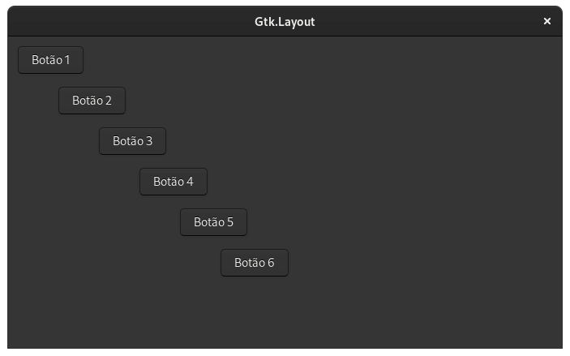

---

## Gtk LinkButton

- [Gnome Builder](https://github.com/natorsc/gui-python-gtk/tree/master/src/gtk3/linkbutton/builder).
- [Gnome Glade](https://github.com/natorsc/gui-python-gtk/tree/master/src/gtk3/linkbutton/glade).
- [Python](https://github.com/natorsc/gui-python-gtk/tree/master/src/gtk3/linkbutton).

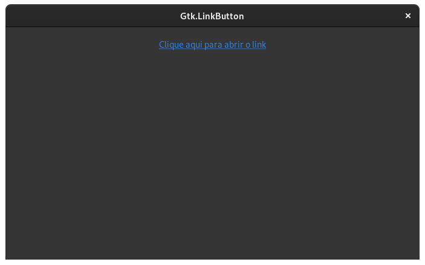

---

## Gtk ListBox

- [Gnome Builder](https://github.com/natorsc/gui-python-gtk/tree/master/src/gtk3/listbox/builder).
- [Gnome Glade](https://github.com/natorsc/gui-python-gtk/tree/master/src/gtk3/listbox/glade).
- [Python](https://github.com/natorsc/gui-python-gtk/tree/master/src/gtk3/listbox).

---

## Gtk Menu

- [Gnome Builder](https://github.com/natorsc/gui-python-gtk/tree/master/src/gtk3/menu/builder).
- [Gnome Glade](https://github.com/natorsc/gui-python-gtk/tree/master/src/gtk3/menu/glade).
- [Python](https://github.com/natorsc/gui-python-gtk/tree/master/src/gtk3/menu).

---

## Gtk MenuBar

- [Gnome Builder](https://github.com/natorsc/gui-python-gtk/tree/master/src/gtk3/menubar/builder).
- [Gnome Glade](https://github.com/natorsc/gui-python-gtk/tree/master/src/gtk3/menubar/glade).
- [Python](https://github.com/natorsc/gui-python-gtk/tree/master/src/gtk3/menubar).

---

## Gtk MenuButton

- [Gnome Builder](https://github.com/natorsc/gui-python-gtk/tree/master/src/gtk3/menubutton/builder).
- [Gnome Glade](https://github.com/natorsc/gui-python-gtk/tree/master/src/gtk3/menubutton/glade).
- [Python](https://github.com/natorsc/gui-python-gtk/tree/master/src/gtk3/menubutton).

---

## Gtk MessageDialog

Não recomendo a criação desse tipo de dialogo com o Gnome Builder ou mesmo com o Gnome Glade, uma vez que os dialogos
criados neles não seguem as regras de estilo do GTK.

- [Python](https://github.com/natorsc/gui-python-gtk/tree/master/src/gtk3/message-dialog).

---

## Gtk Notebook

- [Gnome Builder](https://github.com/natorsc/gui-python-gtk/tree/master/src/gtk3/notebook/builder).
- [Gnome Glade](https://github.com/natorsc/gui-python-gtk/tree/master/src/gtk3/notebook/glade).
- [Python](https://github.com/natorsc/gui-python-gtk/tree/master/src/gtk3/notebook).

---

## Gtk Notify

- [Python](https://github.com/natorsc/gui-python-gtk/tree/master/src/gtk3/notify).

---

## Gtk Overlay

- [Gnome Builder](https://github.com/natorsc/gui-python-gtk/tree/master/src/gtk3/overlay/builder).
- [Gnome Glade](https://github.com/natorsc/gui-python-gtk/tree/master/src/gtk3/overlay/glade).
- [Python](https://github.com/natorsc/gui-python-gtk/tree/master/src/gtk3/overlay).

---

## Gtk Paned horizontal

- [Gnome Builder](https://github.com/natorsc/gui-python-gtk/tree/master/src/gtk3/paned-horizontal/builder).
- [Gnome Glade](https://github.com/natorsc/gui-python-gtk/tree/master/src/gtk3/paned-horizontal/glade).
- [Python](https://github.com/natorsc/gui-python-gtk/tree/master/src/gtk3/paned-horizontal).

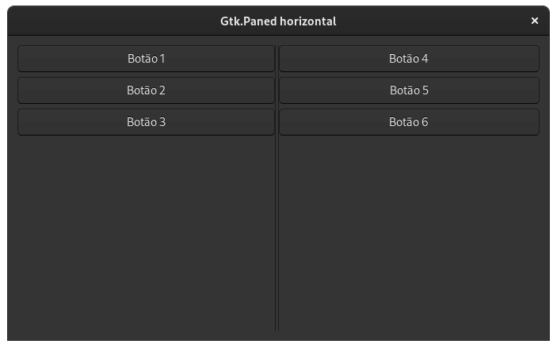

---

## Gtk Paned vertical

- [Gnome Builder](https://github.com/natorsc/gui-python-gtk/tree/master/src/gtk3/paned-vertical/builder).
- [Gnome Glade](https://github.com/natorsc/gui-python-gtk/tree/master/src/gtk3/paned-vertical/glade).
- [Python](https://github.com/natorsc/gui-python-gtk/tree/master/src/gtk3/paned-vertical).

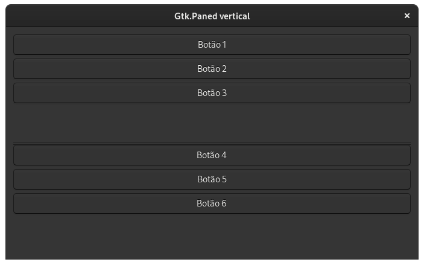

---

## Gtk Popover

- [Gnome Builder](https://github.com/natorsc/gui-python-gtk/tree/master/src/gtk3/popover/builder).
- [Gnome Glade](https://github.com/natorsc/gui-python-gtk/tree/master/src/gtk3/popover/glade).
- [Python](https://github.com/natorsc/gui-python-gtk/tree/master/src/gtk3/popover).

---

## Gtk PrintOperation

- [Gnome Builder](https://github.com/natorsc/gui-python-gtk/tree/master/src/gtk3/print-operation/builder).
- [Gnome Glade](https://github.com/natorsc/gui-python-gtk/tree/master/src/gtk3/print-operation/glade).
- [Python](https://github.com/natorsc/gui-python-gtk/tree/master/src/gtk3/print-operation).

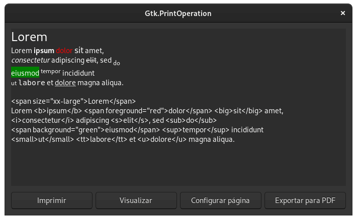

---

## Gtk RadioButton

- [Gnome Builder](https://github.com/natorsc/gui-python-gtk/tree/master/src/gtk3/radiobutton/builder).
- [Gnome Glade](https://github.com/natorsc/gui-python-gtk/tree/master/src/gtk3/radiobutton/glade).
- [Python](https://github.com/natorsc/gui-python-gtk/tree/master/src/gtk3/radiobutton).

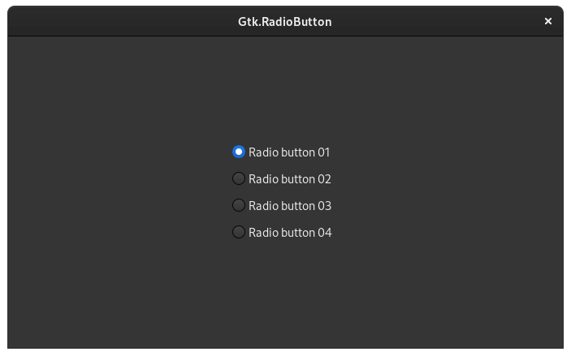

---

## Gtk Revealer

- [Gnome Builder](https://github.com/natorsc/gui-python-gtk/tree/master/src/gtk3/revealer/builder).
- [Gnome Glade](https://github.com/natorsc/gui-python-gtk/tree/master/src/gtk3/revealer/glade).
- [Python](https://github.com/natorsc/gui-python-gtk/tree/master/src/gtk3/revealer).

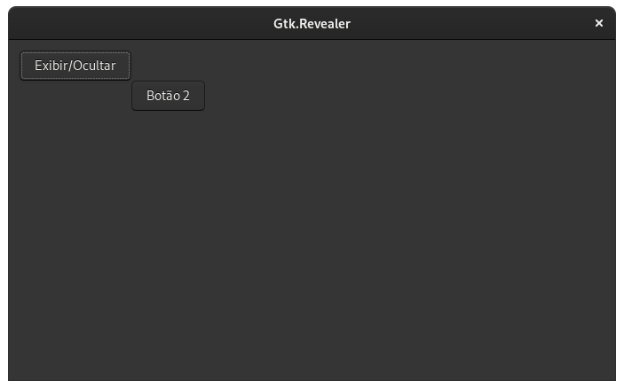

---

## Gtk SearchBar

- [Gnome Builder](https://github.com/natorsc/gui-python-gtk/tree/master/src/gtk3/searchbar/builder).
- [Gnome Glade](https://github.com/natorsc/gui-python-gtk/tree/master/src/gtk3/searchbar/glade).
- [Python](https://github.com/natorsc/gui-python-gtk/tree/master/src/gtk3/searchbar).

---

## Gtk SearchEntry

- [Gnome Builder](https://github.com/natorsc/gui-python-gtk/tree/master/src/gtk3/searchentry/builder).
- [Gnome Glade](https://github.com/natorsc/gui-python-gtk/tree/master/src/gtk3/searchentry/glade).
- [Python](https://github.com/natorsc/gui-python-gtk/tree/master/src/gtk3/searchentry).

---

## Gtk Separator

- [Gnome Builder](https://github.com/natorsc/gui-python-gtk/tree/master/src/gtk3/separator/builder).
- [Gnome Glade](https://github.com/natorsc/gui-python-gtk/tree/master/src/gtk3/separator/glade).
- [Python](https://github.com/natorsc/gui-python-gtk/tree/master/src/gtk3/separator).

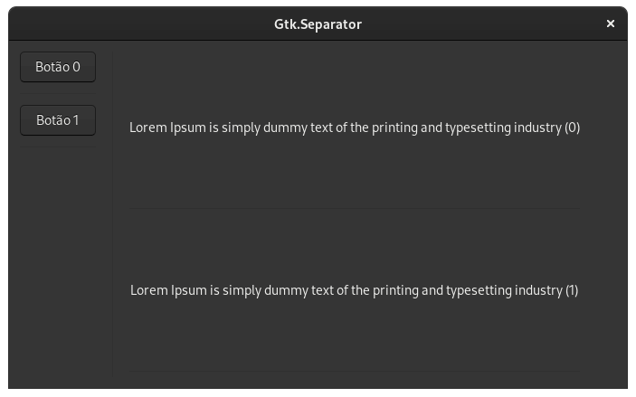

---

## Gtk Spinner

- [Gnome Builder](https://github.com/natorsc/gui-python-gtk/tree/master/src/gtk3/spinner/builder).
- [Gnome Glade](https://github.com/natorsc/gui-python-gtk/tree/master/src/gtk3/spinner/glade).
- [Python](https://github.com/natorsc/gui-python-gtk/tree/master/src/gtk3/spinner).

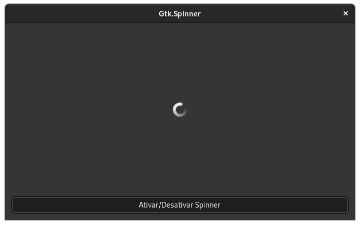

---

## Gtk StackSidebar

- [Gnome Builder](https://github.com/natorsc/gui-python-gtk/tree/master/src/gtk3/stacksidebar/builder).
- [Gnome Glade](https://github.com/natorsc/gui-python-gtk/tree/master/src/gtk3/stacksidebar/glade).
- [Python](https://github.com/natorsc/gui-python-gtk/tree/master/src/gtk3/stacksidebar).

---

## Gtk StackSwitcher

- [Gnome Builder](https://github.com/natorsc/gui-python-gtk/tree/master/src/gtk3/stackswitcher/builder).
- [Gnome Glade](https://github.com/natorsc/gui-python-gtk/tree/master/src/gtk3/stackswitcher/glade).
- [Python](https://github.com/natorsc/gui-python-gtk/tree/master/src/gtk3/stackswitcher).

---

## Gtk Statusbar

- [Gnome Builder](https://github.com/natorsc/gui-python-gtk/tree/master/src/gtk3/statusbar/builder).
- [Gnome Glade](https://github.com/natorsc/gui-python-gtk/tree/master/src/gtk3/statusbar/glade).
- [Python](https://github.com/natorsc/gui-python-gtk/tree/master/src/gtk3/statusbar).

---

## Gtk Style add class

- [Gnome Builder](https://github.com/natorsc/gui-python-gtk/tree/master/src/gtk3/style-add-class/builder).
- [Gnome Glade](https://github.com/natorsc/gui-python-gtk/tree/master/src/gtk3/style-add-class/glade).
- [Python](https://github.com/natorsc/gui-python-gtk/tree/master/src/gtk3/style-add-class).

---

## Gtk Style Css Provider

- [Gnome Builder](https://github.com/natorsc/gui-python-gtk/tree/master/src/gtk3/style-css-provider/builder).
- [Gnome Glade](https://github.com/natorsc/gui-python-gtk/tree/master/src/gtk3/style-css-provider/glade).
- [Python](https://github.com/natorsc/gui-python-gtk/tree/master/src/gtk3/style-css-provider).

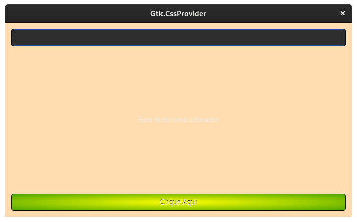

---

## Gtk Style dark mode

- [Gnome Builder](https://github.com/natorsc/gui-python-gtk/tree/master/src/gtk3/dark-mode/builder).
- [Gnome Glade](https://github.com/natorsc/gui-python-gtk/tree/master/src/gtk3/dark-mode/glade).
- [Python](https://github.com/natorsc/gui-python-gtk/tree/master/src/gtk3/dark-mode).

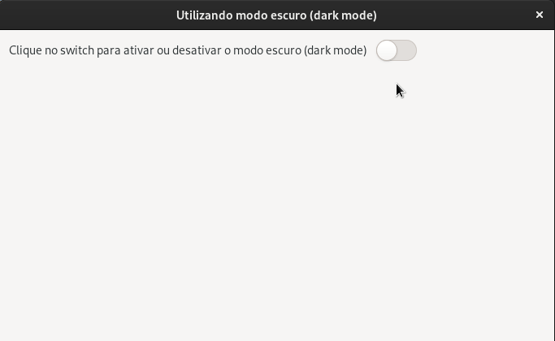

---

## Gtk Style set name

- [Gnome Builder](https://github.com/natorsc/gui-python-gtk/tree/master/src/gtk3/style-set-name/builder).
- [Gnome Glade](https://github.com/natorsc/gui-python-gtk/tree/master/src/gtk3/style-set-name/glade).
- [Python](https://github.com/natorsc/gui-python-gtk/tree/master/src/gtk3/style-set-name).

---

## Gtk Switch

- [Gnome Builder](https://github.com/natorsc/gui-python-gtk/tree/master/src/gtk3/switch/builder).
- [Gnome Glade](https://github.com/natorsc/gui-python-gtk/tree/master/src/gtk3/switch/glade).
- [Python](https://github.com/natorsc/gui-python-gtk/tree/master/src/gtk3/switch).

---

## Gtk ToggleButton

- [Gnome Builder](https://github.com/natorsc/gui-python-gtk/tree/master/src/gtk3/togglebutton/builder).
- [Gnome Glade](https://github.com/natorsc/gui-python-gtk/tree/master/src/gtk3/togglebutton/glade).
- [Python](https://github.com/natorsc/gui-python-gtk/tree/master/src/gtk3/togglebutton).

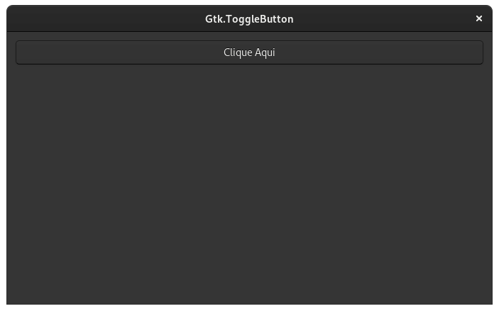

---

## Gtk Toolbar

- [Gnome Builder](https://github.com/natorsc/gui-python-gtk/tree/master/src/gtk3/toolbar/builder).
- [Gnome Glade](https://github.com/natorsc/gui-python-gtk/tree/master/src/gtk3/toolbar/glade).
- [Python](https://github.com/natorsc/gui-python-gtk/tree/master/src/gtk3/toolbar).

---

## Gtk TreeView editable

- [Gnome Builder](https://github.com/natorsc/gui-python-gtk/tree/master/src/gtk3/treeview-liststore-editable/builder).
- [Gnome Glade](https://github.com/natorsc/gui-python-gtk/tree/master/src/gtk3/totreeview-liststore-editableolbar/glade)
  .
- [Python](https://github.com/natorsc/gui-python-gtk/tree/master/src/gtk3/treeview-liststore-editable).

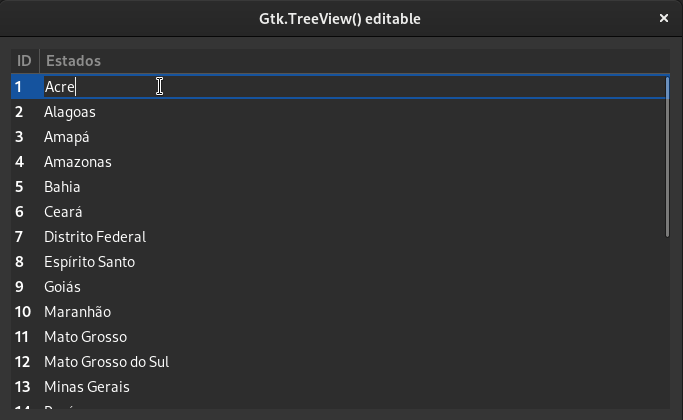

---

## Gtk TreeView filter

- [Gnome Builder](https://github.com/natorsc/gui-python-gtk/tree/master/src/gtk3/treeview-liststore-filter/builder).
- [Gnome Glade](https://github.com/natorsc/gui-python-gtk/tree/master/src/gtk3/totreeview-liststore-filter/glade).
- [Python](https://github.com/natorsc/gui-python-gtk/tree/master/src/gtk3/treeview-liststore-filter).

---

## Gtk TreeView sort

- [Gnome Builder](https://github.com/natorsc/gui-python-gtk/tree/master/src/gtk3/treeview-liststore-sort/builder).
- [Gnome Glade](https://github.com/natorsc/gui-python-gtk/tree/master/src/gtk3/totreeview-liststore-sort/glade).
- [Python](https://github.com/natorsc/gui-python-gtk/tree/master/src/gtk3/treeview-liststore-sort).

---

## Gtk TreeView TreeStore

- [Gnome Builder](https://github.com/natorsc/gui-python-gtk/tree/master/src/gtk3/treeview-treestore/builder).
- [Gnome Glade](https://github.com/natorsc/gui-python-gtk/tree/master/src/gtk3/totreeview-treestore/glade).
- [Python](https://github.com/natorsc/gui-python-gtk/tree/master/src/gtk3/treeview-treestore).

---

## Gtk Window

- [Gnome Builder](https://github.com/natorsc/gui-python-gtk/tree/master/src/gtk3/window/builder).
- [Gnome Glade](https://github.com/natorsc/gui-python-gtk/tree/master/src/gtk3/window/glade).
- [Python](https://github.com/natorsc/gui-python-gtk/tree/master/src/gtk3/window).

---

