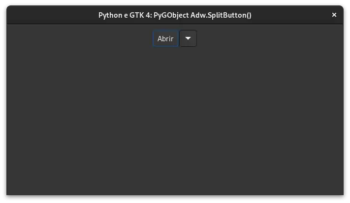

# Libadwaita

## Adw ActionRow

- [Python](../src/gtk4-libadwaita/actionrow).

---

## Adw Avatar

- [Python](../src/gtk4-libadwaita/avatar).

---

## Adw Carousel

- [Python](../src/gtk4-libadwaita/carousel).

---

## Adw CarouselIndicatorDots

- [Python](../src/gtk4-libadwaita/carouselindicatordots).

---

## CarouselIndicatorLines

- [Python](../src/gtk4-libadwaita/carouselindicatorlines).

---

## Adw Flap

- [Python](../src/gtk4-libadwaita/flap).

---

## Adw SplitButton

- [Python](../src/gtk4-libadwaita/split-button).

---
