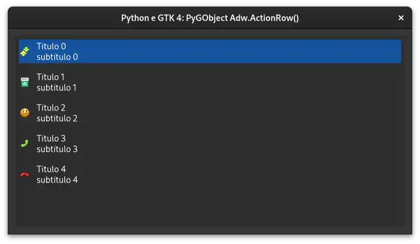
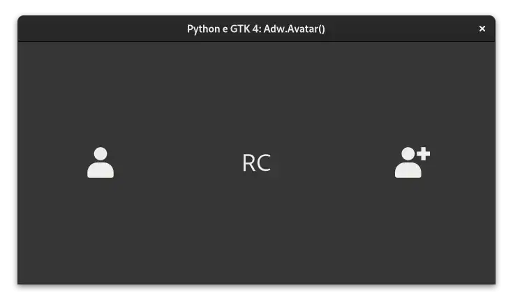
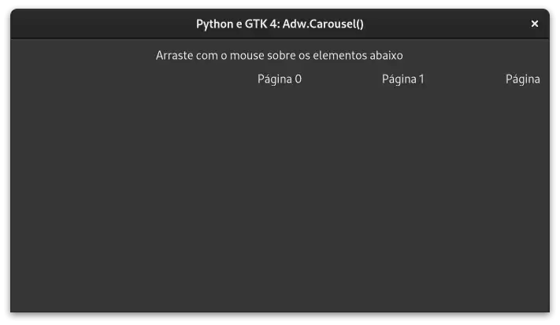
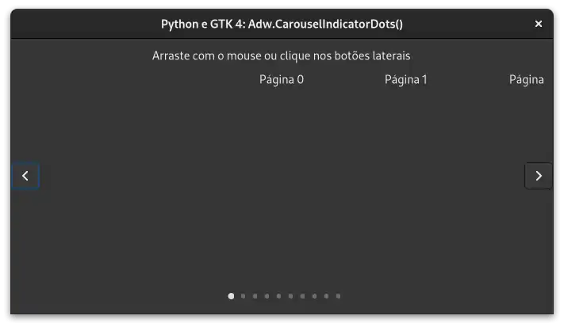
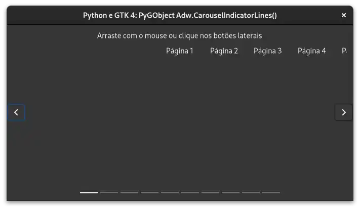

# Libadwaita

## ActionRow

- [Python](../src/gtk4-libadwaita/actionrow).

---

## Avatar

- [Python](../src/gtk4-libadwaita/avatar).

---

## Carousel

- [Python](../src/gtk4-libadwaita/carousel).

---

## CarouselIndicatorDots

- [Python](../src/gtk4-libadwaita/carouselindicatordots).

---

## CarouselIndicatorLines

- [Python](../src/gtk4-libadwaita/carouselindicatorlines).

---
