# GTK 4 Widgets

## Gtk ActionBar

- [Python](../src/gtk4/actionbar).
- [Template (arquivos de interface)](../src/gtk4/actionbar/template).

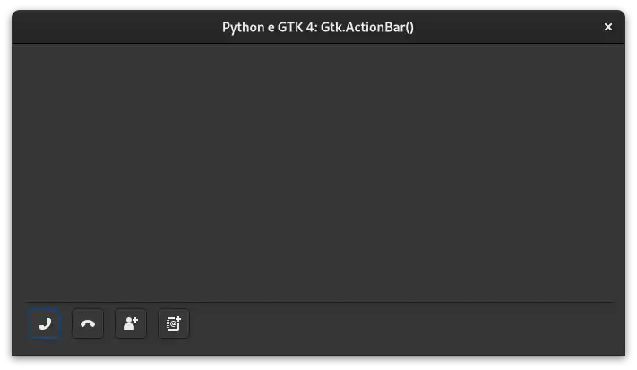

---

## Gtk ApplicationWindow

- [Python](../src/gtk4/applicationwindow).
- [Template (arquivos de interface)](../src/gtk4/applicationwindow/template).

---

## Gtk Box Horizontal

- [Python](../src/gtk4/box-horizontal).
- [Template (arquivos de interface)](../src/gtk4/box-horizontal/template).

---

## Gtk Box Vertical

- [Python](../src/gtk4/box-vertical).
- [Template (arquivos de interface)](../src/gtk4/box-vertical/template).

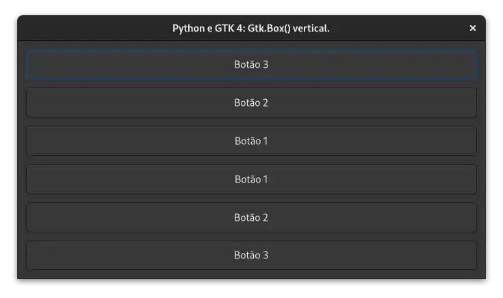

---

## Gtk Button

- [Python](../src/gtk4/button).
- [Template (arquivos de interface)](../src/gtk4/button/template).

---

## Gtk Calendar

- [Python](../src/gtk4/calendar).
- [Template (arquivos de interface)](../src/gtk4/calendar/template).

---

## Gtk CheckButton

- [Python](../src/gtk4/checkbutton).
- [Template (arquivos de interface)](../src/gtk4/checkbutton/template).

---

## Gtk ComboBoxText

- [Python](../src/gtk4/comboboxtext).

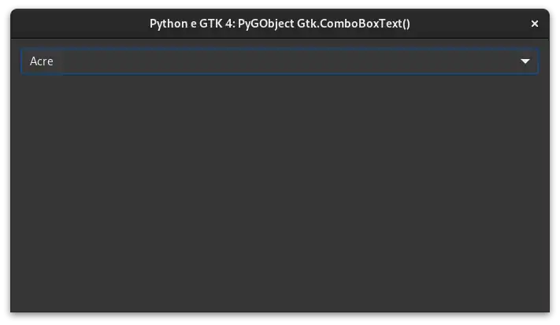

---

## Gtk Dialog

- [Python](../src/gtk4/dialog).

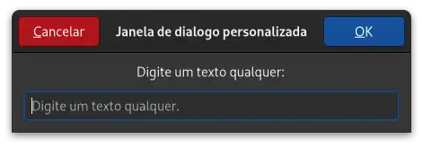

---

## Gtk drag and drop

- [Python](../src/gtk4/drag-and-drop).

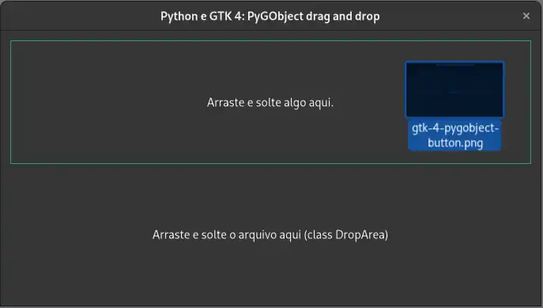

---

## Gtk Entry

- [Python](../src/gtk4/entry).
- [Template (arquivos de interface)](../src/gtk4/entry/template).

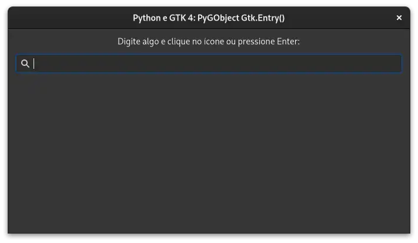

---

## Gtk EntryCompletion

- [Python](../src/gtk4/entry-completion).

---

## Gtk FileChooserDialog folder

- [Python](../src/gtk4/file-chooser-dialog-folder).

---

## Gtk FileChooserDialog open

- [Python](../src/gtk4/file-chooser-dialog-open).

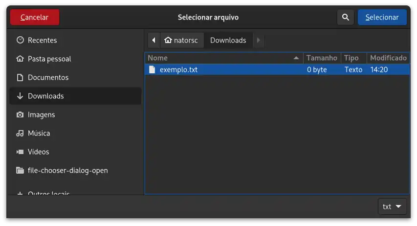

---

## Gtk FileChooserDialog save

- [Python](../src/gtk4/file-chooser-dialog-save).

---

## Gtk Fixed

- [Python](../src/gtk4/fixed).

---

## Gtk FlowBox

- [Python](../src/gtk4/flowbox).

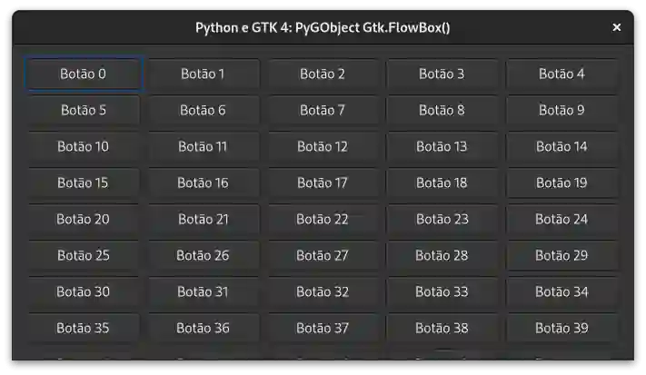

---

## Gtk Grid

- [Python](../src/gtk4/grid).

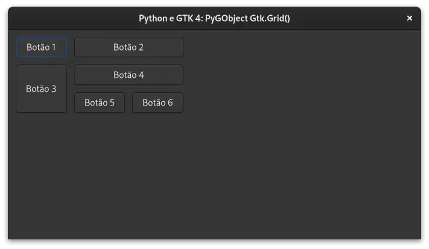

---

## Gtk HeaderBar

- [Python](../src/gtk4/headerbar).

---

## Gtk Image

- [Python](../src/gtk4/image).

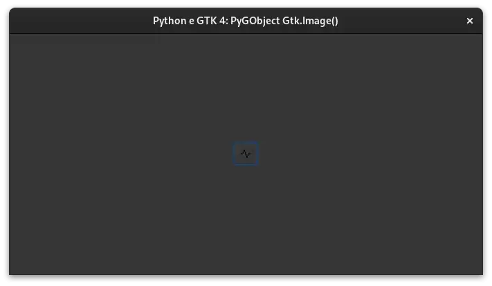

---

## Gtk ListBox

- [Python](../src/gtk4/listbox).

---

## Gtk MenuButton

- [Python](../src/gtk4/menubutton).

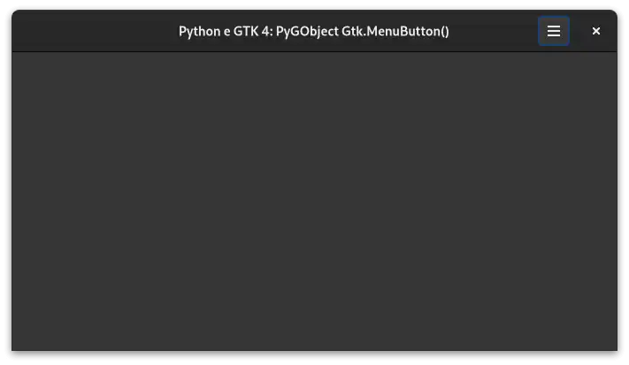

---

## Gtk Overlay

- [Python](../src/gtk4/overlay).

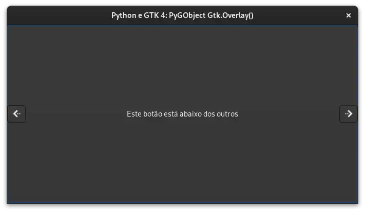

---

## Gtk Picture

- [Python](../src/gtk4/picture).

---

## Gtk Popover

- [Python](../src/gtk4/popover).

---

## Gtk PopoverMenu

- [Python](../src/gtk4/popover-menu).

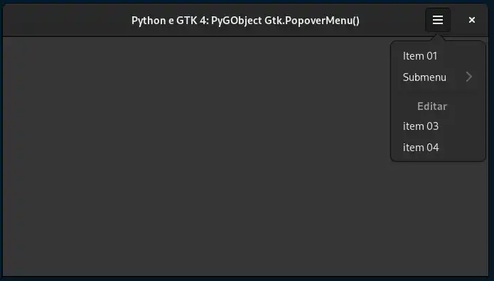

---

## Gtk RadioButton

- [Python](../src/gtk4/radiobutton).

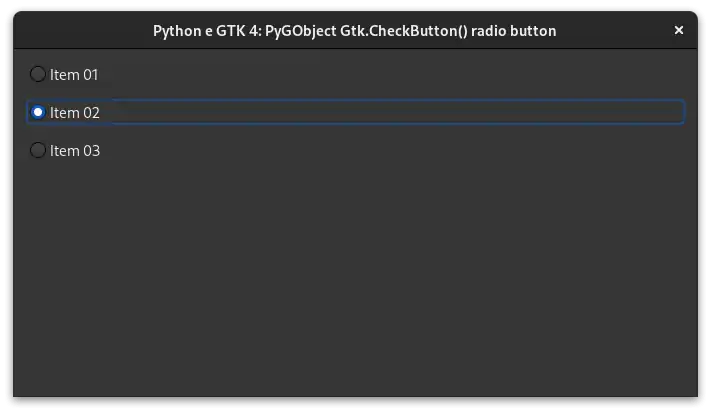

---

## Gtk Signal e Slots

- [Python](../src/gtk4/signal-and-slots).

---

## Gtk StackSidebar

- [Python](../src/gtk4/stacksidebar).

---

## Gtk StackSwitcher

- [Python](../src/gtk4/stackswitcher).

---

## Gtk Style add class

- [Python](../src/gtk4/style-add-class).

---

## Gtk Style dark mode

- [Python](../src/gtk4/style-dark-mode).

---

## Gtk Switch

- [Python](../src/gtk4/switch).

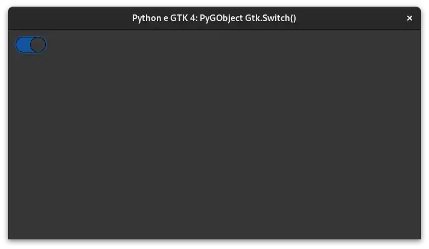

---

## Translator gettext

- [Python](../src/gtk4/translator-gettext).

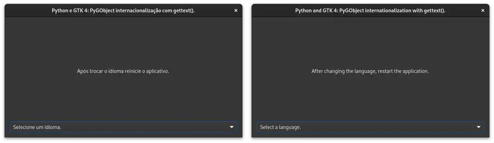

---

## TreeView (editable)

- [Python](../src/gtk4/treeview-liststore-editable).

---

## TreeView (filter)

- [Python](../src/gtk4/treeview-liststore-filter).

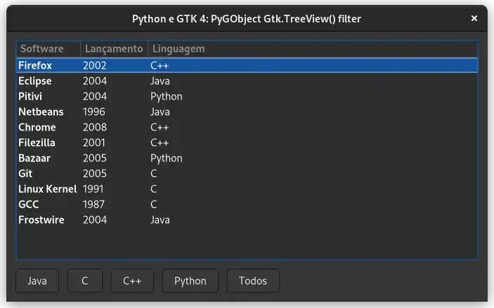

---

## TreeView (sort)

- [Python](../src/gtk4/treeview-liststore-sort).

---

## Gtk Video

- [Python](../src/gtk4/video).

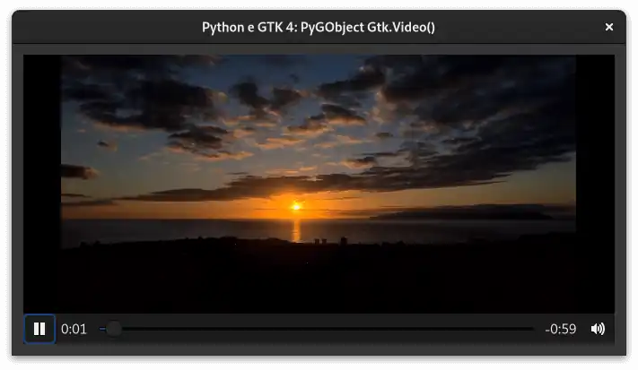

---

## Gtk Window

- [Python](../src/gtk4/window).

---
