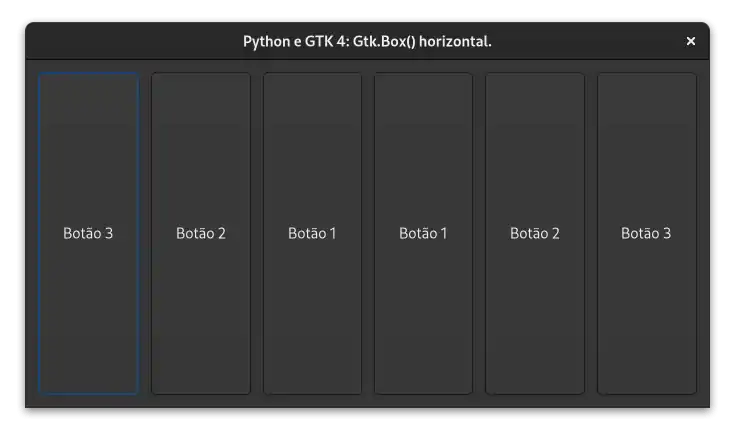

# Widgets

## Gtk ApplicationWindow

- [Gnome Builder](https://github.com/natorsc/gui-python-gtk/tree/master/src/gtk4/applicationwindow/builder).
- [Python](https://github.com/natorsc/gui-python-gtk/tree/master/src/gtk4/applicationwindow).

---

## Gtk Box Horizontal

- [Python](../src/gtk4/box-horizontal).

---
