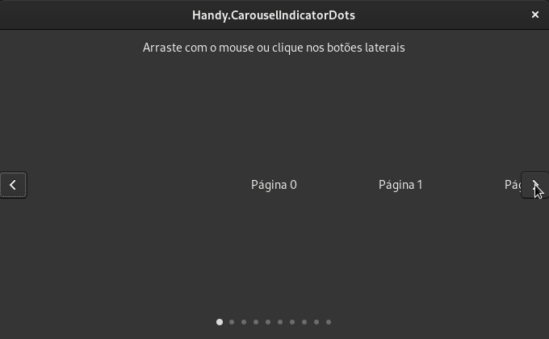
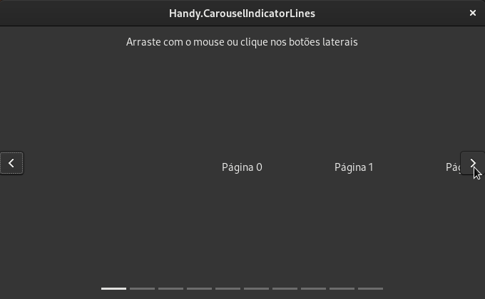
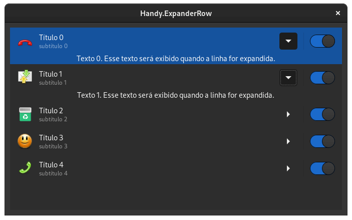
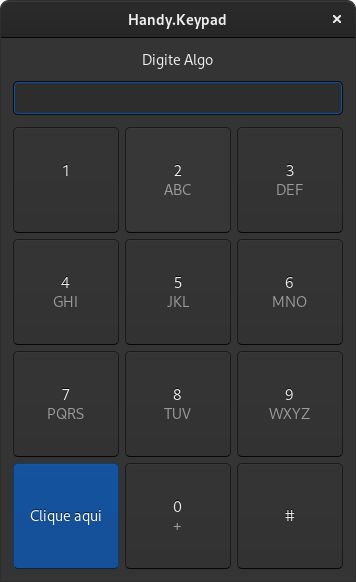
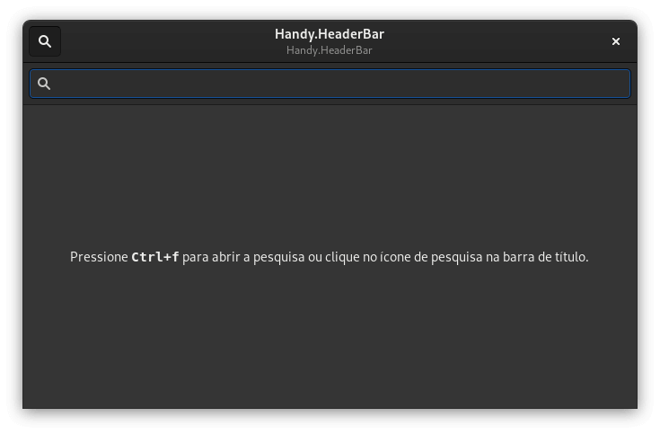
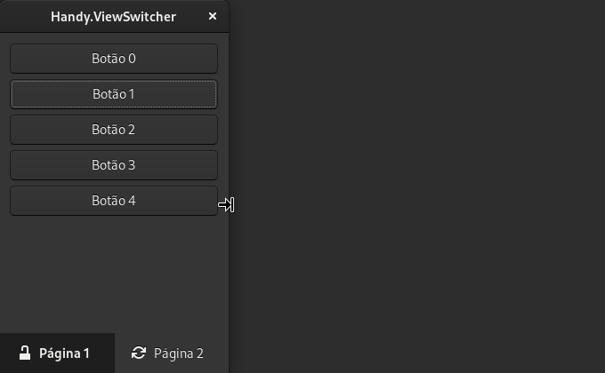
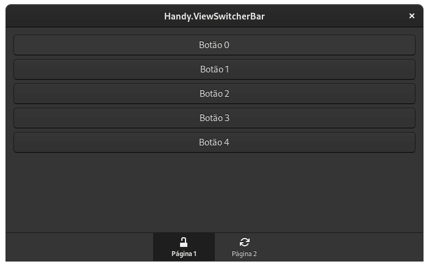

# Widgets

## Handy ActionRow

- [Gnome Builder](https://github.com/natorsc/gui-python-gtk/tree/master/src/libhandy/actionrow/builder).
- [Gnome Glade](https://github.com/natorsc/gui-python-gtk/tree/master/src/libhandy/actionrow/glade).
- [Python](https://github.com/natorsc/gui-python-gtk/tree/master/src/libhandy/actionrow).

---

## Handy ApplicationWindow

Não está funcionando de forma adequada ou não sei implementar. Disponível a partir da versão 1.0?

- [Python](https://github.com/natorsc/gui-python-gtk/tree/master/src/libhandy/actionrow).

---

## Handy Avatar

- [Python](https://github.com/natorsc/gui-python-gtk/tree/master/src/libhandy/avatar).

---

## Handy Carousel

- [Python](https://github.com/natorsc/gui-python-gtk/tree/master/src/libhandy/carousel).

---

## Handy Carousel Indicator Dots

- [Python](https://github.com/natorsc/gui-python-gtk/tree/master/src/libhandy/carousel-indicator-dots).

---

## Handy Carousel Indicator Lines

[Python](https://github.com/natorsc/gui-python-gtk/tree/master/src/libhandy/carousel-indicator-lines).

---

### Handy Clamp

Não sei implementar ou não está funcionando.

- [Python](https://github.com/natorsc/gui-python-gtk/tree/master/src/libhandy/clamp).

---

## Handy ComboRow

- [Python](https://github.com/natorsc/gui-python-gtk/tree/master/src/libhandy/comborow).

---

## Handy Deck

Não sei implementar ou não está funcionando.

- [Python](https://github.com/natorsc/gui-python-gtk/tree/master/src/libhandy/deck) .

---

## Handy ExpanderRow

* [Python](https://github.com/natorsc/gui-python-gtk/tree/master/src/libhandy/expanderrow).

---

## Handy HeaderBar

- [Python](https://github.com/natorsc/gui-python-gtk/tree/master/src/libhandy/headerbar).

---

## Handy HeaderGroup

Não sei implementar ou não está funcionando.

- [Python](https://github.com/natorsc/gui-python-gtk/tree/master/src/libhandy/headergroup).

---

## Handy Keypad

- [Python](https://github.com/natorsc/gui-python-gtk/tree/master/src/libhandy/keypad).

---

## Handy Leaflet

- [Python](https://github.com/natorsc/gui-python-gtk/tree/master/src/libhandy/leaflet).

- [Python dois Leaflets](https://github.com/natorsc/gui-python-gtk/tree/master/src/libhandy/leaflet).

---

## Handy SearchBar

- [Python](https://github.com/natorsc/gui-python-gtk/tree/master/src/libhandy/searchbar).

---

## Handy Squeezer

Não sei implementar ou não está funcionando.

- [Python](https://github.com/natorsc/gui-python-gtk/tree/master/src/libhandy/squeezer).

---

## Handy TitleBar

- [Python](https://github.com/natorsc/gui-python-gtk/tree/master/src/libhandy/titlebar).

---

## Handy View Switcher

- [Python](https://github.com/natorsc/gui-python-gtk/tree/master/src/libhandy/viewswitcher).

---

## Handy View Switcher Bar

- [Python](https://github.com/natorsc/gui-python-gtk/tree/master/src/libhandy/viewswitcherbar).

---

## Handy View Switcher Title

Falta imagem.

- [Python](https://github.com/natorsc/gui-python-gtk/tree/master/src/libhandy/viewswitchertitle).

---

## Handy Window

Não sei implementar ou não está funcionando.

- [Python](https://github.com/natorsc/gui-python-gtk/tree/master/src/libhandy/window).

---

## Handy Window Handle

Falta imagem.

- [Python](https://github.com/natorsc/gui-python-gtk/tree/master/src/libhandy/windowhandle).

---