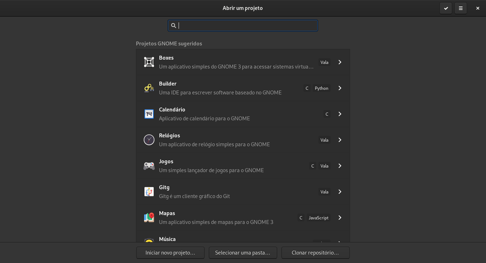

# Como instalar o Gnome Builder

> **OBS**: O Gnome Builder não está disponível para Windows

Gnome Builder é o **IDE** (ambiente de desenvolvimento integrado) do projeto Gnome que tem como objectivo facilitar o desenvolvimento de aplicativos para o ambiente Gnome e permitir a distribuição dos aplicativos através do empacotamento com [Flatpak](https://flatpak.org/).

Até o momento em que escrevo é possível trabalhar com as linguagens:

- C++.
- C#.
- C.
- JavaScript.
- Python.
- Rust.
- Vala.

O que mais me chama atenção neste IDE é sem duvidas:

- A padronização do projeto independente da linguagem de programação escolhida.
- O fato de iniciar um novo projeto (independente da linguagem) e o mesmo já estar funcionando sem grandes problemas.
- O projeto pode ser empacotado com apenas 1 clique.

## Instalação

Para utilizar as versões mais recentes do Gnome Builder é recomendada a instalação da sua versão empacotada em Flatpak.

Para isso acesse a página do [Gnome Builder no FlatHub](https://flathub.org/apps/details/org.gnome.Builder) ou mesmo a [Wiki oficial do Gnome Builder](https://wiki.gnome.org/Apps/Builder).

Caso prefira realizar a instalação pelo terminal basta digitar o comando:

```bash
flatpak install --from https://flathub.org/repo/appstream/org.gnome.Builder.flatpakref
```

> O suporte a flatpak deve estar ativo na sua distriução Linux.

Também é possível realizar a instalação do Gnome Builder através dos repositórios das distribuições Linux, entretanto a versão do Gnome Builder contida no repositório pode **variar bastante**!

### Fedora

```bash
sudo dnf install gnome-builder
```

### openSUSE

```bash
sudo zypper install gnome-builder
```

### Ubuntu

```bash
sudo apt install gnome-builder
```

### macOS (Não testado)

```bash
brew install gnome-builder
```

Com o final da instalação, basta localizar o ícone do Gnome Builder no menu do seu sistema operacional:

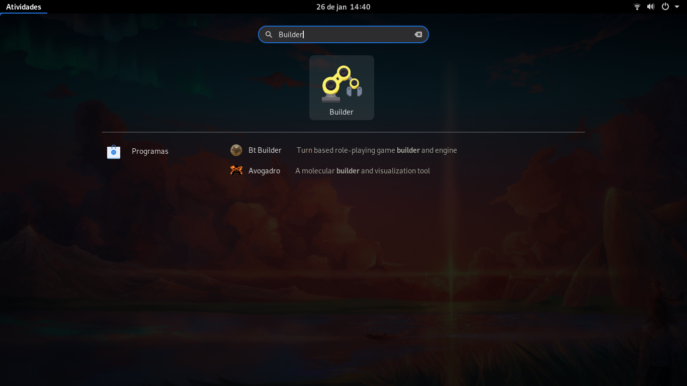

## Criando um projeto

Ao iniciar o Gnome Builder temos a seguinte interface:

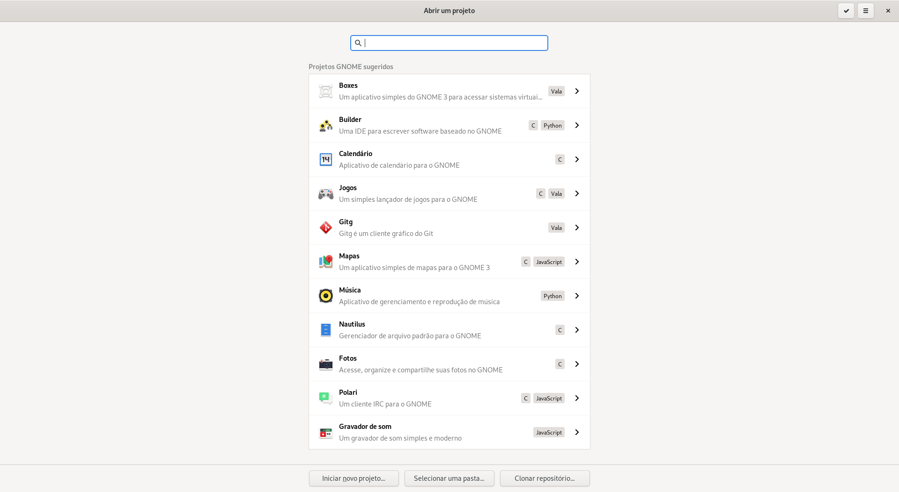

Nessa tela temos alguns projetos que podem ser clonados com apenas um clique e na parte inferior da tela temos:

- **Iniciar novo projeto**.
- **Selecionar uma pasta**: Permite selecionar um projeto existente.
- **Clonar repositório**: Caso você já tenha algum projeto hospedado (Github, Bitbucket, Gitlab, etc), o mesmo pode ser clonado utilizando-se essa opção.

Vamos começar clicando em **Iniciar novo projeto**.

A próxima tela a ser exibida é:

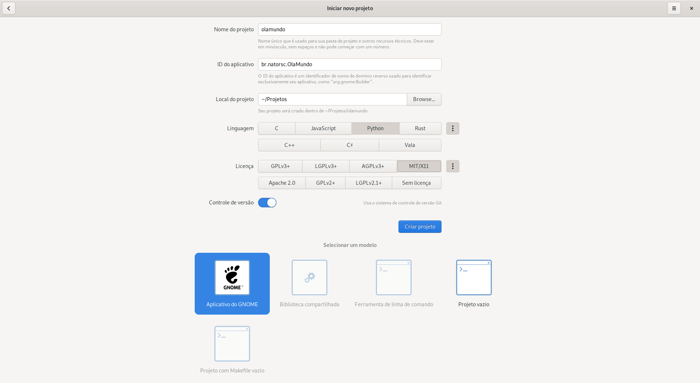

Agora temos que preencher essa tela com os dados do projeto, sendo:

- **Nome do projeto**: Nome da pasta onde os arquivo serão criados.
- **ID do aplicativo**: Este é o nome exclusivo que identifica o aplicativo, essa id é composta por pelo menos 3 partes (com.exemplo.NomeDoApp).
- **Local do projeto**: Local do computador em que o projeto será criado.
- **Linguagem**: Linguagem de programação que será utilizada no projeto. Clique nos 3 pontinhos verticais para ver mais linguagens.
- **Licença**: Licença que será utilizada pelo projeto. Clique nos 3 pontinhos verticais para ver mais licenças.
- **Controle de versão**: Ativa ou desativa o uso do Git no projeto.
- **Selecionar um modelo**: Dependendo da linguem escolhida são exibidos templates iniciais. Selecione **Aplicativo do GNOME**.

Após realizar as configurações do projeto clique em **Criar projeto**.

Se está for a primeira vez que o Gnome Builder é executado ele irá oferecer o download do `org.gnome.Sdk` e `org.gnome.Platform`:

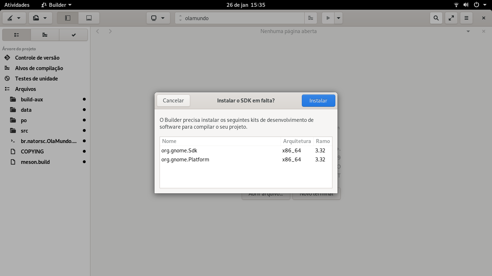

Realize o download de ambos como solicitado, isso porque precisamos de ambos para executar o projeto com sucesso.

O andamento do download pode ser verificado clicando-se no **ícone circular** próximo ao **ícone de busca**:

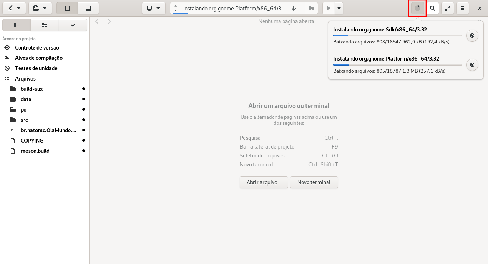

Assim que o download terminar podemos executar o projeto clicando no **ícone de play** ou pressionando **Ctrl + F5**:

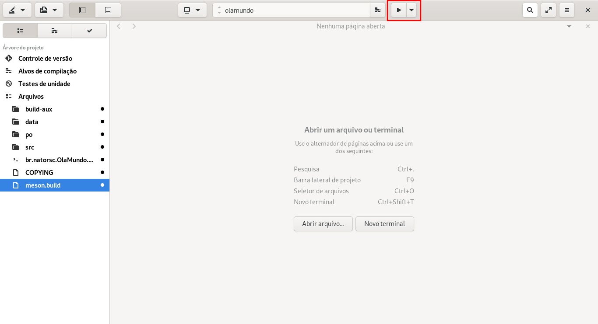

> **OBS**: Pode ser que seja exibido o erro `bwrap: execvp NomeDoProjeto: No such file or directory`, isso porque não tínhamos o **Platform** e **SDK** instalados, feche e abra o Gnome Builder e tente executar novamente.

> **OBS**: Caso reiniciar o Gnome Builder não resolva o problema execute `systemctl --user restart xdg-document-portal`, em alguns casos o **xdg-document-portal** não inicia de forma adequada na sessão do usuário.

Ao executar deve ser exibido:

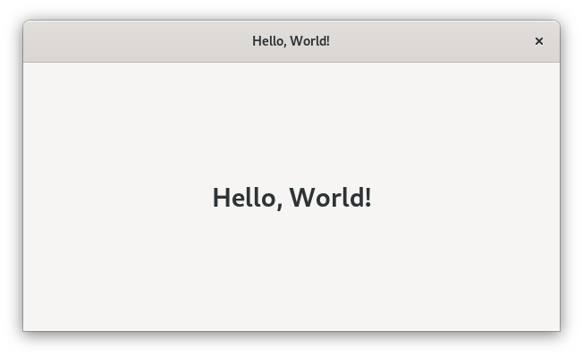

## Estrutura do projeto

Ao se criar um novo projeto, o Gnome Builder inicia com a seguinte configuração de pastas e arquivos:

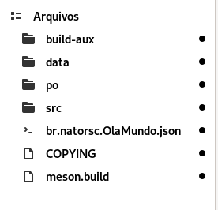

Onde:

- **build-aux**: Diretório define rotinas de pós instalação do aplicativo.
- **data**: Diretório onde ficam salvos arquivos de dados do aplicativo. Ex: aquivos de manifestos, arquivos estáticos que precisam ser acessados em tempo de execução, etc.
- **po**: Diretório com os arquivos relacionados à internacionalização e tradução.
- **src**: Diretório com os arquivos de código e de interface da aplicação. Vi em alguns projetos os arquivos de interface salvos no diretório **data**, contudo não sei se isso é um padrão ou uma variação do padrão.
- **br.natorsc.OlaMundo.json**: Arquivo de manifesto do Flatpak, o mesmo contém informações do aplicativo e suas dependências.
- **COPYING**: Arquivo de licença do projeto.
- **meson.build**: Arquivo descreve como será realizada a construção do aplicativo (build).

Estrutura completa:

```txt
├── br.natorsc.OlaMundo.json
├── build-aux
│   └── meson
│       └── postinstall.py
├── COPYING
├── data
│   ├── br.natorsc.OlaMundo.appdata.xml.in
│   ├── br.natorsc.OlaMundo.desktop.in
│   ├── br.natorsc.OlaMundo.gschema.xml
│   └── meson.build
├── meson.build
├── po
│   ├── LINGUAS
│   ├── meson.build
│   └── POTFILES
└── src
    ├── __init__.py
    ├── main.py
    ├── meson.build
    ├── olamundo.gresource.xml
    ├── olamundo.in
    ├── window.py
    └── window.ui
```

Em um **primeiro momento** podemos citar como arquivos principais:

- **window.py**: Arquivo Python que define a lógica para **window.ui**.
- **window.ui**: Arquivo de interface que descreve a posição dos widgets na janela.
- **olamundo.gresource.xml**: Arquivo que define os recursos que estarão disponíveis. Caso sejam criados novos arquivos de interface os mesmos **DEVEM** estar descritos neste arquivo.
- **br.natorsc.OlaMundo.json**: Arquivo de descreve diversos parâmetros do aplicativo como:
    - ID do aplicativo.
    - Versão do GTK que é utilizada.
    - Dependências do projeto.
    - etc.

## Arquivo de interface

Nas versões mais recentes do Gnome Builder já é possível desenhar as interfaces de forma visual, para isso, basta clicar sobre o arquivo de interface desejado (`NomeDoArquivo.ui`) e clicar em **Ver construção**:

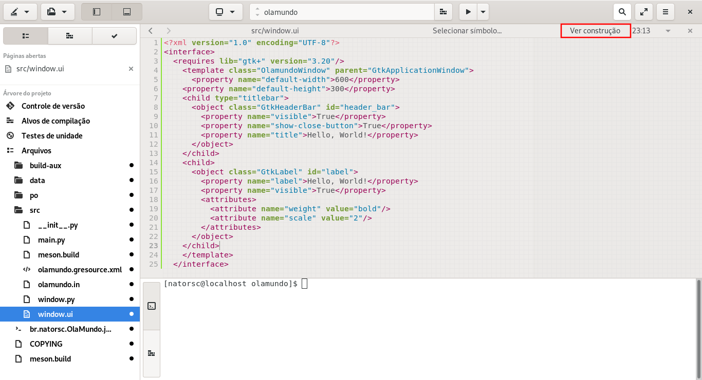

Será aberta uma nova visualização que permite a edição do arquivo de interface de forma visual. Os widgets podem ser localizados no canto inferior direto da interface:

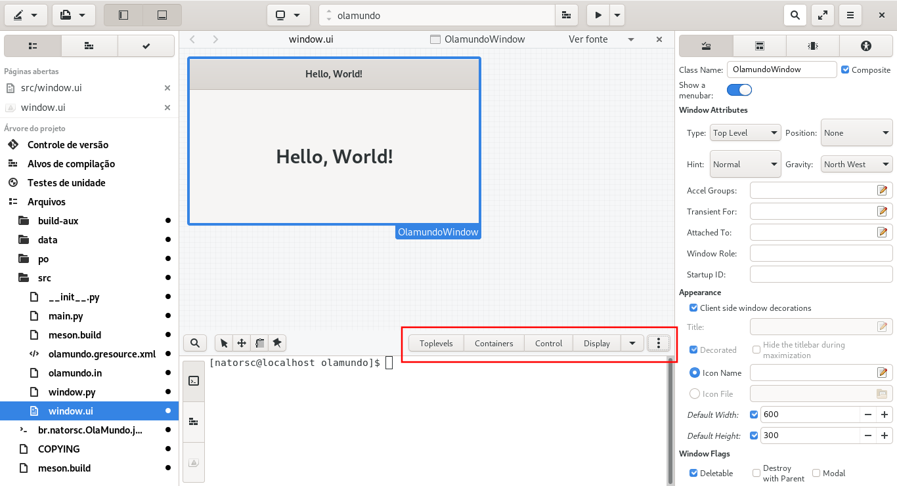

Vale notar também que na área onde temos **3 pontinhos verticais** ficam alguns widgets e principalmente os widgets da biblioteca **libhandy** (caso as bibliotecas necessárias estejam instaladas):

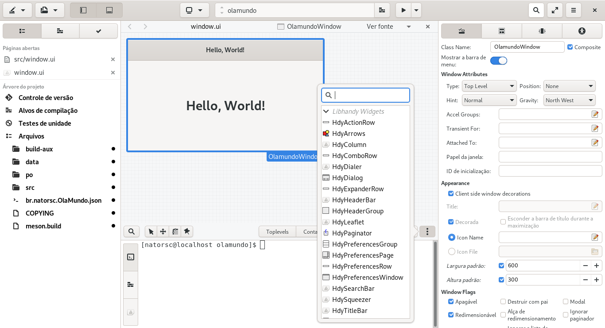

Com isso terminados este passeio inicial e até superficial pelos recursos do Gnome Builder.

Caso encontre algum erro ou dificuldade entre em contato para que o conteúdo possa ser melhorado 🤓.