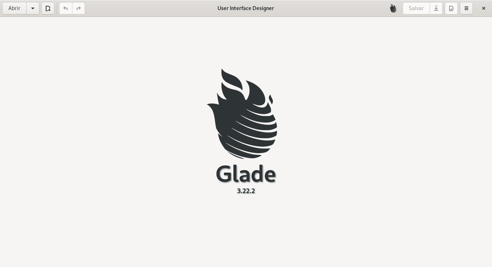
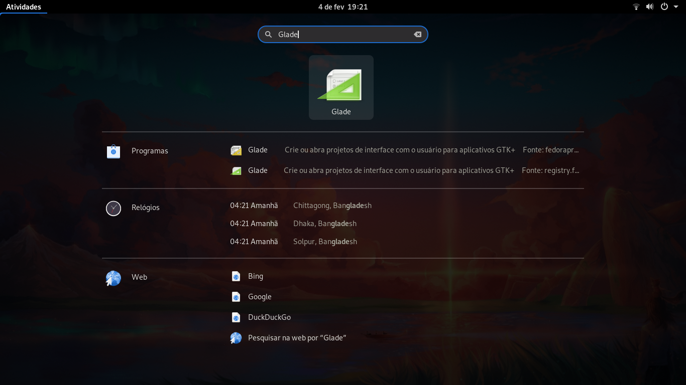
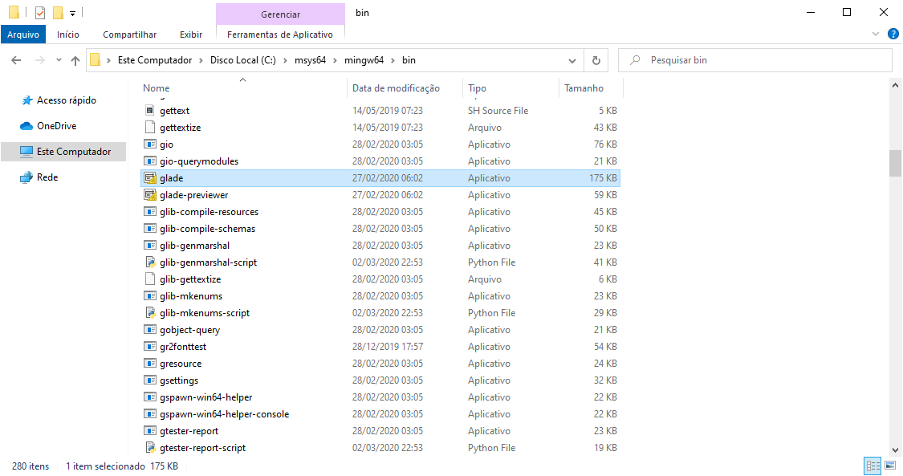

# Como instalar o Gnome Glade

O Gnome Glade é uma ferramenta do tipo RAD (Rapid Application Development - Desenvolvimento de Aplicação Rápida), ele basicamente permite o design de interfaces gráficas de forma visual.

Os arquivos de interface gerados pelo Gnome Glade podem ser acessados (lidos) pelas linguagens de programação que possuem um **binding** para o GTK.

Particularmente gosto deste modelo de desenvolvimento onde temos um arquivo responsável pelo design do aplicativo e a linguagem de programação escolhida fica responsável pela parte lógica da aplicação.

Assim como no **Gnome Builder** os arquivos de interface gerados são do tipo **XML**, contudo a forma de ser fazer a leitura de um arquivo do Gnome Glade é totalmente diferente de um arquivo gerado pelo Gnome Builder, porém falaremos disso em outro momento.

## Linux

Gnome Glade no [Flathub](https://www.flathub.org/apps/details/org.gnome.Glade).

```bash
flatpak install flathub org.gnome.Glade
```

Gnome Glade na [Snap Store](https://snapcraft.io/glade).

> **OBS**: A versão estável da Snap Store está desatualizada em relação a do Flathub e até mesmo em relação a alguns repositórios.

## Ubuntu

```bash
sudo apt install glade
```

## Fedora

```
sudo dnf install glade
```

Com o fim da instalação basta localizar o Gnome Glade no meu da sua distribuição:



## Windows

No Windows a instalação deve ser feita através do msys2, caso você não tenha o msys2 instalado [clique aqui](./install-msys2-windows.md) para ver como realizar essa instalação.

```bash
pacman -S mingw-w64-x86_64-glade
```

Caso precise da versão 32 bits:

```bash
pacman -S mingw-w64-i686-glade
```

O executável do Glade pode ser localizado em um dos seguintes diretórios (desde que você tenha realizada a instalação padrão):

-   `C:\msys32\mingw32\bin\glade.exe`.
-   `C:\msys32\mingw64\bin\glade.exe`.
-   `C:\msys64\mingw32\bin\glade.exe`.
-   `C:\msys64\mingw64\bin\glade.exe`.



Para executar o Glade basta dar **2 cliques** sobre o executável e para maior comodidade crie um atalho para este executável.