# Como instalar o msys2 no Windows

O msys2 permite a utilização do [Pacman](https://wiki.archlinux.org/index.php/Pacman_(Portugu%C3%AAs)) como gerenciador de pacotes no Windows.

Com sua instalação passamos a ter no Windows:

- Instalação e atualização de pacotes de forma simplificada.
- Gerenciamento de dependências ao instalar um novo pacote.
- Acesso a ferramentas como, **shell bash**, **Autotools**, etc.
- Construção de pacotes com **mingw-64** e **toolchains**.

Para realizar a instalação você deve acessar o [site oficial do msys2](https://www.msys2.org/):

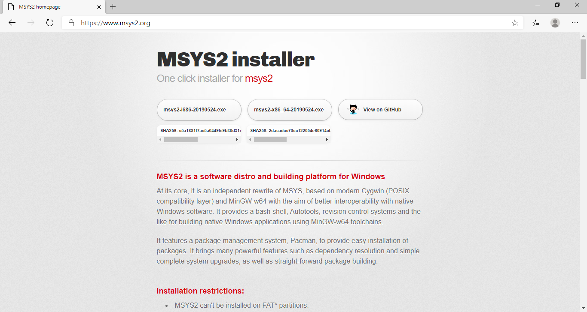

E realizar o download do pacote de acordo com a arquitetura do seu Windows, lembrando que:

- **x86_64**: Para Windows 64 bit.
- **i686**: Para Windows 32 bit.

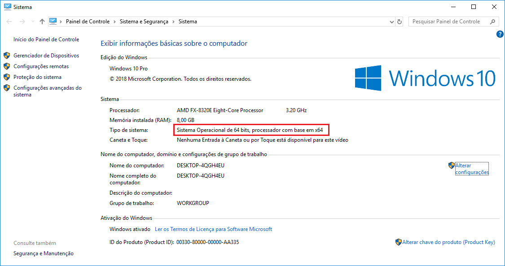

Com o fim do download basta dar **2 cliques** e o instalador será iniciado:

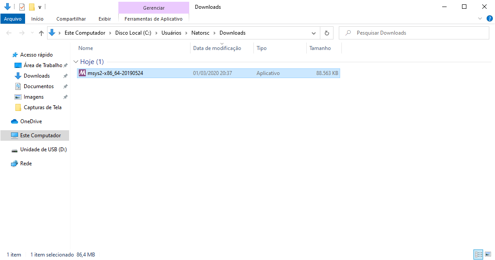

Na primeira tela que é exibida clique em **Next**:

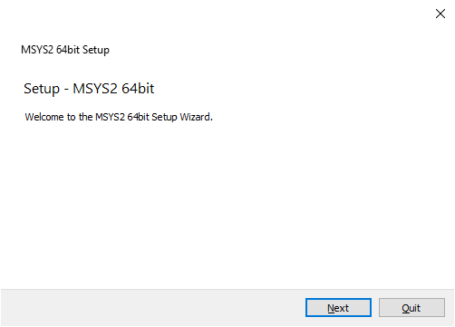

Agora podemos escolher onde o msys2 será instalado, **recomendo** que você deixe o caminho que é exibido no instalador. Clique em **Next**:

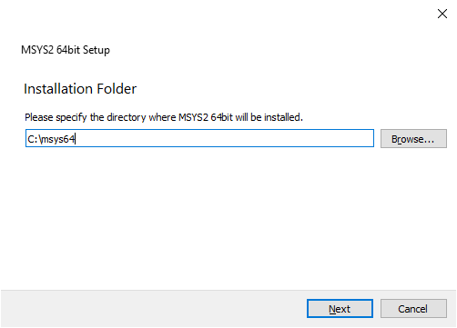

Na tela seguinte podemos escolher o nome do diretório no menu iniciar, novamente **recomendo** que você deixe o nome que é sugerido pelo instalador. Clique em **Next**:

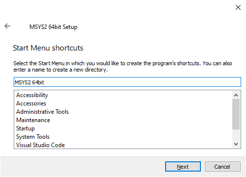

Com isso a instalação é iniciada, basta aguardar o final da mesma:

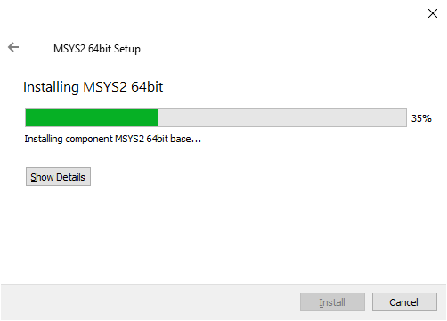

Com o final da instalação podemos iniciar o terminal do msys2, basta marcar a opção **Run MYSYS2 xxBit now** e clicar em **Finish**:


Assim que o terminal estiver aberto devemos iniciar a atualização dos pacotes, para isso execute o comando:

```bash
pacman -Syu
```

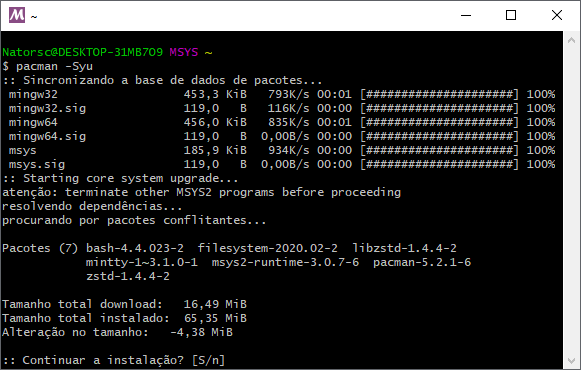

Com o fim da atualização pressione **Ctrl + C** e feche o terminal.

Após fechar o terminal o mesmo pode ser encontrado no menu iniciar do Windows. Selecione **MSYS2 MSYS**:

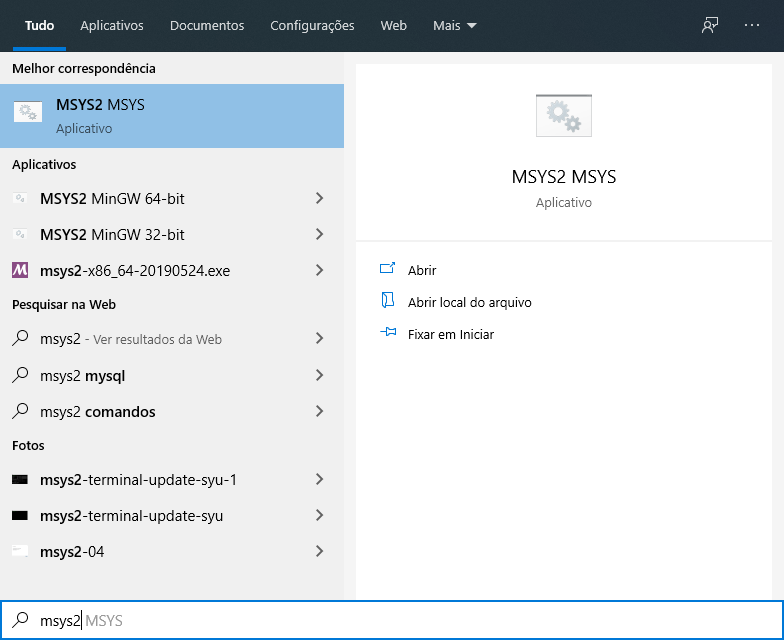

O aplicativo também pode ser localizado na pasta onde o msys2 foi instalado:

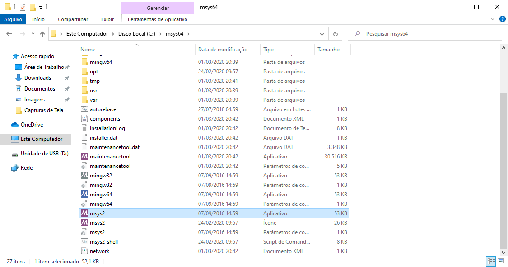

Com ele aberto vamos continuar as atualizações com o comando:

```bash
pacman -Su
```

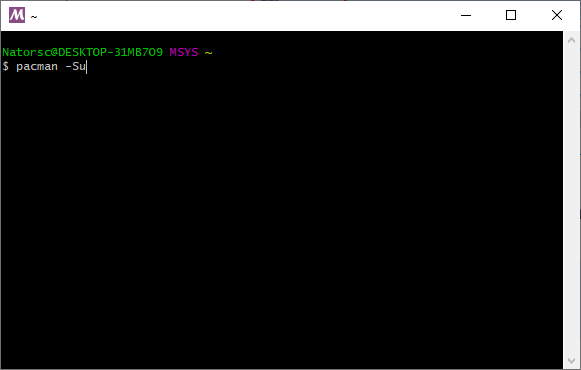

Com isso finalizamos o processo de atualização dos pacotes.

> Os comandos a cima são apenas para atualização, você pode executá-los sempre que se **julgar necessário**, **cuidado** apenas com atualizações de versão do Python, visto que isso pode quebrar o projeto.

A sintaxe básica para realizar uma instalação de pacote no msys2 é:

```bash
pacman -S NomeDoPacote
```

Para localizar algum pacote pode ser utilizando o comando:

```bash
pacman -Ss NomeDoPacote
```

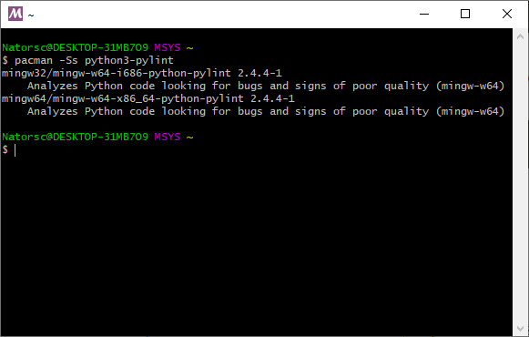

Por fim, vamos instalar o [Git](https://git-scm.com/) no msys2, para isso:

```bash
pacman -S git
```

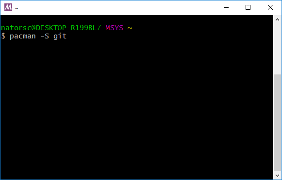

Se nenhum erro for retornado, o git estará disponível **dentro** do terminal do msys2.

Cabe destacar que na pasta onde o msys2 foi instalado, existe uma pasta chama **home** e dentro da mesma existe uma pasta com o **seu nome de usuário**:

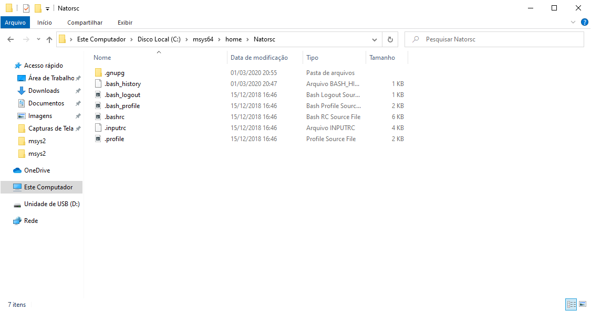

Pode ser muito interessante criar seus projetos dentro desta pasta, uma vez que o terminal do msys2 sempre abre essa localização quando inicia :wink:.