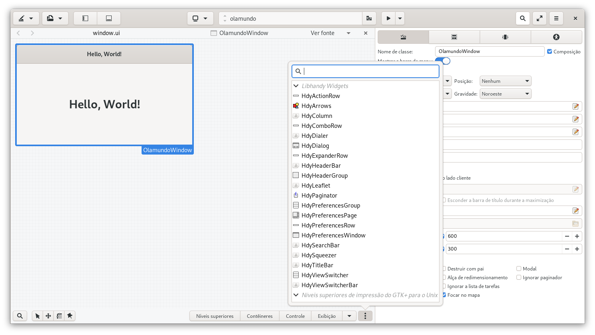

# Como instalar a biblioteca libhandy

Libhandy é a biblioteca apoiada pela Purism para uso em seu smartphone Librem 5 mais informações dessa biblioteca pode ser vistas no seu [Repositório oficial no GitLab](https://source.puri.sm/Librem5/libhandy).

Alguns exemplos de código podem ser vistos no meu Github, os arquivos estão na pasta `src > librem5-libhandy`, contudo os códigos contidos lá ainda estão em um estágio bem inicial.[Clique aqui](https://github.com/natorsc/gui-python-gtk).

## Fedora

> **OBS**: Testado no Fedora 31.

```bash
sudo dnf install libhandy libhandy-devel
```

## Ubuntu

> **OBS**: Testado no Ubuntu 19.04.

```bash
sudo apt install libhandy libhandy-dev
```

## Windows

> **OBS**: Instalação deve ser feita com o msys2. Para ver como instalar o msys2 [clique aqui](./install-msys2-windows.md).

```bash
pacman -S mingw-w64-x86_64-libhandy
```

Se a instalação estiver correta os widgets da libhandy irão aparecer no Gnome Glade:


> **OBS**: Não testado no Gnome Glade do Windows.

Bem como no Gnome Builder:



## Gnome Builder

No Gnome Builder as dependências são colocadas no arquivo de manifesto (manifest) que fica na raiz do projeto (arquivo json com o nome do projeto e dependências do projeto):

```json
{
    "name" : "libhandy", 
    "buildsystem" : "meson", 
    "config-opts" : [
        "-Dprofiling=false", 
        "-Dintrospection=enabled", 
        "-Dgtk_doc=false", 
        "-Dtests=false", 
        "-Dexamples=false", 
        "-Dvapi=false", 
        "-Dglade_catalog=disabled"
    ], 
    "sources" : [
        {
            "type" : "git", 
            "url" : "https://source.puri.sm/Librem5/libhandy.git"
        }
    ]
}
```

Após adicionar a biblioteca, basta executar o projeto e será exibido o log da instalação no terminal do Gnome Builder.

Com isso a biblioteca estará disponível **dentro** da sandbox do Flatpak