# Como Instalar o PyGObject for Windows (não recomendado)

O PyGObject é o binding que permite a comunicação entre a linguagem Python e o GTK 3, no Windows é **recomendada** a instalação através do **msys2**, contudo existe um instalador chamado **PyGObject for Windows**, porém:

-   Até o momento em que escrevo a ultima atualização do pacote é de 24/05/2017.
-   Você **DEVE** utilizar no máximo Python 3.4 ou **anterior**.

Para realizar a instilação através deste instalador você deve:

-   Fazer download da [versão 3.4 do Python](https://www.python.org/ftp/python/3.4.4/python-3.4.4.msi).
-   Fazer download do instalador do [PyGI/PyGObject](https://sourceforge.net/projects/pygobjectwin32/).

## Instalando o Python 3.4

Após a conclusão do download de **2 cliques** no arquivo **msi** (ou **exe** dependendo do formato que você escolheu), com isso o instalador será iniciado. Deixe a opção **Install for all user** marcada e clique em **Next**:

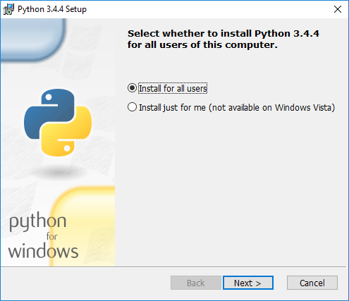

Agora o instalador nos permite alterar o local de instalação do Python 3.4, particularmente **recomendo** que você deixe a instalação em **C:\Python34** como é sugerido. Clique em **Next**:

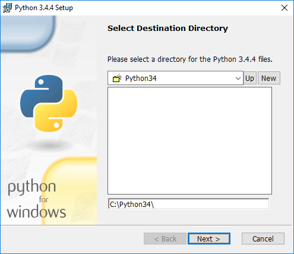

Na tela seguinte podemos selecionar o que será instalado, se você **não tem nenhuma** versão do Python instalada em seu computador **recomendo** que você marque a opção **Add python.exe to Path**, pois assim você conseguirá executar o comando python no **CMD** ou **PowerShell**. Clique em **Next**:

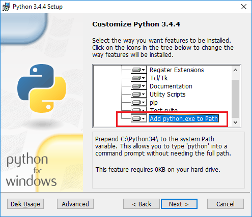

Aguarde até o final da instalação.

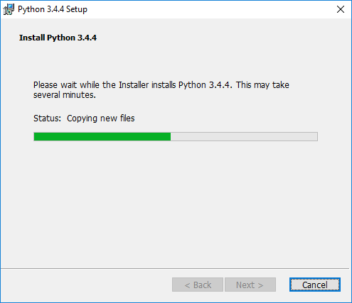

Com o fim da instalação basta clicar em **Finish**:

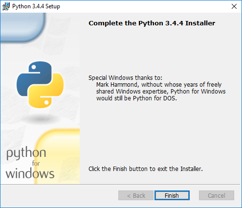

## PyGI/PyGObject

Assim como o pacote do Python basta dar **2 clique** sobre o pacote de instalação do **PyGI/PyGObject** para iniciar o instalador.

O instalador nos pergunta se estamos utilizando um versão portátil do Python, Clique em **No**.

> Caso o instalador não localize a sua instalação do **Python 3.4** basta clicar na opção **Add Path** e navegar até o caminho onde o Python 3.4 foi instalado (**C:\Python34**).

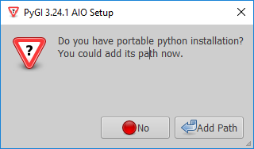

Na tela seguinte é exibida a instalação do Python que o instalador localizou. Se estiver correto clique em **Ok**.

> Caso o instalador duplique a informação exibida basta selecionar uma das opções oferecidas por ele.

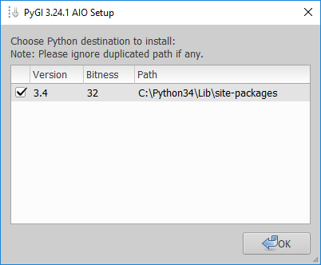

Agora podemos selecionar as bibliotecas do GTK 3, normalmente o pacote **Base packages** é suficiente. Se você já possui algum conhecimento ou sabe que irá utilizar algum dos pacotes que está na lista este é momento de selecioná-lo. Clique em **Next**:

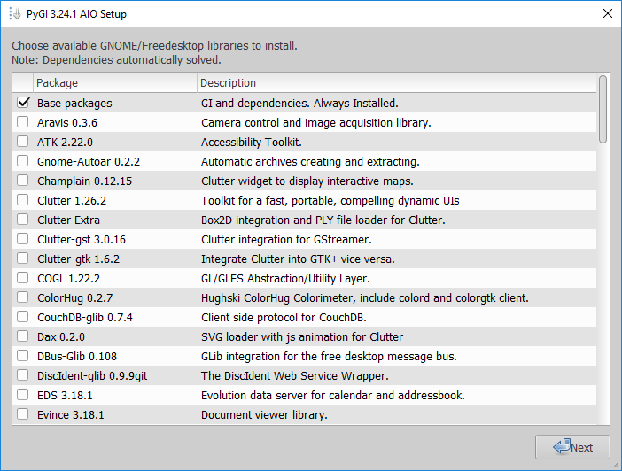

As bibliotecas que agora são exibidas **não** pertencem ao GNOME, se nenhuma delas lhe for familiar clique em **Next**:

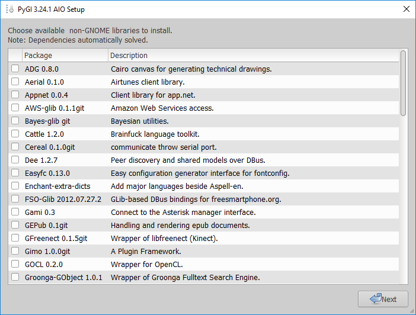

Na tela seguinte que é exibida, podemos selecionar os pacotes de desenvolvimento, **recomendo** que você selecione o pacote do **Glade**.

Com o Glade podemos construir interfaces gráficas de forma visual e posteriormente integrar essa interface com outras linguagens de programação. Clique em **Next**:

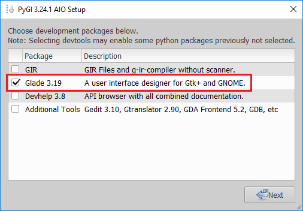

Por fim o instalador nos pergunta se desejamos realizar a instalação. Clique em **Yes**:

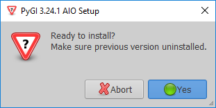

Aguarde até o final da instalação:

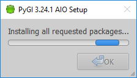

Como final da instalação clique em **Ok**:

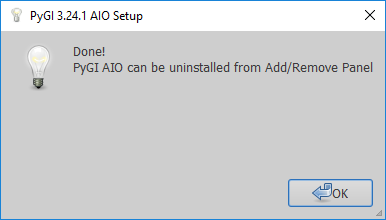

Para testar a instalação podemos abrir o **CMD** e executar:

python -c "import gi"

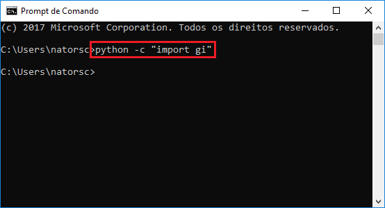

Se **nenhum erro** for exibido a instalação e configuração estão corretos.

Caso você tenha **mais de uma versão** do Python em seu computador e o Python 3.4 não for a padrão execute:

```bat
C:\Python34\python.exe -c "import gi"
```

Se nenhum erro for retornado a instalação está correta.