# Como Python no Linux e Windows

## Ubuntu

No Ubuntu pode-se instalar o Python com o comando:

```bash
sudo apt install python3 \
python3-dev \
python3-venv \
python3-pip \
python3-tk \
idle3
```

O comando acima irá instalar a versão que o repositório considera estável e essa versão pode variar dependendo da versão do Ubuntu.

Caso queira instalar uma versão especifica do Python primeiro verifique quais são as versões do Python que estão disponíveis nos repositórios.

Uma forma simples de fazer isso é digitar no terminal:

```bash
sudo apt install python3.
```

E pressionar **Tab** 2 vezes, com isso o terminal irá autocompletar e exibir as versões disponíveis:

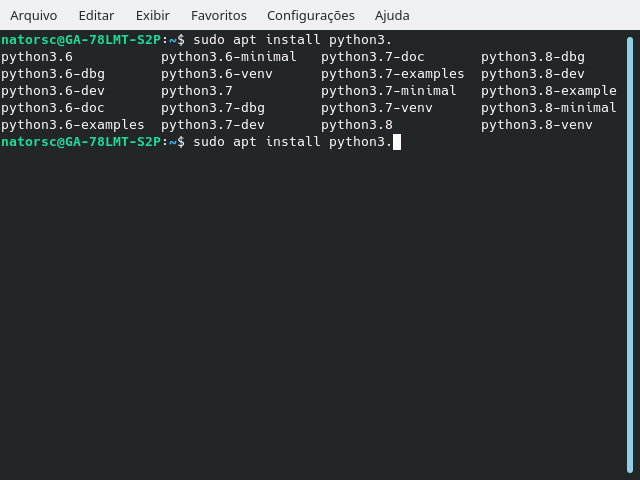

No caso estão disponíveis as versões 3.6, 3.7 e 3.8. Para realizar a instalação da versão 3.8, pode-se utilizar o seguinte comando:

```bash
sudo apt install python3.8 \
python3.8-dev \
python3.8-venv \
python3-pip \
python3-tk \
idle-python3.8
```

Para instalar outras versões, basta adequar o comando acima.

## Fedora

No fedora pode-se utilizar o comando:

```bash
sudo dnf install python3 python3-devel python3-tools
```

De forma similar ao que ocorre no Ubuntu, podemos instalar uma versão especifica do Python, para verificar se uma versão está disponível:

```bash
dnf search python38
```

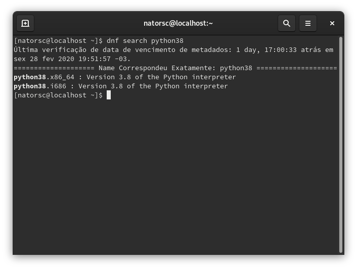

Após verificar se a versão está disponível:

```bash
sudo dnf install python38 python3-devel python3-tools
```

Vale lembrar que em **algumas distribuições Linux** o comando:

-   `python` faz referencia ao **Python 2**.
-   `python3` faz referencia ao **Python 3** que estiver definido como padrão do sistema.
-   Para executar uma versão especifica (caso tenha mais de uma no sistema) utilize o comando `python3.X`. O **X** representa o numero da versão (3.6, 3.7, etc).
-   `pip` irá instalar novos pacotes no **Python 2**.
-   `pip3` irá instalar novos pacotes no **Python 3**.

## Windows

No Windows a instalação é realizada através de um instalador do tipo **exe** o seu download pode ser realizado diretamente no [site oficial do Python](https://www.python.org/):

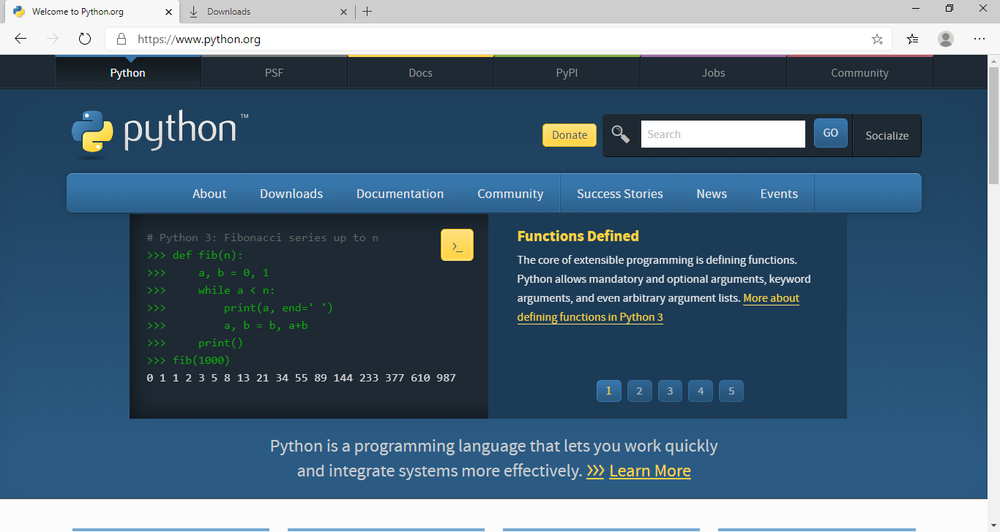

Escolha a versão **32** ou **64** bits de acordo com a arquitetura do seu sistema. Caso esteja em duvida baixe a **32 bits**:

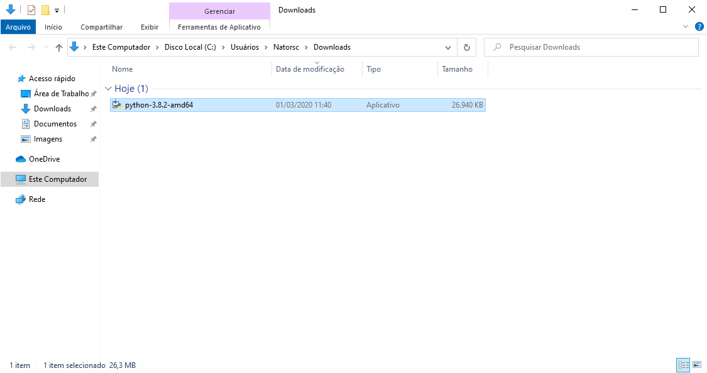

Com o fim do download de 2 cliques sobre o arquivo que foi baixado e será iniciado o instalador.

Nesta primeira tela podemos fazer uma instalação rápida clicando em **Install Now** ou fazer uma instalação personalizada clicando em **Customize installation**.

Particularmente recomendo a instalação **personalizada**, uma vez que ela permite escolher onde o Python será instalado.

Nesta primeira tela também é importante marcar a caixa **Add Python 3.X to PATH**. Essa opção irá configurar o caminho do interpretador Python no **path do Windows**, com isso o Python já estará disponível para uso ao final da instalação e configurações adicionais não serão necessárias:

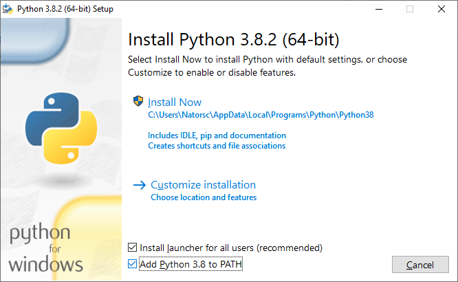

Na tela **Optional Features** todas as opções já vem marcadas, clique em **Next**:

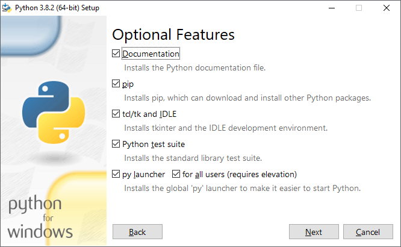

Tela **Advanced Options**, nessa tela é interessante marcar a opção **Install for all users** e eu **RECOMENDO** que você instale o Python em **C:\**, isso porque em alguns casos pode ser necessário acessar a pasta de instalação do Python e **C:\** costuma ser uma caminho simples para os usuários do sistema.

Clique em **Install**:

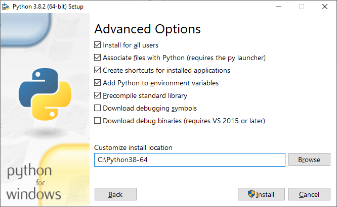

Aguarde o processo de instalação:

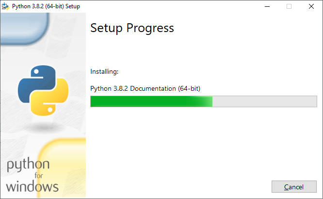

Se a instalação ocorrer sem problemas será exibida uma tela de sucesso.

Essa tela de sucesso pode exibir a opção **Disable path length limit** , se esta for a primeira vez que você está instalando o Python no sistema operacional, particularmente **recomendo** que você clique nessa opção. Ela irá desabilitar o limite de caracteres que o Windows tem.

Caso não queira desabilitar este limite basta clicar em **Close**:

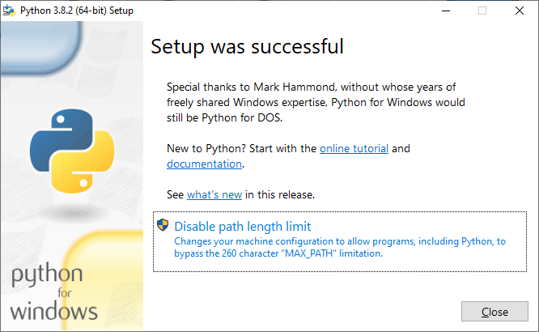

Após desabilitar o limite do path é exibida novamente a tela de sucesso, clique em **Close**:

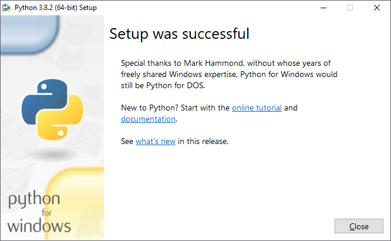

Para testar a instalação do Python basta abrir o **CMD**:

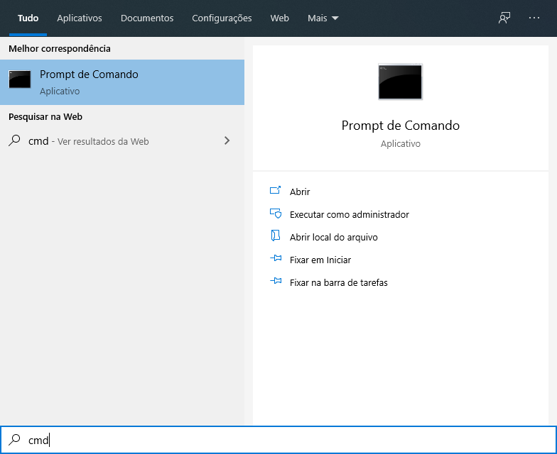

E digitar `python`:

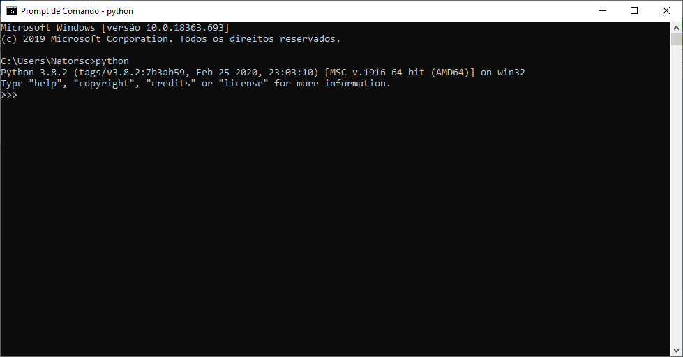

Se for aberto o modo **interativo** do Python a instalação está correta e funcionando sem problemas.

Também é possível localizar o o editor de texto **IDLE** e o **terminal do Python** através do menu inicial do Windows:

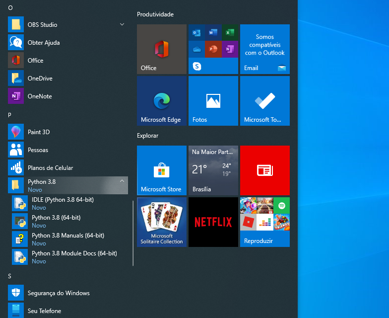

Com isso temos o Python instalado e configurado :blush:.