# Executando o PureOS (Phosh) via VM

> **OBS**: VM abreviação para **virtual machine** (máquina virtual).

A [Purism](https://puri.sm/) em seus notebooks e computadores utiliza o sistema operacional [PureOS](https://pureos.net/), o mesmo é uma distribuição Linux que utiliza como base o [Debian](https://www.debian.org/) juntamente com o ambiente de desktop [Gnome](https://www.gnome.org/).

Para o [Librem 5](https://puri.sm/products/librem-5/), que é um smartphone da empresa, é utilizada uma versão do PureOS que utilizar um protótipo de shell chamado [Phosh](https://source.puri.sm/Librem5/phosh) juntamente com um compositor que utiliza [Wayland](https://wayland.freedesktop.org/) chamado [Phoc](https://source.puri.sm/Librem5/phoc/).

Neste texto vamos ver como realizar o download do arquivo de disco e como utilizar este arquivo de disco no [Gnome Boxes](https://wiki.gnome.org/Apps/Boxes).

Veremos também que é possível utilizar essa VM para testar aplicativos construídos com [GTK](https://www.gtk.org/), em especifico aplicativos construídos com o [Gnome Builder](./install-gnome-builder.md) e empacotados em formato [Flatpak](https://flatpak.org/).

> Para saber mais sobre o Gnome Builder [clique aqui](./install-gnome-builder.md).

## Baixando o arquivo de disco

O primeiro passo para baixar o arquivo de disco que será utilizado no virtualizador é acessar o site de integração continua (CI server) do projeto:

[https://arm01.puri.sm/job/Images/job/Image%20Build/](https://arm01.puri.sm/job/Images/job/Image%20Build/)

Procure pelos históricos de builds que **estão em verde**:

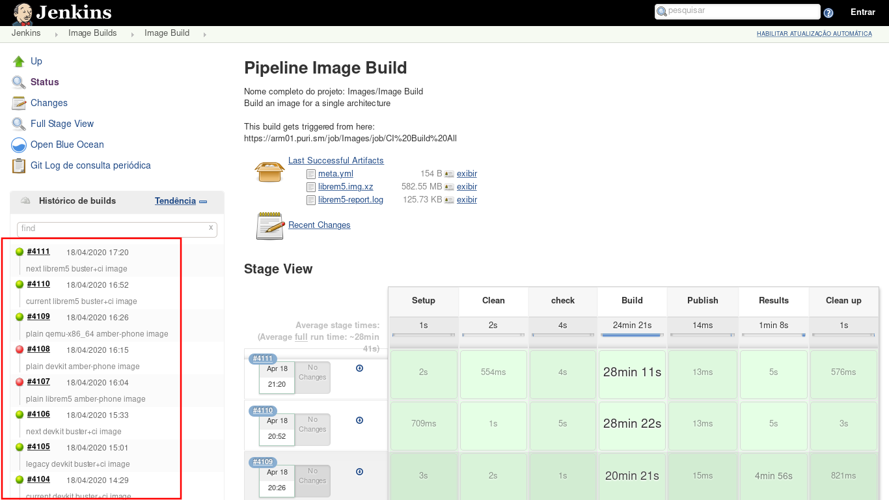

Ao acessar o histórico de builds procure por arquivos do tipo `qemu-x86_64.qcow2`, caso não encontre este arquivo basta clicar no botão **Previous Build**:

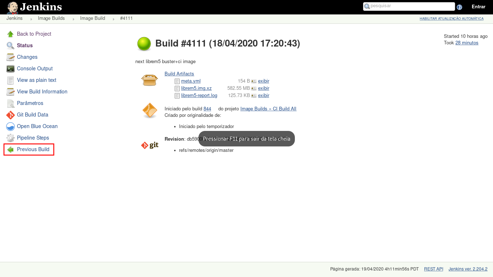

Ao localizar a imagem, basta fazer o download da mesma clicando sobre o nome:

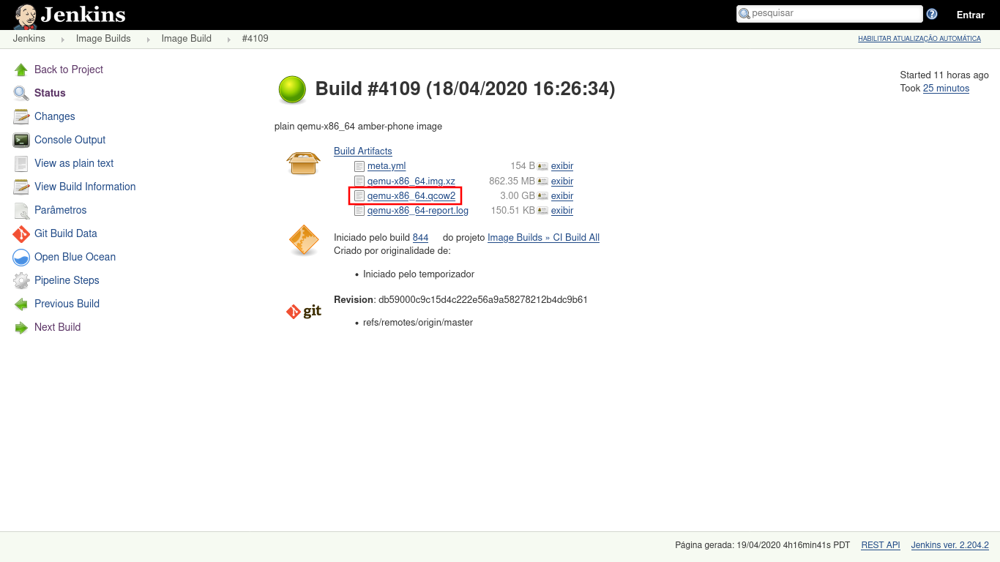

Como o arquivo é do tipo `qcow2` é interessante utilizar `KVM/QEMU` para a virtualização, duas boas opções de virtualizadores para este caso são:

- [Gnome Boxes](https://wiki.gnome.org/Apps/Boxes) (que vem com algumas distribuições Linux).
- [virt-manager](https://virt-manager.org/).

Como estou utilizando o [Fedora](https://getfedora.org/pt_BR/) o Gnome Boxes já vem instalado por padrão, neste caso basta clicar no **ícone de soma** (**+**) e selecionar a opção **Criar uma máquina virtual...**:

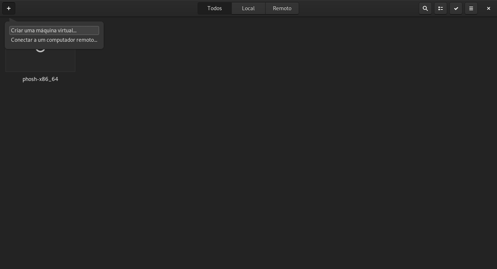

Em seguida clique na opção **Selecione um arquivo**:

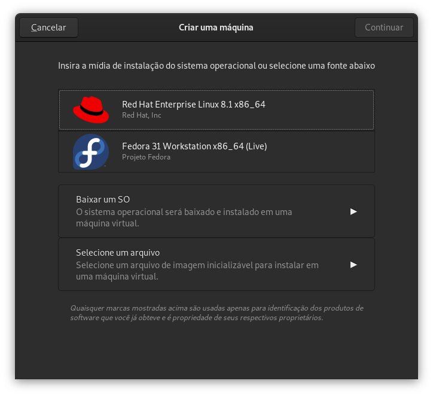

Navegue até a pasta onde está o arquivo `qemu-x86_64.qcow2` e clique em **Abrir**:

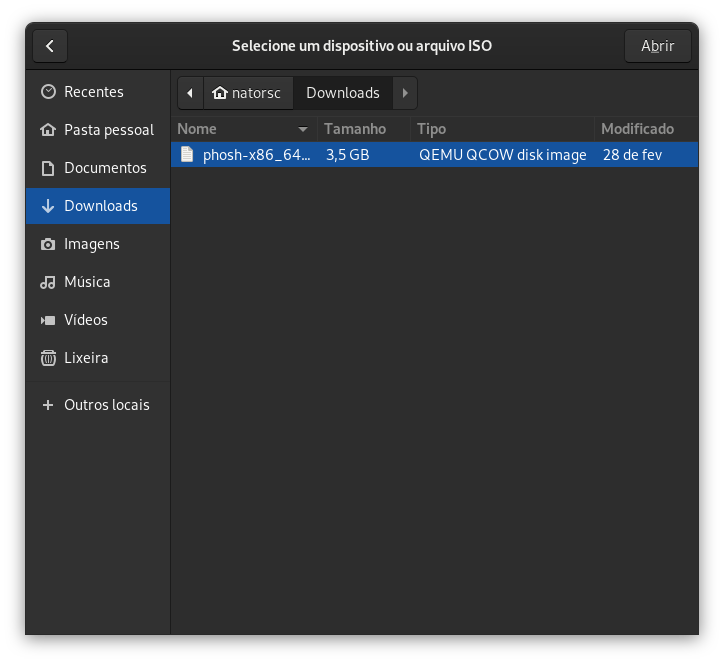

Agora é exibida a tela onde podemos configurar a quantidade de memória RAM que será utilizada pela máquina virtual, por padrão a mesma utiliza 2 GiB, o qual é um bom valor. Clique em **Criar**:

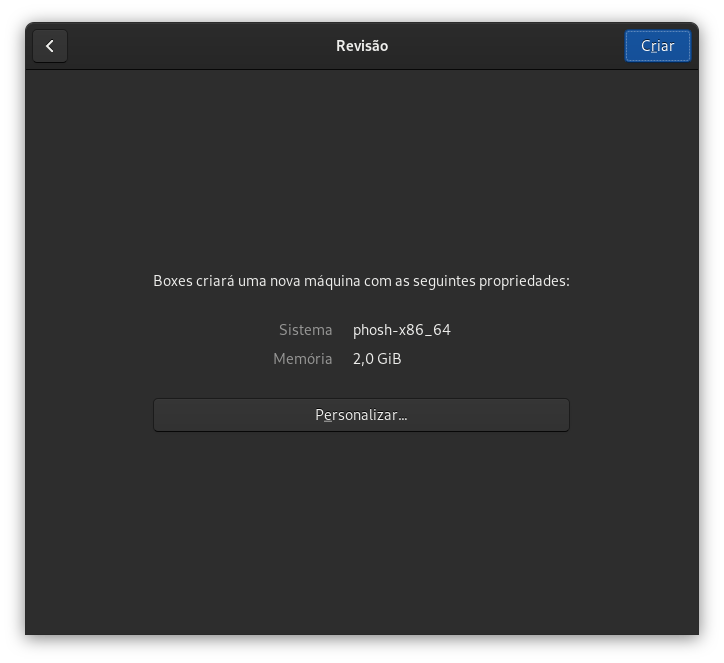

Aguarde **alguns minutos** até que seja exibida a tela de desbloqueio do sistema.

A senha para desbloqueio da tela é `123456`:

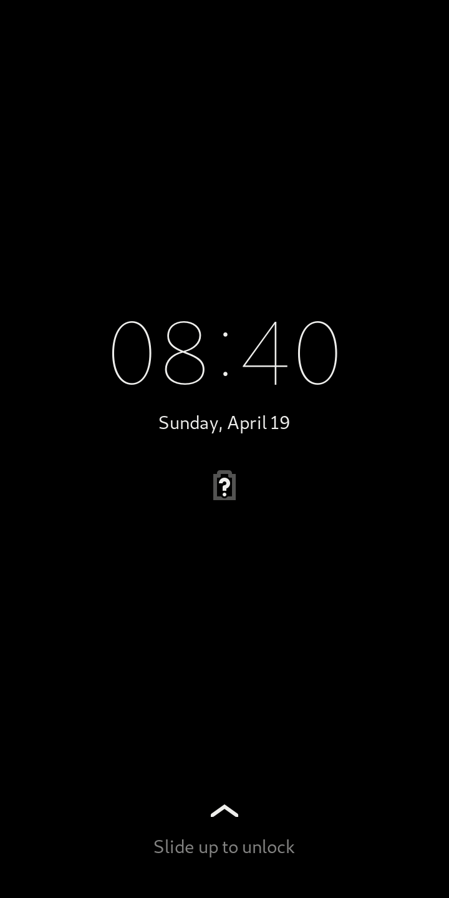

Ao realizar o desbloqueio é exibida a primeira tela de configuração, onde podemos definir o idioma para o sistema (por enquanto não está disponível o idioma português do brasil). Clique em **Next**:

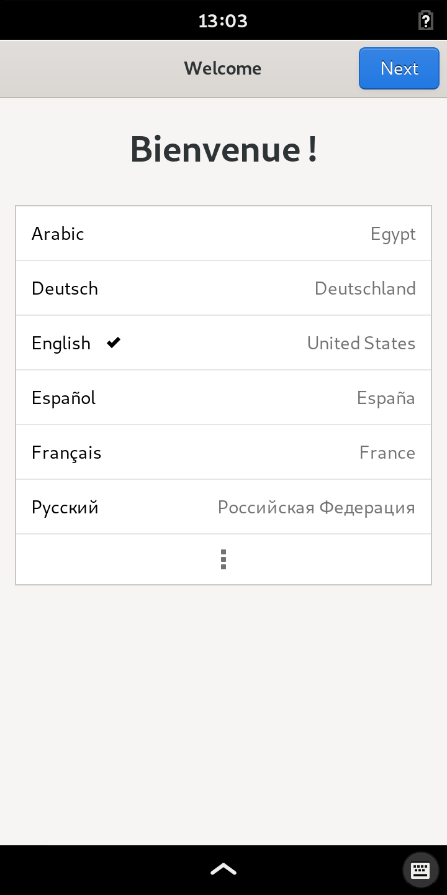

Logo em seguida temos a tela de configuração do teclado, selecione o mais adequado e clique em **Next**:

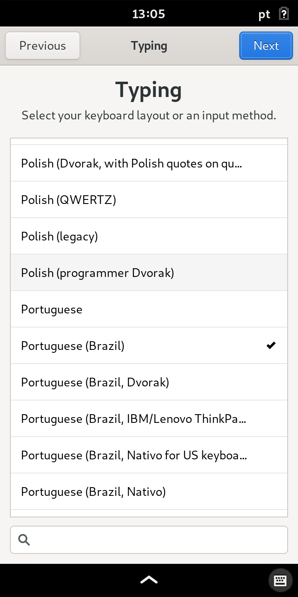

Agora podemos configurar a privacidade, marque as opções que julgar interessantes para a **sua privacidade**. Clique em **Next**:

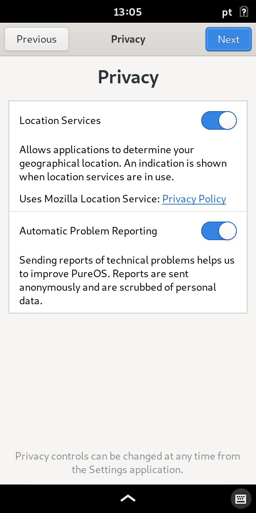

Caso queira configurar uma conta de **e-mail** ou do **NextCloud** este é o momento, caso contrario clique em **Skip**:

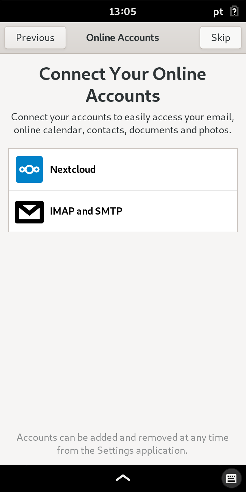

Por fim, clique em **Start Using your Librem 5** para começar a utilizar o sistema:

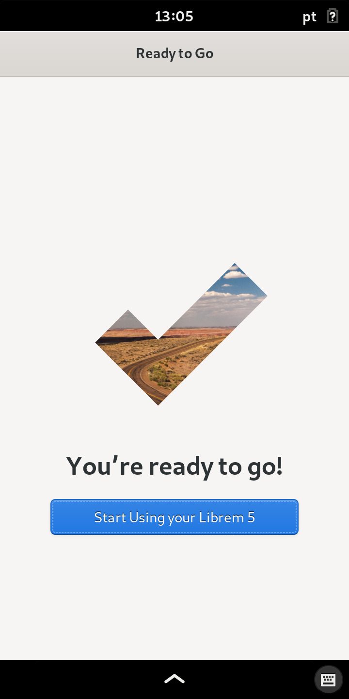

Com o fim das configurações temos a tela inicial do sistema, onde podem ser vistos alguns apps:

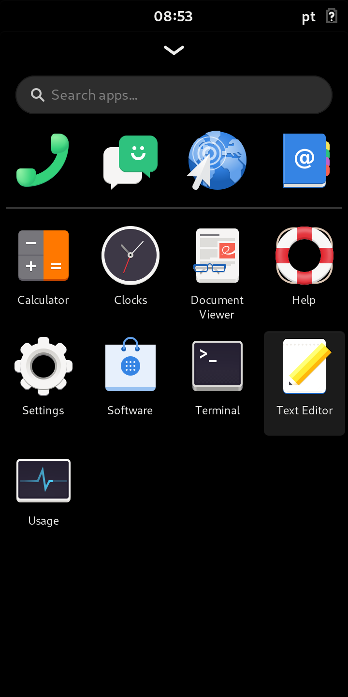

Ao clicar na região do relógio temos uma área de notificações e algumas configurações rápidas:

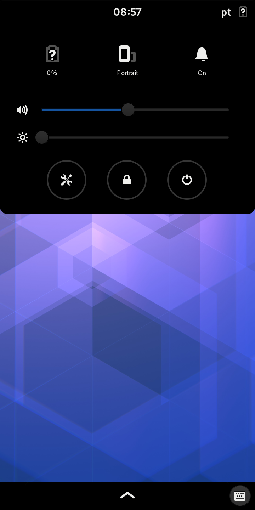

Assim como em sistemas Linux para desktop, podemos realizar diversas operações pelo terminal, basicamente são os mesmo comandos que se utilizariam em sistemas operacionais como Debian e Ubuntu:

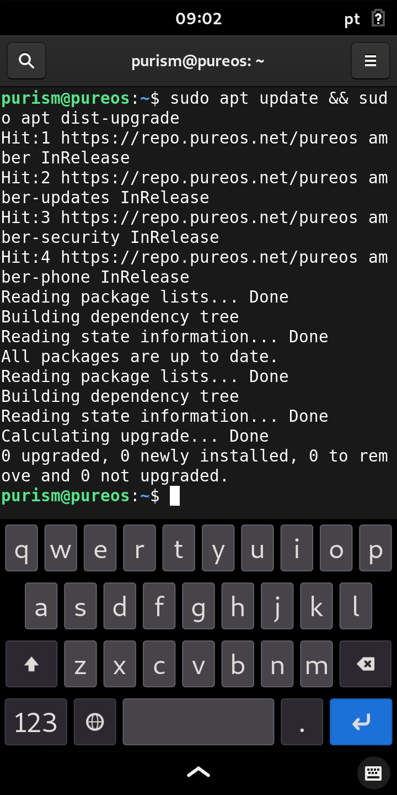

> **OBS**: Vale enfatizar que o **usuário padrão** é `purism` e a **senha** é `123456`.

Nos testes que realizei, a VM apresenta um comportamento bem estável e é muito interessante analisar a forma com que os aplicativos feitos com a biblioteca [libhandy](./install-purism-libhandy.md) (ou não) se comportam em telas pequenas.

## Deploy de um aplicativo na VM

O objetivo aqui **é apenas exemplificar** o processo de instalação de um aplicativo na VM.

Para isso vou utilizar o próprio aplicativo de exemplo que é criado quando se inciar um projeto no Gnome Builder.

> [Clique aqui](./install-gnome-builder.md) para ver como instalar e criar um projeto no Gnome Builder.

Criar um pacote Flatpak no Gnome Builder é extremamente simples, basta acessar o menu superior e clicar na opção **Exportar pacote**:

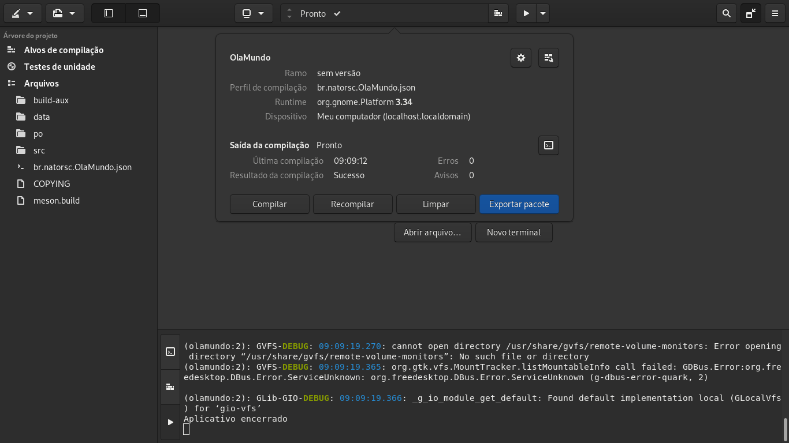

> **OBS**: Caso o botão não esteja disponível execute uma vez o projeto.

O processo de construção do pacote é exibido no terminal do Gnome Builder:

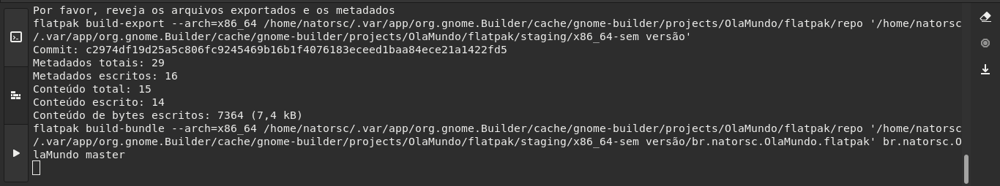

Com o final do processo uma janela contendo os arquivos **costuma** ser aberta:

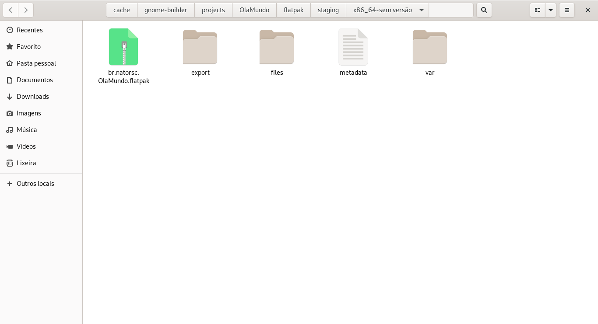

Caso a janela não abra, basta verificar no terminal do Gnome Builder o caminho onde os arquivos foram gerados.

O caminho padrão costuma ser:

```bash
~/.var/app/org.gnome.Builder/cache/gnome-builder/projects/NomeDoProjeto/flatpak/staging/
```

A copia do pacote Flatpak (`br.natorsc.OlaMundo.flatpak`) é feita com o comando `scp`, para utilizar esse comando é necessário saber o **IP** da VM.

Para isso basta abrir um terminal na VM e digitar o comando `ip a` ou mesmo `ip a | grep inet`:

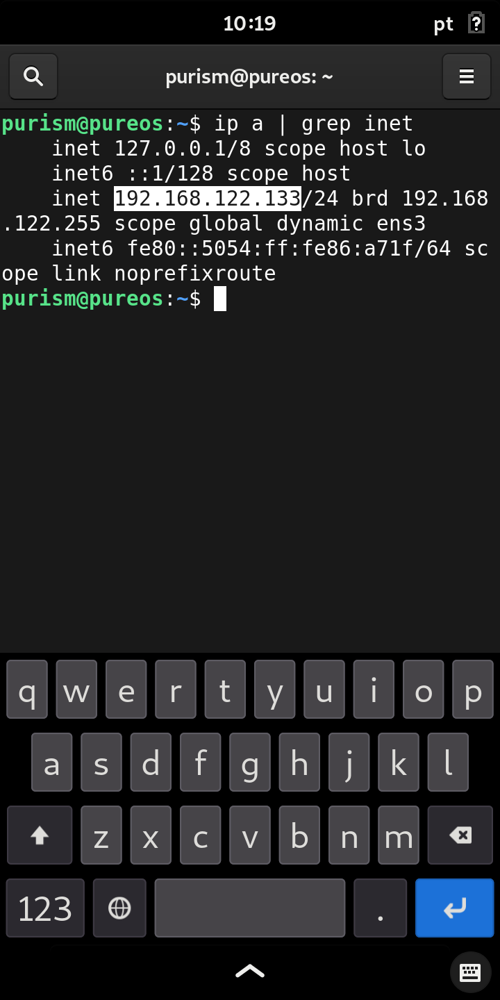

Vale notar que não é necessário utilizar apenas o terminal da VM, também é possível se conectar a mesma utilizando-se **SSH**:

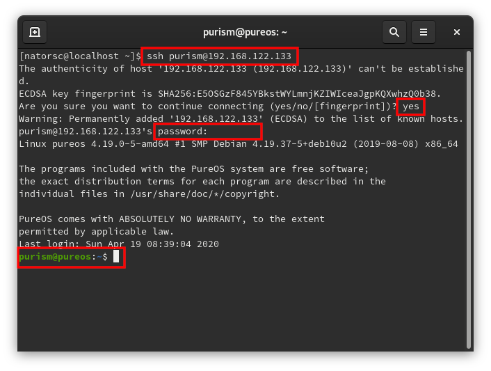

> **OBS**: Utilize a forma que lhe for mais confortável.

Ao descobrir o IP da VM **abra um terminal no mesmo diretório** onde está o pacote Flatpak (`br.natorsc.OlaMundo.flatpak`) e execute:

```bash
scp br.natorsc.OlaMundo.flatpak purism@192.168.122.133:~/
```

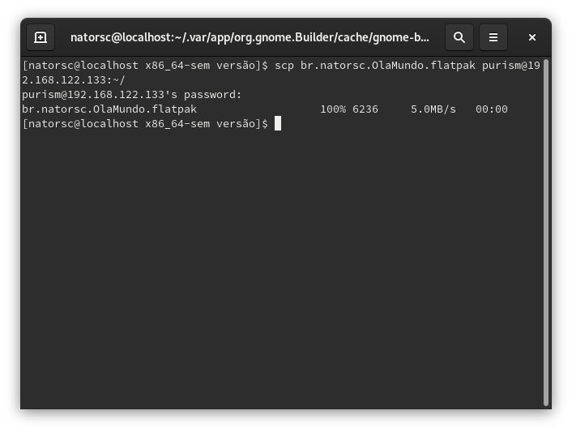

> **OBS**: Lembre-se de alterar o IP e o nome do pacote!

Após a cópia podemos verificar que o arquivo foi copiado para a VM utilizando o comando `ls`:

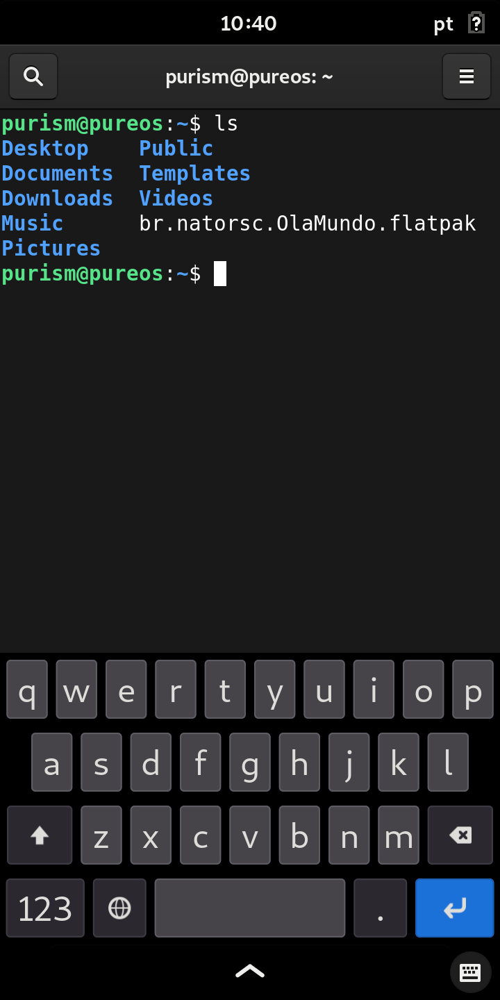

Agora que o aplicativo está na VM precisamos configurar o repositório [Flathub](https://flatpak.org/setup/) na VM, isso porque o aplicativo que copiamos no momento da instalação irá baixar o runtime e outros pacotes necessário para a sua execução.

O repositório Flathub pode ser adicionado utilizando-se:

```bash
flatpak remote-add --if-not-exists flathub https://flathub.org/repo/flathub.flatpakrepo
```

Para confirmar se o repositório foi adicionando:

```bash
flatpak remotes
```

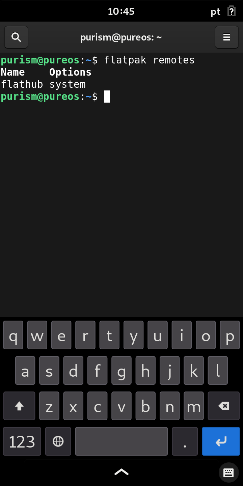

Com o repositório configurado podemos instalar o aplicativo com o comando:

```
flatpak install br.natorsc.OlaMundo.flatpak
```

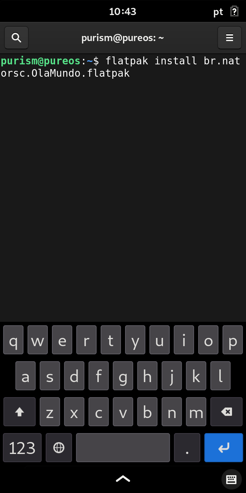

Digite a senha do usuário `purism` (`123456`):

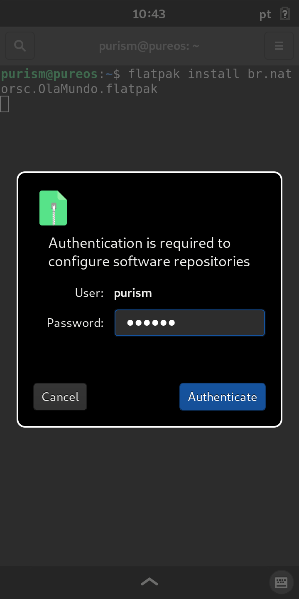

O instalador irá verificar e realizar o download do runtime necessário:

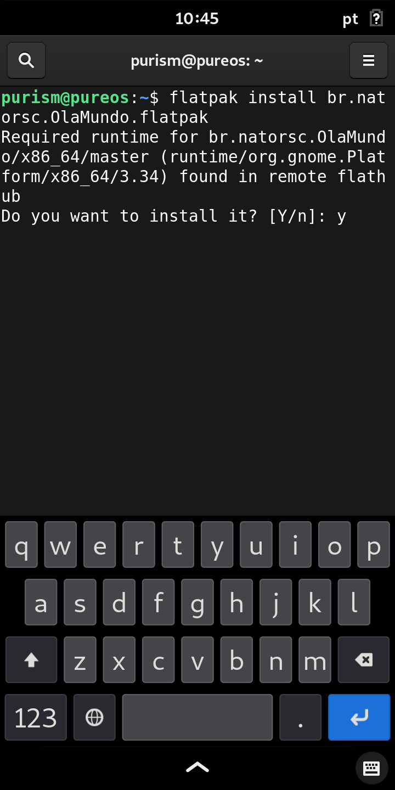

E de outros pacotes pacotes necessários para sua execução:

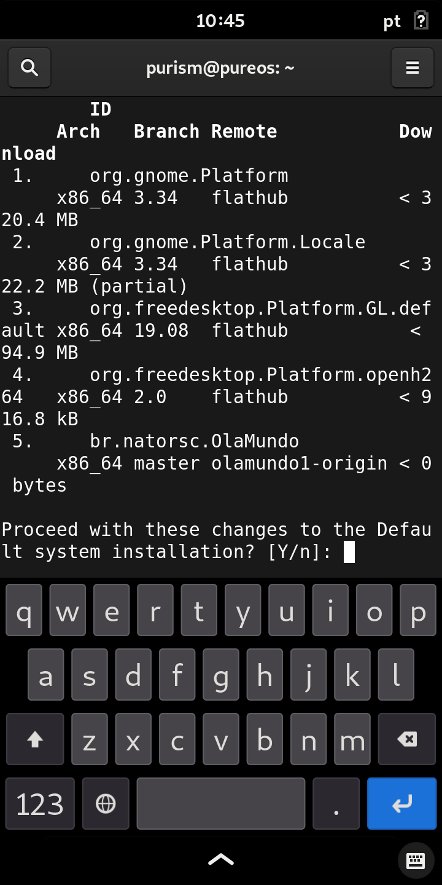

> Caso encontre um erro durante a instalação [clique aqui](#Erros)

A execução do aplicativo pode ser feita com o comando:

```bash
flatpak run br.natorsc.OlaMundo
```
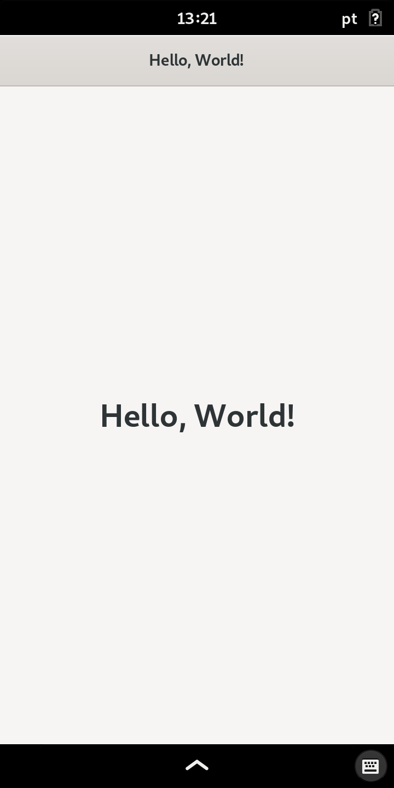

O aplicativo também pode ser executado pelo ícone que é exibido na tela inicial, caso o ícone não apareça na tela inicial reinicie a VM:

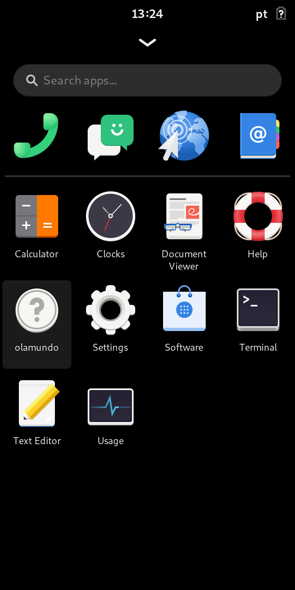

Com isso finalizamos esse passeio pelo PureOS com Phosh.

Caso encontre erros, ou mesmo inconsistências, entre em contato para que o conteúdo possa ser melhorado 🤓.

Dicas e criticas também são bem vindas 😁.

# Extra

## Erros

### Falta de espaço na VM

Ao tentar instalar o aplicativo na VM pode ser exibido o erro:

```bash
Error: Not enough disk space to complete this operation
```

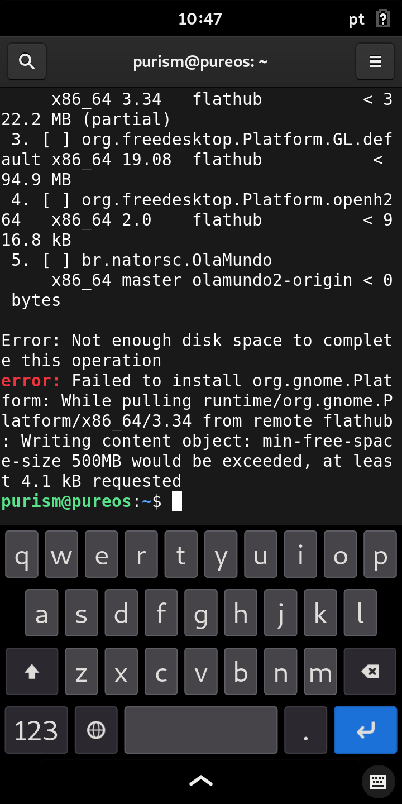

Este erro é porque o **tamanho da partição** está menor que o tamanho do disco virtual.

Para visualizar o tamanho do disco virtual ou até mesmo aumentar o seu tamanho basta acessar as configurações da VM:

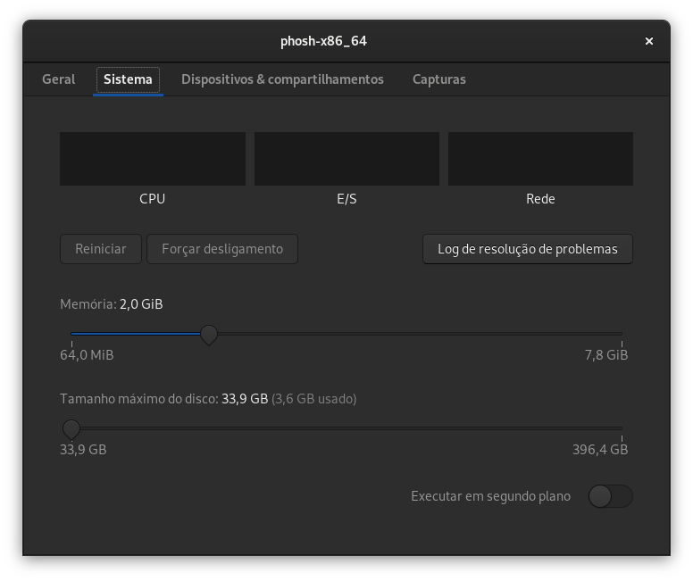

> **OBS**: Você não precisa aumentar o tamanho do disco ele é mais que suficiente o erro está no tamanho da partição.

Para corrigir (redimensionar) o tamanho da partição podemos utilizar uma imagem de boot do [Gparted](https://gparted.org/)

Para iniciar pela imagem do Gparted, basta acionar a mesma nas propriedades da VM:

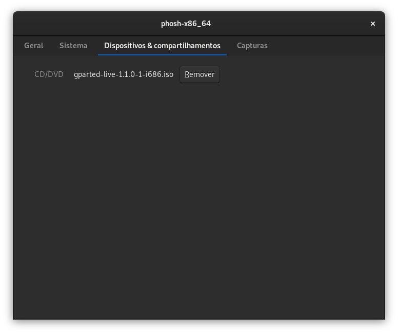

Ao iniciar a VM pressione `Esc` e em seguida pressione o numero `3` (No meu Gnome Boxes a unidade de CD/DVD está no 3):

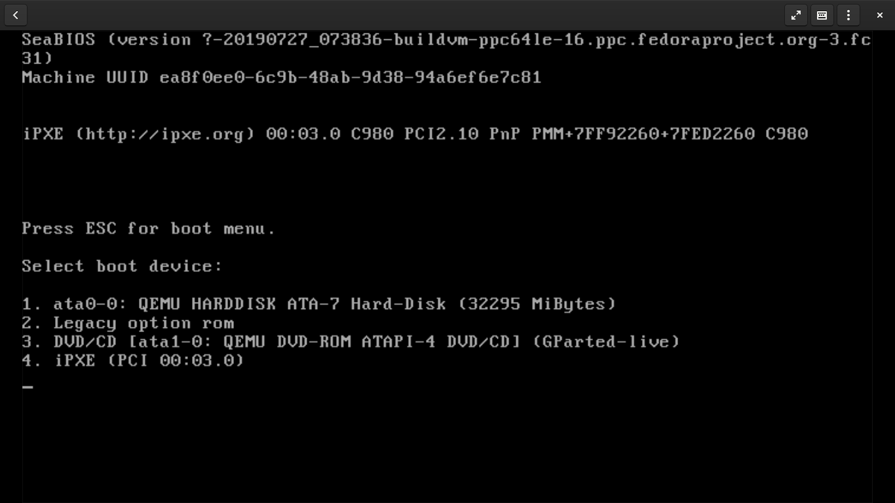

Como resultado temos:

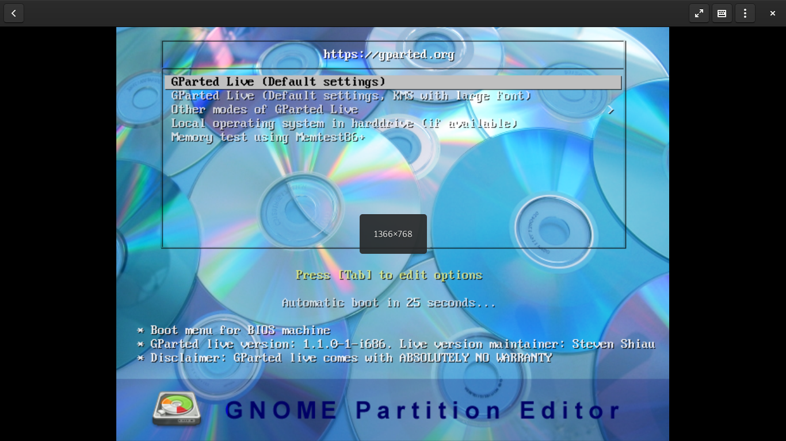

De boot normalmente e ao abrir o Gparted podemos verificar que a partição (`/dev/sda2` ⚠️) não está aproveitando todo o disco e é isso que está gerando o problema de espaço:

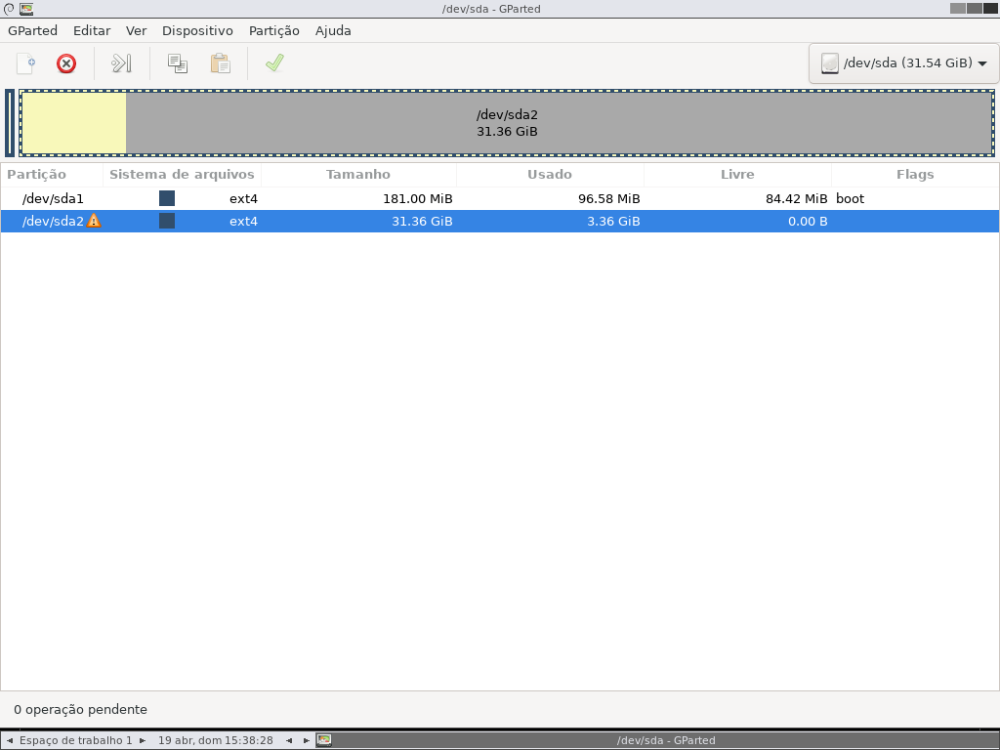

Para corrigir clique com o **botão direito** sobre a partição com alerta, clique em **Verificar** e depois no **botão de check verde** (✅) para realizar a operação:

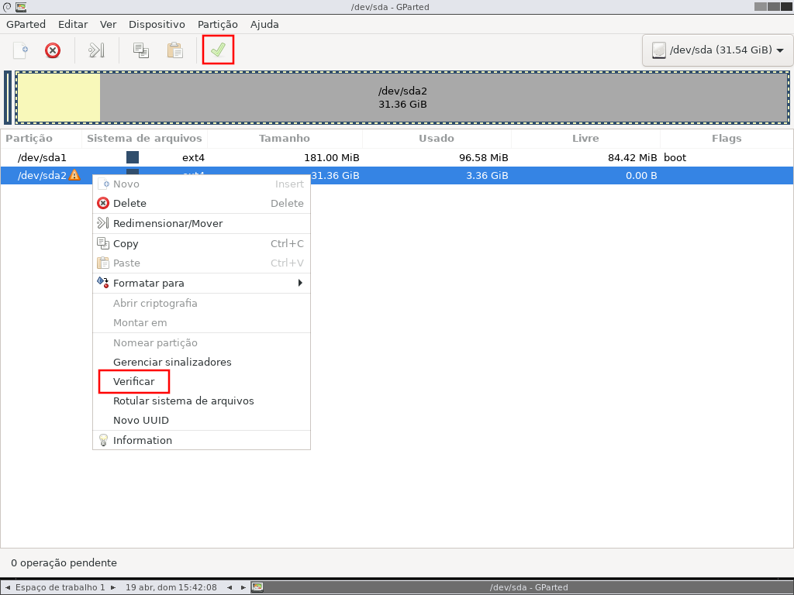

Após a verificação a partição já deve estar utilizando todo o espaço disponível:

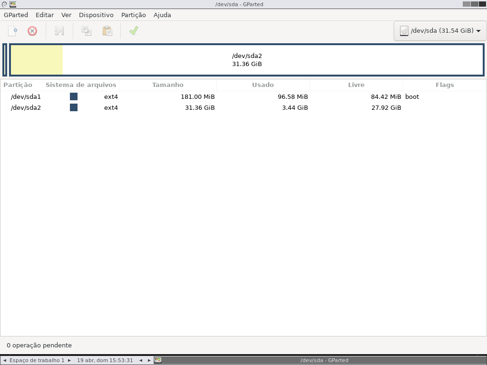

Desligue o Gparted e inicie novamente na VM.

Ao iniciar tente realizar a instalação novamente e a mesma deve ocorrer sem problemas 😎.