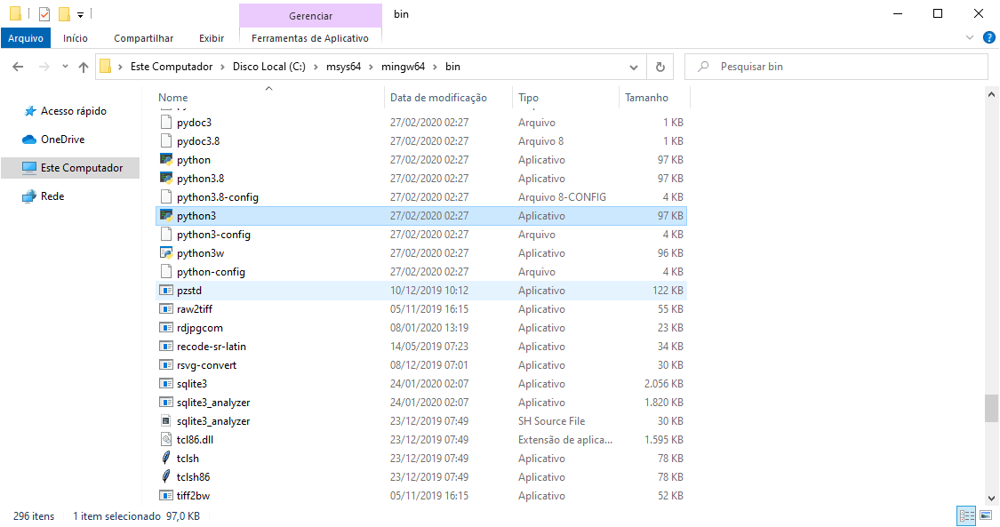
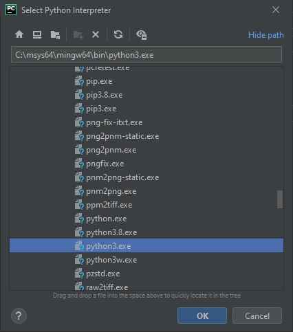
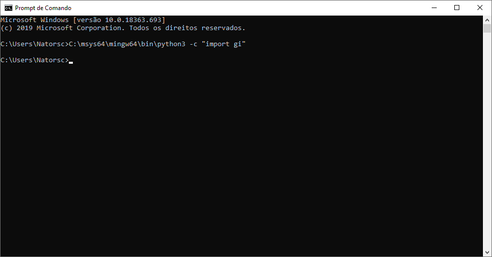
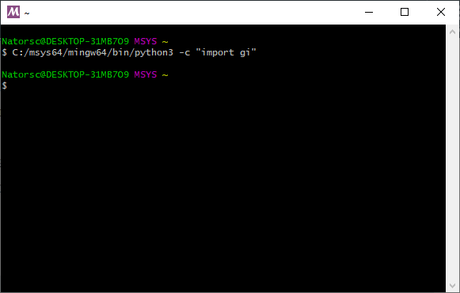
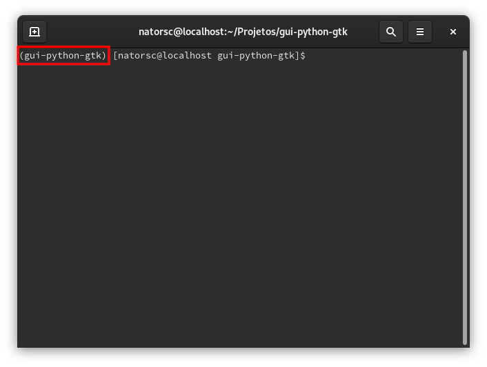

# Configurando o ambiente de desenvolvimento

Antes de iniciar você deve ter o Python instalado, se estiver utilizando Linux [clique aqui](install-python.md) para ver como instalar.

Caso esteja no Windows você deve ter o msys2 instalado, para ver como instalar [clique aqui](./install-msys2-windows.md).

> Os comandos apresentados contém bibliotecas que irão permitir a utilização do PyGObject diretamente na instalação local do Python, bem como, a instalação do mesmo dentro de um ambiente virtual.

## Fedora

``` bash
sudo dnf install \
gcc \
pkg-config \
python3-gobject \
cairo-devel \
cairo-gobject-devel \
gobject-introspection-devel \
gtk3
```

## Ubuntu

``` bash
sudo apt install \
python3-gi \
python3-gi-cairo \
libcairo2-dev \
libgirepository1.0-dev \
gir1.2-gtk-3.0
```

Para verificar se a instalação está correta, basta abrir um terminal e digitar o comando:

``` bash
python3 -c "import gi"
```

## Windows

``` bash
pacman -S \
mingw-w64-x86_64-gtk3 \
mingw-w64-x86_64-python3 \
mingw-w64-x86_64-python3-pip \
mingw-w64-x86_64-python3-gobject
```

O executável do Python pode ser localizado em um dos seguintes caminhos (desde que você tenha realizada a instalação padrão):

**Python 3**:

* `C:\msys32\mingw32\bin\python3.exe` .
* `C:\msys32\mingw64\bin\python3.exe` .
* `C:\msys64\mingw32\bin\python3.exe` .
* `C:\msys64\mingw64\bin\python3.exe` .



Este local (caminho) de instalação é importante, visto que o mesmo pode ser utilizado para configurar um **editor de texto** ou **IDE**:



Para testar a comunicação entre a linguagem Python e o GTK 3 podemos utilizar o CMD ou PowerShell do próprio Windows.

Para isso:

``` bat
C:\msys64\mingw64\bin\python3 -c "import gi"
```

> **OBS**: lembre-se de adequar o caminho conforme a sua instalação.

> **OBS**: Importante notar que está sendo executado o interpretador Python que está **dentro** da pasta do msys2 e não alguma versão do Python que esteja instalada no sistema operacional!



Também é possível utilizar o próprio terminal do msys2, para isso:

``` bash
C:/msys64/mingw64/bin/python3 -c "import gi"
```



Se nenhum erro for retornando a instalação e configuração estão corretas.

## Como instalar o PyGObject no ambiente virtual

> **OBS**: Até o momento em que escrevo **não** é possível instalar o pacote **pygobject** dentro de um ambiente virtual no Windows. Ou pelo menos eu não consegui.

Este texto descreve a utilização do `venv` , todavia podem ser utilizadas outras ferramentas como:

* pipenv.
* pyenv.
* virtualenv.
* etc.

Para realizar a criação de um ambiente virtual utiliza-se a sintaxe:

``` bash
python3 -m venv NomeDoAmbiente
```

ou

``` 
python3. X -m venv NomeDoAmbiente
```

Para se criar um ambiente virtual com uma versão especifica do Python. Lembre-se de substituir o **X** pela versão que deseja utilizar (3.6, 3.7, 3.8, etc).

Os nomes mais comuns utilizados em ambientes virtual no Python são:

* `.venv`.
* `venv`.
* `VENV`.
* `.env`.
* `env`.
* `ENV`.

Ao se utilizar um destes nomes muitos **editores de texto** ou **IDEs** costumam reconhecer de forma automática o ambiente, entretanto o ambiente pode ter outro nome qualquer.

> **OBS**: Repare que o ambiente virtual **é criado no local onde o terminal está aberto**, no entanto ao se utilizar outras ferramentas este local **pode variar**!

Com o ambiente criado, realizamos a ativação do mesmo com o comando:

``` bash
source NomeDoAmbiente/bin/activate
```

Ao ser ativo o **nome** do ambiente virtual **DEVERÁ** aparecer no inicio da linha do terminal:



> **OBS**: Lembre-se de **sempre** ativar o ambiente virtual, caso contrario a instalação dos módulos, pacotes e bibliotecas serão realizados na instalação **principal/local** do Python e não dentro do ambiente virtual.

Com o ambiente **ativo** é recomendada a instalação/atualização de alguns pacotes, para isso:

``` bash
pip install --upgrade pip setuptools wheel
```

Por fim é realizada a instalação do PyGObject com o comando:

``` bash
pip install pygobject pygobject-stubs
```

Para testar a comunicação entre Python e GTK, execute:

``` bash
python -c 'import gi'
```

Se o comando não retornar **nenhum erro** a instalação e configuração estão corretas.