:og:description: Exemplos de código da utilização dos widgets da biblioteca libadwaita (GTK 4) com a linguagem de programação Python (PyGObject).

.. meta::
   :description: Exemplos de código da utilização dos widgets da biblioteca libadwaita (GTK 4) com a linguagem de programação Python (PyGObject).
   :keywords: GTK, GTK 4, Python, PyGObject, XML, Blueprint, libadwaita

Libadwaita Widgets
==================

.. danger::

   Ao se utilizar a biblioteca ``libadwaita`` juntamente com arquivos de interface (``*.ui``) é **obrigatório** o uso de ``Adw.init()`` no código.

Adw AboutWindow
---------------

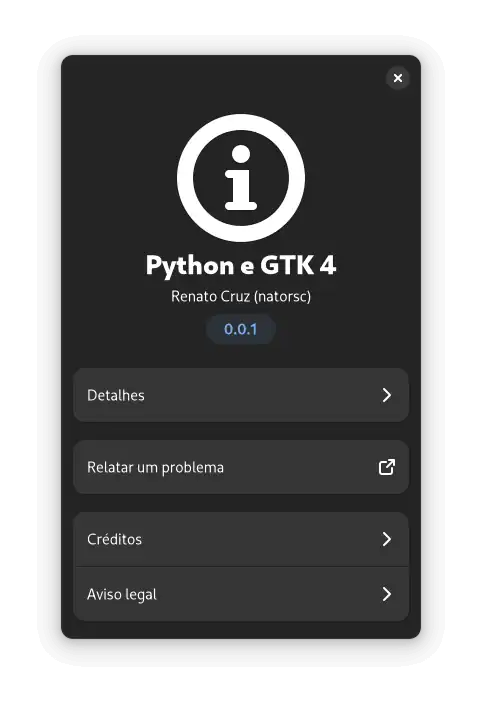

   Python e GTK 4: PyGObject libadwaita Adw.AboutWindow().

.. tab:: Python

    ..  literalinclude:: ../../src/gtk4-libadwaita-widgets/aboutwindow/MainWindow.py

--------------

Adw ActionRow
-------------

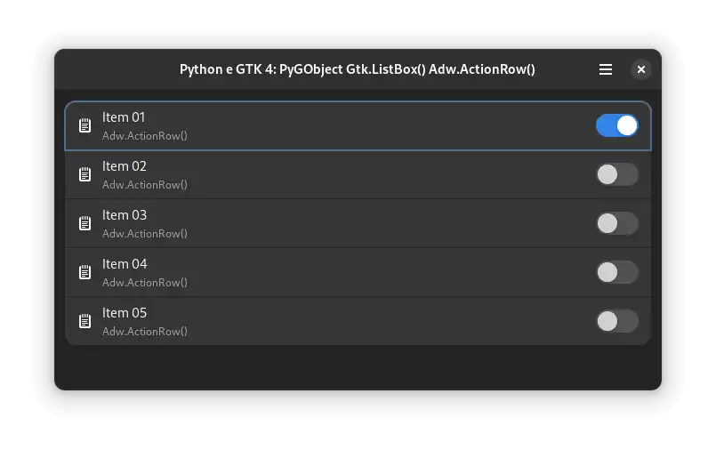

   Python e GTK 4: PyGObject libadwaita Adw.ActionRow().

.. tab:: Python

    ..  literalinclude:: ../../src/gtk4-libadwaita-widgets/action-row/MainWindow.py

.. tab:: UI

    ..  literalinclude:: ../../src/gtk4-libadwaita-widgets/action-row/ui/MainWindow.ui
      :language: html

.. tab:: Blueprint

    ..  literalinclude:: ../../src/gtk4-libadwaita-widgets/action-row/ui/MainWindow.blp

--------------

Adw Application
---------------

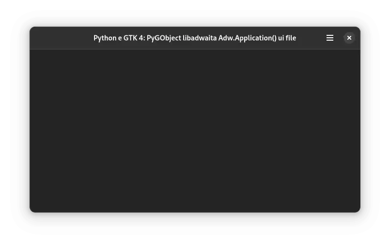

   Python e GTK 4: PyGObject libadwaita Adw.Application().

.. tab:: Python

    ..  literalinclude:: ../../src/gtk4-libadwaita-widgets/application/MainWindow.py

.. tab:: UI

    ..  literalinclude:: ../../src/gtk4-libadwaita-widgets/application/ui/MainWindow.ui
      :language: html

.. tab:: Pythonb

    ..  literalinclude:: ../../src/gtk4-libadwaita-widgets/application/ui/MainWindow.blp

--------------

Adw Avatar
----------

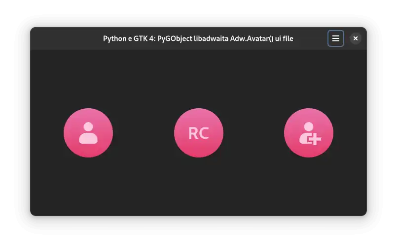

   Python e GTK 4: PyGObject libadwaita Adw.Avatar().

.. tab:: Python

    ..  literalinclude:: ../../src/gtk4-libadwaita-widgets/avatar/MainWindow.py

.. tab:: UI

    ..  literalinclude:: ../../src/gtk4-libadwaita-widgets/avatar/ui/MainWindow.ui
      :language: html

.. tab:: Blueprint

    ..  literalinclude:: ../../src/gtk4-libadwaita-widgets/avatar/ui/MainWindow.blp

--------------

Adw ButtonContent
-----------------

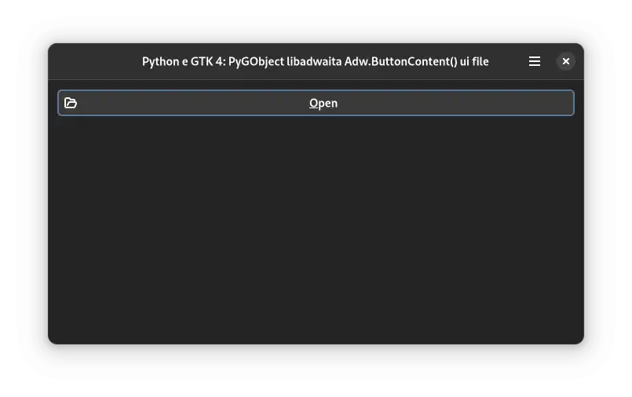

   Python e GTK 4: PyGObject libadwaita Adw.ButtonContent().

.. tab:: Python

    ..  literalinclude:: ../../src/gtk4-libadwaita-widgets/button-content/MainWindow.py

.. tab:: UI

    ..  literalinclude:: ../../src/gtk4-libadwaita-widgets/button-content/ui/MainWindow.ui
      :language: html

.. tab:: Blueprint

    ..  literalinclude:: ../../src/gtk4-libadwaita-widgets/button-content/ui/MainWindow.blp

--------------

Adw Carousel
------------

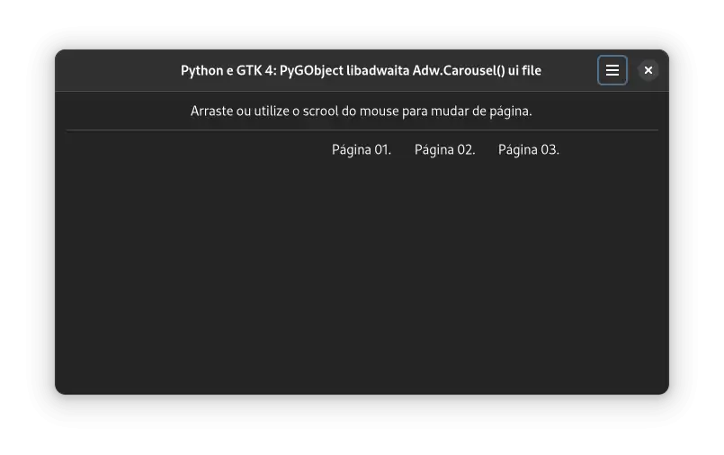

   Python e GTK 4: PyGObject libadwaita Adw.Carousel().

.. tab:: Python

    ..  literalinclude:: ../../src/gtk4-libadwaita-widgets/carousel/MainWindow.py

.. tab:: UI

    ..  literalinclude:: ../../src/gtk4-libadwaita-widgets/carousel/ui/MainWindow.ui
      :language: html

.. tab:: Blueprint

    ..  literalinclude:: ../../src/gtk4-libadwaita-widgets/carousel/ui/MainWindow.blp

--------------

Adw CarouselIndicatorDots
-------------------------

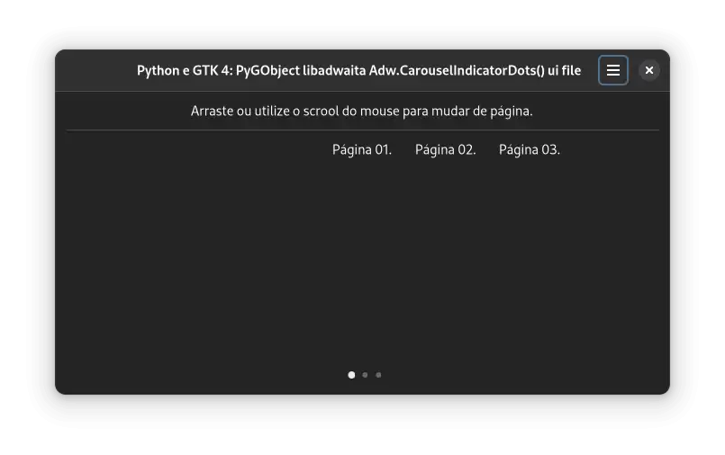

   Python e GTK 4: PyGObject libadwaita Adw.CarouselIndicatorDots().

.. tab:: Python

    ..  literalinclude:: ../../src/gtk4-libadwaita-widgets/carousel-indicator-dots/MainWindow.py

.. tab:: UI

    ..  literalinclude:: ../../src/gtk4-libadwaita-widgets/carousel-indicator-dots/ui/MainWindow.ui
      :language: html

.. tab:: Blueprint

    ..  literalinclude:: ../../src/gtk4-libadwaita-widgets/carousel-indicator-dots/ui/MainWindow.blp

--------------

Adw CarouselIndicatorLines
--------------------------

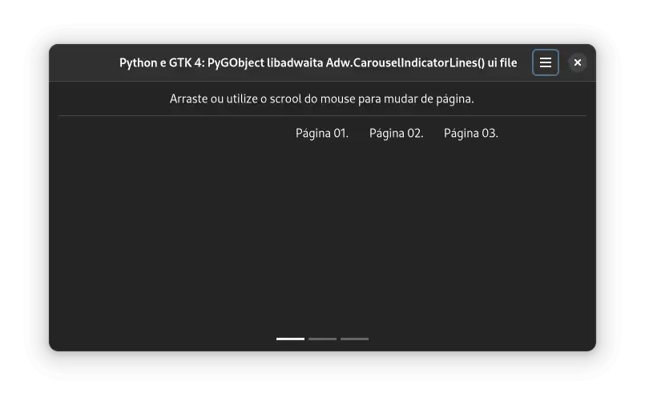

   Python e GTK 4: PyGObject libadwaita Adw.CarouselIndicatorLines().

.. tab:: Python

    ..  literalinclude:: ../../src/gtk4-libadwaita-widgets/carousel-indicator-lines/MainWindow.py

.. tab:: UI

    ..  literalinclude:: ../../src/gtk4-libadwaita-widgets/carousel-indicator-lines/ui/MainWindow.ui
      :language: html

.. tab:: Blueprint

    ..  literalinclude:: ../../src/gtk4-libadwaita-widgets/carousel-indicator-lines/ui/MainWindow.blp

--------------

Adw Clamp
---------

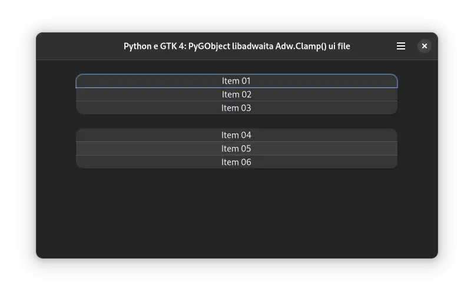

   Python e GTK 4: PyGObject libadwaita Adw.Clamp().

.. tab:: Python

    ..  literalinclude:: ../../src/gtk4-libadwaita-widgets/clamp/MainWindow.py

.. tab:: UI

    ..  literalinclude:: ../../src/gtk4-libadwaita-widgets/clamp/ui/MainWindow.ui
      :language: html

.. tab:: Blueprint

    ..  literalinclude:: ../../src/gtk4-libadwaita-widgets/clamp/ui/MainWindow.blp

--------------

Adw ColorScheme
---------------

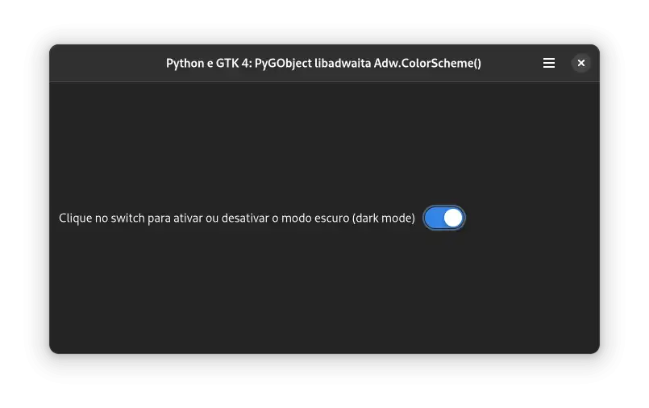

   Python e GTK 4: PyGObject libadwaita Adw.ColorScheme().

.. tab:: Python

    ..  literalinclude:: ../../src/gtk4-libadwaita-widgets/colorscheme/MainWindow.py

.. tab:: UI

    ..  literalinclude:: ../../src/gtk4-libadwaita-widgets/colorscheme/ui/MainWindow.ui
      :language: html

.. tab:: Blueprint

    ..  literalinclude:: ../../src/gtk4-libadwaita-widgets/colorscheme/ui/MainWindow.blp

--------------

Adw ComboRow
------------

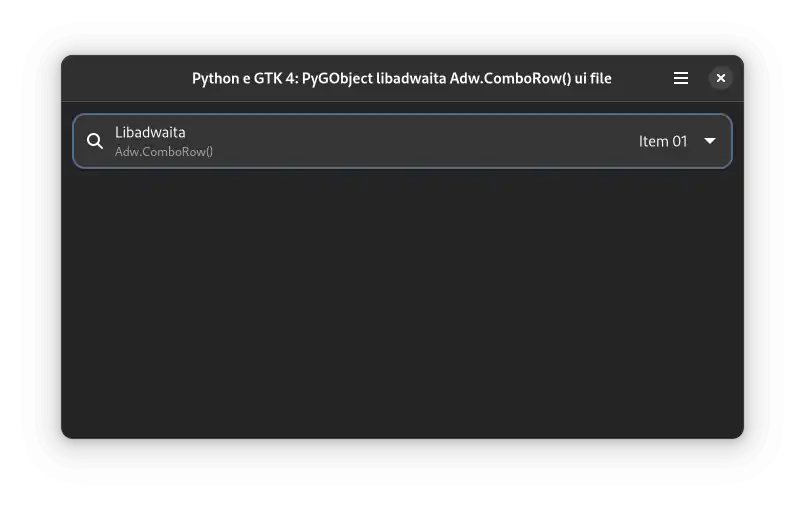

   Python e GTK 4: PyGObject libadwaita Adw.ComboRow().

.. tab:: Python

    ..  literalinclude:: ../../src/gtk4-libadwaita-widgets/comborow/MainWindow.py

.. tab:: UI

    ..  literalinclude:: ../../src/gtk4-libadwaita-widgets/comborow/ui/MainWindow.ui
      :language: html

--------------

Adw EntryRow
------------

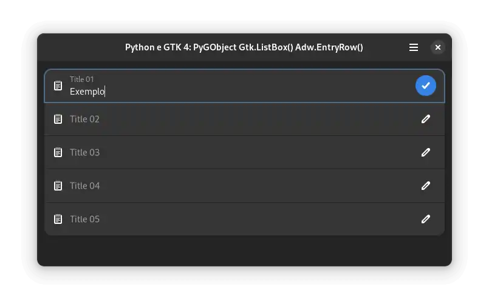

   Python e GTK 4: PyGObject Gtk.ListBox() Adw.EntryRow().

.. tab:: Python

    ..  literalinclude:: ../../src/gtk4-libadwaita-widgets/entry-row/MainWindow.py

.. tab:: UI

    ..  literalinclude:: ../../src/gtk4-libadwaita-widgets/entry-row/ui/MainWindow.ui
      :language: html

.. tab:: Blueprint

    ..  literalinclude:: ../../src/gtk4-libadwaita-widgets/entry-row/ui/MainWindow.blp

--------------

Adw ExpanderRow
---------------

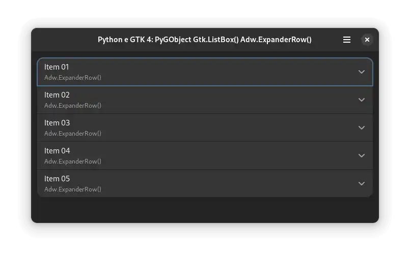

   Python e GTK 4: PyGObject Gtk.ListBox() Adw.ExpanderRow().

.. tab:: Python

    ..  literalinclude:: ../../src/gtk4-libadwaita-widgets/expander-row/MainWindow.py

.. tab:: UI

    ..  literalinclude:: ../../src/gtk4-libadwaita-widgets/expander-row/ui/MainWindow.ui
      :language: html

.. tab:: Blueprint

    ..  literalinclude:: ../../src/gtk4-libadwaita-widgets/expander-row/ui/MainWindow.blp

--------------

Adw Flap
--------

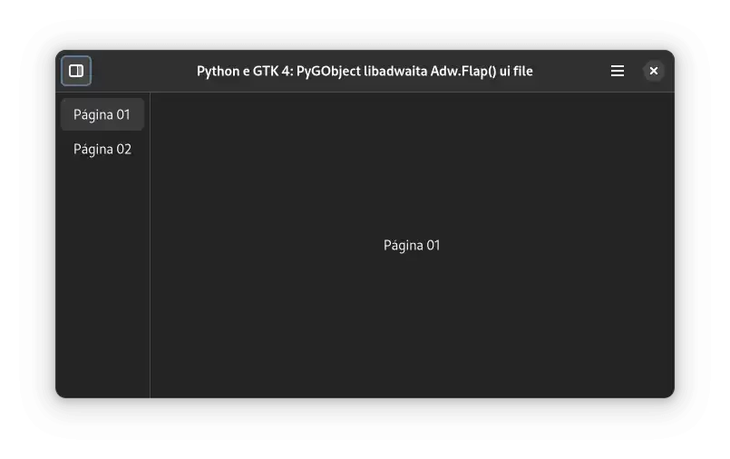

   Python e GTK 4: PyGObject libadwaita Adw.Flap().

.. tab:: Python

    ..  literalinclude:: ../../src/gtk4-libadwaita-widgets/flap/MainWindow.py

.. tab:: UI

    ..  literalinclude:: ../../src/gtk4-libadwaita-widgets/flap/ui/MainWindow.ui
      :language: html

.. tab:: Blueprint

    ..  literalinclude:: ../../src/gtk4-libadwaita-widgets/flap/ui/MainWindow.blp

--------------

Adw Leaflet
-----------

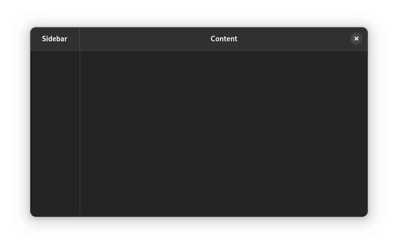

   Python e GTK 4: PyGObject libadwaita Adw.Leaflet().

.. tab:: Python

    ..  literalinclude:: ../../src/gtk4-libadwaita-widgets/leaflet/MainWindow.py

.. tab:: UI

    ..  literalinclude:: ../../src/gtk4-libadwaita-widgets/leaflet/ui/MainWindow.ui
      :language: html

--------------

Adw MessageDialog
-----------------

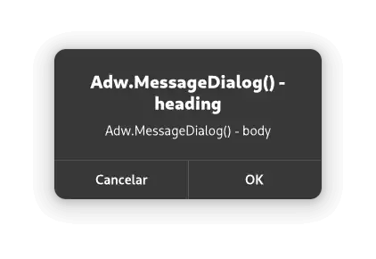

   Python e GTK 4: PyGObject libadwaita Adw.Leaflet().

.. tab:: Python

    ..  literalinclude:: ../../src/gtk4-libadwaita-widgets/message-dialog/MainWindow.py

.. tab:: UI

    ..  literalinclude:: ../../src/gtk4-libadwaita-widgets/message-dialog/ui/MainWindow.ui
      :language: html

--------------

Adw PreferencesPage
-------------------

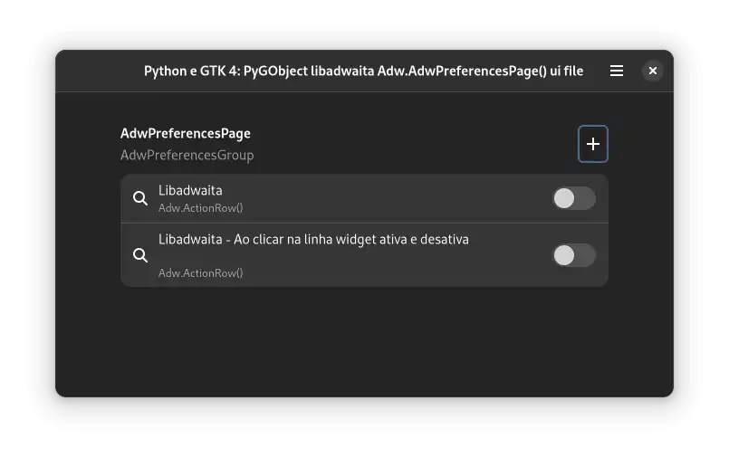

   Python e GTK 4: PyGObject libadwaita Adw.PreferencesPage().

.. tab:: Python

    ..  literalinclude:: ../../src/gtk4-libadwaita-widgets/preferencespage/MainWindow.py

.. tab:: UI

    ..  literalinclude:: ../../src/gtk4-libadwaita-widgets/preferencespage/ui/MainWindow.ui
      :language: html

.. tab:: Blueprint

    ..  literalinclude:: ../../src/gtk4-libadwaita-widgets/preferencespage/ui/MainWindow.blp

--------------

Adw PreferencesWindow
---------------------

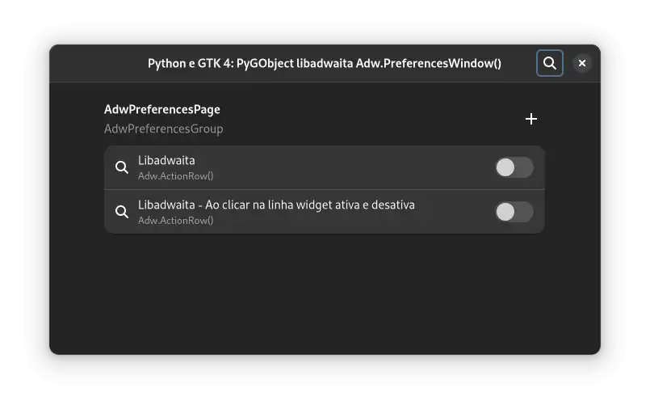

   Python e GTK 4: PyGObject libadwaita Adw.PreferencesWindow().

.. tab:: Python

    ..  literalinclude:: ../../src/gtk4-libadwaita-widgets/preferenceswindow/MainWindow.py

.. tab:: UI

    ..  literalinclude:: ../../src/gtk4-libadwaita-widgets/preferenceswindow/ui/MainWindow.ui
      :language: html

.. tab:: Blueprint

    ..  literalinclude:: ../../src/gtk4-libadwaita-widgets/preferenceswindow/ui/MainWindow.blp

--------------

Adw SplitButton
---------------

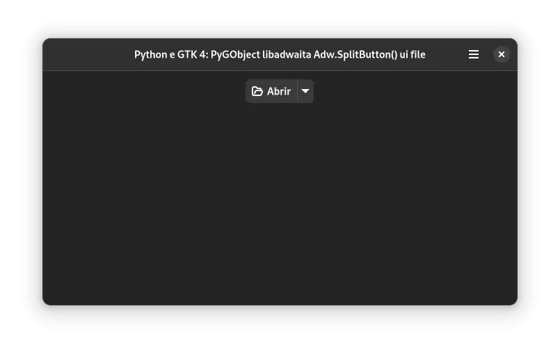

   Python e GTK 4: PyGObject libadwaita Adw.SplitButton().

.. tab:: Python

    ..  literalinclude:: ../../src/gtk4-libadwaita-widgets/split-button/MainWindow.py

.. tab:: UI

    ..  literalinclude:: ../../src/gtk4-libadwaita-widgets/split-button/ui/MainWindow.ui
      :language: html

.. tab:: Blueprint

    ..  literalinclude:: ../../src/gtk4-libadwaita-widgets/split-button/ui/MainWindow.blp

--------------

Adw StatusPage
--------------

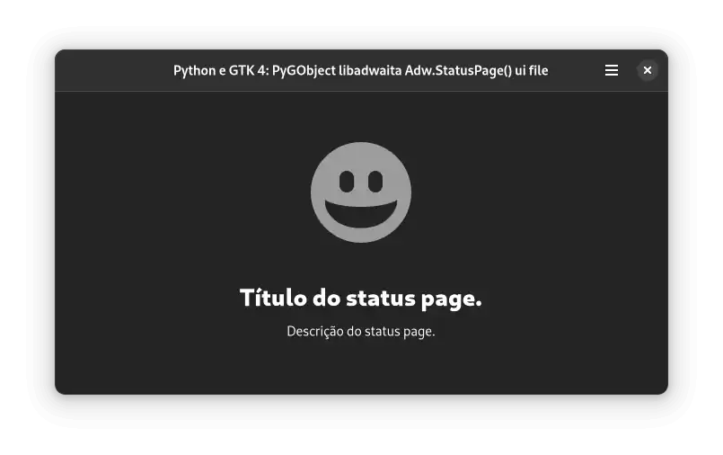

   Python e GTK 4: PyGObject libadwaita Adw.StatusPage().

.. tab:: Python

    ..  literalinclude:: ../../src/gtk4-libadwaita-widgets/status-page/MainWindow.py

.. tab:: UI

    ..  literalinclude:: ../../src/gtk4-libadwaita-widgets/status-page/ui/MainWindow.ui
      :language: html

.. tab:: Blueprint

    ..  literalinclude:: ../../src/gtk4-libadwaita-widgets/status-page/ui/MainWindow.blp

--------------

Adw Toast
---------

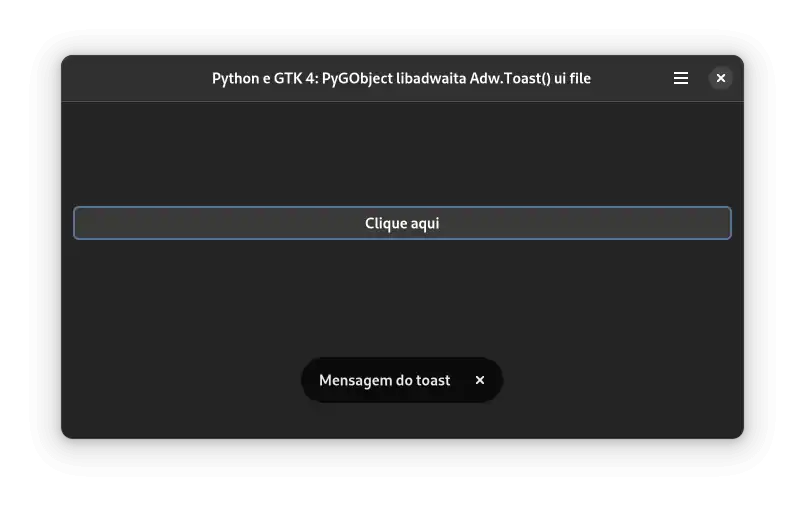

   Python e GTK 4: PyGObject libadwaita Adw.Toast().

.. tab:: Python

    ..  literalinclude:: ../../src/gtk4-libadwaita-widgets/toast/MainWindow.py

.. tab:: UI

    ..  literalinclude:: ../../src/gtk4-libadwaita-widgets/toast/ui/MainWindow.ui
      :language: html

.. tab:: Blueprint

    ..  literalinclude:: ../../src/gtk4-libadwaita-widgets/toast/ui/MainWindow.blp
