:og:description: Exemplos de código da utilização dos widgets do toolkit gráfico GTK 4 com a linguagem de programação Python (PyGObject).

.. meta::
   :description: Exemplos de código da utilização dos widgets do toolkit gráfico GTK 4 com a linguagem de programação Python (PyGObject).
   :keywords: GTK, GTK 4, Python, PyGObject, XML, Blueprint

GTK 4 Widgets
=============

Gtk ActionBar
-------------

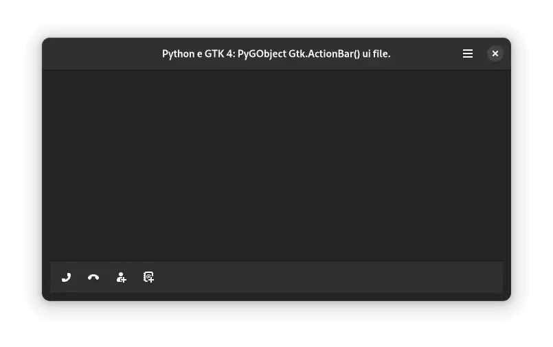

   Python e GTK 4: PyGObject Gtk.ActionBar().

.. tab:: Python

   ..  literalinclude:: ../../src/gtk4-widgets/actionbar/MainWindow.py

.. tab:: Python load ui

   ..  literalinclude:: ../../src/gtk4-widgets/actionbar/ui/MainWindow.py

.. tab:: UI

   ..  literalinclude:: ../../src/gtk4-widgets/actionbar/ui/MainWindow.ui
      :language: html

.. tab:: Blueprint

   ..  literalinclude:: ../../src/gtk4-widgets/actionbar/ui/MainWindow.blp

--------------

Gtk ApplicationWindow
---------------------

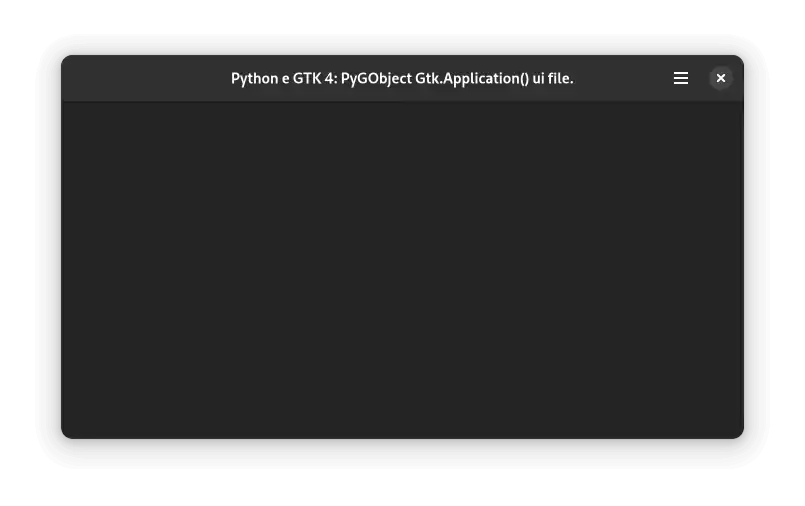

   Python e GTK 4: PyGObject Gtk.ApplicationWindow().

.. tab:: Python

   ..  literalinclude:: ../../src/gtk4-widgets/applicationwindow/MainWindow.py

.. tab:: Python load ui

   ..  literalinclude:: ../../src/gtk4-widgets/applicationwindow/ui/MainWindow.py

.. tab:: UI

   ..  literalinclude:: ../../src/gtk4-widgets/applicationwindow/ui/MainWindow.ui
      :language: html

.. tab:: Blueprint

   ..  literalinclude:: ../../src/gtk4-widgets/applicationwindow/ui/MainWindow.blp

--------------

Gtk Box Horizontal
------------------

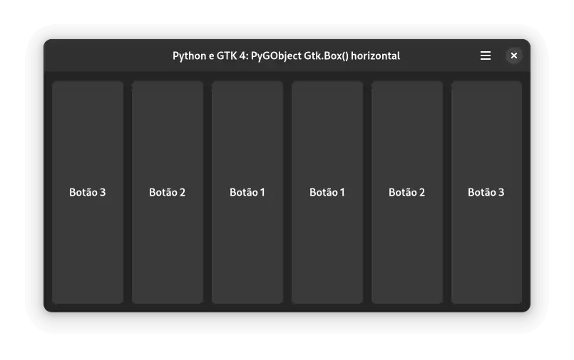

   Python e GTK 4: PyGObject Gtk.Box() horizontal.

.. tab:: Python

   ..  literalinclude:: ../../src/gtk4-widgets/box-horizontal/MainWindow.py

.. tab:: Python load ui

   ..  literalinclude:: ../../src/gtk4-widgets/box-horizontal/ui/MainWindow.py

.. tab:: UI

   ..  literalinclude:: ../../src/gtk4-widgets/box-horizontal/ui/MainWindow.ui
      :language: html

.. tab:: Blueprint

   ..  literalinclude:: ../../src/gtk4-widgets/box-horizontal/ui/MainWindow.blp

--------------

Gtk Box Vertical
----------------

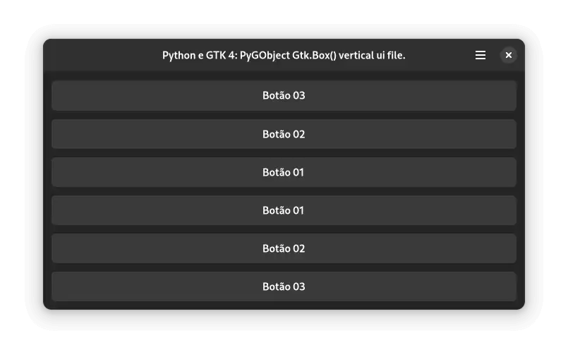

   Python e GTK 4: PyGObject Gtk.Box() vertical.

.. tab:: Python

   ..  literalinclude:: ../../src/gtk4-widgets/box-vertical/MainWindow.py

.. tab:: Python load ui

   ..  literalinclude:: ../../src/gtk4-widgets/box-vertical/ui/MainWindow.py
   
.. tab:: UI

   ..  literalinclude:: ../../src/gtk4-widgets/box-vertical/ui/MainWindow.ui
      :language: html

.. tab:: Blueprint

   ..  literalinclude:: ../../src/gtk4-widgets/box-vertical/ui/MainWindow.blp

--------------

Gtk Button
----------

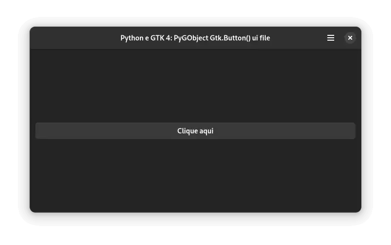

   Python e GTK 4: PyGObject Gtk.Button().

.. tab:: Python

   ..  literalinclude:: ../../src/gtk4-widgets/button/MainWindow.py

.. tab:: Python load ui

   ..  literalinclude:: ../../src/gtk4-widgets/button/ui/MainWindow.py

.. tab:: UI

   ..  literalinclude:: ../../src/gtk4-widgets/button/ui/MainWindow.ui
      :language: html

.. tab:: Blueprint

   ..  literalinclude:: ../../src/gtk4-widgets/button/ui/MainWindow.blp

--------------

Gtk Calendar
------------

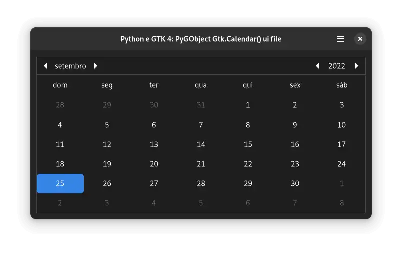

   Python e GTK 4: PyGObject Gtk.Calendar().

.. tab:: Python

   ..  literalinclude:: ../../src/gtk4-widgets/calendar/MainWindow.py

.. tab:: Python load ui

   ..  literalinclude:: ../../src/gtk4-widgets/calendar/ui/MainWindow.py

.. tab:: UI

   ..  literalinclude:: ../../src/gtk4-widgets/calendar/ui/MainWindow.ui
      :language: html
      
.. tab:: Blueprint

   ..  literalinclude:: ../../src/gtk4-widgets/calendar/ui/MainWindow.blp

--------------

Gtk CheckButton
---------------

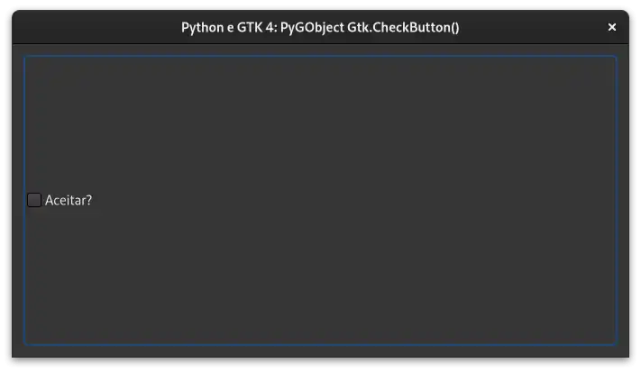

   Python e GTK 4: PyGObject Gtk.CheckButton().

.. tab:: Python

   ..  literalinclude:: ../../src/gtk4-widgets/checkbutton/MainWindow.py

.. tab:: Python load ui

   ..  literalinclude:: ../../src/gtk4-widgets/checkbutton/ui/MainWindow.py

.. tab:: UI

   ..  literalinclude:: ../../src/gtk4-widgets/checkbutton/ui/MainWindow.ui
      :language: html

.. tab:: Blueprint

   ..  literalinclude:: ../../src/gtk4-widgets/checkbutton/ui/MainWindow.blp

--------------

Gtk ColorButton
---------------

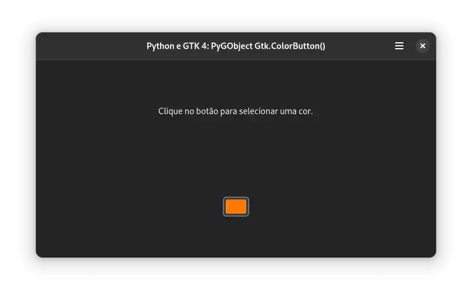

   Python e GTK 4: PyGObject Gtk.ColorButton().

.. tab:: Python

   ..  literalinclude:: ../../src/gtk4-widgets/colorbutton/MainWindow.py

.. tab:: UI

   ..  literalinclude:: ../../src/gtk4-widgets/colorbutton/ui/MainWindow.ui
      :language: html

.. tab:: Blueprint

   ..  literalinclude:: ../../src/gtk4-widgets/colorbutton/ui/MainWindow.blp

--------------

Gtk ComboBoxText
----------------

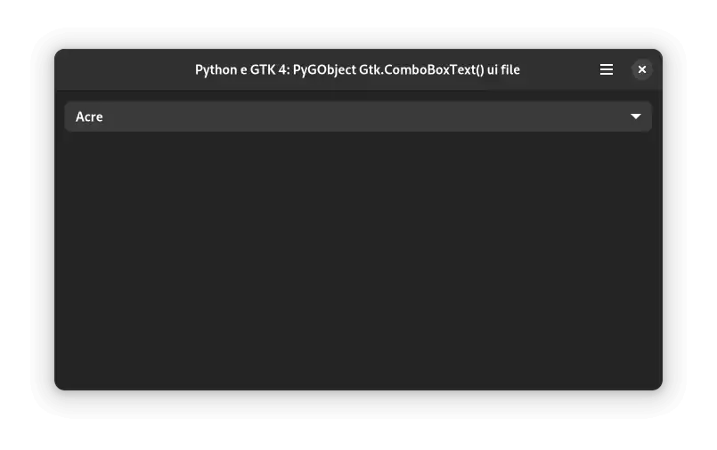

   Python e GTK 4: PyGObject Gtk.ComboBoxText().

.. tab:: Python

   ..  literalinclude:: ../../src/gtk4-widgets/comboboxtext/MainWindow.py
   
.. tab:: UI

   ..  literalinclude:: ../../src/gtk4-widgets/comboboxtext/ui/MainWindow.ui
      :language: html

--------------

Gtk Dialog
----------

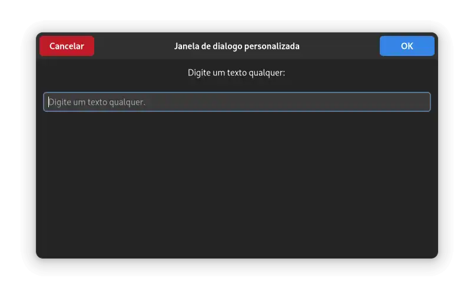

   Python e GTK 4: PyGObject Gtk.Dialog().

.. tab:: Python

   ..  literalinclude:: ../../src/gtk4-widgets/dialog/MainWindow.py

--------------

Gtk drag and drop
-----------------

.. figure:: ../images/gtk4-widgets/gtk-4-pygobject-drag-and-drop.webp
   :alt: Python e GTK 4: PyGObject Gtk.DragAndDrop (Gtk.DragSource e Gtk.DropTarget).

   Python e GTK 4: PyGObject Gtk.DragAndDrop (Gtk.DragSource e Gtk.DropTarget).

.. tab:: Python

   ..  literalinclude:: ../../src/gtk4-widgets/drag-and-drop/MainWindow.py

--------------

Gtk Entry
---------

.. figure:: ../images/gtk4-widgets/gtk-4-pygobject-entry.webp
   :alt: Python e GTK 4: PyGObject Gtk.Entry().

   Python e GTK 4: PyGObject Gtk.Entry().

.. tab:: Python

   ..  literalinclude:: ../../src/gtk4-widgets/entry/MainWindow.py

.. tab:: UI

   ..  literalinclude:: ../../src/gtk4-widgets/entry/ui/MainWindow.ui
      :language: html

.. tab:: Blueprint

   ..  literalinclude:: ../../src/gtk4-widgets/entry/ui/MainWindow.blp

--------------

Gtk EntryCompletion
-------------------

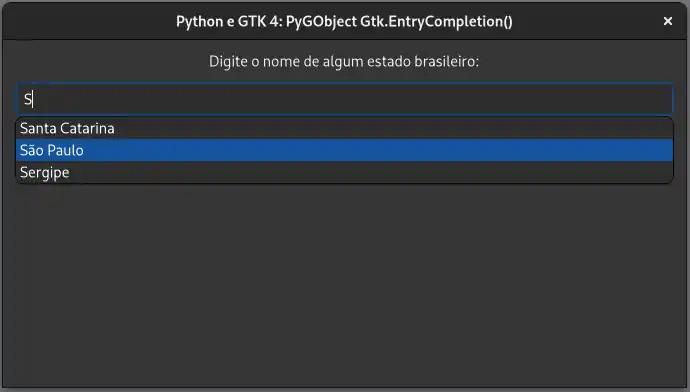

   Python e GTK 4: PyGObject Gtk.EntryCompletion().

.. tab:: Python

   ..  literalinclude:: ../../src/gtk4-widgets/entry-completion/MainWindow.py

.. tab:: UI

   ..  literalinclude:: ../../src/gtk4-widgets/entry-completion/ui/MainWindow.ui
      :language: html

--------------

Gtk FileChooserDialog folder
----------------------------

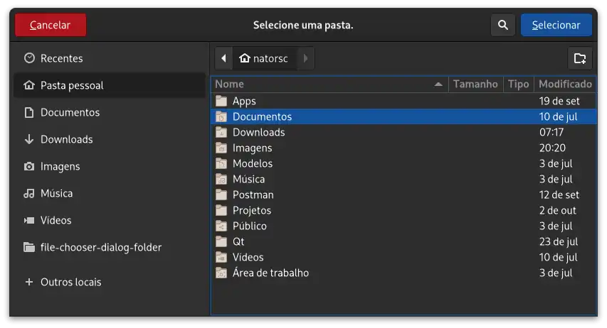

   Python e GTK 4: PyGObject Gtk.FileChooserDialog() folder.

.. tab:: Python

   ..  literalinclude:: ../../src/gtk4-widgets/file-chooser-dialog-folder/MainWindow.py

--------------

Gtk FileChooserDialog open
--------------------------

.. figure:: ../images/gtk4-widgets/gtk-4-pygobject-file-chooser-dialog-open.webp
   :alt: Python e GTK 4: PyGObject Gtk.FileChooserDialog() selecionar arquivo.

   Python e GTK 4: PyGObject Gtk.FileChooserDialog() selecionar arquivo.

.. tab:: Python

   ..  literalinclude:: ../../src/gtk4-widgets/file-chooser-dialog-open/MainWindow.py

--------------

Gtk FileChooserDialog save
--------------------------

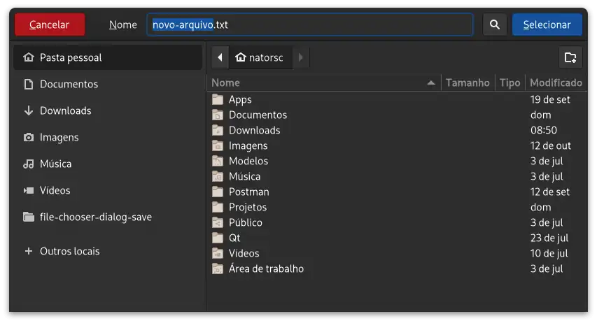

   Python e GTK 4: PyGObject Gtk.FileChooserDialog() salvar arquivo.

.. tab:: Python

   ..  literalinclude:: ../../src/gtk4-widgets/file-chooser-dialog-save/MainWindow.py

--------------

Gtk Fixed
---------

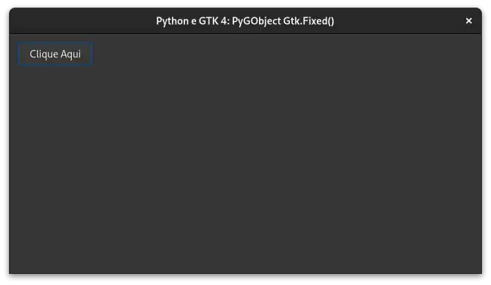

   Python e GTK 4: PyGObject Gtk.Fixed().

.. tab:: Python

   ..  literalinclude:: ../../src/gtk4-widgets/fixed/MainWindow.py

.. tab:: UI

   ..  literalinclude:: ../../src/gtk4-widgets/fixed/ui/MainWindow.ui
      :language: html

.. tab:: Blueprint

   ..  literalinclude:: ../../src/gtk4-widgets/fixed/ui/MainWindow.blp

--------------

Gtk FlowBox
-----------

.. figure:: ../images/gtk4-widgets/gtk-4-pygobject-flowbox.webp
   :alt: Python e GTK 4: PyGObject Gtk.FlowBox().

   Python e GTK 4: PyGObject Gtk.FlowBox().

.. tab:: Python

   ..  literalinclude:: ../../src/gtk4-widgets/flowbox/MainWindow.py

.. tab:: UI

   ..  literalinclude:: ../../src/gtk4-widgets/flowbox/ui/MainWindow.ui
      :language: html

.. tab:: Blueprint

   ..  literalinclude:: ../../src/gtk4-widgets/flowbox/ui/MainWindow.blp

--------------

Gtk FontButton
--------------

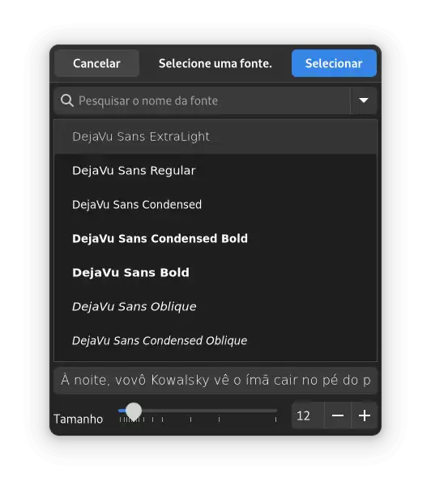

   Python e GTK 4: PyGObject Gtk.FontButton().

.. tab:: Python

   ..  literalinclude:: ../../src/gtk4-widgets/fontbutton/MainWindow.py

.. tab:: UI

   ..  literalinclude:: ../../src/gtk4-widgets/fontbutton/ui/MainWindow.ui
      :language: html

.. tab:: Blueprint

   ..  literalinclude:: ../../src/gtk4-widgets/fontbutton/ui/MainWindow.blp

--------------

Gtk Grid
--------

.. figure:: ../images/gtk4-widgets/gtk-4-pygobject-grid.webp
   :alt: Python e GTK 4: PyGObject Gtk.Grid().

   Python e GTK 4: PyGObject Gtk.Grid().

.. tab:: Python

   ..  literalinclude:: ../../src/gtk4-widgets/grid/MainWindow.py

.. tab:: UI

   ..  literalinclude:: ../../src/gtk4-widgets/grid/ui/MainWindow.ui
      :language: html

.. tab:: Blueprint

   ..  literalinclude:: ../../src/gtk4-widgets/grid/ui/MainWindow.blp

--------------

Gtk HeaderBar
-------------

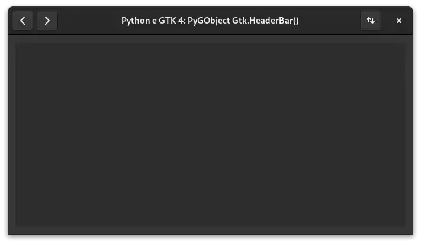

   Python e GTK 4: PyGObject Gtk.HeaderBar().

.. tab:: Python

   ..  literalinclude:: ../../src/gtk4-widgets/headerbar/MainWindow.py

.. tab:: UI

   ..  literalinclude:: ../../src/gtk4-widgets/headerbar/ui/MainWindow.ui
      :language: html

.. tab:: Blueprint

   ..  literalinclude:: ../../src/gtk4-widgets/headerbar/ui/MainWindow.blp

--------------

Gtk Image
---------

.. figure:: ../images/gtk4-widgets/gtk-4-pygobject-image.webp
   :alt: Python e GTK 4: PyGObject Gtk.Image().

   Python e GTK 4: PyGObject Gtk.Image().

.. tab:: Python

   ..  literalinclude:: ../../src/gtk4-widgets/image/MainWindow.py

.. tab:: UI

   ..  literalinclude:: ../../src/gtk4-widgets/image/ui/MainWindow.ui
      :language: html

.. tab:: Blueprint

   ..  literalinclude:: ../../src/gtk4-widgets/image/ui/MainWindow.blp

--------------

Gtk InfoBar
-----------

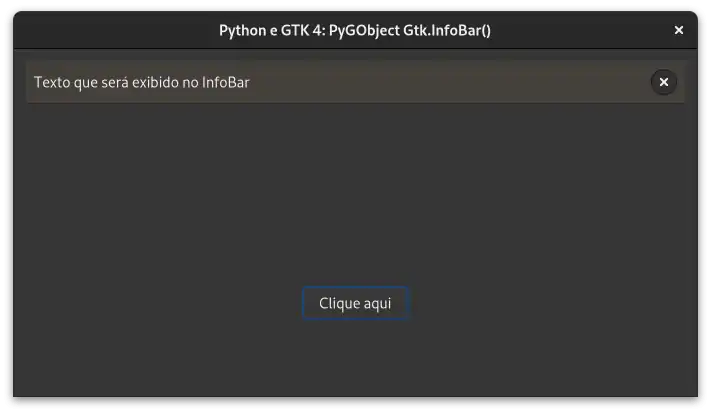

   Python e GTK 4: PyGObject Gtk.InfoBar().

.. tab:: Python

   ..  literalinclude:: ../../src/gtk4-widgets/infobar/MainWindow.py

.. tab:: UI

   ..  literalinclude:: ../../src/gtk4-widgets/infobar/ui/MainWindow.ui
      :language: html

.. tab:: Blueprint

   ..  literalinclude:: ../../src/gtk4-widgets/infobar/ui/MainWindow.blp

--------------

Gtk ListBox
-----------

.. figure:: ../images/gtk4-widgets/gtk-4-pygobject-listbox.webp
   :alt: Python e GTK 4: PyGObject Gtk.ListBox().

   Python e GTK 4: PyGObject Gtk.ListBox().

.. tab:: Python

   ..  literalinclude:: ../../src/gtk4-widgets/listbox/MainWindow.py

.. tab:: UI

   ..  literalinclude:: ../../src/gtk4-widgets/listbox/ui/MainWindow.ui
      :language: html

.. tab:: Blueprint

   ..  literalinclude:: ../../src/gtk4-widgets/listbox/ui/MainWindow.blp

--------------

Gtk MenuButton
--------------

.. figure:: ../images/gtk4-widgets/gtk-4-pygobject-menubutton.webp
   :alt: Python e GTK 4: PyGObject Gtk.MenuButton().

   Python e GTK 4: PyGObject Gtk.MenuButton().

.. tab:: Python

   ..  literalinclude:: ../../src/gtk4-widgets/menubutton/MainWindow.py

.. tab:: UI

   ..  literalinclude:: ../../src/gtk4-widgets/menubutton/ui/MainWindow.ui
      :language: html

.. tab:: Blueprint

   ..  literalinclude:: ../../src/gtk4-widgets/menubutton/ui/MainWindow.blp

--------------

Gtk Overlay
-----------

.. figure:: ../images/gtk4-widgets/gtk-4-pygobject-overlay.webp
   :alt: Python e GTK 4: PyGObject Gtk.Overlay().

   Python e GTK 4: PyGObject Gtk.Overlay().

.. tab:: Python

   ..  literalinclude:: ../../src/gtk4-widgets/overlay/MainWindow.py

--------------

Gtk Picture
-----------

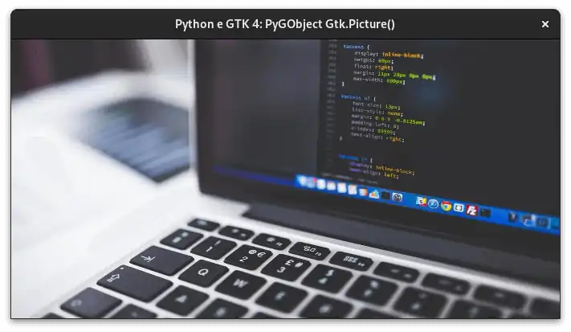

   Python e GTK 4: PyGObject Gtk.Picture().

.. tab:: Python

   ..  literalinclude:: ../../src/gtk4-widgets/picture/MainWindow.py

--------------

Gtk Popover
-----------

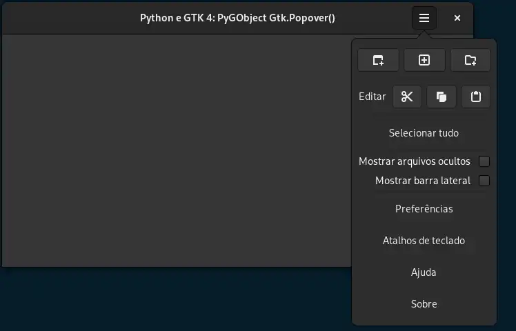

   Python e GTK 4: PyGObject Gtk.Popover().

.. tab:: Python

   ..  literalinclude:: ../../src/gtk4-widgets/popover/MainWindow.py

--------------

Gtk PopoverMenu
---------------

.. figure:: ../images/gtk4-widgets/gtk-4-pygobject-popover-menu.webp
   :alt: Python e GTK 4: PyGObject Gtk.PopoverMenu().

   Python e GTK 4: PyGObject Gtk.PopoverMenu().

.. tab:: Python

   ..  literalinclude:: ../../src/gtk4-widgets/popover-menu/MainWindow.py

--------------

Gtk RadioButton
---------------

.. figure:: ../images/gtk4-widgets/gtk-4-pygobject-radiobutton.webp
   :alt: Python e GTK 4: PyGObject Gtk.RadioButton().

   Python e GTK 4: PyGObject Gtk.RadioButton().

.. tab:: Python

   ..  literalinclude:: ../../src/gtk4-widgets/radiobutton/MainWindow.py

--------------

Gtk SearchBar
-------------

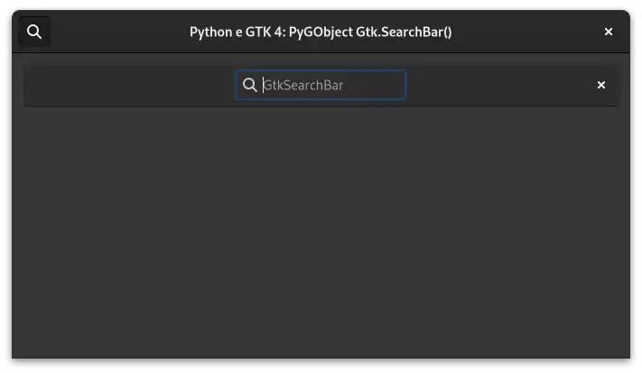

   Python e GTK 4: PyGObject Gtk.SearchBar().

.. tab:: Python

   ..  literalinclude:: ../../src/gtk4-widgets/searchbar/MainWindow.py

--------------

Gtk Signal e Slots
------------------

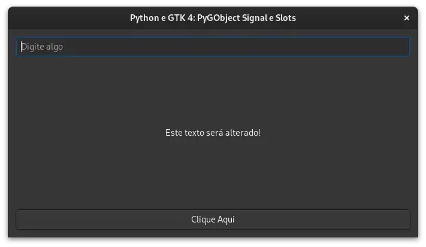

   Python e GTK 4: PyGObject Gtk Signal e Slots.

.. tab:: Python

   ..  literalinclude:: ../../src/gtk4-widgets/signals-and-slots/MainWindow.py

.. tab:: UI

   ..  literalinclude:: ../../src/gtk4-widgets/signals-and-slots/ui/MainWindow.ui
      :language: html

.. tab:: Blueprint

   ..  literalinclude:: ../../src/gtk4-widgets/signals-and-slots/ui/MainWindow.blp

--------------

Gtk StackSidebar
----------------

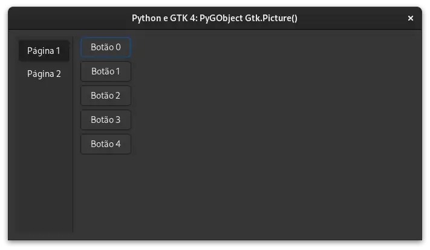

   Python e GTK 4: PyGObject Gtk.StackSidebar().

.. tab:: Python

   ..  literalinclude:: ../../src/gtk4-widgets/stacksidebar/MainWindow.py

--------------

Gtk StackSwitcher
-----------------

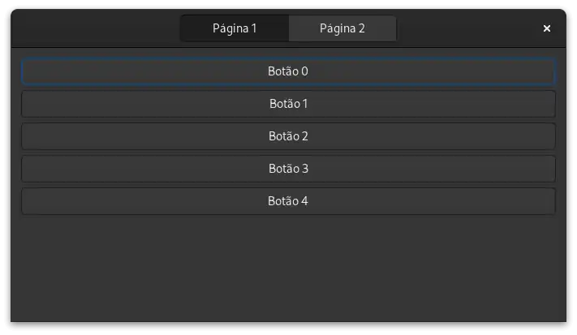

   Python e GTK 4: PyGObject Gtk.StackSwitcher().

.. tab:: Python

   ..  literalinclude:: ../../src/gtk4-widgets/stackswitcher/MainWindow.py

.. tab:: UI

   ..  literalinclude:: ../../src/gtk4-widgets/stackswitcher/ui/MainWindow.ui
      :language: html

.. tab:: Blueprint

   ..  literalinclude:: ../../src/gtk4-widgets/stackswitcher/ui/MainWindow.blp

--------------

Gtk Switch
----------

.. figure:: ../images/gtk4-widgets/gtk-4-pygobject-switch.webp
   :alt: Python e GTK 4: PyGObject Gtk.switch().

   Python e GTK 4: PyGObject Gtk.switch().

.. tab:: Python

   ..  literalinclude:: ../../src/gtk4-widgets/switch/MainWindow.py

--------------

Translator gettext
------------------

.. figure:: ../images/gtk4-widgets/gtk-4-pygobject-translator-gettext.webp
   :alt: Python e GTK 4: PyGObject Translator gettext.

   Python e GTK 4: PyGObject Translator gettext.

.. tab:: Python

   ..  literalinclude:: ../../src/gtk4-widgets/translator-gettext/MainWindow.py

--------------

TreeView (editable)
-------------------

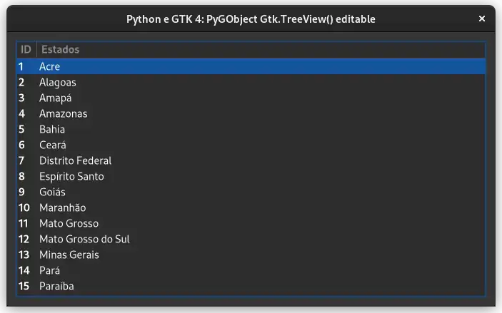

   Python e GTK 4: PyGObject Gtk.TreeView() editable.

.. tab:: Python

   ..  literalinclude:: ../../src/gtk4-widgets/treeview-liststore-editable/MainWindow.py

--------------

TreeView (filter)
-----------------

.. figure:: ../images/gtk4-widgets/gtk-4-pygobject-treeview-filter.webp
   :alt: Python e GTK 4: PyGObject Gtk.TreeView() filter.

   Python e GTK 4: PyGObject Gtk.TreeView() filter.

.. tab:: Python

   ..  literalinclude:: ../../src/gtk4-widgets/treeview-liststore-filter/MainWindow.py

--------------

TreeView (sort)
---------------

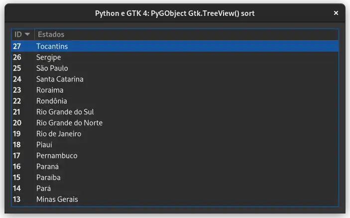

   Python e GTK 4: PyGObject Gtk.TreeView() sort.

.. tab:: Python

   ..  literalinclude:: ../../src/gtk4-widgets/treeview-liststore-sort/MainWindow.py

--------------

Gtk Video
---------

.. figure:: ../images/gtk4-widgets/gtk-4-pygobject-video.webp
   :alt: Python e GTK 4: PyGObject Gtk.Video().

   Python e GTK 4: PyGObject Gtk.Video().

.. tab:: Python

   ..  literalinclude:: ../../src/gtk4-widgets/video/MainWindow.py

--------------

Gtk Window
----------

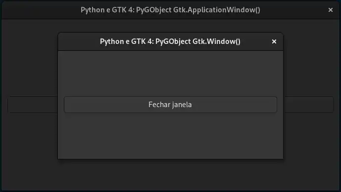

   Python e GTK 4: PyGObject Gtk.Window().

.. tab:: Python

   ..  literalinclude:: ../../src/gtk4-widgets/window/MainWindow.py
