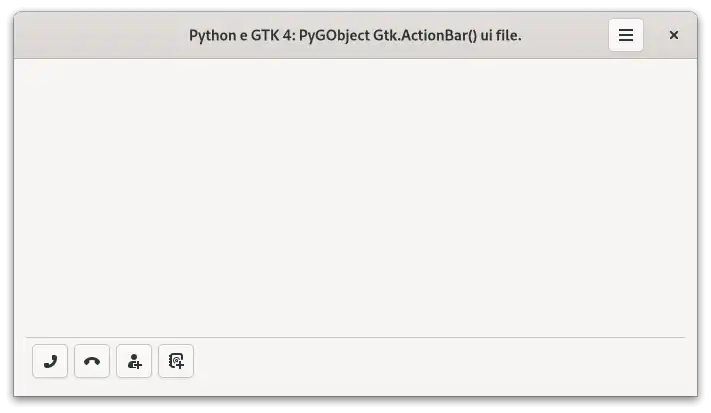

:og:description: O GTK é um toolkit multiplataforma que perite a criação de interfaces gráficas com diversas linguagem de programação.

.. meta::
   :description: O GTK é um toolkit multiplataforma que perite a criação de interfaces gráficas com diversas linguagem de programação.
   :keywords: GTK, GTK 4, libadwaita, Python, Python 3, PyGObject, XML, Blueprint, blp

Sobre o GTK 4
=============

O `GTK <https://www.gtk.org/>`__ é um toolkit multiplataforma que perite a criação de interfaces gráficas com diversas linguagem de programação.

O mesmo utiliza licença `GNU LGPL <https://www.gnu.org/licenses/lgpl-3.0.html>`__, o que permite a sua utilização para construção de softwares que sejam livres ou proprietários.

Foi desenvolvido inicialmente para o GIMP (GNU Image Manipulation Program), por isso foi batizado de GIMP Toolkit ou simplesmente GTK.

Originalmente criado por, Peter Mattis, Spencer Kimball e Josh MacDonald.

O GTK é comumente utilizado na elaboração de aplicativos para o ambiente de desktop GNOME, contudo por ser multiplataforma pode ser executado sem problemas em diversos sistemas operacionais e ambientes gráficos.

O toolkit é escrito em C e o seu design é orientado a objeto com base no sistema de objetos da biblioteca GLib.

Existe o suporte a diversas linguagens de programação (bindings), contudo as linguagem que são **suportadas oficialmente** (até o momento que escrevo) são:

-  `C++ <https://www.cplusplus.com/>`__.
-  `C# <https://docs.microsoft.com/pt-br/dotnet/csharp/>`__.
-  `C <https://pt.wikipedia.org/wiki/C_(linguagem_de_programa%C3%A7%C3%A3o)>`__.
-  `JavaScript <https://www.javascript.com/>`__.
-  `Python <https://www.python.org/>`__.
-  `Rust <https://www.rust-lang.org/pt-BR>`__.
-  `Vala <https://wiki.gnome.org/Projects/Vala>`__.

Sempre que possível de preferencia por iniciar um projeto utilizando o Gnome Builder.

.. danger::
    
    O Gnome Builder não está disponível para Microsoft Windows.

--------------

Arquitetura
-----------

.. figure:: ../images/gtk4-widgets/gtk-4-architecture.webp
   :alt: Arquitetura do GTK 4

   Arquitetura do GTK 4

--------------

bibliotecas
-----------

`GLib <https://docs.gtk.org/glib/>`__
~~~~~~~~~~~~~~~~~~~~~~~~~~~~~~~~~~~~~

GLib é uma biblioteca central de baixo nível que forma a base do GTK.

Ele fornece manipulação de estrutura de dados para C, wrappers de portabilidade e interfaces para funcionalidade de tempo de execução como um loop de eventos, threads, carregamento dinâmico e um sistema de objetos.

`Pango <https://docs.gtk.org/Pango/>`__
~~~~~~~~~~~~~~~~~~~~~~~~~~~~~~~~~~~~~~~

Pango é uma biblioteca para layout e renderização de texto com ênfase na internacionalização.

Ele forma o núcleo do manuseio de texto e fonte para GTK.

`Cairo <https://www.cairographics.org/>`__
~~~~~~~~~~~~~~~~~~~~~~~~~~~~~~~~~~~~~~~~~~

Cairo é uma biblioteca para gráficos 2D com suporte para vários dispositivos de saída (incluindo o X Window System, Win32) ao mesmo tempo em que produz uma saída consistente em todas as mídias, aproveitando a aceleração do hardware de exibição quando disponível.

`GdkPixbuf <https://docs.gtk.org/gdk-pixbuf>`__
~~~~~~~~~~~~~~~~~~~~~~~~~~~~~~~~~~~~~~~~~~~~~~~

GdkPixbuf é uma biblioteca para carregar ativos gráficos como ícones em vários formatos, como PNG, JPEG e GIF.

`ATK <https://docs.gtk.org/atk/>`__
~~~~~~~~~~~~~~~~~~~~~~~~~~~~~~~~~~~

ATK é uma biblioteca para um conjunto de interfaces que fornecem acessibilidade. Ao suportar as interfaces ATK, um aplicativo ou kit de ferramentas pode ser usado com ferramentas como leitores de tela, ampliadores e dispositivos de entrada alternativos.

--------------

Estilos
-------

Até o presente momento o Gtk 4 permite a utilização de 2 estilos no desenvolvimento de aplicativos.

Aplicativo do Gnome
~~~~~~~~~~~~~~~~~~~

.. figure:: ../images/gtk4-widgets/gtk-4-pygobject-actionbar.webp
   :alt: Python e GTK 4: PyGObject Gtk.actionbar() Adw.init().

   Python e GTK 4: PyGObject Gtk.actionbar() Adw.init().

.. caution::
   
   Para que o estilo visual seja aplicado de forma correta utilize ``Adw.init()`` no código.

.. danger::

   Ao se utilizar a biblioteca ``libadwaita`` juntamente com arquivos de interface (``*.ui``) é **obrigatório** o uso de ``Adw.init()`` no código.
   
   Caso contrario será exibido o erro:

   ``Error building template class '' for an instance of type '': .:0:0 Invalid object type ''``.

Aplicativo Gtk 4
~~~~~~~~~~~~~~~~

   Python e GTK 4: PyGObject Gtk.actionbar().

.. note::
    
    Para utilizar este estilo visual **não adicione** ``Adw.init()`` no código.
