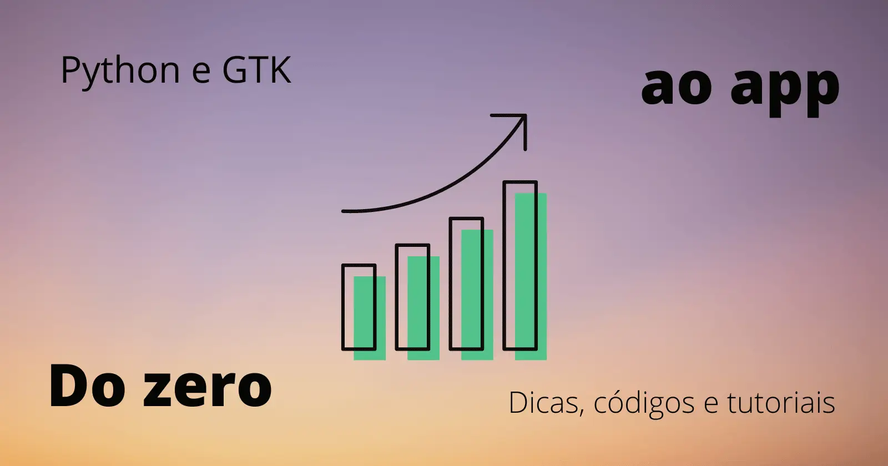

:og:type: site
:og:author: Renato Cruz (natorsc)
:og:title: criando interfaces gráficas com Python (PyGObject) e GTK - justCode
:og:description: Aprenda a criar interfaces gráficas com o toolkit GTK e a linguagem de programação Python (PyGObject).

.. meta::
   :author: Renato Cruz (natorsc)
   :description: Aprenda a criar interfaces gráficas com o toolkit GTK e a linguagem de programação Python (PyGObject).
   :description lang=en: Learn how to create graphical user interfaces with the GTK toolkit and the Python programming language (PyGObject).
   :keywords: Gnome, GTK, Libadwaita, Python, PyGObject, Blueprint,

   criando interfaces gráficas com Python (PyGObject) e GTK

========================================================
criando interfaces gráficas com Python (PyGObject) e GTK
========================================================

Documentação criada para centralizar dicas, tutoriais e exemplos de código sobre a construção de interfaces gráficas com a linguagem de programação Python (PyGObject) e o toolkit gráfico GTK.

Conteúdo
========

.. toctree::
   :caption: GTK

   gtk-about
   gtk-widgets

.. toctree::
   :caption: Libadwaita

   libadwaita-about
   libadwaita-widgets
   libadwaita-style-class

.. toctree::
   :caption: Sobre
   
   contribute
