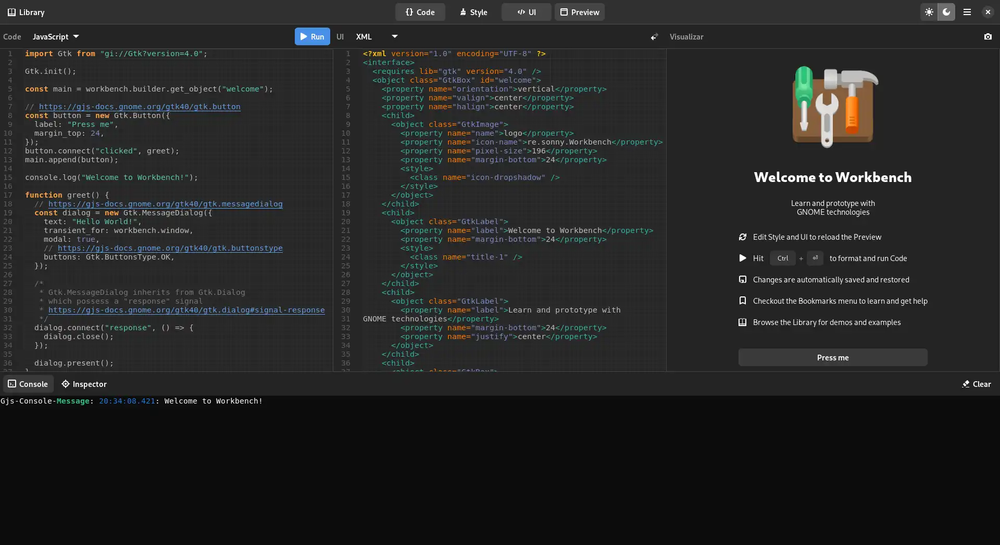
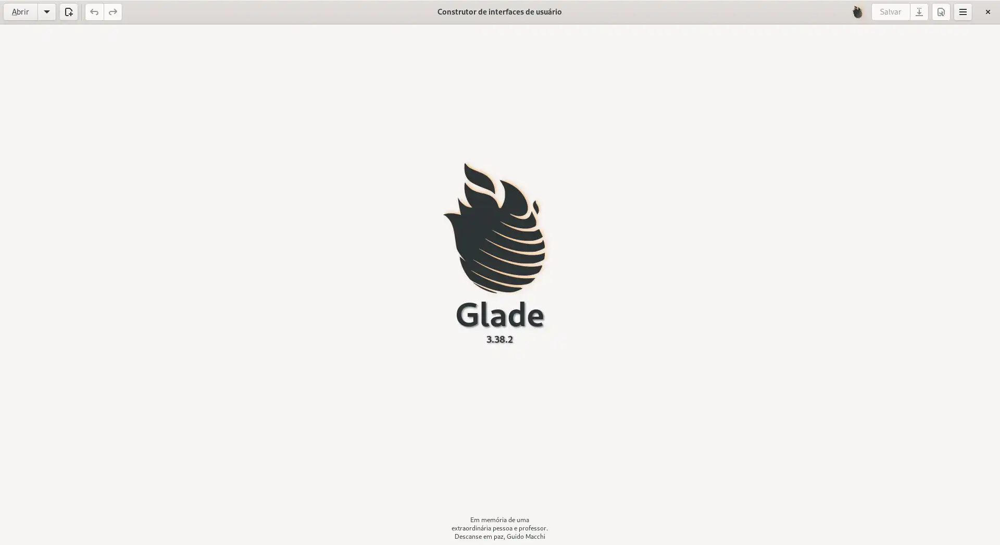
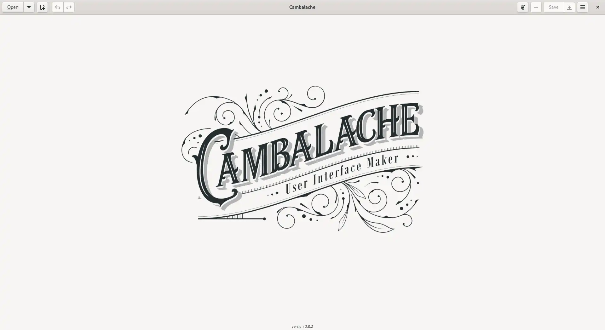
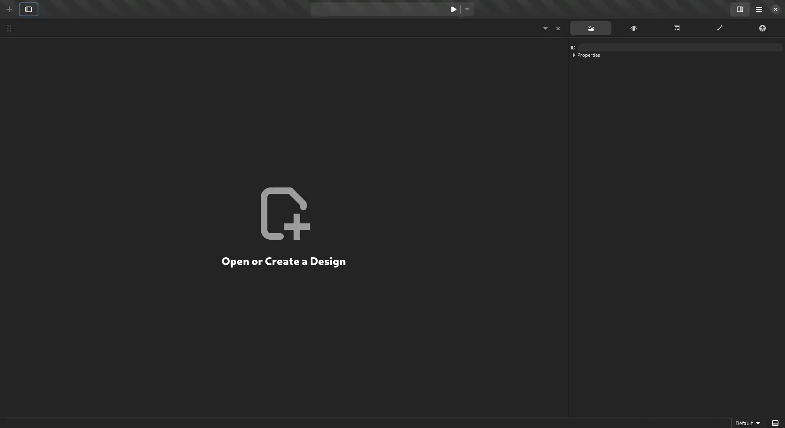
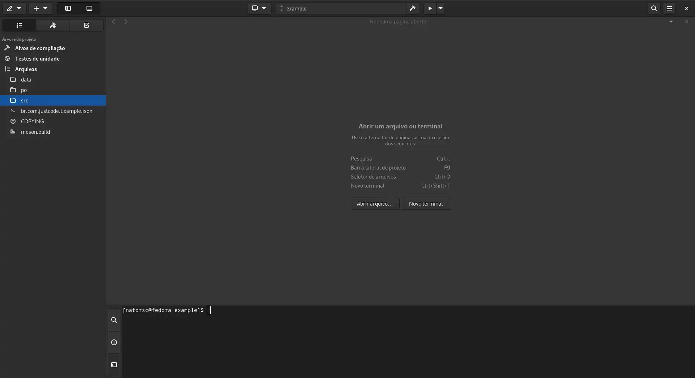

:og:description: Dicas de softwares e links úteis sobre a linguagem de programação Python e GTK 4.

.. meta::
   :description: Dicas de softwares e links úteis sobre a linguagem de programação Python e GTK 4.
   :keywords: GTK, GTK 4, Python, PyGObject, XML, Blueprint, blog

Dicas
=====

Build e empacotamento
------------------------------------

.. tip::
   
   A melhor forma de distribuir um aplicativo GTK no Linux é utilizando Gnome Builder + Flatpak 💙.

- `cx_Freeze <https://cx-freeze.readthedocs.io/en/latest/>`__.
- `Flatpak <https://flatpak.org/>`__.
- `Hello World GTK <https://github.com/zevlee/hello-world-gtk>`__.
- `Pyinstaller <https://pyinstaller.org/en/stable/>`__.

--------------

Documentação
------------

- `Documentação Gtk 4 <https://docs.gtk.org/gtk4/>`__.
- `Documentação libadwaita <https://gnome.pages.gitlab.gnome.org/libadwaita/doc/>`__.
- `Guia para desenvolvedores <https://developer.gnome.org/>`__.
- `GNOME Human Interface Guidelines <https://teams.pages.gitlab.gnome.org/Design/hig-www/index.html>`__.

--------------

Softwares
---------

- `Softwares que fazem parte do “circulo” do Gnome <https://apps.gnome.org/pt-BR/#circle>`__.

Prototipação
^^^^^^^^^^^^

Workbench
~~~~~~~~~

      Workbench

- `Workbench <https://beta.flathub.org/apps/details/re.sonny.Workbench>`__. Software permite a prototipação em tempo real.

RADs
~~~~

Gnome Glade
^^^^^^^^^^^

   Gnome Glade

- `Gnome Glade <https://glade.gnome.org/>`__. Recomendo apenas para o desenvolvimento de aplicativos com GTK 3.

Cambalache
^^^^^^^^^^

   Cambalache

- `Cambalache <https://flathub.org/apps/details/ar.xjuan.Cambalache>`__. (Em desenvolvimento).

Gnome Drafting
^^^^^^^^^^^^^^

   Gnome Drafting

- `Gnome Drafting <https://gitlab.gnome.org/chergert/drafting>`__ (Em desenvolvimento).

--------------

IDEs
----

   Gnome Builder

-  `Gnome Builder <https://wiki.gnome.org/Apps/Builder>`__. IDE oficial do projeto Gnome.

--------------

Icons
-----

-  `Icon Library <https://flathub.org/apps/details/org.gnome.design.IconLibrary>`__.
-  `Icon Browser <https://blog.codigoninja.dev/como-instalar-o-aplicativo-gtk-4-icon-browser>`__.
