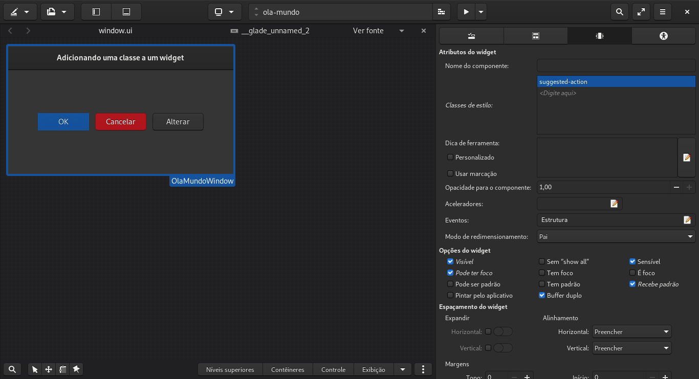
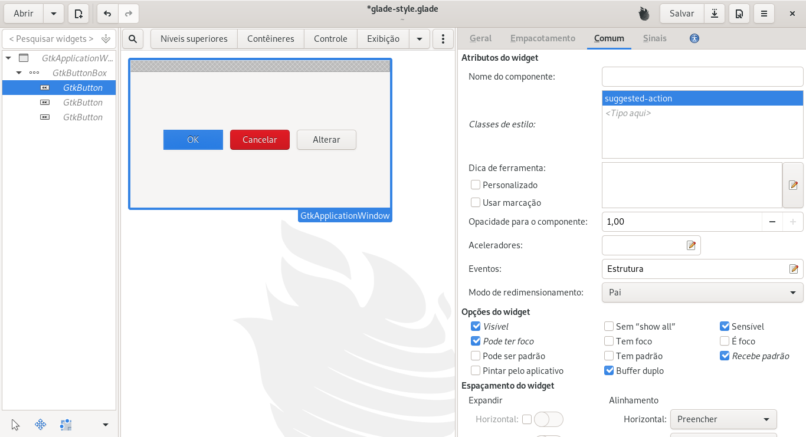

## Adicionar classe a um widget

Podemos adicionar uma classe a um widget para posteriormente criar uma classe no arquivo de css que será utilizado pelo widget.

Nativamente o GTK possui as classes:

- `suggested-action`.
- `destructive-action`.

Essas classes costumam ser utilizada em botões, fazendo com que os mesmos tenham uma cor azul (`suggested-action`) e vermelha (`destructive-action`).

> **OBS**: Se a distribução Linux realiza alterações no tema **padrão** do Gnome/GTK essas classes (`suggested-action` e `destructive-action`) podem acabar tendo cores diferentes.

A configuração de uma classe pode ser realizada no Gnome Builder, Gnome Glade ou utilizando-se a linguagem de programação.

## Gnome Builder

No Gnome Builder basta clicar sobre o widget que se deseja adicionar uma classe, clicar na aba **Comum** e digitar a classe no campo **Classes de estilo**:



## Gnome Glade

No Gnome Glade a operação é bem semelhante ao Gnome Bulder, basta clicar sobre o widget que se deseja adicionar uma classe, clicar na aba **Comum** e digitar a classe no campo **Classes de estilo** a classe desejada:



## Via código


```python
# -*- coding: utf-8 -*-
"""Aplicando estilo via classe.

Adicionando uma classe através do método `add_class()` e
arquivo css é caregado via linguagem de programação.
"""

import gi

gi.require_version(namespace='Gtk', version='3.0')

from gi.repository import Gtk, Gdk


class MainWindow(Gtk.ApplicationWindow):
    def __init__(self):
        super().__init__()
        self._set_custom_css(file='./css/custom.css')

        self.set_title(title='Aplicando estilo via classe')
        self.set_default_size(width=1366 / 2, height=768 / 2)
        self.set_position(position=Gtk.WindowPosition.CENTER)
        self.set_default_icon_from_file(filename='../../../../images/icons/icon.png')

        hbbox = Gtk.ButtonBox.new(orientation=Gtk.Orientation.HORIZONTAL)
        hbbox.set_halign(align=Gtk.Align.CENTER)
        hbbox.set_valign(align=Gtk.Align.CENTER)
        hbbox.set_spacing(spacing=12)
        self.add(widget=hbbox)

        button_ok = Gtk.Button.new_with_label(label='OK')
        # Adicionando classe natitiva `suggested-action` ao widget.
        button_ok.get_style_context().add_class('suggested-action')
        hbbox.add(widget=button_ok)

        button_cancel = Gtk.Button.new_with_label(label='Cancelar')
        # Adicionando classe natitiva `destructive-action` ao widget.
        button_cancel.get_style_context().add_class('destructive-action')
        hbbox.add(widget=button_cancel)

        button_warning = Gtk.Button.new_with_label(label='Cancelar')
        # Adicionando classe PERSONALIZADA `warning-action` ao widget.
        button_warning.get_style_context().add_class('warning-action')
        hbbox.add(widget=button_warning)

    @staticmethod
    def _set_custom_css(file):
        css_provider = Gtk.CssProvider.new()
        css_provider.load_from_path(path=file)

        screen = Gdk.Screen()

        style_context = Gtk.StyleContext.new()
        style_context.add_provider_for_screen(
            screen=screen.get_default(),
            provider=css_provider,
            priority=Gtk.STYLE_PROVIDER_PRIORITY_APPLICATION,
        )


if __name__ == '__main__':
    win = MainWindow()
    win.connect('destroy', Gtk.main_quit)
    win.show_all()
    Gtk.main()
```

Como exemplo pode ser utilizado o seguinte arquivo css:

```css
.warning-action {
    background: orange;
    border-color: darkorange;
    border-width: 0.5px;
    color: white;
}

.warning-action:hover {
    background: darkorange;
}
```

No caso do exemplo adicionamos uma classe chamada `'warning-action'` a um widget do tipo botão e depois criamos um estilo para este botão via css.

O Resultado é:

