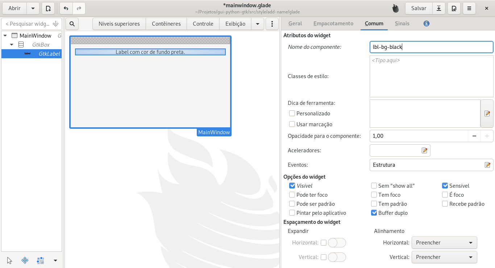

# Adicionar um nome a um widget

É possível adicionar um nome a um widget para posteriormente alterar o estilo do mesmo através de um arquivo de css.

## Gnome Builder

No Gnome Builder basta clicar sobre o widget que se deseja adicionar uma classe, clicar na aba **Comum** e digitar a classe no campo **Nome do componente**:


## Gnome Glade

No Gnome Glade a operação é bem semelhante ao Gnome Bulder, basta clicar sobre o widget que se deseja adicionar uma classe, clicar na aba **Comum** e digitar a classe no campo **Nome do componente** a classe desejada:



## Via código


```python
# -*- coding: utf-8 -*-
"""Aplicando estilo via linguagem de programação.

O parametro `name` é adicionado via método `set_name() e
arquivo css é caregado via linguagem de programação.
"""

import gi

gi.require_version(namespace='Gtk', version='3.0')
from gi.repository import Gtk, Gdk


class MainWindow(Gtk.ApplicationWindow):
    def __init__(self):
        super().__init__()
        self._set_custom_css(file='./css/custom.css')
        self.set_title(title='Aplicando estilo via propriedade name')
        self.set_default_size(width=1366 / 2, height=768 / 2)
        self.set_position(position=Gtk.WindowPosition.CENTER)
        self.set_default_icon_from_file(filename='../../../../images/icons/icon.png')

        vbox = Gtk.Box.new(orientation=Gtk.Orientation.VERTICAL, spacing=12)
        vbox.set_border_width(border_width=12)
        self.add(widget=vbox)

        lbl_bg_black = Gtk.Label.new(str='Label com cor de fundo preta.')
        # Definindo o nome do widget.
        lbl_bg_black.set_name(name='lbl-bg-black')
        vbox.pack_start(child=lbl_bg_black, expand=False, fill=False, padding=0)

    @staticmethod
    def _set_custom_css(file):
        css_provider = Gtk.CssProvider.new()
        css_provider.load_from_path(path=file)

        screen = Gdk.Screen()

        style_context = Gtk.StyleContext.new()
        style_context.add_provider_for_screen(
            screen=screen.get_default(),
            provider=css_provider,
            priority=Gtk.STYLE_PROVIDER_PRIORITY_APPLICATION,
        )


if __name__ == '__main__':
    win = MainWindow()
    win.connect('destroy', Gtk.main_quit)
    win.show_all()
    Gtk.main()
```

Como resultado temos:

