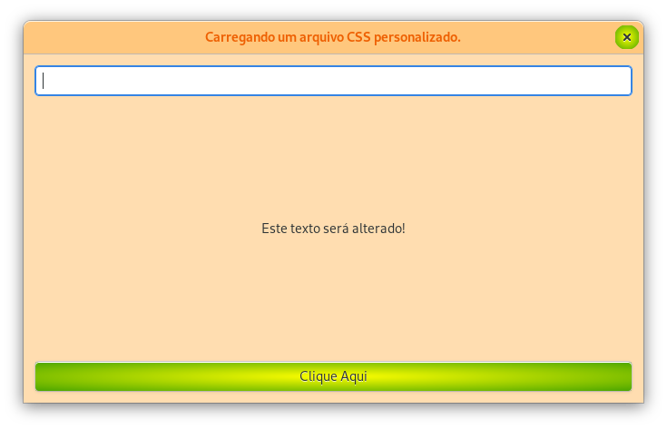
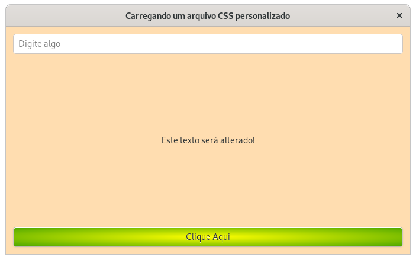
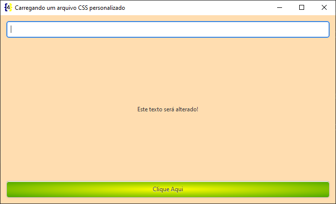

# Carregando uma arquivo css

Para carregar um arquivo css no GTK temos praticamente uma receita que não costuma sofrer grandes alterações.

Dei preferencia por criar um método que carrega o arquivo CSS:

```python
def _set_custom_css(file):                          
    css_provider = Gtk.CssProvider.new()
    css_provider.load_from_path(path=file)

    screen = Gdk.Screen()

    style_context = Gtk.StyleContext.new()
    style_context.add_provider_for_screen(
        screen=screen.get_default(),
        provider=css_provider,
        priority=Gtk.STYLE_PROVIDER_PRIORITY_APPLICATION,
    )
```

Para exemplifcar a utilização do método acima podemos utilizar o seguinte código:

```python
# -*- coding: utf-8 -*-
"""Carregando um arquivo CSS personalizado."""

import gi

gi.require_version(namespace='Gtk', version='3.0')
from gi.repository import Gtk, Gdk


class MainWindow(Gtk.ApplicationWindow):
    def __init__(self):
        super().__init__()
        self._set_custom_css(file='./css/custom.css')

        self.set_title(title='Carregando um arquivo CSS personalizado')
        self.set_default_size(width=1366 / 2, height=768 / 2)
        self.set_position(position=Gtk.WindowPosition.CENTER)
        self.set_default_icon_from_file(filename='../../../../images/icons/icon.png')

        vbox = Gtk.Box.new(orientation=Gtk.Orientation.VERTICAL, spacing=12)
        vbox.set_border_width(border_width=12)
        self.add(widget=vbox)

        self.entry = Gtk.Entry.new()
        self.entry.set_placeholder_text(text='Digite algo')
        vbox.pack_start(child=self.entry, expand=False, fill=True, padding=0)

        self.label = Gtk.Label.new(str='Este texto será alterado!')
        vbox.pack_start(child=self.label, expand=True, fill=True, padding=0)

        button = Gtk.Button.new_with_label(label='Clique Aqui')
        button.connect('clicked', self._on_button_clicked)
        vbox.pack_end(child=button, expand=False, fill=True, padding=0)

    @staticmethod
    def _set_custom_css(file):
        css_provider = Gtk.CssProvider.new()
        css_provider.load_from_path(path=file)

        screen = Gdk.Screen()

        style_context = Gtk.StyleContext.new()
        style_context.add_provider_for_screen(
            screen=screen.get_default(),
            provider=css_provider,
            priority=Gtk.STYLE_PROVIDER_PRIORITY_APPLICATION,
        )

    def _on_button_clicked(self, button):
        """Método é chamado quando o botão da interface é pressionado.

        Caso haja algum texto/caractere no campo de entrada de texto o
        texto será exibido no label da interface, caso não haja
        texto é exibida outra mensagem.

        :param button: Instância do objeto ``Gtk.Button()``. Basicamente
        informaçõe do botão que foi pressionado.
        """
        if self.entry.get_text():
            self.label.set_label(str=self.entry.get_text())
        else:
            self.label.set_label(str='Digite algo no campo acima!')


if __name__ == '__main__':
    win = MainWindow()
    win.connect('destroy', Gtk.main_quit)
    win.show_all()
    Gtk.main()
```

Esse código foi utilizado no exemplo de **signals e slots**, ele serve como um bom exemplo por possuir alguns widgets.

O arquivo css utilizado juntamente com o código apresentado foi:

```css
/* Janela */
window {
    background-color: #ffddb0;
}

/* Barra de titulo. */
.titlebar {
    /* Cor de fundo */
    background: #ffc77d;
    /* Cor da fonte */
    color: #ee6002;
}

/* Cor da barra quando a janela perde o foco */
.titlebar:backdrop {
    background: #e98df5;
    color: white;
}

/* Botão */
button {
    background-image: -gtk-gradient (radial, center center, 0, center center, 1, from(yellow), to(green));
}

/* Quando o mouse passa sobre o botão */
button:hover {
    background: #1565C0;
}

/* Quando o botão é clicado */
button:active {
    background: #0D47A1;
}
```

O resultado da personalização pode variar dependendo de diversos fatores como:
 
- Ambiente gráfico que se está utilizando (Gnome, KDE, LXDE, etc).
- Do servidor gráfico que se está utilizando (Xorg, Wayland, etc).
- Do tema que se está utilizando.

Por isso personalizações não são tão recomendas e quando feitas devem ser testadas no maximo de ambiente possíveis.

Para exemplificar:

Personalização sendo executado no Fedora com Wayland:



Personalização sendo executado no Fedora com Xorg:



**OBS**: No Xorg a barra de titulo não recebe a personalização e o botão da barra também não.

Personalização sendo executada no Windows:

